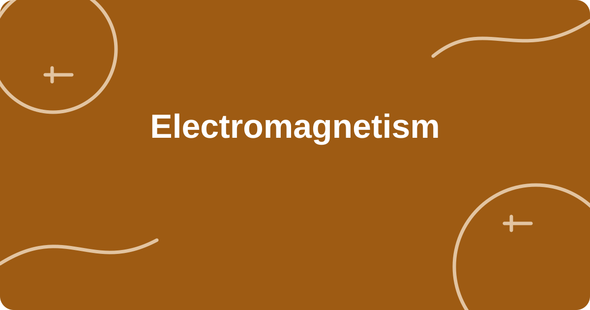

# Leadde Motion Prompt Library

> A GitHub-native catalog of **227 English Manim prompts** across **15 disciplines** and **20 courses**.
>
> Browse the cards below without leaving this repository. Videos are being produced and will appear in the corresponding entries later.

## Browse the library

<table>
<tr>
<td width="33%" valign="top">
  <br>
  <a href="#computer-science"><strong>Computer Science</strong></a><br>
  <sub>2 courses · 21 prompts</sub>
</td>
<td width="33%" valign="top">
  <br>
  <a href="#artificial-intelligence"><strong>Artificial Intelligence</strong></a><br>
  <sub>1 courses · 12 prompts</sub>
</td>
<td width="33%" valign="top">
  <br>
  <a href="#mathematics"><strong>Mathematics</strong></a><br>
  <sub>2 courses · 20 prompts</sub>
</td>
</tr>
<tr>
<td width="33%" valign="top">
  <br>
  <a href="#mathematics-statistics"><strong>Mathematics &amp; Statistics</strong></a><br>
  <sub>1 courses · 11 prompts</sub>
</td>
<td width="33%" valign="top">
  <br>
  <a href="#physics"><strong>Physics</strong></a><br>
  <sub>2 courses · 25 prompts</sub>
</td>
<td width="33%" valign="top">
  <br>
  <a href="#chemistry"><strong>Chemistry</strong></a><br>
  <sub>1 courses · 14 prompts</sub>
</td>
</tr>
<tr>
<td width="33%" valign="top">
  <br>
  <a href="#life-sciences"><strong>Life Sciences</strong></a><br>
  <sub>1 courses · 12 prompts</sub>
</td>
<td width="33%" valign="top">
  <br>
  <a href="#neuroscience"><strong>Neuroscience</strong></a><br>
  <sub>1 courses · 10 prompts</sub>
</td>
<td width="33%" valign="top">
  <br>
  <a href="#psychology"><strong>Psychology</strong></a><br>
  <sub>1 courses · 13 prompts</sub>
</td>
</tr>
<tr>
<td width="33%" valign="top">
  <br>
  <a href="#economics"><strong>Economics</strong></a><br>
  <sub>3 courses · 31 prompts</sub>
</td>
<td width="33%" valign="top">
  <br>
  <a href="#finance"><strong>Finance</strong></a><br>
  <sub>1 courses · 12 prompts</sub>
</td>
<td width="33%" valign="top">
  <br>
  <a href="#political-science"><strong>Political Science</strong></a><br>
  <sub>1 courses · 14 prompts</sub>
</td>
</tr>
<tr>
<td width="33%" valign="top">
  <br>
  <a href="#philosophy"><strong>Philosophy</strong></a><br>
  <sub>1 courses · 10 prompts</sub>
</td>
<td width="33%" valign="top">
  <br>
  <a href="#literature"><strong>Literature</strong></a><br>
  <sub>1 courses · 10 prompts</sub>
</td>
<td width="33%" valign="top">
  <br>
  <a href="#astronomy"><strong>Astronomy</strong></a><br>
  <sub>1 courses · 12 prompts</sub>
</td>
</tr>
</table>

---

<a id="computer-science"></a>
## Computer Science

**2 courses · 21 prompts** &nbsp; [Back to cards](#browse-the-library)

<table>
<tr>
<td width="33%" valign="top">
  <br>
  <a href="#course-cs50x"><strong>Introduction to Computer Science</strong></a><br>
  <sub>12 prompts · Course notes (no required textbook)</sub>
</td>
<td width="33%" valign="top">
  <br>
  <a href="#course-6.006"><strong>Introduction to Algorithms</strong></a><br>
  <sub>9 prompts · Introduction to Algorithms, 3e (Cormen et al.)</sub>
</td>
<td></td>
</tr>
</table>

<a id="course-cs50x"></a>
### Introduction to Computer Science

**TEXTBOOK · Course notes (no required textbook)** &nbsp; [Back to Computer Science courses](#computer-science)

#### Knowledge points

1. <details>
   <summary><strong>Pointer</strong> &nbsp; <code>C01-A001</code> · VIDEO COMING SOON</summary>

   ```text
   Create a 15-second silent educational animation in Manim Community Edition.

   Explain “Pointer” using this visual metaphor: “a glowing pointer arrow moving from variable p to one memory cell x”. Dynamically demonstrate the core formula or conclusion: p = \&x,\quad *p = x.

   Use one continuous scene and one clear narrative line. Explain only this concept; do not add comparisons, extensions, or side cases. Structure the motion in three connected beats:
   1. 0–3 seconds: establish the objects, input, or initial state.
   2. 3–10.95 seconds: show at least two causally connected state changes that reveal the mechanism and progressively connect key variables or conclusions to the visual.
   3. 10.95–12.45 seconds: resolve the result, invariant, or central insight.

   Keep introducing meaningful animation information until 12.45 seconds. Hold the final still frame for no more than 2.55 seconds.

   All on-screen titles, labels, and supporting annotations must be short English phrases in Arial. Use a bright, non-black background (#F7F3EA); main visual (#0B4F6C); secondary visual (#8B1E3F); highlight (#795500); and text (#172033). Maintain strong contrast and legibility.

   Use ThreeDScene for a genuinely spatial main visual: at least one core object must show volume, depth, or occlusion, and include one smooth camera move that reveals spatial structure. The 3D motion must clarify the concept rather than merely tilt a flat diagram. Render in 16:9.
   ```

   Want to make more videos like this? [Create yours at Leadde](https://leadde.ai/animation).

   </details>

2. <details>
   <summary><strong>Memory address</strong> &nbsp; <code>C01-A002</code> · VIDEO COMING SOON</summary>

   ```text
   Create a 15-second silent educational animation in Manim Community Edition.

   Explain “Memory address” using this visual metaphor: “an illuminated street address guiding a data byte to one numbered memory slot”. Dynamically demonstrate the core formula or conclusion: \operatorname{addr}(x) \rightarrow \text{one memory location}.

   Use one continuous scene and one clear narrative line. Explain only this concept; do not add comparisons, extensions, or side cases. Structure the motion in three connected beats:
   1. 0–3 seconds: establish the objects, input, or initial state.
   2. 3–10.95 seconds: show at least two causally connected state changes that reveal the mechanism and progressively connect key variables or conclusions to the visual.
   3. 10.95–12.45 seconds: resolve the result, invariant, or central insight.

   Keep introducing meaningful animation information until 12.45 seconds. Hold the final still frame for no more than 2.55 seconds.

   All on-screen titles, labels, and supporting annotations must be short English phrases in Arial. Use a bright, non-black background (#EDF4FA); main visual (#154C79); secondary visual (#8A2D2D); highlight (#6B5700); and text (#172033). Maintain strong contrast and legibility.

   Use ThreeDScene for a genuinely spatial main visual: at least one core object must show volume, depth, or occlusion, and include one smooth camera move that reveals spatial structure. The 3D motion must clarify the concept rather than merely tilt a flat diagram. Render in 16:9.
   ```

   Want to make more videos like this? [Create yours at Leadde](https://leadde.ai/animation).

   </details>

3. <details>
   <summary><strong>Memory layout</strong> &nbsp; <code>C01-A003</code> · VIDEO COMING SOON</summary>

   ```text
   Create a 15-second silent educational animation in Manim Community Edition.

   Explain “Memory layout” using this visual metaphor: “a vertical memory tower whose labeled regions light up in place”. Dynamically demonstrate the core formula or conclusion: \text{code}\;|\;\text{data}\;|\;\text{heap}\;|\;\text{stack}.

   Use one continuous scene and one clear narrative line. Explain only this concept; do not add comparisons, extensions, or side cases. Structure the motion in three connected beats:
   1. 0–3 seconds: establish the objects, input, or initial state.
   2. 3–10.95 seconds: show at least two causally connected state changes that reveal the mechanism and progressively connect key variables or conclusions to the visual.
   3. 10.95–12.45 seconds: resolve the result, invariant, or central insight.

   Keep introducing meaningful animation information until 12.45 seconds. Hold the final still frame for no more than 2.55 seconds.

   All on-screen titles, labels, and supporting annotations must be short English phrases in Arial. Use a bright, non-black background (#F4EEF8); main visual (#214E75); secondary visual (#8A2356); highlight (#725400); and text (#172033). Maintain strong contrast and legibility.

   Use ThreeDScene for a genuinely spatial main visual: at least one core object must show volume, depth, or occlusion, and include one smooth camera move that reveals spatial structure. The 3D motion must clarify the concept rather than merely tilt a flat diagram. Render in 16:9.
   ```

   Want to make more videos like this? [Create yours at Leadde](https://leadde.ai/animation).

   </details>

4. <details>
   <summary><strong>Time complexity</strong> &nbsp; <code>C01-A004</code> · VIDEO COMING SOON</summary>

   ```text
   Create a 15-second silent educational animation in Manim Community Edition.

   Explain “Time complexity” using this visual metaphor: “an operation counter growing as input tiles enter a machine”. Dynamically demonstrate the core formula or conclusion: T(n)=O(n\log n).

   Use one continuous scene and one clear narrative line. Explain only this concept; do not add comparisons, extensions, or side cases. Structure the motion in three connected beats:
   1. 0–3 seconds: establish the objects, input, or initial state.
   2. 3–10.95 seconds: show at least two causally connected state changes that reveal the mechanism and progressively connect key variables or conclusions to the visual.
   3. 10.95–12.45 seconds: resolve the result, invariant, or central insight.

   Keep introducing meaningful animation information until 12.45 seconds. Hold the final still frame for no more than 2.55 seconds.

   All on-screen titles, labels, and supporting annotations must be short English phrases in Arial. Use a bright, non-black background (#EEF7EE); main visual (#145A56); secondary visual (#8F2B2B); highlight (#735000); and text (#172033). Maintain strong contrast and legibility.

   Use ThreeDScene for a genuinely spatial main visual: at least one core object must show volume, depth, or occlusion, and include one smooth camera move that reveals spatial structure. The 3D motion must clarify the concept rather than merely tilt a flat diagram. Render in 16:9.
   ```

   Want to make more videos like this? [Create yours at Leadde](https://leadde.ai/animation).

   </details>

5. <details>
   <summary><strong>Algorithm growth rate</strong> &nbsp; <code>C01-A005</code> · VIDEO COMING SOON</summary>

   ```text
   Create a 15-second silent educational animation in Manim Community Edition.

   Explain “Algorithm growth rate” using this visual metaphor: “a single expanding staircase whose height follows the input size”. Dynamically demonstrate the core formula or conclusion: f(n)\le c\,g(n)\quad (n\ge n_0).

   Use one continuous scene and one clear narrative line. Explain only this concept; do not add comparisons, extensions, or side cases. Structure the motion in three connected beats:
   1. 0–3 seconds: establish the objects, input, or initial state.
   2. 3–10.95 seconds: show at least two causally connected state changes that reveal the mechanism and progressively connect key variables or conclusions to the visual.
   3. 10.95–12.45 seconds: resolve the result, invariant, or central insight.

   Keep introducing meaningful animation information until 12.45 seconds. Hold the final still frame for no more than 2.55 seconds.

   All on-screen titles, labels, and supporting annotations must be short English phrases in Arial. Use a bright, non-black background (#FFF3E8); main visual (#1D4D73); secondary visual (#9A2E24); highlight (#6C5200); and text (#172033). Maintain strong contrast and legibility.

   Use ThreeDScene for a genuinely spatial main visual: at least one core object must show volume, depth, or occlusion, and include one smooth camera move that reveals spatial structure. The 3D motion must clarify the concept rather than merely tilt a flat diagram. Render in 16:9.
   ```

   Want to make more videos like this? [Create yours at Leadde](https://leadde.ai/animation).

   </details>

6. <details>
   <summary><strong>Sorting process</strong> &nbsp; <code>C01-A006</code> · VIDEO COMING SOON</summary>

   ```text
   Create a 15-second silent educational animation in Manim Community Edition.

   Explain “Sorting process” using this visual metaphor: “a conveyor belt inserting each numbered card into its correct position”. Dynamically demonstrate the core formula or conclusion: a_1\le a_2\le\cdots\le a_n.

   Use one continuous scene and one clear narrative line. Explain only this concept; do not add comparisons, extensions, or side cases. Structure the motion in three connected beats:
   1. 0–3 seconds: establish the objects, input, or initial state.
   2. 3–10.95 seconds: show at least two causally connected state changes that reveal the mechanism and progressively connect key variables or conclusions to the visual.
   3. 10.95–12.45 seconds: resolve the result, invariant, or central insight.

   Keep introducing meaningful animation information until 12.45 seconds. Hold the final still frame for no more than 2.55 seconds.

   All on-screen titles, labels, and supporting annotations must be short English phrases in Arial. Use a bright, non-black background (#F0F3FB); main visual (#253D75); secondary visual (#9B2447); highlight (#6A5600); and text (#172033). Maintain strong contrast and legibility.

   Use ThreeDScene for a genuinely spatial main visual: at least one core object must show volume, depth, or occlusion, and include one smooth camera move that reveals spatial structure. The 3D motion must clarify the concept rather than merely tilt a flat diagram. Render in 16:9.
   ```

   Want to make more videos like this? [Create yours at Leadde](https://leadde.ai/animation).

   </details>

7. <details>
   <summary><strong>Binary search</strong> &nbsp; <code>C01-A007</code> · VIDEO COMING SOON</summary>

   ```text
   Create a 15-second silent educational animation in Manim Community Edition.

   Explain “Binary search” using this visual metaphor: “a corridor whose active search interval folds in half at every step”. Dynamically demonstrate the core formula or conclusion: n\rightarrow \frac n2\rightarrow\frac n4,\qquad T(n)=O(\log n).

   Use one continuous scene and one clear narrative line. Explain only this concept; do not add comparisons, extensions, or side cases. Structure the motion in three connected beats:
   1. 0–3 seconds: establish the objects, input, or initial state.
   2. 3–10.95 seconds: show at least two causally connected state changes that reveal the mechanism and progressively connect key variables or conclusions to the visual.
   3. 10.95–12.45 seconds: resolve the result, invariant, or central insight.

   Keep introducing meaningful animation information until 12.45 seconds. Hold the final still frame for no more than 2.55 seconds.

   All on-screen titles, labels, and supporting annotations must be short English phrases in Arial. Use a bright, non-black background (#F9F1F5); main visual (#15516C); secondary visual (#8F253B); highlight (#6E5300); and text (#172033). Maintain strong contrast and legibility.

   Use ThreeDScene for a genuinely spatial main visual: at least one core object must show volume, depth, or occlusion, and include one smooth camera move that reveals spatial structure. The 3D motion must clarify the concept rather than merely tilt a flat diagram. Render in 16:9.
   ```

   Want to make more videos like this? [Create yours at Leadde](https://leadde.ai/animation).

   </details>

8. <details>
   <summary><strong>Linked list</strong> &nbsp; <code>C01-A008</code> · VIDEO COMING SOON</summary>

   ```text
   Create a 15-second silent educational animation in Manim Community Edition.

   Explain “Linked list” using this visual metaphor: “a chain of train cars where each car carries data and one next arrow”. Dynamically demonstrate the core formula or conclusion: \text{node}=(\text{value},\text{next}).

   Use one continuous scene and one clear narrative line. Explain only this concept; do not add comparisons, extensions, or side cases. Structure the motion in three connected beats:
   1. 0–3 seconds: establish the objects, input, or initial state.
   2. 3–10.95 seconds: show at least two causally connected state changes that reveal the mechanism and progressively connect key variables or conclusions to the visual.
   3. 10.95–12.45 seconds: resolve the result, invariant, or central insight.

   Keep introducing meaningful animation information until 12.45 seconds. Hold the final still frame for no more than 2.55 seconds.

   All on-screen titles, labels, and supporting annotations must be short English phrases in Arial. Use a bright, non-black background (#EEF4F1); main visual (#1E4F4C); secondary visual (#8E2B4E); highlight (#735000); and text (#172033). Maintain strong contrast and legibility.

   Use ThreeDScene for a genuinely spatial main visual: at least one core object must show volume, depth, or occlusion, and include one smooth camera move that reveals spatial structure. The 3D motion must clarify the concept rather than merely tilt a flat diagram. Render in 16:9.
   ```

   Want to make more videos like this? [Create yours at Leadde](https://leadde.ai/animation).

   </details>

9. <details>
   <summary><strong>Tree structure</strong> &nbsp; <code>C01-A009</code> · VIDEO COMING SOON</summary>

   ```text
   Create a 15-second silent educational animation in Manim Community Edition.

   Explain “Tree structure” using this visual metaphor: “a branching mobile growing from one root into parent-child nodes”. Dynamically demonstrate the core formula or conclusion: |E|=|V|-1\quad\text{for a tree}.

   Use one continuous scene and one clear narrative line. Explain only this concept; do not add comparisons, extensions, or side cases. Structure the motion in three connected beats:
   1. 0–3 seconds: establish the objects, input, or initial state.
   2. 3–10.95 seconds: show at least two causally connected state changes that reveal the mechanism and progressively connect key variables or conclusions to the visual.
   3. 10.95–12.45 seconds: resolve the result, invariant, or central insight.

   Keep introducing meaningful animation information until 12.45 seconds. Hold the final still frame for no more than 2.55 seconds.

   All on-screen titles, labels, and supporting annotations must be short English phrases in Arial. Use a bright, non-black background (#F7F3EA); main visual (#0B4F6C); secondary visual (#8B1E3F); highlight (#795500); and text (#172033). Maintain strong contrast and legibility.

   Use ThreeDScene for a genuinely spatial main visual: at least one core object must show volume, depth, or occlusion, and include one smooth camera move that reveals spatial structure. The 3D motion must clarify the concept rather than merely tilt a flat diagram. Render in 16:9.
   ```

   Want to make more videos like this? [Create yours at Leadde](https://leadde.ai/animation).

   </details>

10. <details>
    <summary><strong>Hash table</strong> &nbsp; <code>C01-A010</code> · VIDEO COMING SOON</summary>

    ```text
    Create a 15-second silent educational animation in Manim Community Edition.

    Explain “Hash table” using this visual metaphor: “a mail-sorting chute sending one key into its computed bucket”. Dynamically demonstrate the core formula or conclusion: \operatorname{index}=h(k)\bmod m.

    Use one continuous scene and one clear narrative line. Explain only this concept; do not add comparisons, extensions, or side cases. Structure the motion in three connected beats:
    1. 0–3 seconds: establish the objects, input, or initial state.
    2. 3–10.95 seconds: show at least two causally connected state changes that reveal the mechanism and progressively connect key variables or conclusions to the visual.
    3. 10.95–12.45 seconds: resolve the result, invariant, or central insight.

    Keep introducing meaningful animation information until 12.45 seconds. Hold the final still frame for no more than 2.55 seconds.

    All on-screen titles, labels, and supporting annotations must be short English phrases in Arial. Use a bright, non-black background (#EDF4FA); main visual (#154C79); secondary visual (#8A2D2D); highlight (#6B5700); and text (#172033). Maintain strong contrast and legibility.

    Use ThreeDScene for a genuinely spatial main visual: at least one core object must show volume, depth, or occlusion, and include one smooth camera move that reveals spatial structure. The 3D motion must clarify the concept rather than merely tilt a flat diagram. Render in 16:9.
    ```

    Want to make more videos like this? [Create yours at Leadde](https://leadde.ai/animation).

    </details>

11. <details>
    <summary><strong>Relational model</strong> &nbsp; <code>C01-A011</code> · VIDEO COMING SOON</summary>

    ```text
    Create a 15-second silent educational animation in Manim Community Edition.

    Explain “Relational model” using this visual metaphor: “a clean data table where one row becomes a tuple and one column becomes a key”. Dynamically demonstrate the core formula or conclusion: R(A_1,A_2,\ldots,A_n).

    Use one continuous scene and one clear narrative line. Explain only this concept; do not add comparisons, extensions, or side cases. Structure the motion in three connected beats:
    1. 0–3 seconds: establish the objects, input, or initial state.
    2. 3–10.95 seconds: show at least two causally connected state changes that reveal the mechanism and progressively connect key variables or conclusions to the visual.
    3. 10.95–12.45 seconds: resolve the result, invariant, or central insight.

    Keep introducing meaningful animation information until 12.45 seconds. Hold the final still frame for no more than 2.55 seconds.

    All on-screen titles, labels, and supporting annotations must be short English phrases in Arial. Use a bright, non-black background (#F4EEF8); main visual (#214E75); secondary visual (#8A2356); highlight (#725400); and text (#172033). Maintain strong contrast and legibility.

    Use ThreeDScene for a genuinely spatial main visual: at least one core object must show volume, depth, or occlusion, and include one smooth camera move that reveals spatial structure. The 3D motion must clarify the concept rather than merely tilt a flat diagram. Render in 16:9.
    ```

    Want to make more videos like this? [Create yours at Leadde](https://leadde.ai/animation).

    </details>

12. <details>
    <summary><strong>SQL JOIN</strong> &nbsp; <code>C01-A012</code> · VIDEO COMING SOON</summary>

    ```text
    Create a 15-second silent educational animation in Manim Community Edition.

    Explain “SQL JOIN” using this visual metaphor: “one matching key pulling two database rows into a single joined row”. Dynamically demonstrate the core formula or conclusion: A\bowtie_{A.id=B.id}B.

    Use one continuous scene and one clear narrative line. Explain only this concept; do not add comparisons, extensions, or side cases. Structure the motion in three connected beats:
    1. 0–3 seconds: establish the objects, input, or initial state.
    2. 3–10.95 seconds: show at least two causally connected state changes that reveal the mechanism and progressively connect key variables or conclusions to the visual.
    3. 10.95–12.45 seconds: resolve the result, invariant, or central insight.

    Keep introducing meaningful animation information until 12.45 seconds. Hold the final still frame for no more than 2.55 seconds.

    All on-screen titles, labels, and supporting annotations must be short English phrases in Arial. Use a bright, non-black background (#EEF7EE); main visual (#145A56); secondary visual (#8F2B2B); highlight (#735000); and text (#172033). Maintain strong contrast and legibility.

    Use ThreeDScene for a genuinely spatial main visual: at least one core object must show volume, depth, or occlusion, and include one smooth camera move that reveals spatial structure. The 3D motion must clarify the concept rather than merely tilt a flat diagram. Render in 16:9.
    ```

    Want to make more videos like this? [Create yours at Leadde](https://leadde.ai/animation).

    </details>


<a id="course-6.006"></a>
### Introduction to Algorithms

**TEXTBOOK · Introduction to Algorithms, 3e (Cormen et al.)** &nbsp; [Back to Computer Science courses](#computer-science)

#### Knowledge points

1. <details>
   <summary><strong>Divide and conquer recursion</strong> &nbsp; <code>C02-A001</code> · VIDEO COMING SOON</summary>

   ```text
   Create a 15-second silent educational animation in Manim Community Edition.

   Explain “Divide and conquer recursion” using this visual metaphor: “one problem block splitting recursively into smaller identical blocks”. Dynamically demonstrate the core formula or conclusion: T(n)=2T(n/2)+O(n).

   Use one continuous scene and one clear narrative line. Explain only this concept; do not add comparisons, extensions, or side cases. Structure the motion in three connected beats:
   1. 0–3 seconds: establish the objects, input, or initial state.
   2. 3–10.95 seconds: show at least two causally connected state changes that reveal the mechanism and progressively connect key variables or conclusions to the visual.
   3. 10.95–12.45 seconds: resolve the result, invariant, or central insight.

   Keep introducing meaningful animation information until 12.45 seconds. Hold the final still frame for no more than 2.55 seconds.

   All on-screen titles, labels, and supporting annotations must be short English phrases in Arial. Use a bright, non-black background (#FFF3E8); main visual (#1D4D73); secondary visual (#9A2E24); highlight (#6C5200); and text (#172033). Maintain strong contrast and legibility.

   Use ThreeDScene for a genuinely spatial main visual: at least one core object must show volume, depth, or occlusion, and include one smooth camera move that reveals spatial structure. The 3D motion must clarify the concept rather than merely tilt a flat diagram. Render in 16:9.
   ```

   Want to make more videos like this? [Create yours at Leadde](https://leadde.ai/animation).

   </details>

2. <details>
   <summary><strong>Recursive</strong> &nbsp; <code>C02-A002</code> · VIDEO COMING SOON</summary>

   ```text
   Create a 15-second silent educational animation in Manim Community Edition.

   Explain “Recursive” using this visual metaphor: “nested clockwork boxes revealing the cost stored at each recursion level”. Dynamically demonstrate the core formula or conclusion: T(n)=aT(n/b)+f(n).

   Use one continuous scene and one clear narrative line. Explain only this concept; do not add comparisons, extensions, or side cases. Structure the motion in three connected beats:
   1. 0–3 seconds: establish the objects, input, or initial state.
   2. 3–10.95 seconds: show at least two causally connected state changes that reveal the mechanism and progressively connect key variables or conclusions to the visual.
   3. 10.95–12.45 seconds: resolve the result, invariant, or central insight.

   Keep introducing meaningful animation information until 12.45 seconds. Hold the final still frame for no more than 2.55 seconds.

   All on-screen titles, labels, and supporting annotations must be short English phrases in Arial. Use a bright, non-black background (#F0F3FB); main visual (#253D75); secondary visual (#9B2447); highlight (#6A5600); and text (#172033). Maintain strong contrast and legibility.

   Use ThreeDScene for a genuinely spatial main visual: at least one core object must show volume, depth, or occlusion, and include one smooth camera move that reveals spatial structure. The 3D motion must clarify the concept rather than merely tilt a flat diagram. Render in 16:9.
   ```

   Want to make more videos like this? [Create yours at Leadde](https://leadde.ai/animation).

   </details>

3. <details>
   <summary><strong>Heap structure</strong> &nbsp; <code>C02-A003</code> · VIDEO COMING SOON</summary>

   ```text
   Create a 15-second silent educational animation in Manim Community Edition.

   Explain “Heap structure” using this visual metaphor: “a priority pyramid where every parent tile remains above its children”. Dynamically demonstrate the core formula or conclusion: A[\operatorname{parent}(i)]\ge A[i].

   Use one continuous scene and one clear narrative line. Explain only this concept; do not add comparisons, extensions, or side cases. Structure the motion in three connected beats:
   1. 0–3 seconds: establish the objects, input, or initial state.
   2. 3–10.95 seconds: show at least two causally connected state changes that reveal the mechanism and progressively connect key variables or conclusions to the visual.
   3. 10.95–12.45 seconds: resolve the result, invariant, or central insight.

   Keep introducing meaningful animation information until 12.45 seconds. Hold the final still frame for no more than 2.55 seconds.

   All on-screen titles, labels, and supporting annotations must be short English phrases in Arial. Use a bright, non-black background (#F9F1F5); main visual (#15516C); secondary visual (#8F253B); highlight (#6E5300); and text (#172033). Maintain strong contrast and legibility.

   Use ThreeDScene for a genuinely spatial main visual: at least one core object must show volume, depth, or occlusion, and include one smooth camera move that reveals spatial structure. The 3D motion must clarify the concept rather than merely tilt a flat diagram. Render in 16:9.
   ```

   Want to make more videos like this? [Create yours at Leadde](https://leadde.ai/animation).

   </details>

4. <details>
   <summary><strong>Heap sort</strong> &nbsp; <code>C02-A004</code> · VIDEO COMING SOON</summary>

   ```text
   Create a 15-second silent educational animation in Manim Community Edition.

   Explain “Heap sort” using this visual metaphor: “a crane repeatedly lifting the root maximum while the heap repairs itself”. Dynamically demonstrate the core formula or conclusion: T(n)=O(n\log n).

   Use one continuous scene and one clear narrative line. Explain only this concept; do not add comparisons, extensions, or side cases. Structure the motion in three connected beats:
   1. 0–3 seconds: establish the objects, input, or initial state.
   2. 3–10.95 seconds: show at least two causally connected state changes that reveal the mechanism and progressively connect key variables or conclusions to the visual.
   3. 10.95–12.45 seconds: resolve the result, invariant, or central insight.

   Keep introducing meaningful animation information until 12.45 seconds. Hold the final still frame for no more than 2.55 seconds.

   All on-screen titles, labels, and supporting annotations must be short English phrases in Arial. Use a bright, non-black background (#EEF4F1); main visual (#1E4F4C); secondary visual (#8E2B4E); highlight (#735000); and text (#172033). Maintain strong contrast and legibility.

   Use ThreeDScene for a genuinely spatial main visual: at least one core object must show volume, depth, or occlusion, and include one smooth camera move that reveals spatial structure. The 3D motion must clarify the concept rather than merely tilt a flat diagram. Render in 16:9.
   ```

   Want to make more videos like this? [Create yours at Leadde](https://leadde.ai/animation).

   </details>

5. <details>
   <summary><strong>Balanced binary search tree</strong> &nbsp; <code>C02-A005</code> · VIDEO COMING SOON</summary>

   ```text
   Create a 15-second silent educational animation in Manim Community Edition.

   Explain “Balanced binary search tree” using this visual metaphor: “a self-leveling tree mobile rotating once after an insertion”. Dynamically demonstrate the core formula or conclusion: h=O(\log n).

   Use one continuous scene and one clear narrative line. Explain only this concept; do not add comparisons, extensions, or side cases. Structure the motion in three connected beats:
   1. 0–3 seconds: establish the objects, input, or initial state.
   2. 3–10.95 seconds: show at least two causally connected state changes that reveal the mechanism and progressively connect key variables or conclusions to the visual.
   3. 10.95–12.45 seconds: resolve the result, invariant, or central insight.

   Keep introducing meaningful animation information until 12.45 seconds. Hold the final still frame for no more than 2.55 seconds.

   All on-screen titles, labels, and supporting annotations must be short English phrases in Arial. Use a bright, non-black background (#F7F3EA); main visual (#0B4F6C); secondary visual (#8B1E3F); highlight (#795500); and text (#172033). Maintain strong contrast and legibility.

   Use ThreeDScene for a genuinely spatial main visual: at least one core object must show volume, depth, or occlusion, and include one smooth camera move that reveals spatial structure. The 3D motion must clarify the concept rather than merely tilt a flat diagram. Render in 16:9.
   ```

   Want to make more videos like this? [Create yours at Leadde](https://leadde.ai/animation).

   </details>

6. <details>
   <summary><strong>Graph search</strong> &nbsp; <code>C02-A006</code> · VIDEO COMING SOON</summary>

   ```text
   Create a 15-second silent educational animation in Manim Community Edition.

   Explain “Graph search” using this visual metaphor: “a wave of light visiting connected graph nodes and marking each one once”. Dynamically demonstrate the core formula or conclusion: T=O(|V|+|E|).

   Use one continuous scene and one clear narrative line. Explain only this concept; do not add comparisons, extensions, or side cases. Structure the motion in three connected beats:
   1. 0–3 seconds: establish the objects, input, or initial state.
   2. 3–10.95 seconds: show at least two causally connected state changes that reveal the mechanism and progressively connect key variables or conclusions to the visual.
   3. 10.95–12.45 seconds: resolve the result, invariant, or central insight.

   Keep introducing meaningful animation information until 12.45 seconds. Hold the final still frame for no more than 2.55 seconds.

   All on-screen titles, labels, and supporting annotations must be short English phrases in Arial. Use a bright, non-black background (#EDF4FA); main visual (#154C79); secondary visual (#8A2D2D); highlight (#6B5700); and text (#172033). Maintain strong contrast and legibility.

   Use ThreeDScene for a genuinely spatial main visual: at least one core object must show volume, depth, or occlusion, and include one smooth camera move that reveals spatial structure. The 3D motion must clarify the concept rather than merely tilt a flat diagram. Render in 16:9.
   ```

   Want to make more videos like this? [Create yours at Leadde](https://leadde.ai/animation).

   </details>

7. <details>
   <summary><strong>Shortest path</strong> &nbsp; <code>C02-A007</code> · VIDEO COMING SOON</summary>

   ```text
   Create a 15-second silent educational animation in Manim Community Edition.

   Explain “Shortest path” using this visual metaphor: “a route-map distance label shrinking when one edge is relaxed”. Dynamically demonstrate the core formula or conclusion: d[v]\leftarrow\min\{d[v],d[u]+w(u,v)\}.

   Use one continuous scene and one clear narrative line. Explain only this concept; do not add comparisons, extensions, or side cases. Structure the motion in three connected beats:
   1. 0–3 seconds: establish the objects, input, or initial state.
   2. 3–10.95 seconds: show at least two causally connected state changes that reveal the mechanism and progressively connect key variables or conclusions to the visual.
   3. 10.95–12.45 seconds: resolve the result, invariant, or central insight.

   Keep introducing meaningful animation information until 12.45 seconds. Hold the final still frame for no more than 2.55 seconds.

   All on-screen titles, labels, and supporting annotations must be short English phrases in Arial. Use a bright, non-black background (#F4EEF8); main visual (#214E75); secondary visual (#8A2356); highlight (#725400); and text (#172033). Maintain strong contrast and legibility.

   Use ThreeDScene for a genuinely spatial main visual: at least one core object must show volume, depth, or occlusion, and include one smooth camera move that reveals spatial structure. The 3D motion must clarify the concept rather than merely tilt a flat diagram. Render in 16:9.
   ```

   Want to make more videos like this? [Create yours at Leadde](https://leadde.ai/animation).

   </details>

8. <details>
   <summary><strong>Dynamic programming status</strong> &nbsp; <code>C02-A008</code> · VIDEO COMING SOON</summary>

   ```text
   Create a 15-second silent educational animation in Manim Community Edition.

   Explain “Dynamic programming status” using this visual metaphor: “a grid cell storing the answer to exactly one reusable subproblem”. Dynamically demonstrate the core formula or conclusion: dp[i]=\text{answer for state }i.

   Use one continuous scene and one clear narrative line. Explain only this concept; do not add comparisons, extensions, or side cases. Structure the motion in three connected beats:
   1. 0–3 seconds: establish the objects, input, or initial state.
   2. 3–10.95 seconds: show at least two causally connected state changes that reveal the mechanism and progressively connect key variables or conclusions to the visual.
   3. 10.95–12.45 seconds: resolve the result, invariant, or central insight.

   Keep introducing meaningful animation information until 12.45 seconds. Hold the final still frame for no more than 2.55 seconds.

   All on-screen titles, labels, and supporting annotations must be short English phrases in Arial. Use a bright, non-black background (#EEF7EE); main visual (#145A56); secondary visual (#8F2B2B); highlight (#735000); and text (#172033). Maintain strong contrast and legibility.

   Use ThreeDScene for a genuinely spatial main visual: at least one core object must show volume, depth, or occlusion, and include one smooth camera move that reveals spatial structure. The 3D motion must clarify the concept rather than merely tilt a flat diagram. Render in 16:9.
   ```

   Want to make more videos like this? [Create yours at Leadde](https://leadde.ai/animation).

   </details>

9. <details>
   <summary><strong>Dynamic programming transfer</strong> &nbsp; <code>C02-A009</code> · VIDEO COMING SOON</summary>

   ```text
   Create a 15-second silent educational animation in Manim Community Edition.

   Explain “Dynamic programming transfer” using this visual metaphor: “one directed arrow transferring solved state values into the next state”. Dynamically demonstrate the core formula or conclusion: dp[i]=\operatorname{opt}_{j}\{dp[j]+c(j,i)\}.

   Use one continuous scene and one clear narrative line. Explain only this concept; do not add comparisons, extensions, or side cases. Structure the motion in three connected beats:
   1. 0–3 seconds: establish the objects, input, or initial state.
   2. 3–10.95 seconds: show at least two causally connected state changes that reveal the mechanism and progressively connect key variables or conclusions to the visual.
   3. 10.95–12.45 seconds: resolve the result, invariant, or central insight.

   Keep introducing meaningful animation information until 12.45 seconds. Hold the final still frame for no more than 2.55 seconds.

   All on-screen titles, labels, and supporting annotations must be short English phrases in Arial. Use a bright, non-black background (#FFF3E8); main visual (#1D4D73); secondary visual (#9A2E24); highlight (#6C5200); and text (#172033). Maintain strong contrast and legibility.

   Use ThreeDScene for a genuinely spatial main visual: at least one core object must show volume, depth, or occlusion, and include one smooth camera move that reveals spatial structure. The 3D motion must clarify the concept rather than merely tilt a flat diagram. Render in 16:9.
   ```

   Want to make more videos like this? [Create yours at Leadde](https://leadde.ai/animation).

   </details>


---

<a id="artificial-intelligence"></a>
## Artificial Intelligence

**1 courses · 12 prompts** &nbsp; [Back to cards](#browse-the-library)

<table>
<tr>
<td width="33%" valign="top">
  <br>
  <a href="#course-6.036"><strong>Introduction to Machine Learning</strong></a><br>
  <sub>12 prompts · Course notes; The Elements of Statistical Learning (reference)</sub>
</td>
<td></td>
<td></td>
</tr>
</table>

<a id="course-6.036"></a>
### Introduction to Machine Learning

**TEXTBOOK · Course notes; The Elements of Statistical Learning (reference)** &nbsp; [Back to Artificial Intelligence courses](#artificial-intelligence)

#### Knowledge points

1. <details>
   <summary><strong>Decision boundary</strong> &nbsp; <code>C03-A001</code> · VIDEO COMING SOON</summary>

   ```text
   Create a 15-second silent educational animation in Manim Community Edition.

   Explain “Decision boundary” using this visual metaphor: “a luminous model workbench showing one controlled transformation for Decision boundary”. Dynamically demonstrate the core formula or conclusion: A decision boundary is the surface where the predicted class changes..

   Use one continuous scene and one clear narrative line. Explain only this concept; do not add comparisons, extensions, or side cases. Structure the motion in three connected beats:
   1. 0–3 seconds: establish the objects, input, or initial state.
   2. 3–10.95 seconds: show at least two causally connected state changes that reveal the mechanism and progressively connect key variables or conclusions to the visual.
   3. 10.95–12.45 seconds: resolve the result, invariant, or central insight.

   Keep introducing meaningful animation information until 12.45 seconds. Hold the final still frame for no more than 2.55 seconds.

   All on-screen titles, labels, and supporting annotations must be short English phrases in Arial. Use a bright, non-black background (#F0F3FB); main visual (#253D75); secondary visual (#9B2447); highlight (#6A5600); and text (#172033). Maintain strong contrast and legibility.

   Use ThreeDScene for a genuinely spatial main visual: at least one core object must show volume, depth, or occlusion, and include one smooth camera move that reveals spatial structure. The 3D motion must clarify the concept rather than merely tilt a flat diagram. Render in 16:9.
   ```

   Want to make more videos like this? [Create yours at Leadde](https://leadde.ai/animation).

   </details>

2. <details>
   <summary><strong>Feature space</strong> &nbsp; <code>C03-A002</code> · VIDEO COMING SOON</summary>

   ```text
   Create a 15-second silent educational animation in Manim Community Edition.

   Explain “Feature space” using this visual metaphor: “a luminous model workbench showing one controlled transformation for Feature space”. Dynamically demonstrate the core formula or conclusion: Each feature becomes one coordinate axis in feature space..

   Use one continuous scene and one clear narrative line. Explain only this concept; do not add comparisons, extensions, or side cases. Structure the motion in three connected beats:
   1. 0–3 seconds: establish the objects, input, or initial state.
   2. 3–10.95 seconds: show at least two causally connected state changes that reveal the mechanism and progressively connect key variables or conclusions to the visual.
   3. 10.95–12.45 seconds: resolve the result, invariant, or central insight.

   Keep introducing meaningful animation information until 12.45 seconds. Hold the final still frame for no more than 2.55 seconds.

   All on-screen titles, labels, and supporting annotations must be short English phrases in Arial. Use a bright, non-black background (#F9F1F5); main visual (#15516C); secondary visual (#8F253B); highlight (#6E5300); and text (#172033). Maintain strong contrast and legibility.

   Use ThreeDScene for a genuinely spatial main visual: at least one core object must show volume, depth, or occlusion, and include one smooth camera move that reveals spatial structure. The 3D motion must clarify the concept rather than merely tilt a flat diagram. Render in 16:9.
   ```

   Want to make more videos like this? [Create yours at Leadde](https://leadde.ai/animation).

   </details>

3. <details>
   <summary><strong>Gradient descent</strong> &nbsp; <code>C03-A003</code> · VIDEO COMING SOON</summary>

   ```text
   Create a 15-second silent educational animation in Manim Community Edition.

   Explain “Gradient descent” using this visual metaphor: “a luminous model workbench showing one controlled transformation for Gradient descent”. Dynamically demonstrate the core formula or conclusion: Gradient descent follows $\theta_{t+1}=\theta_t-\eta\nabla L(\theta_t)$..

   Use one continuous scene and one clear narrative line. Explain only this concept; do not add comparisons, extensions, or side cases. Structure the motion in three connected beats:
   1. 0–3 seconds: establish the objects, input, or initial state.
   2. 3–10.95 seconds: show at least two causally connected state changes that reveal the mechanism and progressively connect key variables or conclusions to the visual.
   3. 10.95–12.45 seconds: resolve the result, invariant, or central insight.

   Keep introducing meaningful animation information until 12.45 seconds. Hold the final still frame for no more than 2.55 seconds.

   All on-screen titles, labels, and supporting annotations must be short English phrases in Arial. Use a bright, non-black background (#EEF4F1); main visual (#1E4F4C); secondary visual (#8E2B4E); highlight (#735000); and text (#172033). Maintain strong contrast and legibility.

   Use ThreeDScene for a genuinely spatial main visual: at least one core object must show volume, depth, or occlusion, and include one smooth camera move that reveals spatial structure. The 3D motion must clarify the concept rather than merely tilt a flat diagram. Render in 16:9.
   ```

   Want to make more videos like this? [Create yours at Leadde](https://leadde.ai/animation).

   </details>

4. <details>
   <summary><strong>Loss of terrain</strong> &nbsp; <code>C03-A004</code> · VIDEO COMING SOON</summary>

   ```text
   Create a 15-second silent educational animation in Manim Community Edition.

   Explain “Loss of terrain” using this visual metaphor: “a luminous model workbench showing one controlled transformation for Loss of terrain”. Dynamically demonstrate the core formula or conclusion: The height of a loss landscape equals model error at that parameter value..

   Use one continuous scene and one clear narrative line. Explain only this concept; do not add comparisons, extensions, or side cases. Structure the motion in three connected beats:
   1. 0–3 seconds: establish the objects, input, or initial state.
   2. 3–10.95 seconds: show at least two causally connected state changes that reveal the mechanism and progressively connect key variables or conclusions to the visual.
   3. 10.95–12.45 seconds: resolve the result, invariant, or central insight.

   Keep introducing meaningful animation information until 12.45 seconds. Hold the final still frame for no more than 2.55 seconds.

   All on-screen titles, labels, and supporting annotations must be short English phrases in Arial. Use a bright, non-black background (#F7F3EA); main visual (#0B4F6C); secondary visual (#8B1E3F); highlight (#795500); and text (#172033). Maintain strong contrast and legibility.

   Use ThreeDScene for a genuinely spatial main visual: at least one core object must show volume, depth, or occlusion, and include one smooth camera move that reveals spatial structure. The 3D motion must clarify the concept rather than merely tilt a flat diagram. Render in 16:9.
   ```

   Want to make more videos like this? [Create yours at Leadde](https://leadde.ai/animation).

   </details>

5. <details>
   <summary><strong>Overfitting</strong> &nbsp; <code>C03-A005</code> · VIDEO COMING SOON</summary>

   ```text
   Create a 15-second silent educational animation in Manim Community Edition.

   Explain “Overfitting” using this visual metaphor: “a luminous model workbench showing one controlled transformation for Overfitting”. Dynamically demonstrate the core formula or conclusion: Overfitting memorizes training noise and weakens generalization..

   Use one continuous scene and one clear narrative line. Explain only this concept; do not add comparisons, extensions, or side cases. Structure the motion in three connected beats:
   1. 0–3 seconds: establish the objects, input, or initial state.
   2. 3–10.95 seconds: show at least two causally connected state changes that reveal the mechanism and progressively connect key variables or conclusions to the visual.
   3. 10.95–12.45 seconds: resolve the result, invariant, or central insight.

   Keep introducing meaningful animation information until 12.45 seconds. Hold the final still frame for no more than 2.55 seconds.

   All on-screen titles, labels, and supporting annotations must be short English phrases in Arial. Use a bright, non-black background (#EDF4FA); main visual (#154C79); secondary visual (#8A2D2D); highlight (#6B5700); and text (#172033). Maintain strong contrast and legibility.

   Use ThreeDScene for a genuinely spatial main visual: at least one core object must show volume, depth, or occlusion, and include one smooth camera move that reveals spatial structure. The 3D motion must clarify the concept rather than merely tilt a flat diagram. Render in 16:9.
   ```

   Want to make more videos like this? [Create yours at Leadde](https://leadde.ai/animation).

   </details>

6. <details>
   <summary><strong>Underfitting</strong> &nbsp; <code>C03-A006</code> · VIDEO COMING SOON</summary>

   ```text
   Create a 15-second silent educational animation in Manim Community Edition.

   Explain “Underfitting” using this visual metaphor: “a luminous model workbench showing one controlled transformation for Underfitting”. Dynamically demonstrate the core formula or conclusion: Underfitting misses the structure already present in the data..

   Use one continuous scene and one clear narrative line. Explain only this concept; do not add comparisons, extensions, or side cases. Structure the motion in three connected beats:
   1. 0–3 seconds: establish the objects, input, or initial state.
   2. 3–10.95 seconds: show at least two causally connected state changes that reveal the mechanism and progressively connect key variables or conclusions to the visual.
   3. 10.95–12.45 seconds: resolve the result, invariant, or central insight.

   Keep introducing meaningful animation information until 12.45 seconds. Hold the final still frame for no more than 2.55 seconds.

   All on-screen titles, labels, and supporting annotations must be short English phrases in Arial. Use a bright, non-black background (#F4EEF8); main visual (#214E75); secondary visual (#8A2356); highlight (#725400); and text (#172033). Maintain strong contrast and legibility.

   Use ThreeDScene for a genuinely spatial main visual: at least one core object must show volume, depth, or occlusion, and include one smooth camera move that reveals spatial structure. The 3D motion must clarify the concept rather than merely tilt a flat diagram. Render in 16:9.
   ```

   Want to make more videos like this? [Create yours at Leadde](https://leadde.ai/animation).

   </details>

7. <details>
   <summary><strong>Model bias</strong> &nbsp; <code>C03-A007</code> · VIDEO COMING SOON</summary>

   ```text
   Create a 15-second silent educational animation in Manim Community Edition.

   Explain “Model bias” using this visual metaphor: “a luminous model workbench showing one controlled transformation for Model bias”. Dynamically demonstrate the core formula or conclusion: Bias is systematic error caused by an overly restrictive model..

   Use one continuous scene and one clear narrative line. Explain only this concept; do not add comparisons, extensions, or side cases. Structure the motion in three connected beats:
   1. 0–3 seconds: establish the objects, input, or initial state.
   2. 3–10.95 seconds: show at least two causally connected state changes that reveal the mechanism and progressively connect key variables or conclusions to the visual.
   3. 10.95–12.45 seconds: resolve the result, invariant, or central insight.

   Keep introducing meaningful animation information until 12.45 seconds. Hold the final still frame for no more than 2.55 seconds.

   All on-screen titles, labels, and supporting annotations must be short English phrases in Arial. Use a bright, non-black background (#EEF7EE); main visual (#145A56); secondary visual (#8F2B2B); highlight (#735000); and text (#172033). Maintain strong contrast and legibility.

   Use ThreeDScene for a genuinely spatial main visual: at least one core object must show volume, depth, or occlusion, and include one smooth camera move that reveals spatial structure. The 3D motion must clarify the concept rather than merely tilt a flat diagram. Render in 16:9.
   ```

   Want to make more videos like this? [Create yours at Leadde](https://leadde.ai/animation).

   </details>

8. <details>
   <summary><strong>Model variance</strong> &nbsp; <code>C03-A008</code> · VIDEO COMING SOON</summary>

   ```text
   Create a 15-second silent educational animation in Manim Community Edition.

   Explain “Model variance” using this visual metaphor: “a luminous model workbench showing one controlled transformation for Model variance”. Dynamically demonstrate the core formula or conclusion: Variance is prediction sensitivity to changes in the training sample..

   Use one continuous scene and one clear narrative line. Explain only this concept; do not add comparisons, extensions, or side cases. Structure the motion in three connected beats:
   1. 0–3 seconds: establish the objects, input, or initial state.
   2. 3–10.95 seconds: show at least two causally connected state changes that reveal the mechanism and progressively connect key variables or conclusions to the visual.
   3. 10.95–12.45 seconds: resolve the result, invariant, or central insight.

   Keep introducing meaningful animation information until 12.45 seconds. Hold the final still frame for no more than 2.55 seconds.

   All on-screen titles, labels, and supporting annotations must be short English phrases in Arial. Use a bright, non-black background (#FFF3E8); main visual (#1D4D73); secondary visual (#9A2E24); highlight (#6C5200); and text (#172033). Maintain strong contrast and legibility.

   Use ThreeDScene for a genuinely spatial main visual: at least one core object must show volume, depth, or occlusion, and include one smooth camera move that reveals spatial structure. The 3D motion must clarify the concept rather than merely tilt a flat diagram. Render in 16:9.
   ```

   Want to make more videos like this? [Create yours at Leadde](https://leadde.ai/animation).

   </details>

9. <details>
   <summary><strong>Backpropagation</strong> &nbsp; <code>C03-A009</code> · VIDEO COMING SOON</summary>

   ```text
   Create a 15-second silent educational animation in Manim Community Edition.

   Explain “Backpropagation” using this visual metaphor: “a luminous model workbench showing one controlled transformation for Backpropagation”. Dynamically demonstrate the core formula or conclusion: Backpropagation sends output error backward as local gradients..

   Use one continuous scene and one clear narrative line. Explain only this concept; do not add comparisons, extensions, or side cases. Structure the motion in three connected beats:
   1. 0–3 seconds: establish the objects, input, or initial state.
   2. 3–10.95 seconds: show at least two causally connected state changes that reveal the mechanism and progressively connect key variables or conclusions to the visual.
   3. 10.95–12.45 seconds: resolve the result, invariant, or central insight.

   Keep introducing meaningful animation information until 12.45 seconds. Hold the final still frame for no more than 2.55 seconds.

   All on-screen titles, labels, and supporting annotations must be short English phrases in Arial. Use a bright, non-black background (#F0F3FB); main visual (#253D75); secondary visual (#9B2447); highlight (#6A5600); and text (#172033). Maintain strong contrast and legibility.

   Use ThreeDScene for a genuinely spatial main visual: at least one core object must show volume, depth, or occlusion, and include one smooth camera move that reveals spatial structure. The 3D motion must clarify the concept rather than merely tilt a flat diagram. Render in 16:9.
   ```

   Want to make more videos like this? [Create yours at Leadde](https://leadde.ai/animation).

   </details>

10. <details>
    <summary><strong>Chain rule</strong> &nbsp; <code>C03-A010</code> · VIDEO COMING SOON</summary>

    ```text
    Create a 15-second silent educational animation in Manim Community Edition.

    Explain “Chain rule” using this visual metaphor: “a luminous model workbench showing one controlled transformation for Chain rule”. Dynamically demonstrate the core formula or conclusion: The chain rule multiplies local derivatives along a computation path..

    Use one continuous scene and one clear narrative line. Explain only this concept; do not add comparisons, extensions, or side cases. Structure the motion in three connected beats:
    1. 0–3 seconds: establish the objects, input, or initial state.
    2. 3–10.95 seconds: show at least two causally connected state changes that reveal the mechanism and progressively connect key variables or conclusions to the visual.
    3. 10.95–12.45 seconds: resolve the result, invariant, or central insight.

    Keep introducing meaningful animation information until 12.45 seconds. Hold the final still frame for no more than 2.55 seconds.

    All on-screen titles, labels, and supporting annotations must be short English phrases in Arial. Use a bright, non-black background (#F9F1F5); main visual (#15516C); secondary visual (#8F253B); highlight (#6E5300); and text (#172033). Maintain strong contrast and legibility.

    Use ThreeDScene for a genuinely spatial main visual: at least one core object must show volume, depth, or occlusion, and include one smooth camera move that reveals spatial structure. The 3D motion must clarify the concept rather than merely tilt a flat diagram. Render in 16:9.
    ```

    Want to make more videos like this? [Create yours at Leadde](https://leadde.ai/animation).

    </details>

11. <details>
    <summary><strong>Markov decision process</strong> &nbsp; <code>C03-A011</code> · VIDEO COMING SOON</summary>

    ```text
    Create a 15-second silent educational animation in Manim Community Edition.

    Explain “Markov decision process” using this visual metaphor: “a luminous model workbench showing one controlled transformation for Markov decision process”. Dynamically demonstrate the core formula or conclusion: An MDP is defined by $(S,A,P,R,\gamma)$..

    Use one continuous scene and one clear narrative line. Explain only this concept; do not add comparisons, extensions, or side cases. Structure the motion in three connected beats:
    1. 0–3 seconds: establish the objects, input, or initial state.
    2. 3–10.95 seconds: show at least two causally connected state changes that reveal the mechanism and progressively connect key variables or conclusions to the visual.
    3. 10.95–12.45 seconds: resolve the result, invariant, or central insight.

    Keep introducing meaningful animation information until 12.45 seconds. Hold the final still frame for no more than 2.55 seconds.

    All on-screen titles, labels, and supporting annotations must be short English phrases in Arial. Use a bright, non-black background (#EEF4F1); main visual (#1E4F4C); secondary visual (#8E2B4E); highlight (#735000); and text (#172033). Maintain strong contrast and legibility.

    Use ThreeDScene for a genuinely spatial main visual: at least one core object must show volume, depth, or occlusion, and include one smooth camera move that reveals spatial structure. The 3D motion must clarify the concept rather than merely tilt a flat diagram. Render in 16:9.
    ```

    Want to make more videos like this? [Create yours at Leadde](https://leadde.ai/animation).

    </details>

12. <details>
    <summary><strong>Value iteration</strong> &nbsp; <code>C03-A012</code> · VIDEO COMING SOON</summary>

    ```text
    Create a 15-second silent educational animation in Manim Community Edition.

    Explain “Value iteration” using this visual metaphor: “a luminous model workbench showing one controlled transformation for Value iteration”. Dynamically demonstrate the core formula or conclusion: Value iteration applies $V_{k+1}(s)=\max_a[R+\gamma\sum P V_k]$..

    Use one continuous scene and one clear narrative line. Explain only this concept; do not add comparisons, extensions, or side cases. Structure the motion in three connected beats:
    1. 0–3 seconds: establish the objects, input, or initial state.
    2. 3–10.95 seconds: show at least two causally connected state changes that reveal the mechanism and progressively connect key variables or conclusions to the visual.
    3. 10.95–12.45 seconds: resolve the result, invariant, or central insight.

    Keep introducing meaningful animation information until 12.45 seconds. Hold the final still frame for no more than 2.55 seconds.

    All on-screen titles, labels, and supporting annotations must be short English phrases in Arial. Use a bright, non-black background (#F7F3EA); main visual (#0B4F6C); secondary visual (#8B1E3F); highlight (#795500); and text (#172033). Maintain strong contrast and legibility.

    Use ThreeDScene for a genuinely spatial main visual: at least one core object must show volume, depth, or occlusion, and include one smooth camera move that reveals spatial structure. The 3D motion must clarify the concept rather than merely tilt a flat diagram. Render in 16:9.
    ```

    Want to make more videos like this? [Create yours at Leadde](https://leadde.ai/animation).

    </details>


---

<a id="mathematics"></a>
## Mathematics

**2 courses · 20 prompts** &nbsp; [Back to cards](#browse-the-library)

<table>
<tr>
<td width="33%" valign="top">
  <br>
  <a href="#course-18.01"><strong>Single-Variable Calculus</strong></a><br>
  <sub>8 prompts · Calculus with Analytic Geometry, 2e (Simmons)</sub>
</td>
<td width="33%" valign="top">
  <br>
  <a href="#course-18.06"><strong>Linear Algebra</strong></a><br>
  <sub>12 prompts · Introduction to Linear Algebra, 4e/5e (Strang)</sub>
</td>
<td></td>
</tr>
</table>

<a id="course-18.01"></a>
### Single-Variable Calculus

**TEXTBOOK · Calculus with Analytic Geometry, 2e (Simmons)** &nbsp; [Back to Mathematics courses](#mathematics)

#### Knowledge points

1. <details>
   <summary><strong>Limit</strong> &nbsp; <code>C04-A001</code> · VIDEO COMING SOON</summary>

   ```text
   Create a 15-second silent educational animation in Manim Community Edition.

   Explain “Limit” using this visual metaphor: “a clean coordinate stage turning the idea into one moving geometric object for Limit”. Dynamically demonstrate the core formula or conclusion: A limit describes the value approached as $x$ approaches a point..

   Use one continuous scene and one clear narrative line. Explain only this concept; do not add comparisons, extensions, or side cases. Structure the motion in three connected beats:
   1. 0–3 seconds: establish the objects, input, or initial state.
   2. 3–10.95 seconds: show at least two causally connected state changes that reveal the mechanism and progressively connect key variables or conclusions to the visual.
   3. 10.95–12.45 seconds: resolve the result, invariant, or central insight.

   Keep introducing meaningful animation information until 12.45 seconds. Hold the final still frame for no more than 2.55 seconds.

   All on-screen titles, labels, and supporting annotations must be short English phrases in Arial. Use a bright, non-black background (#EDF4FA); main visual (#154C79); secondary visual (#8A2D2D); highlight (#6B5700); and text (#172033). Maintain strong contrast and legibility.

   Use ThreeDScene for a genuinely spatial main visual: at least one core object must show volume, depth, or occlusion, and include one smooth camera move that reveals spatial structure. The 3D motion must clarify the concept rather than merely tilt a flat diagram. Render in 16:9.
   ```

   Want to make more videos like this? [Create yours at Leadde](https://leadde.ai/animation).

   </details>

2. <details>
   <summary><strong>Continuity</strong> &nbsp; <code>C04-A002</code> · VIDEO COMING SOON</summary>

   ```text
   Create a 15-second silent educational animation in Manim Community Edition.

   Explain “Continuity” using this visual metaphor: “a clean coordinate stage turning the idea into one moving geometric object for Continuity”. Dynamically demonstrate the core formula or conclusion: Continuity at $a$ requires $\lim_{x\to a}f(x)=f(a)$..

   Use one continuous scene and one clear narrative line. Explain only this concept; do not add comparisons, extensions, or side cases. Structure the motion in three connected beats:
   1. 0–3 seconds: establish the objects, input, or initial state.
   2. 3–10.95 seconds: show at least two causally connected state changes that reveal the mechanism and progressively connect key variables or conclusions to the visual.
   3. 10.95–12.45 seconds: resolve the result, invariant, or central insight.

   Keep introducing meaningful animation information until 12.45 seconds. Hold the final still frame for no more than 2.55 seconds.

   All on-screen titles, labels, and supporting annotations must be short English phrases in Arial. Use a bright, non-black background (#F4EEF8); main visual (#214E75); secondary visual (#8A2356); highlight (#725400); and text (#172033). Maintain strong contrast and legibility.

   Use ThreeDScene for a genuinely spatial main visual: at least one core object must show volume, depth, or occlusion, and include one smooth camera move that reveals spatial structure. The 3D motion must clarify the concept rather than merely tilt a flat diagram. Render in 16:9.
   ```

   Want to make more videos like this? [Create yours at Leadde](https://leadde.ai/animation).

   </details>

3. <details>
   <summary><strong>Derivatives as local rates of change</strong> &nbsp; <code>C04-A003</code> · VIDEO COMING SOON</summary>

   ```text
   Create a 15-second silent educational animation in Manim Community Edition.

   Explain “Derivatives as local rates of change” using this visual metaphor: “a clean coordinate stage turning the idea into one moving geometric object for Derivatives as local rates of change”. Dynamically demonstrate the core formula or conclusion: The derivative is the instantaneous rate $f'(x)=\lim_{h\to0}\frac{f(x+h)-f(x)}h$..

   Use one continuous scene and one clear narrative line. Explain only this concept; do not add comparisons, extensions, or side cases. Structure the motion in three connected beats:
   1. 0–3 seconds: establish the objects, input, or initial state.
   2. 3–10.95 seconds: show at least two causally connected state changes that reveal the mechanism and progressively connect key variables or conclusions to the visual.
   3. 10.95–12.45 seconds: resolve the result, invariant, or central insight.

   Keep introducing meaningful animation information until 12.45 seconds. Hold the final still frame for no more than 2.55 seconds.

   All on-screen titles, labels, and supporting annotations must be short English phrases in Arial. Use a bright, non-black background (#EEF7EE); main visual (#145A56); secondary visual (#8F2B2B); highlight (#735000); and text (#172033). Maintain strong contrast and legibility.

   Use ThreeDScene for a genuinely spatial main visual: at least one core object must show volume, depth, or occlusion, and include one smooth camera move that reveals spatial structure. The 3D motion must clarify the concept rather than merely tilt a flat diagram. Render in 16:9.
   ```

   Want to make more videos like this? [Create yours at Leadde](https://leadde.ai/animation).

   </details>

4. <details>
   <summary><strong>Fundamental Theorem of Calculus</strong> &nbsp; <code>C04-A004</code> · VIDEO COMING SOON</summary>

   ```text
   Create a 15-second silent educational animation in Manim Community Edition.

   Explain “Fundamental Theorem of Calculus” using this visual metaphor: “a clean coordinate stage turning the idea into one moving geometric object for Fundamental Theorem of Calculus”. Dynamically demonstrate the core formula or conclusion: The Fundamental Theorem gives $\frac{d}{dx}\int_a^x f(t)dt=f(x)$..

   Use one continuous scene and one clear narrative line. Explain only this concept; do not add comparisons, extensions, or side cases. Structure the motion in three connected beats:
   1. 0–3 seconds: establish the objects, input, or initial state.
   2. 3–10.95 seconds: show at least two causally connected state changes that reveal the mechanism and progressively connect key variables or conclusions to the visual.
   3. 10.95–12.45 seconds: resolve the result, invariant, or central insight.

   Keep introducing meaningful animation information until 12.45 seconds. Hold the final still frame for no more than 2.55 seconds.

   All on-screen titles, labels, and supporting annotations must be short English phrases in Arial. Use a bright, non-black background (#FFF3E8); main visual (#1D4D73); secondary visual (#9A2E24); highlight (#6C5200); and text (#172033). Maintain strong contrast and legibility.

   Use ThreeDScene for a genuinely spatial main visual: at least one core object must show volume, depth, or occlusion, and include one smooth camera move that reveals spatial structure. The 3D motion must clarify the concept rather than merely tilt a flat diagram. Render in 16:9.
   ```

   Want to make more videos like this? [Create yours at Leadde](https://leadde.ai/animation).

   </details>

5. <details>
   <summary><strong>Volume of rotation</strong> &nbsp; <code>C04-A005</code> · VIDEO COMING SOON</summary>

   ```text
   Create a 15-second silent educational animation in Manim Community Edition.

   Explain “Volume of rotation” using this visual metaphor: “a clean coordinate stage turning the idea into one moving geometric object for Volume of rotation”. Dynamically demonstrate the core formula or conclusion: A solid of revolution has volume $V=\pi\int_a^b[R(x)]^2dx$..

   Use one continuous scene and one clear narrative line. Explain only this concept; do not add comparisons, extensions, or side cases. Structure the motion in three connected beats:
   1. 0–3 seconds: establish the objects, input, or initial state.
   2. 3–10.95 seconds: show at least two causally connected state changes that reveal the mechanism and progressively connect key variables or conclusions to the visual.
   3. 10.95–12.45 seconds: resolve the result, invariant, or central insight.

   Keep introducing meaningful animation information until 12.45 seconds. Hold the final still frame for no more than 2.55 seconds.

   All on-screen titles, labels, and supporting annotations must be short English phrases in Arial. Use a bright, non-black background (#F0F3FB); main visual (#253D75); secondary visual (#9B2447); highlight (#6A5600); and text (#172033). Maintain strong contrast and legibility.

   Use ThreeDScene for a genuinely spatial main visual: at least one core object must show volume, depth, or occlusion, and include one smooth camera move that reveals spatial structure. The 3D motion must clarify the concept rather than merely tilt a flat diagram. Render in 16:9.
   ```

   Want to make more videos like this? [Create yours at Leadde](https://leadde.ai/animation).

   </details>

6. <details>
   <summary><strong>Integral slice</strong> &nbsp; <code>C04-A006</code> · VIDEO COMING SOON</summary>

   ```text
   Create a 15-second silent educational animation in Manim Community Edition.

   Explain “Integral slice” using this visual metaphor: “a clean coordinate stage turning the idea into one moving geometric object for Integral slice”. Dynamically demonstrate the core formula or conclusion: An integral slice contributes $dV=A(x)dx$..

   Use one continuous scene and one clear narrative line. Explain only this concept; do not add comparisons, extensions, or side cases. Structure the motion in three connected beats:
   1. 0–3 seconds: establish the objects, input, or initial state.
   2. 3–10.95 seconds: show at least two causally connected state changes that reveal the mechanism and progressively connect key variables or conclusions to the visual.
   3. 10.95–12.45 seconds: resolve the result, invariant, or central insight.

   Keep introducing meaningful animation information until 12.45 seconds. Hold the final still frame for no more than 2.55 seconds.

   All on-screen titles, labels, and supporting annotations must be short English phrases in Arial. Use a bright, non-black background (#F9F1F5); main visual (#15516C); secondary visual (#8F253B); highlight (#6E5300); and text (#172033). Maintain strong contrast and legibility.

   Use ThreeDScene for a genuinely spatial main visual: at least one core object must show volume, depth, or occlusion, and include one smooth camera move that reveals spatial structure. The 3D motion must clarify the concept rather than merely tilt a flat diagram. Render in 16:9.
   ```

   Want to make more videos like this? [Create yours at Leadde](https://leadde.ai/animation).

   </details>

7. <details>
   <summary><strong>Infinite series</strong> &nbsp; <code>C04-A007</code> · VIDEO COMING SOON</summary>

   ```text
   Create a 15-second silent educational animation in Manim Community Edition.

   Explain “Infinite series” using this visual metaphor: “a clean coordinate stage turning the idea into one moving geometric object for Infinite series”. Dynamically demonstrate the core formula or conclusion: An infinite series converges when its partial sums approach one finite value..

   Use one continuous scene and one clear narrative line. Explain only this concept; do not add comparisons, extensions, or side cases. Structure the motion in three connected beats:
   1. 0–3 seconds: establish the objects, input, or initial state.
   2. 3–10.95 seconds: show at least two causally connected state changes that reveal the mechanism and progressively connect key variables or conclusions to the visual.
   3. 10.95–12.45 seconds: resolve the result, invariant, or central insight.

   Keep introducing meaningful animation information until 12.45 seconds. Hold the final still frame for no more than 2.55 seconds.

   All on-screen titles, labels, and supporting annotations must be short English phrases in Arial. Use a bright, non-black background (#EEF4F1); main visual (#1E4F4C); secondary visual (#8E2B4E); highlight (#735000); and text (#172033). Maintain strong contrast and legibility.

   Use ThreeDScene for a genuinely spatial main visual: at least one core object must show volume, depth, or occlusion, and include one smooth camera move that reveals spatial structure. The 3D motion must clarify the concept rather than merely tilt a flat diagram. Render in 16:9.
   ```

   Want to make more videos like this? [Create yours at Leadde](https://leadde.ai/animation).

   </details>

8. <details>
   <summary><strong>Taylor Expand</strong> &nbsp; <code>C04-A008</code> · VIDEO COMING SOON</summary>

   ```text
   Create a 15-second silent educational animation in Manim Community Edition.

   Explain “Taylor Expand” using this visual metaphor: “a clean coordinate stage turning the idea into one moving geometric object for Taylor Expand”. Dynamically demonstrate the core formula or conclusion: A Taylor expansion is $f(x)=\sum_{n=0}^{\infty}\frac{f^{(n)}(a)}{n!}(x-a)^n$..

   Use one continuous scene and one clear narrative line. Explain only this concept; do not add comparisons, extensions, or side cases. Structure the motion in three connected beats:
   1. 0–3 seconds: establish the objects, input, or initial state.
   2. 3–10.95 seconds: show at least two causally connected state changes that reveal the mechanism and progressively connect key variables or conclusions to the visual.
   3. 10.95–12.45 seconds: resolve the result, invariant, or central insight.

   Keep introducing meaningful animation information until 12.45 seconds. Hold the final still frame for no more than 2.55 seconds.

   All on-screen titles, labels, and supporting annotations must be short English phrases in Arial. Use a bright, non-black background (#F7F3EA); main visual (#0B4F6C); secondary visual (#8B1E3F); highlight (#795500); and text (#172033). Maintain strong contrast and legibility.

   Use ThreeDScene for a genuinely spatial main visual: at least one core object must show volume, depth, or occlusion, and include one smooth camera move that reveals spatial structure. The 3D motion must clarify the concept rather than merely tilt a flat diagram. Render in 16:9.
   ```

   Want to make more videos like this? [Create yours at Leadde](https://leadde.ai/animation).

   </details>


<a id="course-18.06"></a>
### Linear Algebra

**TEXTBOOK · Introduction to Linear Algebra, 4e/5e (Strang)** &nbsp; [Back to Mathematics courses](#mathematics)

#### Knowledge points

1. <details>
   <summary><strong>Column space</strong> &nbsp; <code>C05-A001</code> · VIDEO COMING SOON</summary>

   ```text
   Create a 15-second silent educational animation in Manim Community Edition.

   Explain “Column space” using this visual metaphor: “a clean coordinate stage turning the idea into one moving geometric object for Column space”. Dynamically demonstrate the core formula or conclusion: The column space contains every vector reachable as $Ax$..

   Use one continuous scene and one clear narrative line. Explain only this concept; do not add comparisons, extensions, or side cases. Structure the motion in three connected beats:
   1. 0–3 seconds: establish the objects, input, or initial state.
   2. 3–10.95 seconds: show at least two causally connected state changes that reveal the mechanism and progressively connect key variables or conclusions to the visual.
   3. 10.95–12.45 seconds: resolve the result, invariant, or central insight.

   Keep introducing meaningful animation information until 12.45 seconds. Hold the final still frame for no more than 2.55 seconds.

   All on-screen titles, labels, and supporting annotations must be short English phrases in Arial. Use a bright, non-black background (#EDF4FA); main visual (#154C79); secondary visual (#8A2D2D); highlight (#6B5700); and text (#172033). Maintain strong contrast and legibility.

   Use ThreeDScene for a genuinely spatial main visual: at least one core object must show volume, depth, or occlusion, and include one smooth camera move that reveals spatial structure. The 3D motion must clarify the concept rather than merely tilt a flat diagram. Render in 16:9.
   ```

   Want to make more videos like this? [Create yours at Leadde](https://leadde.ai/animation).

   </details>

2. <details>
   <summary><strong>Line space</strong> &nbsp; <code>C05-A002</code> · VIDEO COMING SOON</summary>

   ```text
   Create a 15-second silent educational animation in Manim Community Edition.

   Explain “Line space” using this visual metaphor: “a clean coordinate stage turning the idea into one moving geometric object for Line space”. Dynamically demonstrate the core formula or conclusion: The row space is spanned by the matrix rows..

   Use one continuous scene and one clear narrative line. Explain only this concept; do not add comparisons, extensions, or side cases. Structure the motion in three connected beats:
   1. 0–3 seconds: establish the objects, input, or initial state.
   2. 3–10.95 seconds: show at least two causally connected state changes that reveal the mechanism and progressively connect key variables or conclusions to the visual.
   3. 10.95–12.45 seconds: resolve the result, invariant, or central insight.

   Keep introducing meaningful animation information until 12.45 seconds. Hold the final still frame for no more than 2.55 seconds.

   All on-screen titles, labels, and supporting annotations must be short English phrases in Arial. Use a bright, non-black background (#F4EEF8); main visual (#214E75); secondary visual (#8A2356); highlight (#725400); and text (#172033). Maintain strong contrast and legibility.

   Use ThreeDScene for a genuinely spatial main visual: at least one core object must show volume, depth, or occlusion, and include one smooth camera move that reveals spatial structure. The 3D motion must clarify the concept rather than merely tilt a flat diagram. Render in 16:9.
   ```

   Want to make more videos like this? [Create yours at Leadde](https://leadde.ai/animation).

   </details>

3. <details>
   <summary><strong>Zero space</strong> &nbsp; <code>C05-A003</code> · VIDEO COMING SOON</summary>

   ```text
   Create a 15-second silent educational animation in Manim Community Edition.

   Explain “Zero space” using this visual metaphor: “a clean coordinate stage turning the idea into one moving geometric object for Zero space”. Dynamically demonstrate the core formula or conclusion: The null space contains every $x$ satisfying $Ax=0$..

   Use one continuous scene and one clear narrative line. Explain only this concept; do not add comparisons, extensions, or side cases. Structure the motion in three connected beats:
   1. 0–3 seconds: establish the objects, input, or initial state.
   2. 3–10.95 seconds: show at least two causally connected state changes that reveal the mechanism and progressively connect key variables or conclusions to the visual.
   3. 10.95–12.45 seconds: resolve the result, invariant, or central insight.

   Keep introducing meaningful animation information until 12.45 seconds. Hold the final still frame for no more than 2.55 seconds.

   All on-screen titles, labels, and supporting annotations must be short English phrases in Arial. Use a bright, non-black background (#EEF7EE); main visual (#145A56); secondary visual (#8F2B2B); highlight (#735000); and text (#172033). Maintain strong contrast and legibility.

   Use ThreeDScene for a genuinely spatial main visual: at least one core object must show volume, depth, or occlusion, and include one smooth camera move that reveals spatial structure. The 3D motion must clarify the concept rather than merely tilt a flat diagram. Render in 16:9.
   ```

   Want to make more videos like this? [Create yours at Leadde](https://leadde.ai/animation).

   </details>

4. <details>
   <summary><strong>Left zero space</strong> &nbsp; <code>C05-A004</code> · VIDEO COMING SOON</summary>

   ```text
   Create a 15-second silent educational animation in Manim Community Edition.

   Explain “Left zero space” using this visual metaphor: “a clean coordinate stage turning the idea into one moving geometric object for Left zero space”. Dynamically demonstrate the core formula or conclusion: The left null space contains every $y$ satisfying $A^Ty=0$..

   Use one continuous scene and one clear narrative line. Explain only this concept; do not add comparisons, extensions, or side cases. Structure the motion in three connected beats:
   1. 0–3 seconds: establish the objects, input, or initial state.
   2. 3–10.95 seconds: show at least two causally connected state changes that reveal the mechanism and progressively connect key variables or conclusions to the visual.
   3. 10.95–12.45 seconds: resolve the result, invariant, or central insight.

   Keep introducing meaningful animation information until 12.45 seconds. Hold the final still frame for no more than 2.55 seconds.

   All on-screen titles, labels, and supporting annotations must be short English phrases in Arial. Use a bright, non-black background (#FFF3E8); main visual (#1D4D73); secondary visual (#9A2E24); highlight (#6C5200); and text (#172033). Maintain strong contrast and legibility.

   Use ThreeDScene for a genuinely spatial main visual: at least one core object must show volume, depth, or occlusion, and include one smooth camera move that reveals spatial structure. The 3D motion must clarify the concept rather than merely tilt a flat diagram. Render in 16:9.
   ```

   Want to make more videos like this? [Create yours at Leadde](https://leadde.ai/animation).

   </details>

5. <details>
   <summary><strong>Orthographic projection</strong> &nbsp; <code>C05-A005</code> · VIDEO COMING SOON</summary>

   ```text
   Create a 15-second silent educational animation in Manim Community Edition.

   Explain “Orthographic projection” using this visual metaphor: “a clean coordinate stage turning the idea into one moving geometric object for Orthographic projection”. Dynamically demonstrate the core formula or conclusion: Orthogonal projection gives $p=\frac{a^Tb}{a^Ta}a$..

   Use one continuous scene and one clear narrative line. Explain only this concept; do not add comparisons, extensions, or side cases. Structure the motion in three connected beats:
   1. 0–3 seconds: establish the objects, input, or initial state.
   2. 3–10.95 seconds: show at least two causally connected state changes that reveal the mechanism and progressively connect key variables or conclusions to the visual.
   3. 10.95–12.45 seconds: resolve the result, invariant, or central insight.

   Keep introducing meaningful animation information until 12.45 seconds. Hold the final still frame for no more than 2.55 seconds.

   All on-screen titles, labels, and supporting annotations must be short English phrases in Arial. Use a bright, non-black background (#F0F3FB); main visual (#253D75); secondary visual (#9B2447); highlight (#6A5600); and text (#172033). Maintain strong contrast and legibility.

   Use ThreeDScene for a genuinely spatial main visual: at least one core object must show volume, depth, or occlusion, and include one smooth camera move that reveals spatial structure. The 3D motion must clarify the concept rather than merely tilt a flat diagram. Render in 16:9.
   ```

   Want to make more videos like this? [Create yours at Leadde](https://leadde.ai/animation).

   </details>

6. <details>
   <summary><strong>Least squares</strong> &nbsp; <code>C05-A006</code> · VIDEO COMING SOON</summary>

   ```text
   Create a 15-second silent educational animation in Manim Community Edition.

   Explain “Least squares” using this visual metaphor: “a clean coordinate stage turning the idea into one moving geometric object for Least squares”. Dynamically demonstrate the core formula or conclusion: Least squares chooses $\hat x$ that minimizes $\|Ax-b\|^2$..

   Use one continuous scene and one clear narrative line. Explain only this concept; do not add comparisons, extensions, or side cases. Structure the motion in three connected beats:
   1. 0–3 seconds: establish the objects, input, or initial state.
   2. 3–10.95 seconds: show at least two causally connected state changes that reveal the mechanism and progressively connect key variables or conclusions to the visual.
   3. 10.95–12.45 seconds: resolve the result, invariant, or central insight.

   Keep introducing meaningful animation information until 12.45 seconds. Hold the final still frame for no more than 2.55 seconds.

   All on-screen titles, labels, and supporting annotations must be short English phrases in Arial. Use a bright, non-black background (#F9F1F5); main visual (#15516C); secondary visual (#8F253B); highlight (#6E5300); and text (#172033). Maintain strong contrast and legibility.

   Use ThreeDScene for a genuinely spatial main visual: at least one core object must show volume, depth, or occlusion, and include one smooth camera move that reveals spatial structure. The 3D motion must clarify the concept rather than merely tilt a flat diagram. Render in 16:9.
   ```

   Want to make more videos like this? [Create yours at Leadde](https://leadde.ai/animation).

   </details>

7. <details>
   <summary><strong>Determinant</strong> &nbsp; <code>C05-A007</code> · VIDEO COMING SOON</summary>

   ```text
   Create a 15-second silent educational animation in Manim Community Edition.

   Explain “Determinant” using this visual metaphor: “a clean coordinate stage turning the idea into one moving geometric object for Determinant”. Dynamically demonstrate the core formula or conclusion: The determinant measures signed scale and orientation..

   Use one continuous scene and one clear narrative line. Explain only this concept; do not add comparisons, extensions, or side cases. Structure the motion in three connected beats:
   1. 0–3 seconds: establish the objects, input, or initial state.
   2. 3–10.95 seconds: show at least two causally connected state changes that reveal the mechanism and progressively connect key variables or conclusions to the visual.
   3. 10.95–12.45 seconds: resolve the result, invariant, or central insight.

   Keep introducing meaningful animation information until 12.45 seconds. Hold the final still frame for no more than 2.55 seconds.

   All on-screen titles, labels, and supporting annotations must be short English phrases in Arial. Use a bright, non-black background (#EEF4F1); main visual (#1E4F4C); secondary visual (#8E2B4E); highlight (#735000); and text (#172033). Maintain strong contrast and legibility.

   Use ThreeDScene for a genuinely spatial main visual: at least one core object must show volume, depth, or occlusion, and include one smooth camera move that reveals spatial structure. The 3D motion must clarify the concept rather than merely tilt a flat diagram. Render in 16:9.
   ```

   Want to make more videos like this? [Create yours at Leadde](https://leadde.ai/animation).

   </details>

8. <details>
   <summary><strong>Volume scaling for linear transformations</strong> &nbsp; <code>C05-A008</code> · VIDEO COMING SOON</summary>

   ```text
   Create a 15-second silent educational animation in Manim Community Edition.

   Explain “Volume scaling for linear transformations” using this visual metaphor: “a clean coordinate stage turning the idea into one moving geometric object for Volume scaling for linear transformations”. Dynamically demonstrate the core formula or conclusion: A linear map scales volume by $|\det A|$..

   Use one continuous scene and one clear narrative line. Explain only this concept; do not add comparisons, extensions, or side cases. Structure the motion in three connected beats:
   1. 0–3 seconds: establish the objects, input, or initial state.
   2. 3–10.95 seconds: show at least two causally connected state changes that reveal the mechanism and progressively connect key variables or conclusions to the visual.
   3. 10.95–12.45 seconds: resolve the result, invariant, or central insight.

   Keep introducing meaningful animation information until 12.45 seconds. Hold the final still frame for no more than 2.55 seconds.

   All on-screen titles, labels, and supporting annotations must be short English phrases in Arial. Use a bright, non-black background (#F7F3EA); main visual (#0B4F6C); secondary visual (#8B1E3F); highlight (#795500); and text (#172033). Maintain strong contrast and legibility.

   Use ThreeDScene for a genuinely spatial main visual: at least one core object must show volume, depth, or occlusion, and include one smooth camera move that reveals spatial structure. The 3D motion must clarify the concept rather than merely tilt a flat diagram. Render in 16:9.
   ```

   Want to make more videos like this? [Create yours at Leadde](https://leadde.ai/animation).

   </details>

9. <details>
   <summary><strong>Eigenvalue</strong> &nbsp; <code>C05-A009</code> · VIDEO COMING SOON</summary>

   ```text
   Create a 15-second silent educational animation in Manim Community Edition.

   Explain “Eigenvalue” using this visual metaphor: “a clean coordinate stage turning the idea into one moving geometric object for Eigenvalue”. Dynamically demonstrate the core formula or conclusion: An eigenvalue satisfies $Av=\lambda v$..

   Use one continuous scene and one clear narrative line. Explain only this concept; do not add comparisons, extensions, or side cases. Structure the motion in three connected beats:
   1. 0–3 seconds: establish the objects, input, or initial state.
   2. 3–10.95 seconds: show at least two causally connected state changes that reveal the mechanism and progressively connect key variables or conclusions to the visual.
   3. 10.95–12.45 seconds: resolve the result, invariant, or central insight.

   Keep introducing meaningful animation information until 12.45 seconds. Hold the final still frame for no more than 2.55 seconds.

   All on-screen titles, labels, and supporting annotations must be short English phrases in Arial. Use a bright, non-black background (#EDF4FA); main visual (#154C79); secondary visual (#8A2D2D); highlight (#6B5700); and text (#172033). Maintain strong contrast and legibility.

   Use ThreeDScene for a genuinely spatial main visual: at least one core object must show volume, depth, or occlusion, and include one smooth camera move that reveals spatial structure. The 3D motion must clarify the concept rather than merely tilt a flat diagram. Render in 16:9.
   ```

   Want to make more videos like this? [Create yours at Leadde](https://leadde.ai/animation).

   </details>

10. <details>
    <summary><strong>Eigenvector</strong> &nbsp; <code>C05-A010</code> · VIDEO COMING SOON</summary>

    ```text
    Create a 15-second silent educational animation in Manim Community Edition.

    Explain “Eigenvector” using this visual metaphor: “a clean coordinate stage turning the idea into one moving geometric object for Eigenvector”. Dynamically demonstrate the core formula or conclusion: An eigenvector keeps its direction under a linear map..

    Use one continuous scene and one clear narrative line. Explain only this concept; do not add comparisons, extensions, or side cases. Structure the motion in three connected beats:
    1. 0–3 seconds: establish the objects, input, or initial state.
    2. 3–10.95 seconds: show at least two causally connected state changes that reveal the mechanism and progressively connect key variables or conclusions to the visual.
    3. 10.95–12.45 seconds: resolve the result, invariant, or central insight.

    Keep introducing meaningful animation information until 12.45 seconds. Hold the final still frame for no more than 2.55 seconds.

    All on-screen titles, labels, and supporting annotations must be short English phrases in Arial. Use a bright, non-black background (#F4EEF8); main visual (#214E75); secondary visual (#8A2356); highlight (#725400); and text (#172033). Maintain strong contrast and legibility.

    Use ThreeDScene for a genuinely spatial main visual: at least one core object must show volume, depth, or occlusion, and include one smooth camera move that reveals spatial structure. The 3D motion must clarify the concept rather than merely tilt a flat diagram. Render in 16:9.
    ```

    Want to make more videos like this? [Create yours at Leadde](https://leadde.ai/animation).

    </details>

11. <details>
    <summary><strong>Matrix diagonalization</strong> &nbsp; <code>C05-A011</code> · VIDEO COMING SOON</summary>

    ```text
    Create a 15-second silent educational animation in Manim Community Edition.

    Explain “Matrix diagonalization” using this visual metaphor: “a clean coordinate stage turning the idea into one moving geometric object for Matrix diagonalization”. Dynamically demonstrate the core formula or conclusion: Diagonalization writes $A=PDP^{-1}$..

    Use one continuous scene and one clear narrative line. Explain only this concept; do not add comparisons, extensions, or side cases. Structure the motion in three connected beats:
    1. 0–3 seconds: establish the objects, input, or initial state.
    2. 3–10.95 seconds: show at least two causally connected state changes that reveal the mechanism and progressively connect key variables or conclusions to the visual.
    3. 10.95–12.45 seconds: resolve the result, invariant, or central insight.

    Keep introducing meaningful animation information until 12.45 seconds. Hold the final still frame for no more than 2.55 seconds.

    All on-screen titles, labels, and supporting annotations must be short English phrases in Arial. Use a bright, non-black background (#EEF7EE); main visual (#145A56); secondary visual (#8F2B2B); highlight (#735000); and text (#172033). Maintain strong contrast and legibility.

    Use ThreeDScene for a genuinely spatial main visual: at least one core object must show volume, depth, or occlusion, and include one smooth camera move that reveals spatial structure. The 3D motion must clarify the concept rather than merely tilt a flat diagram. Render in 16:9.
    ```

    Want to make more videos like this? [Create yours at Leadde](https://leadde.ai/animation).

    </details>

12. <details>
    <summary><strong>Singular value decomposition</strong> &nbsp; <code>C05-A012</code> · VIDEO COMING SOON</summary>

    ```text
    Create a 15-second silent educational animation in Manim Community Edition.

    Explain “Singular value decomposition” using this visual metaphor: “a clean coordinate stage turning the idea into one moving geometric object for Singular value decomposition”. Dynamically demonstrate the core formula or conclusion: SVD factors a matrix as $A=U\Sigma V^T$..

    Use one continuous scene and one clear narrative line. Explain only this concept; do not add comparisons, extensions, or side cases. Structure the motion in three connected beats:
    1. 0–3 seconds: establish the objects, input, or initial state.
    2. 3–10.95 seconds: show at least two causally connected state changes that reveal the mechanism and progressively connect key variables or conclusions to the visual.
    3. 10.95–12.45 seconds: resolve the result, invariant, or central insight.

    Keep introducing meaningful animation information until 12.45 seconds. Hold the final still frame for no more than 2.55 seconds.

    All on-screen titles, labels, and supporting annotations must be short English phrases in Arial. Use a bright, non-black background (#FFF3E8); main visual (#1D4D73); secondary visual (#9A2E24); highlight (#6C5200); and text (#172033). Maintain strong contrast and legibility.

    Use ThreeDScene for a genuinely spatial main visual: at least one core object must show volume, depth, or occlusion, and include one smooth camera move that reveals spatial structure. The 3D motion must clarify the concept rather than merely tilt a flat diagram. Render in 16:9.
    ```

    Want to make more videos like this? [Create yours at Leadde](https://leadde.ai/animation).

    </details>


---

<a id="mathematics-statistics"></a>
## Mathematics & Statistics

**1 courses · 11 prompts** &nbsp; [Back to cards](#browse-the-library)

<table>
<tr>
<td width="33%" valign="top">
  <br>
  <a href="#course-6.041"><strong>Applied Probability</strong></a><br>
  <sub>11 prompts · Introduction to Probability, 2e (Bertsekas &amp; Tsitsiklis)</sub>
</td>
<td></td>
<td></td>
</tr>
</table>

<a id="course-6.041"></a>
### Applied Probability

**TEXTBOOK · Introduction to Probability, 2e (Bertsekas &amp; Tsitsiklis)** &nbsp; [Back to Mathematics & Statistics courses](#mathematics-statistics)

#### Knowledge points

1. <details>
   <summary><strong>Conditional probability</strong> &nbsp; <code>C06-A001</code> · VIDEO COMING SOON</summary>

   ```text
   Create a 15-second silent educational animation in Manim Community Edition.

   Explain “Conditional probability” using this visual metaphor: “a field of particles revealing one probability pattern for Conditional probability”. Dynamically demonstrate the core formula or conclusion: Conditional probability is $P(A|B)=P(A\cap B)/P(B)$..

   Use one continuous scene and one clear narrative line. Explain only this concept; do not add comparisons, extensions, or side cases. Structure the motion in three connected beats:
   1. 0–3 seconds: establish the objects, input, or initial state.
   2. 3–10.95 seconds: show at least two causally connected state changes that reveal the mechanism and progressively connect key variables or conclusions to the visual.
   3. 10.95–12.45 seconds: resolve the result, invariant, or central insight.

   Keep introducing meaningful animation information until 12.45 seconds. Hold the final still frame for no more than 2.55 seconds.

   All on-screen titles, labels, and supporting annotations must be short English phrases in Arial. Use a bright, non-black background (#F0F3FB); main visual (#253D75); secondary visual (#9B2447); highlight (#6A5600); and text (#172033). Maintain strong contrast and legibility.

   Use ThreeDScene for a genuinely spatial main visual: at least one core object must show volume, depth, or occlusion, and include one smooth camera move that reveals spatial structure. The 3D motion must clarify the concept rather than merely tilt a flat diagram. Render in 16:9.
   ```

   Want to make more videos like this? [Create yours at Leadde](https://leadde.ai/animation).

   </details>

2. <details>
   <summary><strong>Bayesian formula</strong> &nbsp; <code>C06-A002</code> · VIDEO COMING SOON</summary>

   ```text
   Create a 15-second silent educational animation in Manim Community Edition.

   Explain “Bayesian formula” using this visual metaphor: “a field of particles revealing one probability pattern for Bayesian formula”. Dynamically demonstrate the core formula or conclusion: Bayes' rule is $P(A|B)=P(B|A)P(A)/P(B)$..

   Use one continuous scene and one clear narrative line. Explain only this concept; do not add comparisons, extensions, or side cases. Structure the motion in three connected beats:
   1. 0–3 seconds: establish the objects, input, or initial state.
   2. 3–10.95 seconds: show at least two causally connected state changes that reveal the mechanism and progressively connect key variables or conclusions to the visual.
   3. 10.95–12.45 seconds: resolve the result, invariant, or central insight.

   Keep introducing meaningful animation information until 12.45 seconds. Hold the final still frame for no more than 2.55 seconds.

   All on-screen titles, labels, and supporting annotations must be short English phrases in Arial. Use a bright, non-black background (#F9F1F5); main visual (#15516C); secondary visual (#8F253B); highlight (#6E5300); and text (#172033). Maintain strong contrast and legibility.

   Use ThreeDScene for a genuinely spatial main visual: at least one core object must show volume, depth, or occlusion, and include one smooth camera move that reveals spatial structure. The 3D motion must clarify the concept rather than merely tilt a flat diagram. Render in 16:9.
   ```

   Want to make more videos like this? [Create yours at Leadde](https://leadde.ai/animation).

   </details>

3. <details>
   <summary><strong>Random variable transformation</strong> &nbsp; <code>C06-A003</code> · VIDEO COMING SOON</summary>

   ```text
   Create a 15-second silent educational animation in Manim Community Edition.

   Explain “Random variable transformation” using this visual metaphor: “a field of particles revealing one probability pattern for Random variable transformation”. Dynamically demonstrate the core formula or conclusion: A transformed variable maps every outcome through $Y=g(X)$..

   Use one continuous scene and one clear narrative line. Explain only this concept; do not add comparisons, extensions, or side cases. Structure the motion in three connected beats:
   1. 0–3 seconds: establish the objects, input, or initial state.
   2. 3–10.95 seconds: show at least two causally connected state changes that reveal the mechanism and progressively connect key variables or conclusions to the visual.
   3. 10.95–12.45 seconds: resolve the result, invariant, or central insight.

   Keep introducing meaningful animation information until 12.45 seconds. Hold the final still frame for no more than 2.55 seconds.

   All on-screen titles, labels, and supporting annotations must be short English phrases in Arial. Use a bright, non-black background (#EEF4F1); main visual (#1E4F4C); secondary visual (#8E2B4E); highlight (#735000); and text (#172033). Maintain strong contrast and legibility.

   Use ThreeDScene for a genuinely spatial main visual: at least one core object must show volume, depth, or occlusion, and include one smooth camera move that reveals spatial structure. The 3D motion must clarify the concept rather than merely tilt a flat diagram. Render in 16:9.
   ```

   Want to make more videos like this? [Create yours at Leadde](https://leadde.ai/animation).

   </details>

4. <details>
   <summary><strong>Joint distribution</strong> &nbsp; <code>C06-A004</code> · VIDEO COMING SOON</summary>

   ```text
   Create a 15-second silent educational animation in Manim Community Edition.

   Explain “Joint distribution” using this visual metaphor: “a field of particles revealing one probability pattern for Joint distribution”. Dynamically demonstrate the core formula or conclusion: A joint distribution assigns probability to pairs $(X,Y)$..

   Use one continuous scene and one clear narrative line. Explain only this concept; do not add comparisons, extensions, or side cases. Structure the motion in three connected beats:
   1. 0–3 seconds: establish the objects, input, or initial state.
   2. 3–10.95 seconds: show at least two causally connected state changes that reveal the mechanism and progressively connect key variables or conclusions to the visual.
   3. 10.95–12.45 seconds: resolve the result, invariant, or central insight.

   Keep introducing meaningful animation information until 12.45 seconds. Hold the final still frame for no more than 2.55 seconds.

   All on-screen titles, labels, and supporting annotations must be short English phrases in Arial. Use a bright, non-black background (#F7F3EA); main visual (#0B4F6C); secondary visual (#8B1E3F); highlight (#795500); and text (#172033). Maintain strong contrast and legibility.

   Use ThreeDScene for a genuinely spatial main visual: at least one core object must show volume, depth, or occlusion, and include one smooth camera move that reveals spatial structure. The 3D motion must clarify the concept rather than merely tilt a flat diagram. Render in 16:9.
   ```

   Want to make more videos like this? [Create yours at Leadde](https://leadde.ai/animation).

   </details>

5. <details>
   <summary><strong>Expectation</strong> &nbsp; <code>C06-A005</code> · VIDEO COMING SOON</summary>

   ```text
   Create a 15-second silent educational animation in Manim Community Edition.

   Explain “Expectation” using this visual metaphor: “a field of particles revealing one probability pattern for Expectation”. Dynamically demonstrate the core formula or conclusion: Expectation is the probability-weighted center $E[X]=\sum xp(x)$..

   Use one continuous scene and one clear narrative line. Explain only this concept; do not add comparisons, extensions, or side cases. Structure the motion in three connected beats:
   1. 0–3 seconds: establish the objects, input, or initial state.
   2. 3–10.95 seconds: show at least two causally connected state changes that reveal the mechanism and progressively connect key variables or conclusions to the visual.
   3. 10.95–12.45 seconds: resolve the result, invariant, or central insight.

   Keep introducing meaningful animation information until 12.45 seconds. Hold the final still frame for no more than 2.55 seconds.

   All on-screen titles, labels, and supporting annotations must be short English phrases in Arial. Use a bright, non-black background (#EDF4FA); main visual (#154C79); secondary visual (#8A2D2D); highlight (#6B5700); and text (#172033). Maintain strong contrast and legibility.

   Use ThreeDScene for a genuinely spatial main visual: at least one core object must show volume, depth, or occlusion, and include one smooth camera move that reveals spatial structure. The 3D motion must clarify the concept rather than merely tilt a flat diagram. Render in 16:9.
   ```

   Want to make more videos like this? [Create yours at Leadde](https://leadde.ai/animation).

   </details>

6. <details>
   <summary><strong>Variance</strong> &nbsp; <code>C06-A006</code> · VIDEO COMING SOON</summary>

   ```text
   Create a 15-second silent educational animation in Manim Community Edition.

   Explain “Variance” using this visual metaphor: “a field of particles revealing one probability pattern for Variance”. Dynamically demonstrate the core formula or conclusion: Variance is $Var(X)=E[(X-E[X])^2]$..

   Use one continuous scene and one clear narrative line. Explain only this concept; do not add comparisons, extensions, or side cases. Structure the motion in three connected beats:
   1. 0–3 seconds: establish the objects, input, or initial state.
   2. 3–10.95 seconds: show at least two causally connected state changes that reveal the mechanism and progressively connect key variables or conclusions to the visual.
   3. 10.95–12.45 seconds: resolve the result, invariant, or central insight.

   Keep introducing meaningful animation information until 12.45 seconds. Hold the final still frame for no more than 2.55 seconds.

   All on-screen titles, labels, and supporting annotations must be short English phrases in Arial. Use a bright, non-black background (#F4EEF8); main visual (#214E75); secondary visual (#8A2356); highlight (#725400); and text (#172033). Maintain strong contrast and legibility.

   Use ThreeDScene for a genuinely spatial main visual: at least one core object must show volume, depth, or occlusion, and include one smooth camera move that reveals spatial structure. The 3D motion must clarify the concept rather than merely tilt a flat diagram. Render in 16:9.
   ```

   Want to make more videos like this? [Create yours at Leadde](https://leadde.ai/animation).

   </details>

7. <details>
   <summary><strong>Covariance</strong> &nbsp; <code>C06-A007</code> · VIDEO COMING SOON</summary>

   ```text
   Create a 15-second silent educational animation in Manim Community Edition.

   Explain “Covariance” using this visual metaphor: “a field of particles revealing one probability pattern for Covariance”. Dynamically demonstrate the core formula or conclusion: Covariance is $Cov(X,Y)=E[(X-E[X])(Y-E[Y])]$..

   Use one continuous scene and one clear narrative line. Explain only this concept; do not add comparisons, extensions, or side cases. Structure the motion in three connected beats:
   1. 0–3 seconds: establish the objects, input, or initial state.
   2. 3–10.95 seconds: show at least two causally connected state changes that reveal the mechanism and progressively connect key variables or conclusions to the visual.
   3. 10.95–12.45 seconds: resolve the result, invariant, or central insight.

   Keep introducing meaningful animation information until 12.45 seconds. Hold the final still frame for no more than 2.55 seconds.

   All on-screen titles, labels, and supporting annotations must be short English phrases in Arial. Use a bright, non-black background (#EEF7EE); main visual (#145A56); secondary visual (#8F2B2B); highlight (#735000); and text (#172033). Maintain strong contrast and legibility.

   Use ThreeDScene for a genuinely spatial main visual: at least one core object must show volume, depth, or occlusion, and include one smooth camera move that reveals spatial structure. The 3D motion must clarify the concept rather than merely tilt a flat diagram. Render in 16:9.
   ```

   Want to make more videos like this? [Create yours at Leadde](https://leadde.ai/animation).

   </details>

8. <details>
   <summary><strong>Law of large numbers</strong> &nbsp; <code>C06-A008</code> · VIDEO COMING SOON</summary>

   ```text
   Create a 15-second silent educational animation in Manim Community Edition.

   Explain “Law of large numbers” using this visual metaphor: “a field of particles revealing one probability pattern for Law of large numbers”. Dynamically demonstrate the core formula or conclusion: The sample average converges to the expectation as the sample grows..

   Use one continuous scene and one clear narrative line. Explain only this concept; do not add comparisons, extensions, or side cases. Structure the motion in three connected beats:
   1. 0–3 seconds: establish the objects, input, or initial state.
   2. 3–10.95 seconds: show at least two causally connected state changes that reveal the mechanism and progressively connect key variables or conclusions to the visual.
   3. 10.95–12.45 seconds: resolve the result, invariant, or central insight.

   Keep introducing meaningful animation information until 12.45 seconds. Hold the final still frame for no more than 2.55 seconds.

   All on-screen titles, labels, and supporting annotations must be short English phrases in Arial. Use a bright, non-black background (#FFF3E8); main visual (#1D4D73); secondary visual (#9A2E24); highlight (#6C5200); and text (#172033). Maintain strong contrast and legibility.

   Use ThreeDScene for a genuinely spatial main visual: at least one core object must show volume, depth, or occlusion, and include one smooth camera move that reveals spatial structure. The 3D motion must clarify the concept rather than merely tilt a flat diagram. Render in 16:9.
   ```

   Want to make more videos like this? [Create yours at Leadde](https://leadde.ai/animation).

   </details>

9. <details>
   <summary><strong>Central limit theorem</strong> &nbsp; <code>C06-A009</code> · VIDEO COMING SOON</summary>

   ```text
   Create a 15-second silent educational animation in Manim Community Edition.

   Explain “Central limit theorem” using this visual metaphor: “a field of particles revealing one probability pattern for Central limit theorem”. Dynamically demonstrate the core formula or conclusion: Normalized sums approach a Gaussian distribution under the CLT..

   Use one continuous scene and one clear narrative line. Explain only this concept; do not add comparisons, extensions, or side cases. Structure the motion in three connected beats:
   1. 0–3 seconds: establish the objects, input, or initial state.
   2. 3–10.95 seconds: show at least two causally connected state changes that reveal the mechanism and progressively connect key variables or conclusions to the visual.
   3. 10.95–12.45 seconds: resolve the result, invariant, or central insight.

   Keep introducing meaningful animation information until 12.45 seconds. Hold the final still frame for no more than 2.55 seconds.

   All on-screen titles, labels, and supporting annotations must be short English phrases in Arial. Use a bright, non-black background (#F0F3FB); main visual (#253D75); secondary visual (#9B2447); highlight (#6A5600); and text (#172033). Maintain strong contrast and legibility.

   Use ThreeDScene for a genuinely spatial main visual: at least one core object must show volume, depth, or occlusion, and include one smooth camera move that reveals spatial structure. The 3D motion must clarify the concept rather than merely tilt a flat diagram. Render in 16:9.
   ```

   Want to make more videos like this? [Create yours at Leadde](https://leadde.ai/animation).

   </details>

10. <details>
    <summary><strong>Markov chain</strong> &nbsp; <code>C06-A010</code> · VIDEO COMING SOON</summary>

    ```text
    Create a 15-second silent educational animation in Manim Community Edition.

    Explain “Markov chain” using this visual metaphor: “a field of particles revealing one probability pattern for Markov chain”. Dynamically demonstrate the core formula or conclusion: A Markov chain depends only on the current state..

    Use one continuous scene and one clear narrative line. Explain only this concept; do not add comparisons, extensions, or side cases. Structure the motion in three connected beats:
    1. 0–3 seconds: establish the objects, input, or initial state.
    2. 3–10.95 seconds: show at least two causally connected state changes that reveal the mechanism and progressively connect key variables or conclusions to the visual.
    3. 10.95–12.45 seconds: resolve the result, invariant, or central insight.

    Keep introducing meaningful animation information until 12.45 seconds. Hold the final still frame for no more than 2.55 seconds.

    All on-screen titles, labels, and supporting annotations must be short English phrases in Arial. Use a bright, non-black background (#F9F1F5); main visual (#15516C); secondary visual (#8F253B); highlight (#6E5300); and text (#172033). Maintain strong contrast and legibility.

    Use ThreeDScene for a genuinely spatial main visual: at least one core object must show volume, depth, or occlusion, and include one smooth camera move that reveals spatial structure. The 3D motion must clarify the concept rather than merely tilt a flat diagram. Render in 16:9.
    ```

    Want to make more videos like this? [Create yours at Leadde](https://leadde.ai/animation).

    </details>

11. <details>
    <summary><strong>Markov chain steady state</strong> &nbsp; <code>C06-A011</code> · VIDEO COMING SOON</summary>

    ```text
    Create a 15-second silent educational animation in Manim Community Edition.

    Explain “Markov chain steady state” using this visual metaphor: “a field of particles revealing one probability pattern for Markov chain steady state”. Dynamically demonstrate the core formula or conclusion: A stationary distribution satisfies $\pi=\pi P$..

    Use one continuous scene and one clear narrative line. Explain only this concept; do not add comparisons, extensions, or side cases. Structure the motion in three connected beats:
    1. 0–3 seconds: establish the objects, input, or initial state.
    2. 3–10.95 seconds: show at least two causally connected state changes that reveal the mechanism and progressively connect key variables or conclusions to the visual.
    3. 10.95–12.45 seconds: resolve the result, invariant, or central insight.

    Keep introducing meaningful animation information until 12.45 seconds. Hold the final still frame for no more than 2.55 seconds.

    All on-screen titles, labels, and supporting annotations must be short English phrases in Arial. Use a bright, non-black background (#EEF4F1); main visual (#1E4F4C); secondary visual (#8E2B4E); highlight (#735000); and text (#172033). Maintain strong contrast and legibility.

    Use ThreeDScene for a genuinely spatial main visual: at least one core object must show volume, depth, or occlusion, and include one smooth camera move that reveals spatial structure. The 3D motion must clarify the concept rather than merely tilt a flat diagram. Render in 16:9.
    ```

    Want to make more videos like this? [Create yours at Leadde](https://leadde.ai/animation).

    </details>


---

<a id="physics"></a>
## Physics

**2 courses · 25 prompts** &nbsp; [Back to cards](#browse-the-library)

<table>
<tr>
<td width="33%" valign="top">
  <br>
  <a href="#course-8.01"><strong>Classical Mechanics</strong></a><br>
  <sub>13 prompts · Classical Mechanics: MIT 8.01 Course Notes (Dourmashkin)</sub>
</td>
<td width="33%" valign="top">
  <br>
  <a href="#course-8.02"><strong>Electromagnetism</strong></a><br>
  <sub>12 prompts · University Physics with Modern Physics, 11e (Young &amp; Freedman)</sub>
</td>
<td></td>
</tr>
</table>

<a id="course-8.01"></a>
### Classical Mechanics

**TEXTBOOK · Classical Mechanics: MIT 8.01 Course Notes (Dourmashkin)** &nbsp; [Back to Physics courses](#physics)

#### Knowledge points

1. <details>
   <summary><strong>Location-time graph</strong> &nbsp; <code>C07-A001</code> · VIDEO COMING SOON</summary>

   ```text
   Create a 15-second silent educational animation in Manim Community Edition.

   Explain “Location-time graph” using this visual metaphor: “a minimal virtual laboratory showing one visible physical change for Location-time graph”. Dynamically demonstrate the core formula or conclusion: The slope of a position-time graph is velocity..

   Use one continuous scene and one clear narrative line. Explain only this concept; do not add comparisons, extensions, or side cases. Structure the motion in three connected beats:
   1. 0–3 seconds: establish the objects, input, or initial state.
   2. 3–10.95 seconds: show at least two causally connected state changes that reveal the mechanism and progressively connect key variables or conclusions to the visual.
   3. 10.95–12.45 seconds: resolve the result, invariant, or central insight.

   Keep introducing meaningful animation information until 12.45 seconds. Hold the final still frame for no more than 2.55 seconds.

   All on-screen titles, labels, and supporting annotations must be short English phrases in Arial. Use a bright, non-black background (#F7F3EA); main visual (#0B4F6C); secondary visual (#8B1E3F); highlight (#795500); and text (#172033). Maintain strong contrast and legibility.

   Use ThreeDScene for a genuinely spatial main visual: at least one core object must show volume, depth, or occlusion, and include one smooth camera move that reveals spatial structure. The 3D motion must clarify the concept rather than merely tilt a flat diagram. Render in 16:9.
   ```

   Want to make more videos like this? [Create yours at Leadde](https://leadde.ai/animation).

   </details>

2. <details>
   <summary><strong>Speed-time graph</strong> &nbsp; <code>C07-A002</code> · VIDEO COMING SOON</summary>

   ```text
   Create a 15-second silent educational animation in Manim Community Edition.

   Explain “Speed-time graph” using this visual metaphor: “a minimal virtual laboratory showing one visible physical change for Speed-time graph”. Dynamically demonstrate the core formula or conclusion: The area under a velocity-time graph is displacement..

   Use one continuous scene and one clear narrative line. Explain only this concept; do not add comparisons, extensions, or side cases. Structure the motion in three connected beats:
   1. 0–3 seconds: establish the objects, input, or initial state.
   2. 3–10.95 seconds: show at least two causally connected state changes that reveal the mechanism and progressively connect key variables or conclusions to the visual.
   3. 10.95–12.45 seconds: resolve the result, invariant, or central insight.

   Keep introducing meaningful animation information until 12.45 seconds. Hold the final still frame for no more than 2.55 seconds.

   All on-screen titles, labels, and supporting annotations must be short English phrases in Arial. Use a bright, non-black background (#EDF4FA); main visual (#154C79); secondary visual (#8A2D2D); highlight (#6B5700); and text (#172033). Maintain strong contrast and legibility.

   Use ThreeDScene for a genuinely spatial main visual: at least one core object must show volume, depth, or occlusion, and include one smooth camera move that reveals spatial structure. The 3D motion must clarify the concept rather than merely tilt a flat diagram. Render in 16:9.
   ```

   Want to make more videos like this? [Create yours at Leadde](https://leadde.ai/animation).

   </details>

3. <details>
   <summary><strong>Acceleration-time graph</strong> &nbsp; <code>C07-A003</code> · VIDEO COMING SOON</summary>

   ```text
   Create a 15-second silent educational animation in Manim Community Edition.

   Explain “Acceleration-time graph” using this visual metaphor: “a minimal virtual laboratory showing one visible physical change for Acceleration-time graph”. Dynamically demonstrate the core formula or conclusion: The slope of a velocity-time graph is acceleration..

   Use one continuous scene and one clear narrative line. Explain only this concept; do not add comparisons, extensions, or side cases. Structure the motion in three connected beats:
   1. 0–3 seconds: establish the objects, input, or initial state.
   2. 3–10.95 seconds: show at least two causally connected state changes that reveal the mechanism and progressively connect key variables or conclusions to the visual.
   3. 10.95–12.45 seconds: resolve the result, invariant, or central insight.

   Keep introducing meaningful animation information until 12.45 seconds. Hold the final still frame for no more than 2.55 seconds.

   All on-screen titles, labels, and supporting annotations must be short English phrases in Arial. Use a bright, non-black background (#F4EEF8); main visual (#214E75); secondary visual (#8A2356); highlight (#725400); and text (#172033). Maintain strong contrast and legibility.

   Use ThreeDScene for a genuinely spatial main visual: at least one core object must show volume, depth, or occlusion, and include one smooth camera move that reveals spatial structure. The 3D motion must clarify the concept rather than merely tilt a flat diagram. Render in 16:9.
   ```

   Want to make more videos like this? [Create yours at Leadde](https://leadde.ai/animation).

   </details>

4. <details>
   <summary><strong>Newton&#x27;s laws of motion</strong> &nbsp; <code>C07-A004</code> · VIDEO COMING SOON</summary>

   ```text
   Create a 15-second silent educational animation in Manim Community Edition.

   Explain “Newton's laws of motion” using this visual metaphor: “a minimal virtual laboratory showing one visible physical change for Newton's laws of motion”. Dynamically demonstrate the core formula or conclusion: Newton's second law is $\sum F=ma$..

   Use one continuous scene and one clear narrative line. Explain only this concept; do not add comparisons, extensions, or side cases. Structure the motion in three connected beats:
   1. 0–3 seconds: establish the objects, input, or initial state.
   2. 3–10.95 seconds: show at least two causally connected state changes that reveal the mechanism and progressively connect key variables or conclusions to the visual.
   3. 10.95–12.45 seconds: resolve the result, invariant, or central insight.

   Keep introducing meaningful animation information until 12.45 seconds. Hold the final still frame for no more than 2.55 seconds.

   All on-screen titles, labels, and supporting annotations must be short English phrases in Arial. Use a bright, non-black background (#EEF7EE); main visual (#145A56); secondary visual (#8F2B2B); highlight (#735000); and text (#172033). Maintain strong contrast and legibility.

   Use ThreeDScene for a genuinely spatial main visual: at least one core object must show volume, depth, or occlusion, and include one smooth camera move that reveals spatial structure. The 3D motion must clarify the concept rather than merely tilt a flat diagram. Render in 16:9.
   ```

   Want to make more videos like this? [Create yours at Leadde](https://leadde.ai/animation).

   </details>

5. <details>
   <summary><strong>Free body diagram</strong> &nbsp; <code>C07-A005</code> · VIDEO COMING SOON</summary>

   ```text
   Create a 15-second silent educational animation in Manim Community Edition.

   Explain “Free body diagram” using this visual metaphor: “a minimal virtual laboratory showing one visible physical change for Free body diagram”. Dynamically demonstrate the core formula or conclusion: A free-body diagram shows only forces acting on one chosen body..

   Use one continuous scene and one clear narrative line. Explain only this concept; do not add comparisons, extensions, or side cases. Structure the motion in three connected beats:
   1. 0–3 seconds: establish the objects, input, or initial state.
   2. 3–10.95 seconds: show at least two causally connected state changes that reveal the mechanism and progressively connect key variables or conclusions to the visual.
   3. 10.95–12.45 seconds: resolve the result, invariant, or central insight.

   Keep introducing meaningful animation information until 12.45 seconds. Hold the final still frame for no more than 2.55 seconds.

   All on-screen titles, labels, and supporting annotations must be short English phrases in Arial. Use a bright, non-black background (#FFF3E8); main visual (#1D4D73); secondary visual (#9A2E24); highlight (#6C5200); and text (#172033). Maintain strong contrast and legibility.

   Use ThreeDScene for a genuinely spatial main visual: at least one core object must show volume, depth, or occlusion, and include one smooth camera move that reveals spatial structure. The 3D motion must clarify the concept rather than merely tilt a flat diagram. Render in 16:9.
   ```

   Want to make more videos like this? [Create yours at Leadde](https://leadde.ai/animation).

   </details>

6. <details>
   <summary><strong>Conservation of momentum</strong> &nbsp; <code>C07-A006</code> · VIDEO COMING SOON</summary>

   ```text
   Create a 15-second silent educational animation in Manim Community Edition.

   Explain “Conservation of momentum” using this visual metaphor: “a minimal virtual laboratory showing one visible physical change for Conservation of momentum”. Dynamically demonstrate the core formula or conclusion: For an isolated system, $\sum p_{before}=\sum p_{after}$..

   Use one continuous scene and one clear narrative line. Explain only this concept; do not add comparisons, extensions, or side cases. Structure the motion in three connected beats:
   1. 0–3 seconds: establish the objects, input, or initial state.
   2. 3–10.95 seconds: show at least two causally connected state changes that reveal the mechanism and progressively connect key variables or conclusions to the visual.
   3. 10.95–12.45 seconds: resolve the result, invariant, or central insight.

   Keep introducing meaningful animation information until 12.45 seconds. Hold the final still frame for no more than 2.55 seconds.

   All on-screen titles, labels, and supporting annotations must be short English phrases in Arial. Use a bright, non-black background (#F0F3FB); main visual (#253D75); secondary visual (#9B2447); highlight (#6A5600); and text (#172033). Maintain strong contrast and legibility.

   Use ThreeDScene for a genuinely spatial main visual: at least one core object must show volume, depth, or occlusion, and include one smooth camera move that reveals spatial structure. The 3D motion must clarify the concept rather than merely tilt a flat diagram. Render in 16:9.
   ```

   Want to make more videos like this? [Create yours at Leadde](https://leadde.ai/animation).

   </details>

7. <details>
   <summary><strong>Collision process</strong> &nbsp; <code>C07-A007</code> · VIDEO COMING SOON</summary>

   ```text
   Create a 15-second silent educational animation in Manim Community Edition.

   Explain “Collision process” using this visual metaphor: “a minimal virtual laboratory showing one visible physical change for Collision process”. Dynamically demonstrate the core formula or conclusion: A collision transfers momentum during a short interaction..

   Use one continuous scene and one clear narrative line. Explain only this concept; do not add comparisons, extensions, or side cases. Structure the motion in three connected beats:
   1. 0–3 seconds: establish the objects, input, or initial state.
   2. 3–10.95 seconds: show at least two causally connected state changes that reveal the mechanism and progressively connect key variables or conclusions to the visual.
   3. 10.95–12.45 seconds: resolve the result, invariant, or central insight.

   Keep introducing meaningful animation information until 12.45 seconds. Hold the final still frame for no more than 2.55 seconds.

   All on-screen titles, labels, and supporting annotations must be short English phrases in Arial. Use a bright, non-black background (#F9F1F5); main visual (#15516C); secondary visual (#8F253B); highlight (#6E5300); and text (#172033). Maintain strong contrast and legibility.

   Use ThreeDScene for a genuinely spatial main visual: at least one core object must show volume, depth, or occlusion, and include one smooth camera move that reveals spatial structure. The 3D motion must clarify the concept rather than merely tilt a flat diagram. Render in 16:9.
   ```

   Want to make more videos like this? [Create yours at Leadde](https://leadde.ai/animation).

   </details>

8. <details>
   <summary><strong>Work-Energy Theorem</strong> &nbsp; <code>C07-A008</code> · VIDEO COMING SOON</summary>

   ```text
   Create a 15-second silent educational animation in Manim Community Edition.

   Explain “Work-Energy Theorem” using this visual metaphor: “a minimal virtual laboratory showing one visible physical change for Work-Energy Theorem”. Dynamically demonstrate the core formula or conclusion: The work-energy theorem is $W_{net}=\Delta K$..

   Use one continuous scene and one clear narrative line. Explain only this concept; do not add comparisons, extensions, or side cases. Structure the motion in three connected beats:
   1. 0–3 seconds: establish the objects, input, or initial state.
   2. 3–10.95 seconds: show at least two causally connected state changes that reveal the mechanism and progressively connect key variables or conclusions to the visual.
   3. 10.95–12.45 seconds: resolve the result, invariant, or central insight.

   Keep introducing meaningful animation information until 12.45 seconds. Hold the final still frame for no more than 2.55 seconds.

   All on-screen titles, labels, and supporting annotations must be short English phrases in Arial. Use a bright, non-black background (#EEF4F1); main visual (#1E4F4C); secondary visual (#8E2B4E); highlight (#735000); and text (#172033). Maintain strong contrast and legibility.

   Use ThreeDScene for a genuinely spatial main visual: at least one core object must show volume, depth, or occlusion, and include one smooth camera move that reveals spatial structure. The 3D motion must clarify the concept rather than merely tilt a flat diagram. Render in 16:9.
   ```

   Want to make more videos like this? [Create yours at Leadde](https://leadde.ai/animation).

   </details>

9. <details>
   <summary><strong>Potential energy</strong> &nbsp; <code>C07-A009</code> · VIDEO COMING SOON</summary>

   ```text
   Create a 15-second silent educational animation in Manim Community Edition.

   Explain “Potential energy” using this visual metaphor: “a minimal virtual laboratory showing one visible physical change for Potential energy”. Dynamically demonstrate the core formula or conclusion: Potential energy stores the capacity to perform mechanical work..

   Use one continuous scene and one clear narrative line. Explain only this concept; do not add comparisons, extensions, or side cases. Structure the motion in three connected beats:
   1. 0–3 seconds: establish the objects, input, or initial state.
   2. 3–10.95 seconds: show at least two causally connected state changes that reveal the mechanism and progressively connect key variables or conclusions to the visual.
   3. 10.95–12.45 seconds: resolve the result, invariant, or central insight.

   Keep introducing meaningful animation information until 12.45 seconds. Hold the final still frame for no more than 2.55 seconds.

   All on-screen titles, labels, and supporting annotations must be short English phrases in Arial. Use a bright, non-black background (#F7F3EA); main visual (#0B4F6C); secondary visual (#8B1E3F); highlight (#795500); and text (#172033). Maintain strong contrast and legibility.

   Use ThreeDScene for a genuinely spatial main visual: at least one core object must show volume, depth, or occlusion, and include one smooth camera move that reveals spatial structure. The 3D motion must clarify the concept rather than merely tilt a flat diagram. Render in 16:9.
   ```

   Want to make more videos like this? [Create yours at Leadde](https://leadde.ai/animation).

   </details>

10. <details>
    <summary><strong>Potential energy curve</strong> &nbsp; <code>C07-A010</code> · VIDEO COMING SOON</summary>

    ```text
    Create a 15-second silent educational animation in Manim Community Edition.

    Explain “Potential energy curve” using this visual metaphor: “a minimal virtual laboratory showing one visible physical change for Potential energy curve”. Dynamically demonstrate the core formula or conclusion: Force follows a potential curve through $F=-dU/dx$..

    Use one continuous scene and one clear narrative line. Explain only this concept; do not add comparisons, extensions, or side cases. Structure the motion in three connected beats:
    1. 0–3 seconds: establish the objects, input, or initial state.
    2. 3–10.95 seconds: show at least two causally connected state changes that reveal the mechanism and progressively connect key variables or conclusions to the visual.
    3. 10.95–12.45 seconds: resolve the result, invariant, or central insight.

    Keep introducing meaningful animation information until 12.45 seconds. Hold the final still frame for no more than 2.55 seconds.

    All on-screen titles, labels, and supporting annotations must be short English phrases in Arial. Use a bright, non-black background (#EDF4FA); main visual (#154C79); secondary visual (#8A2D2D); highlight (#6B5700); and text (#172033). Maintain strong contrast and legibility.

    Use ThreeDScene for a genuinely spatial main visual: at least one core object must show volume, depth, or occlusion, and include one smooth camera move that reveals spatial structure. The 3D motion must clarify the concept rather than merely tilt a flat diagram. Render in 16:9.
    ```

    Want to make more videos like this? [Create yours at Leadde](https://leadde.ai/animation).

    </details>

11. <details>
    <summary><strong>Rigid body rotation</strong> &nbsp; <code>C07-A011</code> · VIDEO COMING SOON</summary>

    ```text
    Create a 15-second silent educational animation in Manim Community Edition.

    Explain “Rigid body rotation” using this visual metaphor: “a minimal virtual laboratory showing one visible physical change for Rigid body rotation”. Dynamically demonstrate the core formula or conclusion: Rotational motion follows $\tau=I\alpha$..

    Use one continuous scene and one clear narrative line. Explain only this concept; do not add comparisons, extensions, or side cases. Structure the motion in three connected beats:
    1. 0–3 seconds: establish the objects, input, or initial state.
    2. 3–10.95 seconds: show at least two causally connected state changes that reveal the mechanism and progressively connect key variables or conclusions to the visual.
    3. 10.95–12.45 seconds: resolve the result, invariant, or central insight.

    Keep introducing meaningful animation information until 12.45 seconds. Hold the final still frame for no more than 2.55 seconds.

    All on-screen titles, labels, and supporting annotations must be short English phrases in Arial. Use a bright, non-black background (#F4EEF8); main visual (#214E75); secondary visual (#8A2356); highlight (#725400); and text (#172033). Maintain strong contrast and legibility.

    Use ThreeDScene for a genuinely spatial main visual: at least one core object must show volume, depth, or occlusion, and include one smooth camera move that reveals spatial structure. The 3D motion must clarify the concept rather than merely tilt a flat diagram. Render in 16:9.
    ```

    Want to make more videos like this? [Create yours at Leadde](https://leadde.ai/animation).

    </details>

12. <details>
    <summary><strong>Angular momentum</strong> &nbsp; <code>C07-A012</code> · VIDEO COMING SOON</summary>

    ```text
    Create a 15-second silent educational animation in Manim Community Edition.

    Explain “Angular momentum” using this visual metaphor: “a minimal virtual laboratory showing one visible physical change for Angular momentum”. Dynamically demonstrate the core formula or conclusion: Angular momentum is $L=r\times p$..

    Use one continuous scene and one clear narrative line. Explain only this concept; do not add comparisons, extensions, or side cases. Structure the motion in three connected beats:
    1. 0–3 seconds: establish the objects, input, or initial state.
    2. 3–10.95 seconds: show at least two causally connected state changes that reveal the mechanism and progressively connect key variables or conclusions to the visual.
    3. 10.95–12.45 seconds: resolve the result, invariant, or central insight.

    Keep introducing meaningful animation information until 12.45 seconds. Hold the final still frame for no more than 2.55 seconds.

    All on-screen titles, labels, and supporting annotations must be short English phrases in Arial. Use a bright, non-black background (#EEF7EE); main visual (#145A56); secondary visual (#8F2B2B); highlight (#735000); and text (#172033). Maintain strong contrast and legibility.

    Use ThreeDScene for a genuinely spatial main visual: at least one core object must show volume, depth, or occlusion, and include one smooth camera move that reveals spatial structure. The 3D motion must clarify the concept rather than merely tilt a flat diagram. Render in 16:9.
    ```

    Want to make more videos like this? [Create yours at Leadde](https://leadde.ai/animation).

    </details>

13. <details>
    <summary><strong>No slip scrolling</strong> &nbsp; <code>C07-A013</code> · VIDEO COMING SOON</summary>

    ```text
    Create a 15-second silent educational animation in Manim Community Edition.

    Explain “No slip scrolling” using this visual metaphor: “a minimal virtual laboratory showing one visible physical change for No slip scrolling”. Dynamically demonstrate the core formula or conclusion: Pure rolling satisfies $v_{cm}=\omega R$..

    Use one continuous scene and one clear narrative line. Explain only this concept; do not add comparisons, extensions, or side cases. Structure the motion in three connected beats:
    1. 0–3 seconds: establish the objects, input, or initial state.
    2. 3–10.95 seconds: show at least two causally connected state changes that reveal the mechanism and progressively connect key variables or conclusions to the visual.
    3. 10.95–12.45 seconds: resolve the result, invariant, or central insight.

    Keep introducing meaningful animation information until 12.45 seconds. Hold the final still frame for no more than 2.55 seconds.

    All on-screen titles, labels, and supporting annotations must be short English phrases in Arial. Use a bright, non-black background (#FFF3E8); main visual (#1D4D73); secondary visual (#9A2E24); highlight (#6C5200); and text (#172033). Maintain strong contrast and legibility.

    Use ThreeDScene for a genuinely spatial main visual: at least one core object must show volume, depth, or occlusion, and include one smooth camera move that reveals spatial structure. The 3D motion must clarify the concept rather than merely tilt a flat diagram. Render in 16:9.
    ```

    Want to make more videos like this? [Create yours at Leadde](https://leadde.ai/animation).

    </details>


<a id="course-8.02"></a>
### Electromagnetism

**TEXTBOOK · University Physics with Modern Physics, 11e (Young &amp; Freedman)** &nbsp; [Back to Physics courses](#physics)

#### Knowledge points

1. <details>
   <summary><strong>Electric field</strong> &nbsp; <code>C08-A001</code> · VIDEO COMING SOON</summary>

   ```text
   Create a 15-second silent educational animation in Manim Community Edition.

   Explain “Electric field” using this visual metaphor: “a minimal virtual laboratory showing one visible physical change for Electric field”. Dynamically demonstrate the core formula or conclusion: Electric field is force per unit charge: $E=F/q$..

   Use one continuous scene and one clear narrative line. Explain only this concept; do not add comparisons, extensions, or side cases. Structure the motion in three connected beats:
   1. 0–3 seconds: establish the objects, input, or initial state.
   2. 3–10.95 seconds: show at least two causally connected state changes that reveal the mechanism and progressively connect key variables or conclusions to the visual.
   3. 10.95–12.45 seconds: resolve the result, invariant, or central insight.

   Keep introducing meaningful animation information until 12.45 seconds. Hold the final still frame for no more than 2.55 seconds.

   All on-screen titles, labels, and supporting annotations must be short English phrases in Arial. Use a bright, non-black background (#F0F3FB); main visual (#253D75); secondary visual (#9B2447); highlight (#6A5600); and text (#172033). Maintain strong contrast and legibility.

   Use ThreeDScene for a genuinely spatial main visual: at least one core object must show volume, depth, or occlusion, and include one smooth camera move that reveals spatial structure. The 3D motion must clarify the concept rather than merely tilt a flat diagram. Render in 16:9.
   ```

   Want to make more videos like this? [Create yours at Leadde](https://leadde.ai/animation).

   </details>

2. <details>
   <summary><strong>Electric flux</strong> &nbsp; <code>C08-A002</code> · VIDEO COMING SOON</summary>

   ```text
   Create a 15-second silent educational animation in Manim Community Edition.

   Explain “Electric flux” using this visual metaphor: “a minimal virtual laboratory showing one visible physical change for Electric flux”. Dynamically demonstrate the core formula or conclusion: Electric flux is $\Phi_E=\int E\cdot dA$..

   Use one continuous scene and one clear narrative line. Explain only this concept; do not add comparisons, extensions, or side cases. Structure the motion in three connected beats:
   1. 0–3 seconds: establish the objects, input, or initial state.
   2. 3–10.95 seconds: show at least two causally connected state changes that reveal the mechanism and progressively connect key variables or conclusions to the visual.
   3. 10.95–12.45 seconds: resolve the result, invariant, or central insight.

   Keep introducing meaningful animation information until 12.45 seconds. Hold the final still frame for no more than 2.55 seconds.

   All on-screen titles, labels, and supporting annotations must be short English phrases in Arial. Use a bright, non-black background (#F9F1F5); main visual (#15516C); secondary visual (#8F253B); highlight (#6E5300); and text (#172033). Maintain strong contrast and legibility.

   Use ThreeDScene for a genuinely spatial main visual: at least one core object must show volume, depth, or occlusion, and include one smooth camera move that reveals spatial structure. The 3D motion must clarify the concept rather than merely tilt a flat diagram. Render in 16:9.
   ```

   Want to make more videos like this? [Create yours at Leadde](https://leadde.ai/animation).

   </details>

3. <details>
   <summary><strong>Gauss&#x27;s law</strong> &nbsp; <code>C08-A003</code> · VIDEO COMING SOON</summary>

   ```text
   Create a 15-second silent educational animation in Manim Community Edition.

   Explain “Gauss's law” using this visual metaphor: “a minimal virtual laboratory showing one visible physical change for Gauss's law”. Dynamically demonstrate the core formula or conclusion: Gauss's law is $\oint E\cdot dA=Q_{enc}/\varepsilon_0$..

   Use one continuous scene and one clear narrative line. Explain only this concept; do not add comparisons, extensions, or side cases. Structure the motion in three connected beats:
   1. 0–3 seconds: establish the objects, input, or initial state.
   2. 3–10.95 seconds: show at least two causally connected state changes that reveal the mechanism and progressively connect key variables or conclusions to the visual.
   3. 10.95–12.45 seconds: resolve the result, invariant, or central insight.

   Keep introducing meaningful animation information until 12.45 seconds. Hold the final still frame for no more than 2.55 seconds.

   All on-screen titles, labels, and supporting annotations must be short English phrases in Arial. Use a bright, non-black background (#EEF4F1); main visual (#1E4F4C); secondary visual (#8E2B4E); highlight (#735000); and text (#172033). Maintain strong contrast and legibility.

   Use ThreeDScene for a genuinely spatial main visual: at least one core object must show volume, depth, or occlusion, and include one smooth camera move that reveals spatial structure. The 3D motion must clarify the concept rather than merely tilt a flat diagram. Render in 16:9.
   ```

   Want to make more videos like this? [Create yours at Leadde](https://leadde.ai/animation).

   </details>

4. <details>
   <summary><strong>Potential</strong> &nbsp; <code>C08-A004</code> · VIDEO COMING SOON</summary>

   ```text
   Create a 15-second silent educational animation in Manim Community Edition.

   Explain “Potential” using this visual metaphor: “a minimal virtual laboratory showing one visible physical change for Potential”. Dynamically demonstrate the core formula or conclusion: Electric potential is potential energy per unit charge..

   Use one continuous scene and one clear narrative line. Explain only this concept; do not add comparisons, extensions, or side cases. Structure the motion in three connected beats:
   1. 0–3 seconds: establish the objects, input, or initial state.
   2. 3–10.95 seconds: show at least two causally connected state changes that reveal the mechanism and progressively connect key variables or conclusions to the visual.
   3. 10.95–12.45 seconds: resolve the result, invariant, or central insight.

   Keep introducing meaningful animation information until 12.45 seconds. Hold the final still frame for no more than 2.55 seconds.

   All on-screen titles, labels, and supporting annotations must be short English phrases in Arial. Use a bright, non-black background (#F7F3EA); main visual (#0B4F6C); secondary visual (#8B1E3F); highlight (#795500); and text (#172033). Maintain strong contrast and legibility.

   Use ThreeDScene for a genuinely spatial main visual: at least one core object must show volume, depth, or occlusion, and include one smooth camera move that reveals spatial structure. The 3D motion must clarify the concept rather than merely tilt a flat diagram. Render in 16:9.
   ```

   Want to make more videos like this? [Create yours at Leadde](https://leadde.ai/animation).

   </details>

5. <details>
   <summary><strong>Potential gradient</strong> &nbsp; <code>C08-A005</code> · VIDEO COMING SOON</summary>

   ```text
   Create a 15-second silent educational animation in Manim Community Edition.

   Explain “Potential gradient” using this visual metaphor: “a minimal virtual laboratory showing one visible physical change for Potential gradient”. Dynamically demonstrate the core formula or conclusion: Electric field points down the potential gradient: $E=-\nabla V$..

   Use one continuous scene and one clear narrative line. Explain only this concept; do not add comparisons, extensions, or side cases. Structure the motion in three connected beats:
   1. 0–3 seconds: establish the objects, input, or initial state.
   2. 3–10.95 seconds: show at least two causally connected state changes that reveal the mechanism and progressively connect key variables or conclusions to the visual.
   3. 10.95–12.45 seconds: resolve the result, invariant, or central insight.

   Keep introducing meaningful animation information until 12.45 seconds. Hold the final still frame for no more than 2.55 seconds.

   All on-screen titles, labels, and supporting annotations must be short English phrases in Arial. Use a bright, non-black background (#EDF4FA); main visual (#154C79); secondary visual (#8A2D2D); highlight (#6B5700); and text (#172033). Maintain strong contrast and legibility.

   Use ThreeDScene for a genuinely spatial main visual: at least one core object must show volume, depth, or occlusion, and include one smooth camera move that reveals spatial structure. The 3D motion must clarify the concept rather than merely tilt a flat diagram. Render in 16:9.
   ```

   Want to make more videos like this? [Create yours at Leadde](https://leadde.ai/animation).

   </details>

6. <details>
   <summary><strong>RC circuit transients</strong> &nbsp; <code>C08-A006</code> · VIDEO COMING SOON</summary>

   ```text
   Create a 15-second silent educational animation in Manim Community Edition.

   Explain “RC circuit transients” using this visual metaphor: “a minimal virtual laboratory showing one visible physical change for RC circuit transients”. Dynamically demonstrate the core formula or conclusion: An RC voltage changes as $V_C(t)=V_0(1-e^{-t/RC})$..

   Use one continuous scene and one clear narrative line. Explain only this concept; do not add comparisons, extensions, or side cases. Structure the motion in three connected beats:
   1. 0–3 seconds: establish the objects, input, or initial state.
   2. 3–10.95 seconds: show at least two causally connected state changes that reveal the mechanism and progressively connect key variables or conclusions to the visual.
   3. 10.95–12.45 seconds: resolve the result, invariant, or central insight.

   Keep introducing meaningful animation information until 12.45 seconds. Hold the final still frame for no more than 2.55 seconds.

   All on-screen titles, labels, and supporting annotations must be short English phrases in Arial. Use a bright, non-black background (#F4EEF8); main visual (#214E75); secondary visual (#8A2356); highlight (#725400); and text (#172033). Maintain strong contrast and legibility.

   Use ThreeDScene for a genuinely spatial main visual: at least one core object must show volume, depth, or occlusion, and include one smooth camera move that reveals spatial structure. The 3D motion must clarify the concept rather than merely tilt a flat diagram. Render in 16:9.
   ```

   Want to make more videos like this? [Create yours at Leadde](https://leadde.ai/animation).

   </details>

7. <details>
   <summary><strong>RL circuit transient</strong> &nbsp; <code>C08-A007</code> · VIDEO COMING SOON</summary>

   ```text
   Create a 15-second silent educational animation in Manim Community Edition.

   Explain “RL circuit transient” using this visual metaphor: “a minimal virtual laboratory showing one visible physical change for RL circuit transient”. Dynamically demonstrate the core formula or conclusion: An RL current changes with time constant $\tau=L/R$..

   Use one continuous scene and one clear narrative line. Explain only this concept; do not add comparisons, extensions, or side cases. Structure the motion in three connected beats:
   1. 0–3 seconds: establish the objects, input, or initial state.
   2. 3–10.95 seconds: show at least two causally connected state changes that reveal the mechanism and progressively connect key variables or conclusions to the visual.
   3. 10.95–12.45 seconds: resolve the result, invariant, or central insight.

   Keep introducing meaningful animation information until 12.45 seconds. Hold the final still frame for no more than 2.55 seconds.

   All on-screen titles, labels, and supporting annotations must be short English phrases in Arial. Use a bright, non-black background (#EEF7EE); main visual (#145A56); secondary visual (#8F2B2B); highlight (#735000); and text (#172033). Maintain strong contrast and legibility.

   Use ThreeDScene for a genuinely spatial main visual: at least one core object must show volume, depth, or occlusion, and include one smooth camera move that reveals spatial structure. The 3D motion must clarify the concept rather than merely tilt a flat diagram. Render in 16:9.
   ```

   Want to make more videos like this? [Create yours at Leadde](https://leadde.ai/animation).

   </details>

8. <details>
   <summary><strong>RLC circuit transients</strong> &nbsp; <code>C08-A008</code> · VIDEO COMING SOON</summary>

   ```text
   Create a 15-second silent educational animation in Manim Community Edition.

   Explain “RLC circuit transients” using this visual metaphor: “a minimal virtual laboratory showing one visible physical change for RLC circuit transients”. Dynamically demonstrate the core formula or conclusion: An ideal RLC circuit exchanges energy at $\omega_0=1/\sqrt{LC}$..

   Use one continuous scene and one clear narrative line. Explain only this concept; do not add comparisons, extensions, or side cases. Structure the motion in three connected beats:
   1. 0–3 seconds: establish the objects, input, or initial state.
   2. 3–10.95 seconds: show at least two causally connected state changes that reveal the mechanism and progressively connect key variables or conclusions to the visual.
   3. 10.95–12.45 seconds: resolve the result, invariant, or central insight.

   Keep introducing meaningful animation information until 12.45 seconds. Hold the final still frame for no more than 2.55 seconds.

   All on-screen titles, labels, and supporting annotations must be short English phrases in Arial. Use a bright, non-black background (#FFF3E8); main visual (#1D4D73); secondary visual (#9A2E24); highlight (#6C5200); and text (#172033). Maintain strong contrast and legibility.

   Use ThreeDScene for a genuinely spatial main visual: at least one core object must show volume, depth, or occlusion, and include one smooth camera move that reveals spatial structure. The 3D motion must clarify the concept rather than merely tilt a flat diagram. Render in 16:9.
   ```

   Want to make more videos like this? [Create yours at Leadde](https://leadde.ai/animation).

   </details>

9. <details>
   <summary><strong>Lorentz force</strong> &nbsp; <code>C08-A009</code> · VIDEO COMING SOON</summary>

   ```text
   Create a 15-second silent educational animation in Manim Community Edition.

   Explain “Lorentz force” using this visual metaphor: “a minimal virtual laboratory showing one visible physical change for Lorentz force”. Dynamically demonstrate the core formula or conclusion: Lorentz force is $F=q(E+v\times B)$..

   Use one continuous scene and one clear narrative line. Explain only this concept; do not add comparisons, extensions, or side cases. Structure the motion in three connected beats:
   1. 0–3 seconds: establish the objects, input, or initial state.
   2. 3–10.95 seconds: show at least two causally connected state changes that reveal the mechanism and progressively connect key variables or conclusions to the visual.
   3. 10.95–12.45 seconds: resolve the result, invariant, or central insight.

   Keep introducing meaningful animation information until 12.45 seconds. Hold the final still frame for no more than 2.55 seconds.

   All on-screen titles, labels, and supporting annotations must be short English phrases in Arial. Use a bright, non-black background (#F0F3FB); main visual (#253D75); secondary visual (#9B2447); highlight (#6A5600); and text (#172033). Maintain strong contrast and legibility.

   Use ThreeDScene for a genuinely spatial main visual: at least one core object must show volume, depth, or occlusion, and include one smooth camera move that reveals spatial structure. The 3D motion must clarify the concept rather than merely tilt a flat diagram. Render in 16:9.
   ```

   Want to make more videos like this? [Create yours at Leadde](https://leadde.ai/animation).

   </details>

10. <details>
    <summary><strong>Magnetic field trajectories of charged particles</strong> &nbsp; <code>C08-A010</code> · VIDEO COMING SOON</summary>

    ```text
    Create a 15-second silent educational animation in Manim Community Edition.

    Explain “Magnetic field trajectories of charged particles” using this visual metaphor: “a minimal virtual laboratory showing one visible physical change for Magnetic field trajectories of charged particles”. Dynamically demonstrate the core formula or conclusion: A perpendicular magnetic field bends a charged particle into a circle..

    Use one continuous scene and one clear narrative line. Explain only this concept; do not add comparisons, extensions, or side cases. Structure the motion in three connected beats:
    1. 0–3 seconds: establish the objects, input, or initial state.
    2. 3–10.95 seconds: show at least two causally connected state changes that reveal the mechanism and progressively connect key variables or conclusions to the visual.
    3. 10.95–12.45 seconds: resolve the result, invariant, or central insight.

    Keep introducing meaningful animation information until 12.45 seconds. Hold the final still frame for no more than 2.55 seconds.

    All on-screen titles, labels, and supporting annotations must be short English phrases in Arial. Use a bright, non-black background (#F9F1F5); main visual (#15516C); secondary visual (#8F253B); highlight (#6E5300); and text (#172033). Maintain strong contrast and legibility.

    Use ThreeDScene for a genuinely spatial main visual: at least one core object must show volume, depth, or occlusion, and include one smooth camera move that reveals spatial structure. The 3D motion must clarify the concept rather than merely tilt a flat diagram. Render in 16:9.
    ```

    Want to make more videos like this? [Create yours at Leadde](https://leadde.ai/animation).

    </details>

11. <details>
    <summary><strong>Maxwell&#x27;s equations</strong> &nbsp; <code>C08-A011</code> · VIDEO COMING SOON</summary>

    ```text
    Create a 15-second silent educational animation in Manim Community Edition.

    Explain “Maxwell's equations” using this visual metaphor: “a minimal virtual laboratory showing one visible physical change for Maxwell's equations”. Dynamically demonstrate the core formula or conclusion: Maxwell's equations connect charge, current, electric field, and magnetic field..

    Use one continuous scene and one clear narrative line. Explain only this concept; do not add comparisons, extensions, or side cases. Structure the motion in three connected beats:
    1. 0–3 seconds: establish the objects, input, or initial state.
    2. 3–10.95 seconds: show at least two causally connected state changes that reveal the mechanism and progressively connect key variables or conclusions to the visual.
    3. 10.95–12.45 seconds: resolve the result, invariant, or central insight.

    Keep introducing meaningful animation information until 12.45 seconds. Hold the final still frame for no more than 2.55 seconds.

    All on-screen titles, labels, and supporting annotations must be short English phrases in Arial. Use a bright, non-black background (#EEF4F1); main visual (#1E4F4C); secondary visual (#8E2B4E); highlight (#735000); and text (#172033). Maintain strong contrast and legibility.

    Use ThreeDScene for a genuinely spatial main visual: at least one core object must show volume, depth, or occlusion, and include one smooth camera move that reveals spatial structure. The 3D motion must clarify the concept rather than merely tilt a flat diagram. Render in 16:9.
    ```

    Want to make more videos like this? [Create yours at Leadde](https://leadde.ai/animation).

    </details>

12. <details>
    <summary><strong>Electromagnetic wave propagation</strong> &nbsp; <code>C08-A012</code> · VIDEO COMING SOON</summary>

    ```text
    Create a 15-second silent educational animation in Manim Community Edition.

    Explain “Electromagnetic wave propagation” using this visual metaphor: “a minimal virtual laboratory showing one visible physical change for Electromagnetic wave propagation”. Dynamically demonstrate the core formula or conclusion: An electromagnetic wave propagates with $c=1/\sqrt{\mu_0\varepsilon_0}$..

    Use one continuous scene and one clear narrative line. Explain only this concept; do not add comparisons, extensions, or side cases. Structure the motion in three connected beats:
    1. 0–3 seconds: establish the objects, input, or initial state.
    2. 3–10.95 seconds: show at least two causally connected state changes that reveal the mechanism and progressively connect key variables or conclusions to the visual.
    3. 10.95–12.45 seconds: resolve the result, invariant, or central insight.

    Keep introducing meaningful animation information until 12.45 seconds. Hold the final still frame for no more than 2.55 seconds.

    All on-screen titles, labels, and supporting annotations must be short English phrases in Arial. Use a bright, non-black background (#F7F3EA); main visual (#0B4F6C); secondary visual (#8B1E3F); highlight (#795500); and text (#172033). Maintain strong contrast and legibility.

    Use ThreeDScene for a genuinely spatial main visual: at least one core object must show volume, depth, or occlusion, and include one smooth camera move that reveals spatial structure. The 3D motion must clarify the concept rather than merely tilt a flat diagram. Render in 16:9.
    ```

    Want to make more videos like this? [Create yours at Leadde](https://leadde.ai/animation).

    </details>


---

<a id="chemistry"></a>
## Chemistry

**1 courses · 14 prompts** &nbsp; [Back to cards](#browse-the-library)

<table>
<tr>
<td width="33%" valign="top">
  <br>
  <a href="#course-5.12"><strong>Organic Chemistry I</strong></a><br>
  <sub>14 prompts · Organic Chemistry, 6e (McMurry)</sub>
</td>
<td></td>
<td></td>
</tr>
</table>

<a id="course-5.12"></a>
### Organic Chemistry I

**TEXTBOOK · Organic Chemistry, 6e (McMurry)** &nbsp; [Back to Chemistry courses](#chemistry)

#### Knowledge points

1. <details>
   <summary><strong>Resonance structure</strong> &nbsp; <code>C09-A001</code> · VIDEO COMING SOON</summary>

   ```text
   Create a 15-second silent educational animation in Manim Community Edition.

   Explain “Resonance structure” using this visual metaphor: “a rotating molecular stage showing one bond or electron event for Resonance structure”. Dynamically demonstrate the core formula or conclusion: Resonance forms are alternate drawings of one delocalized molecule..

   Use one continuous scene and one clear narrative line. Explain only this concept; do not add comparisons, extensions, or side cases. Structure the motion in three connected beats:
   1. 0–3 seconds: establish the objects, input, or initial state.
   2. 3–10.95 seconds: show at least two causally connected state changes that reveal the mechanism and progressively connect key variables or conclusions to the visual.
   3. 10.95–12.45 seconds: resolve the result, invariant, or central insight.

   Keep introducing meaningful animation information until 12.45 seconds. Hold the final still frame for no more than 2.55 seconds.

   All on-screen titles, labels, and supporting annotations must be short English phrases in Arial. Use a bright, non-black background (#EDF4FA); main visual (#154C79); secondary visual (#8A2D2D); highlight (#6B5700); and text (#172033). Maintain strong contrast and legibility.

   Use ThreeDScene for a genuinely spatial main visual: at least one core object must show volume, depth, or occlusion, and include one smooth camera move that reveals spatial structure. The 3D motion must clarify the concept rather than merely tilt a flat diagram. Render in 16:9.
   ```

   Want to make more videos like this? [Create yours at Leadde](https://leadde.ai/animation).

   </details>

2. <details>
   <summary><strong>Acidity and alkalinity</strong> &nbsp; <code>C09-A002</code> · VIDEO COMING SOON</summary>

   ```text
   Create a 15-second silent educational animation in Manim Community Edition.

   Explain “Acidity and alkalinity” using this visual metaphor: “a rotating molecular stage showing one bond or electron event for Acidity and alkalinity”. Dynamically demonstrate the core formula or conclusion: Acid strength increases as the conjugate base becomes more stable..

   Use one continuous scene and one clear narrative line. Explain only this concept; do not add comparisons, extensions, or side cases. Structure the motion in three connected beats:
   1. 0–3 seconds: establish the objects, input, or initial state.
   2. 3–10.95 seconds: show at least two causally connected state changes that reveal the mechanism and progressively connect key variables or conclusions to the visual.
   3. 10.95–12.45 seconds: resolve the result, invariant, or central insight.

   Keep introducing meaningful animation information until 12.45 seconds. Hold the final still frame for no more than 2.55 seconds.

   All on-screen titles, labels, and supporting annotations must be short English phrases in Arial. Use a bright, non-black background (#F4EEF8); main visual (#214E75); secondary visual (#8A2356); highlight (#725400); and text (#172033). Maintain strong contrast and legibility.

   Use ThreeDScene for a genuinely spatial main visual: at least one core object must show volume, depth, or occlusion, and include one smooth camera move that reveals spatial structure. The 3D motion must clarify the concept rather than merely tilt a flat diagram. Render in 16:9.
   ```

   Want to make more videos like this? [Create yours at Leadde](https://leadde.ai/animation).

   </details>

3. <details>
   <summary><strong>Electron delocalization</strong> &nbsp; <code>C09-A003</code> · VIDEO COMING SOON</summary>

   ```text
   Create a 15-second silent educational animation in Manim Community Edition.

   Explain “Electron delocalization” using this visual metaphor: “a rotating molecular stage showing one bond or electron event for Electron delocalization”. Dynamically demonstrate the core formula or conclusion: Electron delocalization spreads electron density across adjacent orbitals..

   Use one continuous scene and one clear narrative line. Explain only this concept; do not add comparisons, extensions, or side cases. Structure the motion in three connected beats:
   1. 0–3 seconds: establish the objects, input, or initial state.
   2. 3–10.95 seconds: show at least two causally connected state changes that reveal the mechanism and progressively connect key variables or conclusions to the visual.
   3. 10.95–12.45 seconds: resolve the result, invariant, or central insight.

   Keep introducing meaningful animation information until 12.45 seconds. Hold the final still frame for no more than 2.55 seconds.

   All on-screen titles, labels, and supporting annotations must be short English phrases in Arial. Use a bright, non-black background (#EEF7EE); main visual (#145A56); secondary visual (#8F2B2B); highlight (#735000); and text (#172033). Maintain strong contrast and legibility.

   Use ThreeDScene for a genuinely spatial main visual: at least one core object must show volume, depth, or occlusion, and include one smooth camera move that reveals spatial structure. The 3D motion must clarify the concept rather than merely tilt a flat diagram. Render in 16:9.
   ```

   Want to make more videos like this? [Create yours at Leadde](https://leadde.ai/animation).

   </details>

4. <details>
   <summary><strong>Conformational analysis</strong> &nbsp; <code>C09-A004</code> · VIDEO COMING SOON</summary>

   ```text
   Create a 15-second silent educational animation in Manim Community Edition.

   Explain “Conformational analysis” using this visual metaphor: “a rotating molecular stage showing one bond or electron event for Conformational analysis”. Dynamically demonstrate the core formula or conclusion: Conformational analysis follows energy changes caused by bond rotation..

   Use one continuous scene and one clear narrative line. Explain only this concept; do not add comparisons, extensions, or side cases. Structure the motion in three connected beats:
   1. 0–3 seconds: establish the objects, input, or initial state.
   2. 3–10.95 seconds: show at least two causally connected state changes that reveal the mechanism and progressively connect key variables or conclusions to the visual.
   3. 10.95–12.45 seconds: resolve the result, invariant, or central insight.

   Keep introducing meaningful animation information until 12.45 seconds. Hold the final still frame for no more than 2.55 seconds.

   All on-screen titles, labels, and supporting annotations must be short English phrases in Arial. Use a bright, non-black background (#FFF3E8); main visual (#1D4D73); secondary visual (#9A2E24); highlight (#6C5200); and text (#172033). Maintain strong contrast and legibility.

   Use ThreeDScene for a genuinely spatial main visual: at least one core object must show volume, depth, or occlusion, and include one smooth camera move that reveals spatial structure. The 3D motion must clarify the concept rather than merely tilt a flat diagram. Render in 16:9.
   ```

   Want to make more videos like this? [Create yours at Leadde](https://leadde.ai/animation).

   </details>

5. <details>
   <summary><strong>Cyclohexane flip</strong> &nbsp; <code>C09-A005</code> · VIDEO COMING SOON</summary>

   ```text
   Create a 15-second silent educational animation in Manim Community Edition.

   Explain “Cyclohexane flip” using this visual metaphor: “a rotating molecular stage showing one bond or electron event for Cyclohexane flip”. Dynamically demonstrate the core formula or conclusion: A cyclohexane chair flip exchanges axial and equatorial positions..

   Use one continuous scene and one clear narrative line. Explain only this concept; do not add comparisons, extensions, or side cases. Structure the motion in three connected beats:
   1. 0–3 seconds: establish the objects, input, or initial state.
   2. 3–10.95 seconds: show at least two causally connected state changes that reveal the mechanism and progressively connect key variables or conclusions to the visual.
   3. 10.95–12.45 seconds: resolve the result, invariant, or central insight.

   Keep introducing meaningful animation information until 12.45 seconds. Hold the final still frame for no more than 2.55 seconds.

   All on-screen titles, labels, and supporting annotations must be short English phrases in Arial. Use a bright, non-black background (#F0F3FB); main visual (#253D75); secondary visual (#9B2447); highlight (#6A5600); and text (#172033). Maintain strong contrast and legibility.

   Use ThreeDScene for a genuinely spatial main visual: at least one core object must show volume, depth, or occlusion, and include one smooth camera move that reveals spatial structure. The 3D motion must clarify the concept rather than merely tilt a flat diagram. Render in 16:9.
   ```

   Want to make more videos like this? [Create yours at Leadde](https://leadde.ai/animation).

   </details>

6. <details>
   <summary><strong>Chirality</strong> &nbsp; <code>C09-A006</code> · VIDEO COMING SOON</summary>

   ```text
   Create a 15-second silent educational animation in Manim Community Edition.

   Explain “Chirality” using this visual metaphor: “a rotating molecular stage showing one bond or electron event for Chirality”. Dynamically demonstrate the core formula or conclusion: A chiral molecule is not superimposable on its mirror image..

   Use one continuous scene and one clear narrative line. Explain only this concept; do not add comparisons, extensions, or side cases. Structure the motion in three connected beats:
   1. 0–3 seconds: establish the objects, input, or initial state.
   2. 3–10.95 seconds: show at least two causally connected state changes that reveal the mechanism and progressively connect key variables or conclusions to the visual.
   3. 10.95–12.45 seconds: resolve the result, invariant, or central insight.

   Keep introducing meaningful animation information until 12.45 seconds. Hold the final still frame for no more than 2.55 seconds.

   All on-screen titles, labels, and supporting annotations must be short English phrases in Arial. Use a bright, non-black background (#F9F1F5); main visual (#15516C); secondary visual (#8F253B); highlight (#6E5300); and text (#172033). Maintain strong contrast and legibility.

   Use ThreeDScene for a genuinely spatial main visual: at least one core object must show volume, depth, or occlusion, and include one smooth camera move that reveals spatial structure. The 3D motion must clarify the concept rather than merely tilt a flat diagram. Render in 16:9.
   ```

   Want to make more videos like this? [Create yours at Leadde](https://leadde.ai/animation).

   </details>

7. <details>
   <summary><strong>R/S configuration</strong> &nbsp; <code>C09-A007</code> · VIDEO COMING SOON</summary>

   ```text
   Create a 15-second silent educational animation in Manim Community Edition.

   Explain “R/S configuration” using this visual metaphor: “a rotating molecular stage showing one bond or electron event for R/S configuration”. Dynamically demonstrate the core formula or conclusion: R/S configuration follows the Cahn-Ingold-Prelog priority sequence..

   Use one continuous scene and one clear narrative line. Explain only this concept; do not add comparisons, extensions, or side cases. Structure the motion in three connected beats:
   1. 0–3 seconds: establish the objects, input, or initial state.
   2. 3–10.95 seconds: show at least two causally connected state changes that reveal the mechanism and progressively connect key variables or conclusions to the visual.
   3. 10.95–12.45 seconds: resolve the result, invariant, or central insight.

   Keep introducing meaningful animation information until 12.45 seconds. Hold the final still frame for no more than 2.55 seconds.

   All on-screen titles, labels, and supporting annotations must be short English phrases in Arial. Use a bright, non-black background (#EEF4F1); main visual (#1E4F4C); secondary visual (#8E2B4E); highlight (#735000); and text (#172033). Maintain strong contrast and legibility.

   Use ThreeDScene for a genuinely spatial main visual: at least one core object must show volume, depth, or occlusion, and include one smooth camera move that reveals spatial structure. The 3D motion must clarify the concept rather than merely tilt a flat diagram. Render in 16:9.
   ```

   Want to make more videos like this? [Create yours at Leadde](https://leadde.ai/animation).

   </details>

8. <details>
   <summary><strong>Stereoisomerism</strong> &nbsp; <code>C09-A008</code> · VIDEO COMING SOON</summary>

   ```text
   Create a 15-second silent educational animation in Manim Community Edition.

   Explain “Stereoisomerism” using this visual metaphor: “a rotating molecular stage showing one bond or electron event for Stereoisomerism”. Dynamically demonstrate the core formula or conclusion: Stereoisomers share connectivity but differ in three-dimensional arrangement..

   Use one continuous scene and one clear narrative line. Explain only this concept; do not add comparisons, extensions, or side cases. Structure the motion in three connected beats:
   1. 0–3 seconds: establish the objects, input, or initial state.
   2. 3–10.95 seconds: show at least two causally connected state changes that reveal the mechanism and progressively connect key variables or conclusions to the visual.
   3. 10.95–12.45 seconds: resolve the result, invariant, or central insight.

   Keep introducing meaningful animation information until 12.45 seconds. Hold the final still frame for no more than 2.55 seconds.

   All on-screen titles, labels, and supporting annotations must be short English phrases in Arial. Use a bright, non-black background (#F7F3EA); main visual (#0B4F6C); secondary visual (#8B1E3F); highlight (#795500); and text (#172033). Maintain strong contrast and legibility.

   Use ThreeDScene for a genuinely spatial main visual: at least one core object must show volume, depth, or occlusion, and include one smooth camera move that reveals spatial structure. The 3D motion must clarify the concept rather than merely tilt a flat diagram. Render in 16:9.
   ```

   Want to make more videos like this? [Create yours at Leadde](https://leadde.ai/animation).

   </details>

9. <details>
   <summary><strong>SN1 response</strong> &nbsp; <code>C09-A009</code> · VIDEO COMING SOON</summary>

   ```text
   Create a 15-second silent educational animation in Manim Community Edition.

   Explain “SN1 response” using this visual metaphor: “a rotating molecular stage showing one bond or electron event for SN1 response”. Dynamically demonstrate the core formula or conclusion: SN1 proceeds through a carbocation intermediate..

   Use one continuous scene and one clear narrative line. Explain only this concept; do not add comparisons, extensions, or side cases. Structure the motion in three connected beats:
   1. 0–3 seconds: establish the objects, input, or initial state.
   2. 3–10.95 seconds: show at least two causally connected state changes that reveal the mechanism and progressively connect key variables or conclusions to the visual.
   3. 10.95–12.45 seconds: resolve the result, invariant, or central insight.

   Keep introducing meaningful animation information until 12.45 seconds. Hold the final still frame for no more than 2.55 seconds.

   All on-screen titles, labels, and supporting annotations must be short English phrases in Arial. Use a bright, non-black background (#EDF4FA); main visual (#154C79); secondary visual (#8A2D2D); highlight (#6B5700); and text (#172033). Maintain strong contrast and legibility.

   Use ThreeDScene for a genuinely spatial main visual: at least one core object must show volume, depth, or occlusion, and include one smooth camera move that reveals spatial structure. The 3D motion must clarify the concept rather than merely tilt a flat diagram. Render in 16:9.
   ```

   Want to make more videos like this? [Create yours at Leadde](https://leadde.ai/animation).

   </details>

10. <details>
    <summary><strong>SN2 reaction</strong> &nbsp; <code>C09-A010</code> · VIDEO COMING SOON</summary>

    ```text
    Create a 15-second silent educational animation in Manim Community Edition.

    Explain “SN2 reaction” using this visual metaphor: “a rotating molecular stage showing one bond or electron event for SN2 reaction”. Dynamically demonstrate the core formula or conclusion: SN2 occurs in one backside-attack step..

    Use one continuous scene and one clear narrative line. Explain only this concept; do not add comparisons, extensions, or side cases. Structure the motion in three connected beats:
    1. 0–3 seconds: establish the objects, input, or initial state.
    2. 3–10.95 seconds: show at least two causally connected state changes that reveal the mechanism and progressively connect key variables or conclusions to the visual.
    3. 10.95–12.45 seconds: resolve the result, invariant, or central insight.

    Keep introducing meaningful animation information until 12.45 seconds. Hold the final still frame for no more than 2.55 seconds.

    All on-screen titles, labels, and supporting annotations must be short English phrases in Arial. Use a bright, non-black background (#F4EEF8); main visual (#214E75); secondary visual (#8A2356); highlight (#725400); and text (#172033). Maintain strong contrast and legibility.

    Use ThreeDScene for a genuinely spatial main visual: at least one core object must show volume, depth, or occlusion, and include one smooth camera move that reveals spatial structure. The 3D motion must clarify the concept rather than merely tilt a flat diagram. Render in 16:9.
    ```

    Want to make more videos like this? [Create yours at Leadde](https://leadde.ai/animation).

    </details>

11. <details>
    <summary><strong>E1 response</strong> &nbsp; <code>C09-A011</code> · VIDEO COMING SOON</summary>

    ```text
    Create a 15-second silent educational animation in Manim Community Edition.

    Explain “E1 response” using this visual metaphor: “a rotating molecular stage showing one bond or electron event for E1 response”. Dynamically demonstrate the core formula or conclusion: E1 forms an alkene through a carbocation intermediate..

    Use one continuous scene and one clear narrative line. Explain only this concept; do not add comparisons, extensions, or side cases. Structure the motion in three connected beats:
    1. 0–3 seconds: establish the objects, input, or initial state.
    2. 3–10.95 seconds: show at least two causally connected state changes that reveal the mechanism and progressively connect key variables or conclusions to the visual.
    3. 10.95–12.45 seconds: resolve the result, invariant, or central insight.

    Keep introducing meaningful animation information until 12.45 seconds. Hold the final still frame for no more than 2.55 seconds.

    All on-screen titles, labels, and supporting annotations must be short English phrases in Arial. Use a bright, non-black background (#EEF7EE); main visual (#145A56); secondary visual (#8F2B2B); highlight (#735000); and text (#172033). Maintain strong contrast and legibility.

    Use ThreeDScene for a genuinely spatial main visual: at least one core object must show volume, depth, or occlusion, and include one smooth camera move that reveals spatial structure. The 3D motion must clarify the concept rather than merely tilt a flat diagram. Render in 16:9.
    ```

    Want to make more videos like this? [Create yours at Leadde](https://leadde.ai/animation).

    </details>

12. <details>
    <summary><strong>E2 reaction</strong> &nbsp; <code>C09-A012</code> · VIDEO COMING SOON</summary>

    ```text
    Create a 15-second silent educational animation in Manim Community Edition.

    Explain “E2 reaction” using this visual metaphor: “a rotating molecular stage showing one bond or electron event for E2 reaction”. Dynamically demonstrate the core formula or conclusion: E2 forms an alkene in one concerted elimination step..

    Use one continuous scene and one clear narrative line. Explain only this concept; do not add comparisons, extensions, or side cases. Structure the motion in three connected beats:
    1. 0–3 seconds: establish the objects, input, or initial state.
    2. 3–10.95 seconds: show at least two causally connected state changes that reveal the mechanism and progressively connect key variables or conclusions to the visual.
    3. 10.95–12.45 seconds: resolve the result, invariant, or central insight.

    Keep introducing meaningful animation information until 12.45 seconds. Hold the final still frame for no more than 2.55 seconds.

    All on-screen titles, labels, and supporting annotations must be short English phrases in Arial. Use a bright, non-black background (#FFF3E8); main visual (#1D4D73); secondary visual (#9A2E24); highlight (#6C5200); and text (#172033). Maintain strong contrast and legibility.

    Use ThreeDScene for a genuinely spatial main visual: at least one core object must show volume, depth, or occlusion, and include one smooth camera move that reveals spatial structure. The 3D motion must clarify the concept rather than merely tilt a flat diagram. Render in 16:9.
    ```

    Want to make more videos like this? [Create yours at Leadde](https://leadde.ai/animation).

    </details>

13. <details>
    <summary><strong>Multi-step organic synthesis</strong> &nbsp; <code>C09-A013</code> · VIDEO COMING SOON</summary>

    ```text
    Create a 15-second silent educational animation in Manim Community Edition.

    Explain “Multi-step organic synthesis” using this visual metaphor: “a rotating molecular stage showing one bond or electron event for Multi-step organic synthesis”. Dynamically demonstrate the core formula or conclusion: Multistep synthesis connects compatible reactions into one route..

    Use one continuous scene and one clear narrative line. Explain only this concept; do not add comparisons, extensions, or side cases. Structure the motion in three connected beats:
    1. 0–3 seconds: establish the objects, input, or initial state.
    2. 3–10.95 seconds: show at least two causally connected state changes that reveal the mechanism and progressively connect key variables or conclusions to the visual.
    3. 10.95–12.45 seconds: resolve the result, invariant, or central insight.

    Keep introducing meaningful animation information until 12.45 seconds. Hold the final still frame for no more than 2.55 seconds.

    All on-screen titles, labels, and supporting annotations must be short English phrases in Arial. Use a bright, non-black background (#F0F3FB); main visual (#253D75); secondary visual (#9B2447); highlight (#6A5600); and text (#172033). Maintain strong contrast and legibility.

    Use ThreeDScene for a genuinely spatial main visual: at least one core object must show volume, depth, or occlusion, and include one smooth camera move that reveals spatial structure. The 3D motion must clarify the concept rather than merely tilt a flat diagram. Render in 16:9.
    ```

    Want to make more videos like this? [Create yours at Leadde](https://leadde.ai/animation).

    </details>

14. <details>
    <summary><strong>Retrosynthetic analysis</strong> &nbsp; <code>C09-A014</code> · VIDEO COMING SOON</summary>

    ```text
    Create a 15-second silent educational animation in Manim Community Edition.

    Explain “Retrosynthetic analysis” using this visual metaphor: “a rotating molecular stage showing one bond or electron event for Retrosynthetic analysis”. Dynamically demonstrate the core formula or conclusion: Retrosynthesis disconnects a target into simpler precursors..

    Use one continuous scene and one clear narrative line. Explain only this concept; do not add comparisons, extensions, or side cases. Structure the motion in three connected beats:
    1. 0–3 seconds: establish the objects, input, or initial state.
    2. 3–10.95 seconds: show at least two causally connected state changes that reveal the mechanism and progressively connect key variables or conclusions to the visual.
    3. 10.95–12.45 seconds: resolve the result, invariant, or central insight.

    Keep introducing meaningful animation information until 12.45 seconds. Hold the final still frame for no more than 2.55 seconds.

    All on-screen titles, labels, and supporting annotations must be short English phrases in Arial. Use a bright, non-black background (#F9F1F5); main visual (#15516C); secondary visual (#8F253B); highlight (#6E5300); and text (#172033). Maintain strong contrast and legibility.

    Use ThreeDScene for a genuinely spatial main visual: at least one core object must show volume, depth, or occlusion, and include one smooth camera move that reveals spatial structure. The 3D motion must clarify the concept rather than merely tilt a flat diagram. Render in 16:9.
    ```

    Want to make more videos like this? [Create yours at Leadde](https://leadde.ai/animation).

    </details>


---

<a id="life-sciences"></a>
## Life Sciences

**1 courses · 12 prompts** &nbsp; [Back to cards](#browse-the-library)

<table>
<tr>
<td width="33%" valign="top">
  <br>
  <a href="#course-7.013"><strong>Introduction to Biology</strong></a><br>
  <sub>12 prompts · Campbell Biology, 9e</sub>
</td>
<td></td>
<td></td>
</tr>
</table>

<a id="course-7.013"></a>
### Introduction to Biology

**TEXTBOOK · Campbell Biology, 9e** &nbsp; [Back to Life Sciences courses](#life-sciences)

#### Knowledge points

1. <details>
   <summary><strong>Protein structure</strong> &nbsp; <code>C10-A001</code> · VIDEO COMING SOON</summary>

   ```text
   Create a 15-second silent educational animation in Manim Community Edition.

   Explain “Protein structure” using this visual metaphor: “a microscopic cellular stage showing one biological process for Protein structure”. Dynamically demonstrate the core formula or conclusion: Protein function emerges from its folded three-dimensional structure..

   Use one continuous scene and one clear narrative line. Explain only this concept; do not add comparisons, extensions, or side cases. Structure the motion in three connected beats:
   1. 0–3 seconds: establish the objects, input, or initial state.
   2. 3–10.95 seconds: show at least two causally connected state changes that reveal the mechanism and progressively connect key variables or conclusions to the visual.
   3. 10.95–12.45 seconds: resolve the result, invariant, or central insight.

   Keep introducing meaningful animation information until 12.45 seconds. Hold the final still frame for no more than 2.55 seconds.

   All on-screen titles, labels, and supporting annotations must be short English phrases in Arial. Use a bright, non-black background (#EEF4F1); main visual (#1E4F4C); secondary visual (#8E2B4E); highlight (#735000); and text (#172033). Maintain strong contrast and legibility.

   Use ThreeDScene for a genuinely spatial main visual: at least one core object must show volume, depth, or occlusion, and include one smooth camera move that reveals spatial structure. The 3D motion must clarify the concept rather than merely tilt a flat diagram. Render in 16:9.
   ```

   Want to make more videos like this? [Create yours at Leadde](https://leadde.ai/animation).

   </details>

2. <details>
   <summary><strong>Enzyme kinetics</strong> &nbsp; <code>C10-A002</code> · VIDEO COMING SOON</summary>

   ```text
   Create a 15-second silent educational animation in Manim Community Edition.

   Explain “Enzyme kinetics” using this visual metaphor: “a microscopic cellular stage showing one biological process for Enzyme kinetics”. Dynamically demonstrate the core formula or conclusion: Michaelis-Menten kinetics follows $v=V_{max}[S]/(K_m+[S])$..

   Use one continuous scene and one clear narrative line. Explain only this concept; do not add comparisons, extensions, or side cases. Structure the motion in three connected beats:
   1. 0–3 seconds: establish the objects, input, or initial state.
   2. 3–10.95 seconds: show at least two causally connected state changes that reveal the mechanism and progressively connect key variables or conclusions to the visual.
   3. 10.95–12.45 seconds: resolve the result, invariant, or central insight.

   Keep introducing meaningful animation information until 12.45 seconds. Hold the final still frame for no more than 2.55 seconds.

   All on-screen titles, labels, and supporting annotations must be short English phrases in Arial. Use a bright, non-black background (#F7F3EA); main visual (#0B4F6C); secondary visual (#8B1E3F); highlight (#795500); and text (#172033). Maintain strong contrast and legibility.

   Use ThreeDScene for a genuinely spatial main visual: at least one core object must show volume, depth, or occlusion, and include one smooth camera move that reveals spatial structure. The 3D motion must clarify the concept rather than merely tilt a flat diagram. Render in 16:9.
   ```

   Want to make more videos like this? [Create yours at Leadde](https://leadde.ai/animation).

   </details>

3. <details>
   <summary><strong>Cell membrane transport</strong> &nbsp; <code>C10-A003</code> · VIDEO COMING SOON</summary>

   ```text
   Create a 15-second silent educational animation in Manim Community Edition.

   Explain “Cell membrane transport” using this visual metaphor: “a microscopic cellular stage showing one biological process for Cell membrane transport”. Dynamically demonstrate the core formula or conclusion: Membrane transport moves molecules through the lipid bilayer or a transport protein..

   Use one continuous scene and one clear narrative line. Explain only this concept; do not add comparisons, extensions, or side cases. Structure the motion in three connected beats:
   1. 0–3 seconds: establish the objects, input, or initial state.
   2. 3–10.95 seconds: show at least two causally connected state changes that reveal the mechanism and progressively connect key variables or conclusions to the visual.
   3. 10.95–12.45 seconds: resolve the result, invariant, or central insight.

   Keep introducing meaningful animation information until 12.45 seconds. Hold the final still frame for no more than 2.55 seconds.

   All on-screen titles, labels, and supporting annotations must be short English phrases in Arial. Use a bright, non-black background (#EDF4FA); main visual (#154C79); secondary visual (#8A2D2D); highlight (#6B5700); and text (#172033). Maintain strong contrast and legibility.

   Use ThreeDScene for a genuinely spatial main visual: at least one core object must show volume, depth, or occlusion, and include one smooth camera move that reveals spatial structure. The 3D motion must clarify the concept rather than merely tilt a flat diagram. Render in 16:9.
   ```

   Want to make more videos like this? [Create yours at Leadde](https://leadde.ai/animation).

   </details>

4. <details>
   <summary><strong>Electrochemical gradient</strong> &nbsp; <code>C10-A004</code> · VIDEO COMING SOON</summary>

   ```text
   Create a 15-second silent educational animation in Manim Community Edition.

   Explain “Electrochemical gradient” using this visual metaphor: “a microscopic cellular stage showing one biological process for Electrochemical gradient”. Dynamically demonstrate the core formula or conclusion: An electrochemical gradient combines concentration and electrical potential..

   Use one continuous scene and one clear narrative line. Explain only this concept; do not add comparisons, extensions, or side cases. Structure the motion in three connected beats:
   1. 0–3 seconds: establish the objects, input, or initial state.
   2. 3–10.95 seconds: show at least two causally connected state changes that reveal the mechanism and progressively connect key variables or conclusions to the visual.
   3. 10.95–12.45 seconds: resolve the result, invariant, or central insight.

   Keep introducing meaningful animation information until 12.45 seconds. Hold the final still frame for no more than 2.55 seconds.

   All on-screen titles, labels, and supporting annotations must be short English phrases in Arial. Use a bright, non-black background (#F4EEF8); main visual (#214E75); secondary visual (#8A2356); highlight (#725400); and text (#172033). Maintain strong contrast and legibility.

   Use ThreeDScene for a genuinely spatial main visual: at least one core object must show volume, depth, or occlusion, and include one smooth camera move that reveals spatial structure. The 3D motion must clarify the concept rather than merely tilt a flat diagram. Render in 16:9.
   ```

   Want to make more videos like this? [Create yours at Leadde](https://leadde.ai/animation).

   </details>

5. <details>
   <summary><strong>Meiosis</strong> &nbsp; <code>C10-A005</code> · VIDEO COMING SOON</summary>

   ```text
   Create a 15-second silent educational animation in Manim Community Edition.

   Explain “Meiosis” using this visual metaphor: “a microscopic cellular stage showing one biological process for Meiosis”. Dynamically demonstrate the core formula or conclusion: Meiosis produces haploid cells through two divisions..

   Use one continuous scene and one clear narrative line. Explain only this concept; do not add comparisons, extensions, or side cases. Structure the motion in three connected beats:
   1. 0–3 seconds: establish the objects, input, or initial state.
   2. 3–10.95 seconds: show at least two causally connected state changes that reveal the mechanism and progressively connect key variables or conclusions to the visual.
   3. 10.95–12.45 seconds: resolve the result, invariant, or central insight.

   Keep introducing meaningful animation information until 12.45 seconds. Hold the final still frame for no more than 2.55 seconds.

   All on-screen titles, labels, and supporting annotations must be short English phrases in Arial. Use a bright, non-black background (#EEF7EE); main visual (#145A56); secondary visual (#8F2B2B); highlight (#735000); and text (#172033). Maintain strong contrast and legibility.

   Use ThreeDScene for a genuinely spatial main visual: at least one core object must show volume, depth, or occlusion, and include one smooth camera move that reveals spatial structure. The 3D motion must clarify the concept rather than merely tilt a flat diagram. Render in 16:9.
   ```

   Want to make more videos like this? [Create yours at Leadde](https://leadde.ai/animation).

   </details>

6. <details>
   <summary><strong>Genetic linkage</strong> &nbsp; <code>C10-A006</code> · VIDEO COMING SOON</summary>

   ```text
   Create a 15-second silent educational animation in Manim Community Edition.

   Explain “Genetic linkage” using this visual metaphor: “a microscopic cellular stage showing one biological process for Genetic linkage”. Dynamically demonstrate the core formula or conclusion: Linked genes tend to travel together on the same chromosome..

   Use one continuous scene and one clear narrative line. Explain only this concept; do not add comparisons, extensions, or side cases. Structure the motion in three connected beats:
   1. 0–3 seconds: establish the objects, input, or initial state.
   2. 3–10.95 seconds: show at least two causally connected state changes that reveal the mechanism and progressively connect key variables or conclusions to the visual.
   3. 10.95–12.45 seconds: resolve the result, invariant, or central insight.

   Keep introducing meaningful animation information until 12.45 seconds. Hold the final still frame for no more than 2.55 seconds.

   All on-screen titles, labels, and supporting annotations must be short English phrases in Arial. Use a bright, non-black background (#FFF3E8); main visual (#1D4D73); secondary visual (#9A2E24); highlight (#6C5200); and text (#172033). Maintain strong contrast and legibility.

   Use ThreeDScene for a genuinely spatial main visual: at least one core object must show volume, depth, or occlusion, and include one smooth camera move that reveals spatial structure. The 3D motion must clarify the concept rather than merely tilt a flat diagram. Render in 16:9.
   ```

   Want to make more videos like this? [Create yours at Leadde](https://leadde.ai/animation).

   </details>

7. <details>
   <summary><strong>Genetic probability</strong> &nbsp; <code>C10-A007</code> · VIDEO COMING SOON</summary>

   ```text
   Create a 15-second silent educational animation in Manim Community Edition.

   Explain “Genetic probability” using this visual metaphor: “a microscopic cellular stage showing one biological process for Genetic probability”. Dynamically demonstrate the core formula or conclusion: A Mendelian allele has a predictable transmission probability..

   Use one continuous scene and one clear narrative line. Explain only this concept; do not add comparisons, extensions, or side cases. Structure the motion in three connected beats:
   1. 0–3 seconds: establish the objects, input, or initial state.
   2. 3–10.95 seconds: show at least two causally connected state changes that reveal the mechanism and progressively connect key variables or conclusions to the visual.
   3. 10.95–12.45 seconds: resolve the result, invariant, or central insight.

   Keep introducing meaningful animation information until 12.45 seconds. Hold the final still frame for no more than 2.55 seconds.

   All on-screen titles, labels, and supporting annotations must be short English phrases in Arial. Use a bright, non-black background (#F0F3FB); main visual (#253D75); secondary visual (#9B2447); highlight (#6A5600); and text (#172033). Maintain strong contrast and legibility.

   Use ThreeDScene for a genuinely spatial main visual: at least one core object must show volume, depth, or occlusion, and include one smooth camera move that reveals spatial structure. The 3D motion must clarify the concept rather than merely tilt a flat diagram. Render in 16:9.
   ```

   Want to make more videos like this? [Create yours at Leadde](https://leadde.ai/animation).

   </details>

8. <details>
   <summary><strong>DNA replication</strong> &nbsp; <code>C10-A008</code> · VIDEO COMING SOON</summary>

   ```text
   Create a 15-second silent educational animation in Manim Community Edition.

   Explain “DNA replication” using this visual metaphor: “a microscopic cellular stage showing one biological process for DNA replication”. Dynamically demonstrate the core formula or conclusion: DNA replication copies each template strand in the $5'\to3'$ direction..

   Use one continuous scene and one clear narrative line. Explain only this concept; do not add comparisons, extensions, or side cases. Structure the motion in three connected beats:
   1. 0–3 seconds: establish the objects, input, or initial state.
   2. 3–10.95 seconds: show at least two causally connected state changes that reveal the mechanism and progressively connect key variables or conclusions to the visual.
   3. 10.95–12.45 seconds: resolve the result, invariant, or central insight.

   Keep introducing meaningful animation information until 12.45 seconds. Hold the final still frame for no more than 2.55 seconds.

   All on-screen titles, labels, and supporting annotations must be short English phrases in Arial. Use a bright, non-black background (#F9F1F5); main visual (#15516C); secondary visual (#8F253B); highlight (#6E5300); and text (#172033). Maintain strong contrast and legibility.

   Use ThreeDScene for a genuinely spatial main visual: at least one core object must show volume, depth, or occlusion, and include one smooth camera move that reveals spatial structure. The 3D motion must clarify the concept rather than merely tilt a flat diagram. Render in 16:9.
   ```

   Want to make more videos like this? [Create yours at Leadde](https://leadde.ai/animation).

   </details>

9. <details>
   <summary><strong>Transcribe</strong> &nbsp; <code>C10-A009</code> · VIDEO COMING SOON</summary>

   ```text
   Create a 15-second silent educational animation in Manim Community Edition.

   Explain “Transcribe” using this visual metaphor: “a microscopic cellular stage showing one biological process for Transcribe”. Dynamically demonstrate the core formula or conclusion: Transcription builds RNA from a DNA template..

   Use one continuous scene and one clear narrative line. Explain only this concept; do not add comparisons, extensions, or side cases. Structure the motion in three connected beats:
   1. 0–3 seconds: establish the objects, input, or initial state.
   2. 3–10.95 seconds: show at least two causally connected state changes that reveal the mechanism and progressively connect key variables or conclusions to the visual.
   3. 10.95–12.45 seconds: resolve the result, invariant, or central insight.

   Keep introducing meaningful animation information until 12.45 seconds. Hold the final still frame for no more than 2.55 seconds.

   All on-screen titles, labels, and supporting annotations must be short English phrases in Arial. Use a bright, non-black background (#EEF4F1); main visual (#1E4F4C); secondary visual (#8E2B4E); highlight (#735000); and text (#172033). Maintain strong contrast and legibility.

   Use ThreeDScene for a genuinely spatial main visual: at least one core object must show volume, depth, or occlusion, and include one smooth camera move that reveals spatial structure. The 3D motion must clarify the concept rather than merely tilt a flat diagram. Render in 16:9.
   ```

   Want to make more videos like this? [Create yours at Leadde](https://leadde.ai/animation).

   </details>

10. <details>
    <summary><strong>Translate</strong> &nbsp; <code>C10-A010</code> · VIDEO COMING SOON</summary>

    ```text
    Create a 15-second silent educational animation in Manim Community Edition.

    Explain “Translate” using this visual metaphor: “a microscopic cellular stage showing one biological process for Translate”. Dynamically demonstrate the core formula or conclusion: Translation converts mRNA codons into an amino-acid chain..

    Use one continuous scene and one clear narrative line. Explain only this concept; do not add comparisons, extensions, or side cases. Structure the motion in three connected beats:
    1. 0–3 seconds: establish the objects, input, or initial state.
    2. 3–10.95 seconds: show at least two causally connected state changes that reveal the mechanism and progressively connect key variables or conclusions to the visual.
    3. 10.95–12.45 seconds: resolve the result, invariant, or central insight.

    Keep introducing meaningful animation information until 12.45 seconds. Hold the final still frame for no more than 2.55 seconds.

    All on-screen titles, labels, and supporting annotations must be short English phrases in Arial. Use a bright, non-black background (#F7F3EA); main visual (#0B4F6C); secondary visual (#8B1E3F); highlight (#795500); and text (#172033). Maintain strong contrast and legibility.

    Use ThreeDScene for a genuinely spatial main visual: at least one core object must show volume, depth, or occlusion, and include one smooth camera move that reveals spatial structure. The 3D motion must clarify the concept rather than merely tilt a flat diagram. Render in 16:9.
    ```

    Want to make more videos like this? [Create yours at Leadde](https://leadde.ai/animation).

    </details>

11. <details>
    <summary><strong>Signal transduction</strong> &nbsp; <code>C10-A011</code> · VIDEO COMING SOON</summary>

    ```text
    Create a 15-second silent educational animation in Manim Community Edition.

    Explain “Signal transduction” using this visual metaphor: “a microscopic cellular stage showing one biological process for Signal transduction”. Dynamically demonstrate the core formula or conclusion: Signal transduction converts receptor activation into an intracellular response..

    Use one continuous scene and one clear narrative line. Explain only this concept; do not add comparisons, extensions, or side cases. Structure the motion in three connected beats:
    1. 0–3 seconds: establish the objects, input, or initial state.
    2. 3–10.95 seconds: show at least two causally connected state changes that reveal the mechanism and progressively connect key variables or conclusions to the visual.
    3. 10.95–12.45 seconds: resolve the result, invariant, or central insight.

    Keep introducing meaningful animation information until 12.45 seconds. Hold the final still frame for no more than 2.55 seconds.

    All on-screen titles, labels, and supporting annotations must be short English phrases in Arial. Use a bright, non-black background (#EDF4FA); main visual (#154C79); secondary visual (#8A2D2D); highlight (#6B5700); and text (#172033). Maintain strong contrast and legibility.

    Use ThreeDScene for a genuinely spatial main visual: at least one core object must show volume, depth, or occlusion, and include one smooth camera move that reveals spatial structure. The 3D motion must clarify the concept rather than merely tilt a flat diagram. Render in 16:9.
    ```

    Want to make more videos like this? [Create yours at Leadde](https://leadde.ai/animation).

    </details>

12. <details>
    <summary><strong>Negative feedback regulation</strong> &nbsp; <code>C10-A012</code> · VIDEO COMING SOON</summary>

    ```text
    Create a 15-second silent educational animation in Manim Community Edition.

    Explain “Negative feedback regulation” using this visual metaphor: “a microscopic cellular stage showing one biological process for Negative feedback regulation”. Dynamically demonstrate the core formula or conclusion: Negative feedback reduces the signal that originally triggered it..

    Use one continuous scene and one clear narrative line. Explain only this concept; do not add comparisons, extensions, or side cases. Structure the motion in three connected beats:
    1. 0–3 seconds: establish the objects, input, or initial state.
    2. 3–10.95 seconds: show at least two causally connected state changes that reveal the mechanism and progressively connect key variables or conclusions to the visual.
    3. 10.95–12.45 seconds: resolve the result, invariant, or central insight.

    Keep introducing meaningful animation information until 12.45 seconds. Hold the final still frame for no more than 2.55 seconds.

    All on-screen titles, labels, and supporting annotations must be short English phrases in Arial. Use a bright, non-black background (#F4EEF8); main visual (#214E75); secondary visual (#8A2356); highlight (#725400); and text (#172033). Maintain strong contrast and legibility.

    Use ThreeDScene for a genuinely spatial main visual: at least one core object must show volume, depth, or occlusion, and include one smooth camera move that reveals spatial structure. The 3D motion must clarify the concept rather than merely tilt a flat diagram. Render in 16:9.
    ```

    Want to make more videos like this? [Create yours at Leadde](https://leadde.ai/animation).

    </details>


---

<a id="neuroscience"></a>
## Neuroscience

**1 courses · 10 prompts** &nbsp; [Back to cards](#browse-the-library)

<table>
<tr>
<td width="33%" valign="top">
  <br>
  <a href="#course-9.01"><strong>Introduction to Neuroscience</strong></a><br>
  <sub>10 prompts · Neuroscience: Exploring the Brain, 3e (Bear et al.)</sub>
</td>
<td></td>
<td></td>
</tr>
</table>

<a id="course-9.01"></a>
### Introduction to Neuroscience

**TEXTBOOK · Neuroscience: Exploring the Brain, 3e (Bear et al.)** &nbsp; [Back to Neuroscience courses](#neuroscience)

#### Knowledge points

1. <details>
   <summary><strong>Resting potential</strong> &nbsp; <code>C11-A001</code> · VIDEO COMING SOON</summary>

   ```text
   Create a 15-second silent educational animation in Manim Community Edition.

   Explain “Resting potential” using this visual metaphor: “a glowing neural circuit carrying one signal for Resting potential”. Dynamically demonstrate the core formula or conclusion: Resting potential comes from ion gradients and selective membrane permeability..

   Use one continuous scene and one clear narrative line. Explain only this concept; do not add comparisons, extensions, or side cases. Structure the motion in three connected beats:
   1. 0–3 seconds: establish the objects, input, or initial state.
   2. 3–10.95 seconds: show at least two causally connected state changes that reveal the mechanism and progressively connect key variables or conclusions to the visual.
   3. 10.95–12.45 seconds: resolve the result, invariant, or central insight.

   Keep introducing meaningful animation information until 12.45 seconds. Hold the final still frame for no more than 2.55 seconds.

   All on-screen titles, labels, and supporting annotations must be short English phrases in Arial. Use a bright, non-black background (#EEF7EE); main visual (#145A56); secondary visual (#8F2B2B); highlight (#735000); and text (#172033). Maintain strong contrast and legibility.

   Use ThreeDScene for a genuinely spatial main visual: at least one core object must show volume, depth, or occlusion, and include one smooth camera move that reveals spatial structure. The 3D motion must clarify the concept rather than merely tilt a flat diagram. Render in 16:9.
   ```

   Want to make more videos like this? [Create yours at Leadde](https://leadde.ai/animation).

   </details>

2. <details>
   <summary><strong>Action potential</strong> &nbsp; <code>C11-A002</code> · VIDEO COMING SOON</summary>

   ```text
   Create a 15-second silent educational animation in Manim Community Edition.

   Explain “Action potential” using this visual metaphor: “a glowing neural circuit carrying one signal for Action potential”. Dynamically demonstrate the core formula or conclusion: An action potential is an all-or-none traveling voltage spike..

   Use one continuous scene and one clear narrative line. Explain only this concept; do not add comparisons, extensions, or side cases. Structure the motion in three connected beats:
   1. 0–3 seconds: establish the objects, input, or initial state.
   2. 3–10.95 seconds: show at least two causally connected state changes that reveal the mechanism and progressively connect key variables or conclusions to the visual.
   3. 10.95–12.45 seconds: resolve the result, invariant, or central insight.

   Keep introducing meaningful animation information until 12.45 seconds. Hold the final still frame for no more than 2.55 seconds.

   All on-screen titles, labels, and supporting annotations must be short English phrases in Arial. Use a bright, non-black background (#FFF3E8); main visual (#1D4D73); secondary visual (#9A2E24); highlight (#6C5200); and text (#172033). Maintain strong contrast and legibility.

   Use ThreeDScene for a genuinely spatial main visual: at least one core object must show volume, depth, or occlusion, and include one smooth camera move that reveals spatial structure. The 3D motion must clarify the concept rather than merely tilt a flat diagram. Render in 16:9.
   ```

   Want to make more videos like this? [Create yours at Leadde](https://leadde.ai/animation).

   </details>

3. <details>
   <summary><strong>Chemical synaptic transmission</strong> &nbsp; <code>C11-A003</code> · VIDEO COMING SOON</summary>

   ```text
   Create a 15-second silent educational animation in Manim Community Edition.

   Explain “Chemical synaptic transmission” using this visual metaphor: “a glowing neural circuit carrying one signal for Chemical synaptic transmission”. Dynamically demonstrate the core formula or conclusion: Chemical synaptic transmission releases neurotransmitter across a synaptic cleft..

   Use one continuous scene and one clear narrative line. Explain only this concept; do not add comparisons, extensions, or side cases. Structure the motion in three connected beats:
   1. 0–3 seconds: establish the objects, input, or initial state.
   2. 3–10.95 seconds: show at least two causally connected state changes that reveal the mechanism and progressively connect key variables or conclusions to the visual.
   3. 10.95–12.45 seconds: resolve the result, invariant, or central insight.

   Keep introducing meaningful animation information until 12.45 seconds. Hold the final still frame for no more than 2.55 seconds.

   All on-screen titles, labels, and supporting annotations must be short English phrases in Arial. Use a bright, non-black background (#F0F3FB); main visual (#253D75); secondary visual (#9B2447); highlight (#6A5600); and text (#172033). Maintain strong contrast and legibility.

   Use ThreeDScene for a genuinely spatial main visual: at least one core object must show volume, depth, or occlusion, and include one smooth camera move that reveals spatial structure. The 3D motion must clarify the concept rather than merely tilt a flat diagram. Render in 16:9.
   ```

   Want to make more videos like this? [Create yours at Leadde](https://leadde.ai/animation).

   </details>

4. <details>
   <summary><strong>Synaptic integration</strong> &nbsp; <code>C11-A004</code> · VIDEO COMING SOON</summary>

   ```text
   Create a 15-second silent educational animation in Manim Community Edition.

   Explain “Synaptic integration” using this visual metaphor: “a glowing neural circuit carrying one signal for Synaptic integration”. Dynamically demonstrate the core formula or conclusion: Synaptic integration sums incoming potentials at one neuron..

   Use one continuous scene and one clear narrative line. Explain only this concept; do not add comparisons, extensions, or side cases. Structure the motion in three connected beats:
   1. 0–3 seconds: establish the objects, input, or initial state.
   2. 3–10.95 seconds: show at least two causally connected state changes that reveal the mechanism and progressively connect key variables or conclusions to the visual.
   3. 10.95–12.45 seconds: resolve the result, invariant, or central insight.

   Keep introducing meaningful animation information until 12.45 seconds. Hold the final still frame for no more than 2.55 seconds.

   All on-screen titles, labels, and supporting annotations must be short English phrases in Arial. Use a bright, non-black background (#F9F1F5); main visual (#15516C); secondary visual (#8F253B); highlight (#6E5300); and text (#172033). Maintain strong contrast and legibility.

   Use ThreeDScene for a genuinely spatial main visual: at least one core object must show volume, depth, or occlusion, and include one smooth camera move that reveals spatial structure. The 3D motion must clarify the concept rather than merely tilt a flat diagram. Render in 16:9.
   ```

   Want to make more videos like this? [Create yours at Leadde](https://leadde.ai/animation).

   </details>

5. <details>
   <summary><strong>Brain region localization</strong> &nbsp; <code>C11-A005</code> · VIDEO COMING SOON</summary>

   ```text
   Create a 15-second silent educational animation in Manim Community Edition.

   Explain “Brain region localization” using this visual metaphor: “a glowing neural circuit carrying one signal for Brain region localization”. Dynamically demonstrate the core formula or conclusion: Functional localization associates one brain region with a specific operation..

   Use one continuous scene and one clear narrative line. Explain only this concept; do not add comparisons, extensions, or side cases. Structure the motion in three connected beats:
   1. 0–3 seconds: establish the objects, input, or initial state.
   2. 3–10.95 seconds: show at least two causally connected state changes that reveal the mechanism and progressively connect key variables or conclusions to the visual.
   3. 10.95–12.45 seconds: resolve the result, invariant, or central insight.

   Keep introducing meaningful animation information until 12.45 seconds. Hold the final still frame for no more than 2.55 seconds.

   All on-screen titles, labels, and supporting annotations must be short English phrases in Arial. Use a bright, non-black background (#EEF4F1); main visual (#1E4F4C); secondary visual (#8E2B4E); highlight (#735000); and text (#172033). Maintain strong contrast and legibility.

   Use ThreeDScene for a genuinely spatial main visual: at least one core object must show volume, depth, or occlusion, and include one smooth camera move that reveals spatial structure. The 3D motion must clarify the concept rather than merely tilt a flat diagram. Render in 16:9.
   ```

   Want to make more videos like this? [Create yours at Leadde](https://leadde.ai/animation).

   </details>

6. <details>
   <summary><strong>Neural pathways</strong> &nbsp; <code>C11-A006</code> · VIDEO COMING SOON</summary>

   ```text
   Create a 15-second silent educational animation in Manim Community Edition.

   Explain “Neural pathways” using this visual metaphor: “a glowing neural circuit carrying one signal for Neural pathways”. Dynamically demonstrate the core formula or conclusion: A neural pathway carries signals through a defined sequence of connected regions..

   Use one continuous scene and one clear narrative line. Explain only this concept; do not add comparisons, extensions, or side cases. Structure the motion in three connected beats:
   1. 0–3 seconds: establish the objects, input, or initial state.
   2. 3–10.95 seconds: show at least two causally connected state changes that reveal the mechanism and progressively connect key variables or conclusions to the visual.
   3. 10.95–12.45 seconds: resolve the result, invariant, or central insight.

   Keep introducing meaningful animation information until 12.45 seconds. Hold the final still frame for no more than 2.55 seconds.

   All on-screen titles, labels, and supporting annotations must be short English phrases in Arial. Use a bright, non-black background (#F7F3EA); main visual (#0B4F6C); secondary visual (#8B1E3F); highlight (#795500); and text (#172033). Maintain strong contrast and legibility.

   Use ThreeDScene for a genuinely spatial main visual: at least one core object must show volume, depth, or occlusion, and include one smooth camera move that reveals spatial structure. The 3D motion must clarify the concept rather than merely tilt a flat diagram. Render in 16:9.
   ```

   Want to make more videos like this? [Create yours at Leadde](https://leadde.ai/animation).

   </details>

7. <details>
   <summary><strong>Visual pathway</strong> &nbsp; <code>C11-A007</code> · VIDEO COMING SOON</summary>

   ```text
   Create a 15-second silent educational animation in Manim Community Edition.

   Explain “Visual pathway” using this visual metaphor: “a glowing neural circuit carrying one signal for Visual pathway”. Dynamically demonstrate the core formula or conclusion: The visual pathway carries retinal signals toward visual cortex..

   Use one continuous scene and one clear narrative line. Explain only this concept; do not add comparisons, extensions, or side cases. Structure the motion in three connected beats:
   1. 0–3 seconds: establish the objects, input, or initial state.
   2. 3–10.95 seconds: show at least two causally connected state changes that reveal the mechanism and progressively connect key variables or conclusions to the visual.
   3. 10.95–12.45 seconds: resolve the result, invariant, or central insight.

   Keep introducing meaningful animation information until 12.45 seconds. Hold the final still frame for no more than 2.55 seconds.

   All on-screen titles, labels, and supporting annotations must be short English phrases in Arial. Use a bright, non-black background (#EDF4FA); main visual (#154C79); secondary visual (#8A2D2D); highlight (#6B5700); and text (#172033). Maintain strong contrast and legibility.

   Use ThreeDScene for a genuinely spatial main visual: at least one core object must show volume, depth, or occlusion, and include one smooth camera move that reveals spatial structure. The 3D motion must clarify the concept rather than merely tilt a flat diagram. Render in 16:9.
   ```

   Want to make more videos like this? [Create yours at Leadde](https://leadde.ai/animation).

   </details>

8. <details>
   <summary><strong>Receptive field</strong> &nbsp; <code>C11-A008</code> · VIDEO COMING SOON</summary>

   ```text
   Create a 15-second silent educational animation in Manim Community Edition.

   Explain “Receptive field” using this visual metaphor: “a glowing neural circuit carrying one signal for Receptive field”. Dynamically demonstrate the core formula or conclusion: A receptive field is the stimulus region that changes one neuron's activity..

   Use one continuous scene and one clear narrative line. Explain only this concept; do not add comparisons, extensions, or side cases. Structure the motion in three connected beats:
   1. 0–3 seconds: establish the objects, input, or initial state.
   2. 3–10.95 seconds: show at least two causally connected state changes that reveal the mechanism and progressively connect key variables or conclusions to the visual.
   3. 10.95–12.45 seconds: resolve the result, invariant, or central insight.

   Keep introducing meaningful animation information until 12.45 seconds. Hold the final still frame for no more than 2.55 seconds.

   All on-screen titles, labels, and supporting annotations must be short English phrases in Arial. Use a bright, non-black background (#F4EEF8); main visual (#214E75); secondary visual (#8A2356); highlight (#725400); and text (#172033). Maintain strong contrast and legibility.

   Use ThreeDScene for a genuinely spatial main visual: at least one core object must show volume, depth, or occlusion, and include one smooth camera move that reveals spatial structure. The 3D motion must clarify the concept rather than merely tilt a flat diagram. Render in 16:9.
   ```

   Want to make more videos like this? [Create yours at Leadde](https://leadde.ai/animation).

   </details>

9. <details>
   <summary><strong>Synaptic plasticity</strong> &nbsp; <code>C11-A009</code> · VIDEO COMING SOON</summary>

   ```text
   Create a 15-second silent educational animation in Manim Community Edition.

   Explain “Synaptic plasticity” using this visual metaphor: “a glowing neural circuit carrying one signal for Synaptic plasticity”. Dynamically demonstrate the core formula or conclusion: Synaptic plasticity changes connection strength with activity..

   Use one continuous scene and one clear narrative line. Explain only this concept; do not add comparisons, extensions, or side cases. Structure the motion in three connected beats:
   1. 0–3 seconds: establish the objects, input, or initial state.
   2. 3–10.95 seconds: show at least two causally connected state changes that reveal the mechanism and progressively connect key variables or conclusions to the visual.
   3. 10.95–12.45 seconds: resolve the result, invariant, or central insight.

   Keep introducing meaningful animation information until 12.45 seconds. Hold the final still frame for no more than 2.55 seconds.

   All on-screen titles, labels, and supporting annotations must be short English phrases in Arial. Use a bright, non-black background (#EEF7EE); main visual (#145A56); secondary visual (#8F2B2B); highlight (#735000); and text (#172033). Maintain strong contrast and legibility.

   Use ThreeDScene for a genuinely spatial main visual: at least one core object must show volume, depth, or occlusion, and include one smooth camera move that reveals spatial structure. The 3D motion must clarify the concept rather than merely tilt a flat diagram. Render in 16:9.
   ```

   Want to make more videos like this? [Create yours at Leadde](https://leadde.ai/animation).

   </details>

10. <details>
    <summary><strong>Memory formation</strong> &nbsp; <code>C11-A010</code> · VIDEO COMING SOON</summary>

    ```text
    Create a 15-second silent educational animation in Manim Community Edition.

    Explain “Memory formation” using this visual metaphor: “a glowing neural circuit carrying one signal for Memory formation”. Dynamically demonstrate the core formula or conclusion: Memory formation stabilizes selected patterns of neural activity..

    Use one continuous scene and one clear narrative line. Explain only this concept; do not add comparisons, extensions, or side cases. Structure the motion in three connected beats:
    1. 0–3 seconds: establish the objects, input, or initial state.
    2. 3–10.95 seconds: show at least two causally connected state changes that reveal the mechanism and progressively connect key variables or conclusions to the visual.
    3. 10.95–12.45 seconds: resolve the result, invariant, or central insight.

    Keep introducing meaningful animation information until 12.45 seconds. Hold the final still frame for no more than 2.55 seconds.

    All on-screen titles, labels, and supporting annotations must be short English phrases in Arial. Use a bright, non-black background (#FFF3E8); main visual (#1D4D73); secondary visual (#9A2E24); highlight (#6C5200); and text (#172033). Maintain strong contrast and legibility.

    Use ThreeDScene for a genuinely spatial main visual: at least one core object must show volume, depth, or occlusion, and include one smooth camera move that reveals spatial structure. The 3D motion must clarify the concept rather than merely tilt a flat diagram. Render in 16:9.
    ```

    Want to make more videos like this? [Create yours at Leadde](https://leadde.ai/animation).

    </details>


---

<a id="psychology"></a>
## Psychology

**1 courses · 13 prompts** &nbsp; [Back to cards](#browse-the-library)

<table>
<tr>
<td width="33%" valign="top">
  <br>
  <a href="#course-9.00"><strong>Introduction to Psychology</strong></a><br>
  <sub>13 prompts · Introducing Psychology: Brain, Person, Group, 4e (Kosslyn &amp; Rosenberg)</sub>
</td>
<td></td>
<td></td>
</tr>
</table>

<a id="course-9.00"></a>
### Introduction to Psychology

**TEXTBOOK · Introducing Psychology: Brain, Person, Group, 4e (Kosslyn &amp; Rosenberg)** &nbsp; [Back to Psychology courses](#psychology)

#### Knowledge points

1. <details>
   <summary><strong>Experimental design</strong> &nbsp; <code>C12-A001</code> · VIDEO COMING SOON</summary>

   ```text
   Create a 15-second silent educational animation in Manim Community Edition.

   Explain “Experimental design” using this visual metaphor: “a controlled one-participant experiment visualizing Experimental design”. Dynamically demonstrate the core formula or conclusion: Experimental design isolates one manipulated variable and one measured outcome..

   Use one continuous scene and one clear narrative line. Explain only this concept; do not add comparisons, extensions, or side cases. Structure the motion in three connected beats:
   1. 0–3 seconds: establish the objects, input, or initial state.
   2. 3–10.95 seconds: show at least two causally connected state changes that reveal the mechanism and progressively connect key variables or conclusions to the visual.
   3. 10.95–12.45 seconds: resolve the result, invariant, or central insight.

   Keep introducing meaningful animation information until 12.45 seconds. Hold the final still frame for no more than 2.55 seconds.

   All on-screen titles, labels, and supporting annotations must be short English phrases in Arial. Use a bright, non-black background (#F0F3FB); main visual (#253D75); secondary visual (#9B2447); highlight (#6A5600); and text (#172033). Maintain strong contrast and legibility.

   Use ThreeDScene for a genuinely spatial main visual: at least one core object must show volume, depth, or occlusion, and include one smooth camera move that reveals spatial structure. The 3D motion must clarify the concept rather than merely tilt a flat diagram. Render in 16:9.
   ```

   Want to make more videos like this? [Create yours at Leadde](https://leadde.ai/animation).

   </details>

2. <details>
   <summary><strong>Relevance</strong> &nbsp; <code>C12-A002</code> · VIDEO COMING SOON</summary>

   ```text
   Create a 15-second silent educational animation in Manim Community Edition.

   Explain “Relevance” using this visual metaphor: “a controlled one-participant experiment visualizing Relevance”. Dynamically demonstrate the core formula or conclusion: Correlation measures how two variables co-vary..

   Use one continuous scene and one clear narrative line. Explain only this concept; do not add comparisons, extensions, or side cases. Structure the motion in three connected beats:
   1. 0–3 seconds: establish the objects, input, or initial state.
   2. 3–10.95 seconds: show at least two causally connected state changes that reveal the mechanism and progressively connect key variables or conclusions to the visual.
   3. 10.95–12.45 seconds: resolve the result, invariant, or central insight.

   Keep introducing meaningful animation information until 12.45 seconds. Hold the final still frame for no more than 2.55 seconds.

   All on-screen titles, labels, and supporting annotations must be short English phrases in Arial. Use a bright, non-black background (#F9F1F5); main visual (#15516C); secondary visual (#8F253B); highlight (#6E5300); and text (#172033). Maintain strong contrast and legibility.

   Use ThreeDScene for a genuinely spatial main visual: at least one core object must show volume, depth, or occlusion, and include one smooth camera move that reveals spatial structure. The 3D motion must clarify the concept rather than merely tilt a flat diagram. Render in 16:9.
   ```

   Want to make more videos like this? [Create yours at Leadde](https://leadde.ai/animation).

   </details>

3. <details>
   <summary><strong>Causation</strong> &nbsp; <code>C12-A003</code> · VIDEO COMING SOON</summary>

   ```text
   Create a 15-second silent educational animation in Manim Community Edition.

   Explain “Causation” using this visual metaphor: “a controlled one-participant experiment visualizing Causation”. Dynamically demonstrate the core formula or conclusion: A causal claim requires that changing one factor changes the outcome..

   Use one continuous scene and one clear narrative line. Explain only this concept; do not add comparisons, extensions, or side cases. Structure the motion in three connected beats:
   1. 0–3 seconds: establish the objects, input, or initial state.
   2. 3–10.95 seconds: show at least two causally connected state changes that reveal the mechanism and progressively connect key variables or conclusions to the visual.
   3. 10.95–12.45 seconds: resolve the result, invariant, or central insight.

   Keep introducing meaningful animation information until 12.45 seconds. Hold the final still frame for no more than 2.55 seconds.

   All on-screen titles, labels, and supporting annotations must be short English phrases in Arial. Use a bright, non-black background (#EEF4F1); main visual (#1E4F4C); secondary visual (#8E2B4E); highlight (#735000); and text (#172033). Maintain strong contrast and legibility.

   Use ThreeDScene for a genuinely spatial main visual: at least one core object must show volume, depth, or occlusion, and include one smooth camera move that reveals spatial structure. The 3D motion must clarify the concept rather than merely tilt a flat diagram. Render in 16:9.
   ```

   Want to make more videos like this? [Create yours at Leadde](https://leadde.ai/animation).

   </details>

4. <details>
   <summary><strong>Optical illusion</strong> &nbsp; <code>C12-A004</code> · VIDEO COMING SOON</summary>

   ```text
   Create a 15-second silent educational animation in Manim Community Edition.

   Explain “Optical illusion” using this visual metaphor: “a controlled one-participant experiment visualizing Optical illusion”. Dynamically demonstrate the core formula or conclusion: A visual illusion reveals a mismatch between perception and physical input..

   Use one continuous scene and one clear narrative line. Explain only this concept; do not add comparisons, extensions, or side cases. Structure the motion in three connected beats:
   1. 0–3 seconds: establish the objects, input, or initial state.
   2. 3–10.95 seconds: show at least two causally connected state changes that reveal the mechanism and progressively connect key variables or conclusions to the visual.
   3. 10.95–12.45 seconds: resolve the result, invariant, or central insight.

   Keep introducing meaningful animation information until 12.45 seconds. Hold the final still frame for no more than 2.55 seconds.

   All on-screen titles, labels, and supporting annotations must be short English phrases in Arial. Use a bright, non-black background (#F7F3EA); main visual (#0B4F6C); secondary visual (#8B1E3F); highlight (#795500); and text (#172033). Maintain strong contrast and legibility.

   Use ThreeDScene for a genuinely spatial main visual: at least one core object must show volume, depth, or occlusion, and include one smooth camera move that reveals spatial structure. The 3D motion must clarify the concept rather than merely tilt a flat diagram. Render in 16:9.
   ```

   Want to make more videos like this? [Create yours at Leadde](https://leadde.ai/animation).

   </details>

5. <details>
   <summary><strong>Top-down processing</strong> &nbsp; <code>C12-A005</code> · VIDEO COMING SOON</summary>

   ```text
   Create a 15-second silent educational animation in Manim Community Edition.

   Explain “Top-down processing” using this visual metaphor: “a controlled one-participant experiment visualizing Top-down processing”. Dynamically demonstrate the core formula or conclusion: Top-down processing uses expectations to shape perception..

   Use one continuous scene and one clear narrative line. Explain only this concept; do not add comparisons, extensions, or side cases. Structure the motion in three connected beats:
   1. 0–3 seconds: establish the objects, input, or initial state.
   2. 3–10.95 seconds: show at least two causally connected state changes that reveal the mechanism and progressively connect key variables or conclusions to the visual.
   3. 10.95–12.45 seconds: resolve the result, invariant, or central insight.

   Keep introducing meaningful animation information until 12.45 seconds. Hold the final still frame for no more than 2.55 seconds.

   All on-screen titles, labels, and supporting annotations must be short English phrases in Arial. Use a bright, non-black background (#EDF4FA); main visual (#154C79); secondary visual (#8A2D2D); highlight (#6B5700); and text (#172033). Maintain strong contrast and legibility.

   Use ThreeDScene for a genuinely spatial main visual: at least one core object must show volume, depth, or occlusion, and include one smooth camera move that reveals spatial structure. The 3D motion must clarify the concept rather than merely tilt a flat diagram. Render in 16:9.
   ```

   Want to make more videos like this? [Create yours at Leadde](https://leadde.ai/animation).

   </details>

6. <details>
   <summary><strong>Classical conditioning</strong> &nbsp; <code>C12-A006</code> · VIDEO COMING SOON</summary>

   ```text
   Create a 15-second silent educational animation in Manim Community Edition.

   Explain “Classical conditioning” using this visual metaphor: “a controlled one-participant experiment visualizing Classical conditioning”. Dynamically demonstrate the core formula or conclusion: Classical conditioning links a neutral cue to an automatic response..

   Use one continuous scene and one clear narrative line. Explain only this concept; do not add comparisons, extensions, or side cases. Structure the motion in three connected beats:
   1. 0–3 seconds: establish the objects, input, or initial state.
   2. 3–10.95 seconds: show at least two causally connected state changes that reveal the mechanism and progressively connect key variables or conclusions to the visual.
   3. 10.95–12.45 seconds: resolve the result, invariant, or central insight.

   Keep introducing meaningful animation information until 12.45 seconds. Hold the final still frame for no more than 2.55 seconds.

   All on-screen titles, labels, and supporting annotations must be short English phrases in Arial. Use a bright, non-black background (#F4EEF8); main visual (#214E75); secondary visual (#8A2356); highlight (#725400); and text (#172033). Maintain strong contrast and legibility.

   Use ThreeDScene for a genuinely spatial main visual: at least one core object must show volume, depth, or occlusion, and include one smooth camera move that reveals spatial structure. The 3D motion must clarify the concept rather than merely tilt a flat diagram. Render in 16:9.
   ```

   Want to make more videos like this? [Create yours at Leadde](https://leadde.ai/animation).

   </details>

7. <details>
   <summary><strong>Operant conditioning</strong> &nbsp; <code>C12-A007</code> · VIDEO COMING SOON</summary>

   ```text
   Create a 15-second silent educational animation in Manim Community Edition.

   Explain “Operant conditioning” using this visual metaphor: “a controlled one-participant experiment visualizing Operant conditioning”. Dynamically demonstrate the core formula or conclusion: Operant conditioning changes behavior through consequences..

   Use one continuous scene and one clear narrative line. Explain only this concept; do not add comparisons, extensions, or side cases. Structure the motion in three connected beats:
   1. 0–3 seconds: establish the objects, input, or initial state.
   2. 3–10.95 seconds: show at least two causally connected state changes that reveal the mechanism and progressively connect key variables or conclusions to the visual.
   3. 10.95–12.45 seconds: resolve the result, invariant, or central insight.

   Keep introducing meaningful animation information until 12.45 seconds. Hold the final still frame for no more than 2.55 seconds.

   All on-screen titles, labels, and supporting annotations must be short English phrases in Arial. Use a bright, non-black background (#EEF7EE); main visual (#145A56); secondary visual (#8F2B2B); highlight (#735000); and text (#172033). Maintain strong contrast and legibility.

   Use ThreeDScene for a genuinely spatial main visual: at least one core object must show volume, depth, or occlusion, and include one smooth camera move that reveals spatial structure. The 3D motion must clarify the concept rather than merely tilt a flat diagram. Render in 16:9.
   ```

   Want to make more videos like this? [Create yours at Leadde](https://leadde.ai/animation).

   </details>

8. <details>
   <summary><strong>Working memory</strong> &nbsp; <code>C12-A008</code> · VIDEO COMING SOON</summary>

   ```text
   Create a 15-second silent educational animation in Manim Community Edition.

   Explain “Working memory” using this visual metaphor: “a controlled one-participant experiment visualizing Working memory”. Dynamically demonstrate the core formula or conclusion: Working memory temporarily holds information for active use..

   Use one continuous scene and one clear narrative line. Explain only this concept; do not add comparisons, extensions, or side cases. Structure the motion in three connected beats:
   1. 0–3 seconds: establish the objects, input, or initial state.
   2. 3–10.95 seconds: show at least two causally connected state changes that reveal the mechanism and progressively connect key variables or conclusions to the visual.
   3. 10.95–12.45 seconds: resolve the result, invariant, or central insight.

   Keep introducing meaningful animation information until 12.45 seconds. Hold the final still frame for no more than 2.55 seconds.

   All on-screen titles, labels, and supporting annotations must be short English phrases in Arial. Use a bright, non-black background (#FFF3E8); main visual (#1D4D73); secondary visual (#9A2E24); highlight (#6C5200); and text (#172033). Maintain strong contrast and legibility.

   Use ThreeDScene for a genuinely spatial main visual: at least one core object must show volume, depth, or occlusion, and include one smooth camera move that reveals spatial structure. The 3D motion must clarify the concept rather than merely tilt a flat diagram. Render in 16:9.
   ```

   Want to make more videos like this? [Create yours at Leadde](https://leadde.ai/animation).

   </details>

9. <details>
   <summary><strong>Long term memory</strong> &nbsp; <code>C12-A009</code> · VIDEO COMING SOON</summary>

   ```text
   Create a 15-second silent educational animation in Manim Community Edition.

   Explain “Long term memory” using this visual metaphor: “a controlled one-participant experiment visualizing Long term memory”. Dynamically demonstrate the core formula or conclusion: Long-term memory stores information beyond the immediate task..

   Use one continuous scene and one clear narrative line. Explain only this concept; do not add comparisons, extensions, or side cases. Structure the motion in three connected beats:
   1. 0–3 seconds: establish the objects, input, or initial state.
   2. 3–10.95 seconds: show at least two causally connected state changes that reveal the mechanism and progressively connect key variables or conclusions to the visual.
   3. 10.95–12.45 seconds: resolve the result, invariant, or central insight.

   Keep introducing meaningful animation information until 12.45 seconds. Hold the final still frame for no more than 2.55 seconds.

   All on-screen titles, labels, and supporting annotations must be short English phrases in Arial. Use a bright, non-black background (#F0F3FB); main visual (#253D75); secondary visual (#9B2447); highlight (#6A5600); and text (#172033). Maintain strong contrast and legibility.

   Use ThreeDScene for a genuinely spatial main visual: at least one core object must show volume, depth, or occlusion, and include one smooth camera move that reveals spatial structure. The 3D motion must clarify the concept rather than merely tilt a flat diagram. Render in 16:9.
   ```

   Want to make more videos like this? [Create yours at Leadde](https://leadde.ai/animation).

   </details>

10. <details>
    <summary><strong>Forget</strong> &nbsp; <code>C12-A010</code> · VIDEO COMING SOON</summary>

    ```text
    Create a 15-second silent educational animation in Manim Community Edition.

    Explain “Forget” using this visual metaphor: “a controlled one-participant experiment visualizing Forget”. Dynamically demonstrate the core formula or conclusion: Forgetting is the loss or failed retrieval of stored information..

    Use one continuous scene and one clear narrative line. Explain only this concept; do not add comparisons, extensions, or side cases. Structure the motion in three connected beats:
    1. 0–3 seconds: establish the objects, input, or initial state.
    2. 3–10.95 seconds: show at least two causally connected state changes that reveal the mechanism and progressively connect key variables or conclusions to the visual.
    3. 10.95–12.45 seconds: resolve the result, invariant, or central insight.

    Keep introducing meaningful animation information until 12.45 seconds. Hold the final still frame for no more than 2.55 seconds.

    All on-screen titles, labels, and supporting annotations must be short English phrases in Arial. Use a bright, non-black background (#F9F1F5); main visual (#15516C); secondary visual (#8F253B); highlight (#6E5300); and text (#172033). Maintain strong contrast and legibility.

    Use ThreeDScene for a genuinely spatial main visual: at least one core object must show volume, depth, or occlusion, and include one smooth camera move that reveals spatial structure. The 3D motion must clarify the concept rather than merely tilt a flat diagram. Render in 16:9.
    ```

    Want to make more videos like this? [Create yours at Leadde](https://leadde.ai/animation).

    </details>

11. <details>
    <summary><strong>Follow the herd</strong> &nbsp; <code>C12-A011</code> · VIDEO COMING SOON</summary>

    ```text
    Create a 15-second silent educational animation in Manim Community Edition.

    Explain “Follow the herd” using this visual metaphor: “a controlled one-participant experiment visualizing Follow the herd”. Dynamically demonstrate the core formula or conclusion: Conformity shifts behavior toward a group norm..

    Use one continuous scene and one clear narrative line. Explain only this concept; do not add comparisons, extensions, or side cases. Structure the motion in three connected beats:
    1. 0–3 seconds: establish the objects, input, or initial state.
    2. 3–10.95 seconds: show at least two causally connected state changes that reveal the mechanism and progressively connect key variables or conclusions to the visual.
    3. 10.95–12.45 seconds: resolve the result, invariant, or central insight.

    Keep introducing meaningful animation information until 12.45 seconds. Hold the final still frame for no more than 2.55 seconds.

    All on-screen titles, labels, and supporting annotations must be short English phrases in Arial. Use a bright, non-black background (#EEF4F1); main visual (#1E4F4C); secondary visual (#8E2B4E); highlight (#735000); and text (#172033). Maintain strong contrast and legibility.

    Use ThreeDScene for a genuinely spatial main visual: at least one core object must show volume, depth, or occlusion, and include one smooth camera move that reveals spatial structure. The 3D motion must clarify the concept rather than merely tilt a flat diagram. Render in 16:9.
    ```

    Want to make more videos like this? [Create yours at Leadde](https://leadde.ai/animation).

    </details>

12. <details>
    <summary><strong>Obey</strong> &nbsp; <code>C12-A012</code> · VIDEO COMING SOON</summary>

    ```text
    Create a 15-second silent educational animation in Manim Community Edition.

    Explain “Obey” using this visual metaphor: “a controlled one-participant experiment visualizing Obey”. Dynamically demonstrate the core formula or conclusion: Obedience follows a perceived authority's command..

    Use one continuous scene and one clear narrative line. Explain only this concept; do not add comparisons, extensions, or side cases. Structure the motion in three connected beats:
    1. 0–3 seconds: establish the objects, input, or initial state.
    2. 3–10.95 seconds: show at least two causally connected state changes that reveal the mechanism and progressively connect key variables or conclusions to the visual.
    3. 10.95–12.45 seconds: resolve the result, invariant, or central insight.

    Keep introducing meaningful animation information until 12.45 seconds. Hold the final still frame for no more than 2.55 seconds.

    All on-screen titles, labels, and supporting annotations must be short English phrases in Arial. Use a bright, non-black background (#F7F3EA); main visual (#0B4F6C); secondary visual (#8B1E3F); highlight (#795500); and text (#172033). Maintain strong contrast and legibility.

    Use ThreeDScene for a genuinely spatial main visual: at least one core object must show volume, depth, or occlusion, and include one smooth camera move that reveals spatial structure. The 3D motion must clarify the concept rather than merely tilt a flat diagram. Render in 16:9.
    ```

    Want to make more videos like this? [Create yours at Leadde](https://leadde.ai/animation).

    </details>

13. <details>
    <summary><strong>Situational effects</strong> &nbsp; <code>C12-A013</code> · VIDEO COMING SOON</summary>

    ```text
    Create a 15-second silent educational animation in Manim Community Edition.

    Explain “Situational effects” using this visual metaphor: “a controlled one-participant experiment visualizing Situational effects”. Dynamically demonstrate the core formula or conclusion: A situation can strongly shape behavior without changing personality..

    Use one continuous scene and one clear narrative line. Explain only this concept; do not add comparisons, extensions, or side cases. Structure the motion in three connected beats:
    1. 0–3 seconds: establish the objects, input, or initial state.
    2. 3–10.95 seconds: show at least two causally connected state changes that reveal the mechanism and progressively connect key variables or conclusions to the visual.
    3. 10.95–12.45 seconds: resolve the result, invariant, or central insight.

    Keep introducing meaningful animation information until 12.45 seconds. Hold the final still frame for no more than 2.55 seconds.

    All on-screen titles, labels, and supporting annotations must be short English phrases in Arial. Use a bright, non-black background (#EDF4FA); main visual (#154C79); secondary visual (#8A2D2D); highlight (#6B5700); and text (#172033). Maintain strong contrast and legibility.

    Use ThreeDScene for a genuinely spatial main visual: at least one core object must show volume, depth, or occlusion, and include one smooth camera move that reveals spatial structure. The 3D motion must clarify the concept rather than merely tilt a flat diagram. Render in 16:9.
    ```

    Want to make more videos like this? [Create yours at Leadde](https://leadde.ai/animation).

    </details>


---

<a id="economics"></a>
## Economics

**3 courses · 31 prompts** &nbsp; [Back to cards](#browse-the-library)

<table>
<tr>
<td width="33%" valign="top">
  <br>
  <a href="#course-14.01"><strong>Principles of Microeconomics</strong></a><br>
  <sub>11 prompts · Microeconomics, 5e (Perloff)</sub>
</td>
<td width="33%" valign="top">
  <br>
  <a href="#course-14.02"><strong>Principles of Macroeconomics</strong></a><br>
  <sub>8 prompts · Macroeconomics, 8e (Blanchard)</sub>
</td>
<td width="33%" valign="top">
  <br>
  <a href="#course-econ 159"><strong>Game Theory</strong></a><br>
  <sub>12 prompts · Strategy and Games (Dutta); Strategy (Watson)</sub>
</td>
</tr>
</table>

<a id="course-14.01"></a>
### Principles of Microeconomics

**TEXTBOOK · Microeconomics, 5e (Perloff)** &nbsp; [Back to Economics courses](#economics)

#### Knowledge points

1. <details>
   <summary><strong>Supply and demand balance</strong> &nbsp; <code>C13-A001</code> · VIDEO COMING SOON</summary>

   ```text
   Create a 15-second silent educational animation in Manim Community Edition.

   Explain “Supply and demand balance” using this visual metaphor: “a single animated economic graph tracing one mechanism for Supply and demand balance”. Dynamically demonstrate the core formula or conclusion: Market equilibrium occurs where quantity supplied equals quantity demanded..

   Use one continuous scene and one clear narrative line. Explain only this concept; do not add comparisons, extensions, or side cases. Structure the motion in three connected beats:
   1. 0–3 seconds: establish the objects, input, or initial state.
   2. 3–10.95 seconds: show at least two causally connected state changes that reveal the mechanism and progressively connect key variables or conclusions to the visual.
   3. 10.95–12.45 seconds: resolve the result, invariant, or central insight.

   Keep introducing meaningful animation information until 12.45 seconds. Hold the final still frame for no more than 2.55 seconds.

   All on-screen titles, labels, and supporting annotations must be short English phrases in Arial. Use a bright, non-black background (#F4EEF8); main visual (#214E75); secondary visual (#8A2356); highlight (#725400); and text (#172033). Maintain strong contrast and legibility.

   Use ThreeDScene for a genuinely spatial main visual: at least one core object must show volume, depth, or occlusion, and include one smooth camera move that reveals spatial structure. The 3D motion must clarify the concept rather than merely tilt a flat diagram. Render in 16:9.
   ```

   Want to make more videos like this? [Create yours at Leadde](https://leadde.ai/animation).

   </details>

2. <details>
   <summary><strong>Relatively static</strong> &nbsp; <code>C13-A002</code> · VIDEO COMING SOON</summary>

   ```text
   Create a 15-second silent educational animation in Manim Community Edition.

   Explain “Relatively static” using this visual metaphor: “a single animated economic graph tracing one mechanism for Relatively static”. Dynamically demonstrate the core formula or conclusion: Comparative statics tracks the new equilibrium after one parameter changes..

   Use one continuous scene and one clear narrative line. Explain only this concept; do not add comparisons, extensions, or side cases. Structure the motion in three connected beats:
   1. 0–3 seconds: establish the objects, input, or initial state.
   2. 3–10.95 seconds: show at least two causally connected state changes that reveal the mechanism and progressively connect key variables or conclusions to the visual.
   3. 10.95–12.45 seconds: resolve the result, invariant, or central insight.

   Keep introducing meaningful animation information until 12.45 seconds. Hold the final still frame for no more than 2.55 seconds.

   All on-screen titles, labels, and supporting annotations must be short English phrases in Arial. Use a bright, non-black background (#EEF7EE); main visual (#145A56); secondary visual (#8F2B2B); highlight (#735000); and text (#172033). Maintain strong contrast and legibility.

   Use ThreeDScene for a genuinely spatial main visual: at least one core object must show volume, depth, or occlusion, and include one smooth camera move that reveals spatial structure. The 3D motion must clarify the concept rather than merely tilt a flat diagram. Render in 16:9.
   ```

   Want to make more videos like this? [Create yours at Leadde](https://leadde.ai/animation).

   </details>

3. <details>
   <summary><strong>Elasticity of demand</strong> &nbsp; <code>C13-A003</code> · VIDEO COMING SOON</summary>

   ```text
   Create a 15-second silent educational animation in Manim Community Edition.

   Explain “Elasticity of demand” using this visual metaphor: “a single animated economic graph tracing one mechanism for Elasticity of demand”. Dynamically demonstrate the core formula or conclusion: Demand elasticity is $\varepsilon=\frac{dQ}{dP}\frac{P}{Q}$..

   Use one continuous scene and one clear narrative line. Explain only this concept; do not add comparisons, extensions, or side cases. Structure the motion in three connected beats:
   1. 0–3 seconds: establish the objects, input, or initial state.
   2. 3–10.95 seconds: show at least two causally connected state changes that reveal the mechanism and progressively connect key variables or conclusions to the visual.
   3. 10.95–12.45 seconds: resolve the result, invariant, or central insight.

   Keep introducing meaningful animation information until 12.45 seconds. Hold the final still frame for no more than 2.55 seconds.

   All on-screen titles, labels, and supporting annotations must be short English phrases in Arial. Use a bright, non-black background (#FFF3E8); main visual (#1D4D73); secondary visual (#9A2E24); highlight (#6C5200); and text (#172033). Maintain strong contrast and legibility.

   Use ThreeDScene for a genuinely spatial main visual: at least one core object must show volume, depth, or occlusion, and include one smooth camera move that reveals spatial structure. The 3D motion must clarify the concept rather than merely tilt a flat diagram. Render in 16:9.
   ```

   Want to make more videos like this? [Create yours at Leadde](https://leadde.ai/animation).

   </details>

4. <details>
   <summary><strong>Tax burden incidence</strong> &nbsp; <code>C13-A004</code> · VIDEO COMING SOON</summary>

   ```text
   Create a 15-second silent educational animation in Manim Community Edition.

   Explain “Tax burden incidence” using this visual metaphor: “a single animated economic graph tracing one mechanism for Tax burden incidence”. Dynamically demonstrate the core formula or conclusion: The less elastic side of a market bears more of a tax..

   Use one continuous scene and one clear narrative line. Explain only this concept; do not add comparisons, extensions, or side cases. Structure the motion in three connected beats:
   1. 0–3 seconds: establish the objects, input, or initial state.
   2. 3–10.95 seconds: show at least two causally connected state changes that reveal the mechanism and progressively connect key variables or conclusions to the visual.
   3. 10.95–12.45 seconds: resolve the result, invariant, or central insight.

   Keep introducing meaningful animation information until 12.45 seconds. Hold the final still frame for no more than 2.55 seconds.

   All on-screen titles, labels, and supporting annotations must be short English phrases in Arial. Use a bright, non-black background (#F0F3FB); main visual (#253D75); secondary visual (#9B2447); highlight (#6A5600); and text (#172033). Maintain strong contrast and legibility.

   Use ThreeDScene for a genuinely spatial main visual: at least one core object must show volume, depth, or occlusion, and include one smooth camera move that reveals spatial structure. The 3D motion must clarify the concept rather than merely tilt a flat diagram. Render in 16:9.
   ```

   Want to make more videos like this? [Create yours at Leadde](https://leadde.ai/animation).

   </details>

5. <details>
   <summary><strong>Deadweight loss</strong> &nbsp; <code>C13-A005</code> · VIDEO COMING SOON</summary>

   ```text
   Create a 15-second silent educational animation in Manim Community Edition.

   Explain “Deadweight loss” using this visual metaphor: “a single animated economic graph tracing one mechanism for Deadweight loss”. Dynamically demonstrate the core formula or conclusion: Deadweight loss is surplus destroyed by trades that no longer occur..

   Use one continuous scene and one clear narrative line. Explain only this concept; do not add comparisons, extensions, or side cases. Structure the motion in three connected beats:
   1. 0–3 seconds: establish the objects, input, or initial state.
   2. 3–10.95 seconds: show at least two causally connected state changes that reveal the mechanism and progressively connect key variables or conclusions to the visual.
   3. 10.95–12.45 seconds: resolve the result, invariant, or central insight.

   Keep introducing meaningful animation information until 12.45 seconds. Hold the final still frame for no more than 2.55 seconds.

   All on-screen titles, labels, and supporting annotations must be short English phrases in Arial. Use a bright, non-black background (#F9F1F5); main visual (#15516C); secondary visual (#8F253B); highlight (#6E5300); and text (#172033). Maintain strong contrast and legibility.

   Use ThreeDScene for a genuinely spatial main visual: at least one core object must show volume, depth, or occlusion, and include one smooth camera move that reveals spatial structure. The 3D motion must clarify the concept rather than merely tilt a flat diagram. Render in 16:9.
   ```

   Want to make more videos like this? [Create yours at Leadde](https://leadde.ai/animation).

   </details>

6. <details>
   <summary><strong>Maximize consumer utility</strong> &nbsp; <code>C13-A006</code> · VIDEO COMING SOON</summary>

   ```text
   Create a 15-second silent educational animation in Manim Community Edition.

   Explain “Maximize consumer utility” using this visual metaphor: “a single animated economic graph tracing one mechanism for Maximize consumer utility”. Dynamically demonstrate the core formula or conclusion: Utility maximization occurs where $MRS=P_x/P_y$ on the budget line..

   Use one continuous scene and one clear narrative line. Explain only this concept; do not add comparisons, extensions, or side cases. Structure the motion in three connected beats:
   1. 0–3 seconds: establish the objects, input, or initial state.
   2. 3–10.95 seconds: show at least two causally connected state changes that reveal the mechanism and progressively connect key variables or conclusions to the visual.
   3. 10.95–12.45 seconds: resolve the result, invariant, or central insight.

   Keep introducing meaningful animation information until 12.45 seconds. Hold the final still frame for no more than 2.55 seconds.

   All on-screen titles, labels, and supporting annotations must be short English phrases in Arial. Use a bright, non-black background (#EEF4F1); main visual (#1E4F4C); secondary visual (#8E2B4E); highlight (#735000); and text (#172033). Maintain strong contrast and legibility.

   Use ThreeDScene for a genuinely spatial main visual: at least one core object must show volume, depth, or occlusion, and include one smooth camera move that reveals spatial structure. The 3D motion must clarify the concept rather than merely tilt a flat diagram. Render in 16:9.
   ```

   Want to make more videos like this? [Create yours at Leadde](https://leadde.ai/animation).

   </details>

7. <details>
   <summary><strong>Cost curve</strong> &nbsp; <code>C13-A007</code> · VIDEO COMING SOON</summary>

   ```text
   Create a 15-second silent educational animation in Manim Community Edition.

   Explain “Cost curve” using this visual metaphor: “a single animated economic graph tracing one mechanism for Cost curve”. Dynamically demonstrate the core formula or conclusion: Marginal cost crosses average cost at average cost's minimum..

   Use one continuous scene and one clear narrative line. Explain only this concept; do not add comparisons, extensions, or side cases. Structure the motion in three connected beats:
   1. 0–3 seconds: establish the objects, input, or initial state.
   2. 3–10.95 seconds: show at least two causally connected state changes that reveal the mechanism and progressively connect key variables or conclusions to the visual.
   3. 10.95–12.45 seconds: resolve the result, invariant, or central insight.

   Keep introducing meaningful animation information until 12.45 seconds. Hold the final still frame for no more than 2.55 seconds.

   All on-screen titles, labels, and supporting annotations must be short English phrases in Arial. Use a bright, non-black background (#F7F3EA); main visual (#0B4F6C); secondary visual (#8B1E3F); highlight (#795500); and text (#172033). Maintain strong contrast and legibility.

   Use ThreeDScene for a genuinely spatial main visual: at least one core object must show volume, depth, or occlusion, and include one smooth camera move that reveals spatial structure. The 3D motion must clarify the concept rather than merely tilt a flat diagram. Render in 16:9.
   ```

   Want to make more videos like this? [Create yours at Leadde](https://leadde.ai/animation).

   </details>

8. <details>
   <summary><strong>Manufacturer&#x27;s output decisions</strong> &nbsp; <code>C13-A008</code> · VIDEO COMING SOON</summary>

   ```text
   Create a 15-second silent educational animation in Manim Community Edition.

   Explain “Manufacturer's output decisions” using this visual metaphor: “a single animated economic graph tracing one mechanism for Manufacturer's output decisions”. Dynamically demonstrate the core formula or conclusion: A firm chooses the output that maximizes $\pi(q)=R(q)-C(q)$..

   Use one continuous scene and one clear narrative line. Explain only this concept; do not add comparisons, extensions, or side cases. Structure the motion in three connected beats:
   1. 0–3 seconds: establish the objects, input, or initial state.
   2. 3–10.95 seconds: show at least two causally connected state changes that reveal the mechanism and progressively connect key variables or conclusions to the visual.
   3. 10.95–12.45 seconds: resolve the result, invariant, or central insight.

   Keep introducing meaningful animation information until 12.45 seconds. Hold the final still frame for no more than 2.55 seconds.

   All on-screen titles, labels, and supporting annotations must be short English phrases in Arial. Use a bright, non-black background (#EDF4FA); main visual (#154C79); secondary visual (#8A2D2D); highlight (#6B5700); and text (#172033). Maintain strong contrast and legibility.

   Use ThreeDScene for a genuinely spatial main visual: at least one core object must show volume, depth, or occlusion, and include one smooth camera move that reveals spatial structure. The 3D motion must clarify the concept rather than merely tilt a flat diagram. Render in 16:9.
   ```

   Want to make more videos like this? [Create yours at Leadde](https://leadde.ai/animation).

   </details>

9. <details>
   <summary><strong>Perfect competition</strong> &nbsp; <code>C13-A009</code> · VIDEO COMING SOON</summary>

   ```text
   Create a 15-second silent educational animation in Manim Community Edition.

   Explain “Perfect competition” using this visual metaphor: “a single animated economic graph tracing one mechanism for Perfect competition”. Dynamically demonstrate the core formula or conclusion: A competitive firm produces where $P=MC$..

   Use one continuous scene and one clear narrative line. Explain only this concept; do not add comparisons, extensions, or side cases. Structure the motion in three connected beats:
   1. 0–3 seconds: establish the objects, input, or initial state.
   2. 3–10.95 seconds: show at least two causally connected state changes that reveal the mechanism and progressively connect key variables or conclusions to the visual.
   3. 10.95–12.45 seconds: resolve the result, invariant, or central insight.

   Keep introducing meaningful animation information until 12.45 seconds. Hold the final still frame for no more than 2.55 seconds.

   All on-screen titles, labels, and supporting annotations must be short English phrases in Arial. Use a bright, non-black background (#F4EEF8); main visual (#214E75); secondary visual (#8A2356); highlight (#725400); and text (#172033). Maintain strong contrast and legibility.

   Use ThreeDScene for a genuinely spatial main visual: at least one core object must show volume, depth, or occlusion, and include one smooth camera move that reveals spatial structure. The 3D motion must clarify the concept rather than merely tilt a flat diagram. Render in 16:9.
   ```

   Want to make more videos like this? [Create yours at Leadde](https://leadde.ai/animation).

   </details>

10. <details>
    <summary><strong>Monopoly pricing</strong> &nbsp; <code>C13-A010</code> · VIDEO COMING SOON</summary>

    ```text
    Create a 15-second silent educational animation in Manim Community Edition.

    Explain “Monopoly pricing” using this visual metaphor: “a single animated economic graph tracing one mechanism for Monopoly pricing”. Dynamically demonstrate the core formula or conclusion: A monopolist chooses output where $MR=MC$..

    Use one continuous scene and one clear narrative line. Explain only this concept; do not add comparisons, extensions, or side cases. Structure the motion in three connected beats:
    1. 0–3 seconds: establish the objects, input, or initial state.
    2. 3–10.95 seconds: show at least two causally connected state changes that reveal the mechanism and progressively connect key variables or conclusions to the visual.
    3. 10.95–12.45 seconds: resolve the result, invariant, or central insight.

    Keep introducing meaningful animation information until 12.45 seconds. Hold the final still frame for no more than 2.55 seconds.

    All on-screen titles, labels, and supporting annotations must be short English phrases in Arial. Use a bright, non-black background (#EEF7EE); main visual (#145A56); secondary visual (#8F2B2B); highlight (#735000); and text (#172033). Maintain strong contrast and legibility.

    Use ThreeDScene for a genuinely spatial main visual: at least one core object must show volume, depth, or occlusion, and include one smooth camera move that reveals spatial structure. The 3D motion must clarify the concept rather than merely tilt a flat diagram. Render in 16:9.
    ```

    Want to make more videos like this? [Create yours at Leadde](https://leadde.ai/animation).

    </details>

11. <details>
    <summary><strong>Market welfare</strong> &nbsp; <code>C13-A011</code> · VIDEO COMING SOON</summary>

    ```text
    Create a 15-second silent educational animation in Manim Community Edition.

    Explain “Market welfare” using this visual metaphor: “a single animated economic graph tracing one mechanism for Market welfare”. Dynamically demonstrate the core formula or conclusion: Total market welfare is consumer surplus plus producer surplus..

    Use one continuous scene and one clear narrative line. Explain only this concept; do not add comparisons, extensions, or side cases. Structure the motion in three connected beats:
    1. 0–3 seconds: establish the objects, input, or initial state.
    2. 3–10.95 seconds: show at least two causally connected state changes that reveal the mechanism and progressively connect key variables or conclusions to the visual.
    3. 10.95–12.45 seconds: resolve the result, invariant, or central insight.

    Keep introducing meaningful animation information until 12.45 seconds. Hold the final still frame for no more than 2.55 seconds.

    All on-screen titles, labels, and supporting annotations must be short English phrases in Arial. Use a bright, non-black background (#FFF3E8); main visual (#1D4D73); secondary visual (#9A2E24); highlight (#6C5200); and text (#172033). Maintain strong contrast and legibility.

    Use ThreeDScene for a genuinely spatial main visual: at least one core object must show volume, depth, or occlusion, and include one smooth camera move that reveals spatial structure. The 3D motion must clarify the concept rather than merely tilt a flat diagram. Render in 16:9.
    ```

    Want to make more videos like this? [Create yours at Leadde](https://leadde.ai/animation).

    </details>


<a id="course-14.02"></a>
### Principles of Macroeconomics

**TEXTBOOK · Macroeconomics, 8e (Blanchard)** &nbsp; [Back to Economics courses](#economics)

#### Knowledge points

1. <details>
   <summary><strong>GDP accounting</strong> &nbsp; <code>C14-A001</code> · VIDEO COMING SOON</summary>

   ```text
   Create a 15-second silent educational animation in Manim Community Edition.

   Explain “GDP accounting” using this visual metaphor: “a single animated economic graph tracing one mechanism for GDP accounting”. Dynamically demonstrate the core formula or conclusion: GDP expenditure accounting is $Y=C+I+G+NX$..

   Use one continuous scene and one clear narrative line. Explain only this concept; do not add comparisons, extensions, or side cases. Structure the motion in three connected beats:
   1. 0–3 seconds: establish the objects, input, or initial state.
   2. 3–10.95 seconds: show at least two causally connected state changes that reveal the mechanism and progressively connect key variables or conclusions to the visual.
   3. 10.95–12.45 seconds: resolve the result, invariant, or central insight.

   Keep introducing meaningful animation information until 12.45 seconds. Hold the final still frame for no more than 2.55 seconds.

   All on-screen titles, labels, and supporting annotations must be short English phrases in Arial. Use a bright, non-black background (#F0F3FB); main visual (#253D75); secondary visual (#9B2447); highlight (#6A5600); and text (#172033). Maintain strong contrast and legibility.

   Use ThreeDScene for a genuinely spatial main visual: at least one core object must show volume, depth, or occlusion, and include one smooth camera move that reveals spatial structure. The 3D motion must clarify the concept rather than merely tilt a flat diagram. Render in 16:9.
   ```

   Want to make more videos like this? [Create yours at Leadde](https://leadde.ai/animation).

   </details>

2. <details>
   <summary><strong>Economic circulation flow</strong> &nbsp; <code>C14-A002</code> · VIDEO COMING SOON</summary>

   ```text
   Create a 15-second silent educational animation in Manim Community Edition.

   Explain “Economic circulation flow” using this visual metaphor: “a single animated economic graph tracing one mechanism for Economic circulation flow”. Dynamically demonstrate the core formula or conclusion: The circular flow sends goods one way and payments the other way..

   Use one continuous scene and one clear narrative line. Explain only this concept; do not add comparisons, extensions, or side cases. Structure the motion in three connected beats:
   1. 0–3 seconds: establish the objects, input, or initial state.
   2. 3–10.95 seconds: show at least two causally connected state changes that reveal the mechanism and progressively connect key variables or conclusions to the visual.
   3. 10.95–12.45 seconds: resolve the result, invariant, or central insight.

   Keep introducing meaningful animation information until 12.45 seconds. Hold the final still frame for no more than 2.55 seconds.

   All on-screen titles, labels, and supporting annotations must be short English phrases in Arial. Use a bright, non-black background (#F9F1F5); main visual (#15516C); secondary visual (#8F253B); highlight (#6E5300); and text (#172033). Maintain strong contrast and legibility.

   Use ThreeDScene for a genuinely spatial main visual: at least one core object must show volume, depth, or occlusion, and include one smooth camera move that reveals spatial structure. The 3D motion must clarify the concept rather than merely tilt a flat diagram. Render in 16:9.
   ```

   Want to make more videos like this? [Create yours at Leadde](https://leadde.ai/animation).

   </details>

3. <details>
   <summary><strong>IS–LM model</strong> &nbsp; <code>C14-A003</code> · VIDEO COMING SOON</summary>

   ```text
   Create a 15-second silent educational animation in Manim Community Edition.

   Explain “IS–LM model” using this visual metaphor: “a single animated economic graph tracing one mechanism for IS–LM model”. Dynamically demonstrate the core formula or conclusion: IS-LM equilibrium simultaneously clears the goods and money markets..

   Use one continuous scene and one clear narrative line. Explain only this concept; do not add comparisons, extensions, or side cases. Structure the motion in three connected beats:
   1. 0–3 seconds: establish the objects, input, or initial state.
   2. 3–10.95 seconds: show at least two causally connected state changes that reveal the mechanism and progressively connect key variables or conclusions to the visual.
   3. 10.95–12.45 seconds: resolve the result, invariant, or central insight.

   Keep introducing meaningful animation information until 12.45 seconds. Hold the final still frame for no more than 2.55 seconds.

   All on-screen titles, labels, and supporting annotations must be short English phrases in Arial. Use a bright, non-black background (#EEF4F1); main visual (#1E4F4C); secondary visual (#8E2B4E); highlight (#735000); and text (#172033). Maintain strong contrast and legibility.

   Use ThreeDScene for a genuinely spatial main visual: at least one core object must show volume, depth, or occlusion, and include one smooth camera move that reveals spatial structure. The 3D motion must clarify the concept rather than merely tilt a flat diagram. Render in 16:9.
   ```

   Want to make more videos like this? [Create yours at Leadde](https://leadde.ai/animation).

   </details>

4. <details>
   <summary><strong>Exchange rate</strong> &nbsp; <code>C14-A004</code> · VIDEO COMING SOON</summary>

   ```text
   Create a 15-second silent educational animation in Manim Community Edition.

   Explain “Exchange rate” using this visual metaphor: “a single animated economic graph tracing one mechanism for Exchange rate”. Dynamically demonstrate the core formula or conclusion: An exchange rate states the price of one currency in another currency..

   Use one continuous scene and one clear narrative line. Explain only this concept; do not add comparisons, extensions, or side cases. Structure the motion in three connected beats:
   1. 0–3 seconds: establish the objects, input, or initial state.
   2. 3–10.95 seconds: show at least two causally connected state changes that reveal the mechanism and progressively connect key variables or conclusions to the visual.
   3. 10.95–12.45 seconds: resolve the result, invariant, or central insight.

   Keep introducing meaningful animation information until 12.45 seconds. Hold the final still frame for no more than 2.55 seconds.

   All on-screen titles, labels, and supporting annotations must be short English phrases in Arial. Use a bright, non-black background (#F7F3EA); main visual (#0B4F6C); secondary visual (#8B1E3F); highlight (#795500); and text (#172033). Maintain strong contrast and legibility.

   Use ThreeDScene for a genuinely spatial main visual: at least one core object must show volume, depth, or occlusion, and include one smooth camera move that reveals spatial structure. The 3D motion must clarify the concept rather than merely tilt a flat diagram. Render in 16:9.
   ```

   Want to make more videos like this? [Create yours at Leadde](https://leadde.ai/animation).

   </details>

5. <details>
   <summary><strong>Balance of payments</strong> &nbsp; <code>C14-A005</code> · VIDEO COMING SOON</summary>

   ```text
   Create a 15-second silent educational animation in Manim Community Edition.

   Explain “Balance of payments” using this visual metaphor: “a single animated economic graph tracing one mechanism for Balance of payments”. Dynamically demonstrate the core formula or conclusion: The balance of payments records a country's external transactions..

   Use one continuous scene and one clear narrative line. Explain only this concept; do not add comparisons, extensions, or side cases. Structure the motion in three connected beats:
   1. 0–3 seconds: establish the objects, input, or initial state.
   2. 3–10.95 seconds: show at least two causally connected state changes that reveal the mechanism and progressively connect key variables or conclusions to the visual.
   3. 10.95–12.45 seconds: resolve the result, invariant, or central insight.

   Keep introducing meaningful animation information until 12.45 seconds. Hold the final still frame for no more than 2.55 seconds.

   All on-screen titles, labels, and supporting annotations must be short English phrases in Arial. Use a bright, non-black background (#EDF4FA); main visual (#154C79); secondary visual (#8A2D2D); highlight (#6B5700); and text (#172033). Maintain strong contrast and legibility.

   Use ThreeDScene for a genuinely spatial main visual: at least one core object must show volume, depth, or occlusion, and include one smooth camera move that reveals spatial structure. The 3D motion must clarify the concept rather than merely tilt a flat diagram. Render in 16:9.
   ```

   Want to make more videos like this? [Create yours at Leadde](https://leadde.ai/animation).

   </details>

6. <details>
   <summary><strong>Solow growth model</strong> &nbsp; <code>C14-A006</code> · VIDEO COMING SOON</summary>

   ```text
   Create a 15-second silent educational animation in Manim Community Edition.

   Explain “Solow growth model” using this visual metaphor: “a single animated economic graph tracing one mechanism for Solow growth model”. Dynamically demonstrate the core formula or conclusion: The Solow steady state satisfies $sf(k)=(n+g+\delta)k$..

   Use one continuous scene and one clear narrative line. Explain only this concept; do not add comparisons, extensions, or side cases. Structure the motion in three connected beats:
   1. 0–3 seconds: establish the objects, input, or initial state.
   2. 3–10.95 seconds: show at least two causally connected state changes that reveal the mechanism and progressively connect key variables or conclusions to the visual.
   3. 10.95–12.45 seconds: resolve the result, invariant, or central insight.

   Keep introducing meaningful animation information until 12.45 seconds. Hold the final still frame for no more than 2.55 seconds.

   All on-screen titles, labels, and supporting annotations must be short English phrases in Arial. Use a bright, non-black background (#F4EEF8); main visual (#214E75); secondary visual (#8A2356); highlight (#725400); and text (#172033). Maintain strong contrast and legibility.

   Use ThreeDScene for a genuinely spatial main visual: at least one core object must show volume, depth, or occlusion, and include one smooth camera move that reveals spatial structure. The 3D motion must clarify the concept rather than merely tilt a flat diagram. Render in 16:9.
   ```

   Want to make more videos like this? [Create yours at Leadde](https://leadde.ai/animation).

   </details>

7. <details>
   <summary><strong>Phillips Curve</strong> &nbsp; <code>C14-A007</code> · VIDEO COMING SOON</summary>

   ```text
   Create a 15-second silent educational animation in Manim Community Edition.

   Explain “Phillips Curve” using this visual metaphor: “a single animated economic graph tracing one mechanism for Phillips Curve”. Dynamically demonstrate the core formula or conclusion: The Phillips curve links inflation dynamics to economic slack..

   Use one continuous scene and one clear narrative line. Explain only this concept; do not add comparisons, extensions, or side cases. Structure the motion in three connected beats:
   1. 0–3 seconds: establish the objects, input, or initial state.
   2. 3–10.95 seconds: show at least two causally connected state changes that reveal the mechanism and progressively connect key variables or conclusions to the visual.
   3. 10.95–12.45 seconds: resolve the result, invariant, or central insight.

   Keep introducing meaningful animation information until 12.45 seconds. Hold the final still frame for no more than 2.55 seconds.

   All on-screen titles, labels, and supporting annotations must be short English phrases in Arial. Use a bright, non-black background (#EEF7EE); main visual (#145A56); secondary visual (#8F2B2B); highlight (#735000); and text (#172033). Maintain strong contrast and legibility.

   Use ThreeDScene for a genuinely spatial main visual: at least one core object must show volume, depth, or occlusion, and include one smooth camera move that reveals spatial structure. The 3D motion must clarify the concept rather than merely tilt a flat diagram. Render in 16:9.
   ```

   Want to make more videos like this? [Create yours at Leadde](https://leadde.ai/animation).

   </details>

8. <details>
   <summary><strong>Inflation expectations</strong> &nbsp; <code>C14-A008</code> · VIDEO COMING SOON</summary>

   ```text
   Create a 15-second silent educational animation in Manim Community Edition.

   Explain “Inflation expectations” using this visual metaphor: “a single animated economic graph tracing one mechanism for Inflation expectations”. Dynamically demonstrate the core formula or conclusion: Expected inflation shifts wage and price setting before actual inflation arrives..

   Use one continuous scene and one clear narrative line. Explain only this concept; do not add comparisons, extensions, or side cases. Structure the motion in three connected beats:
   1. 0–3 seconds: establish the objects, input, or initial state.
   2. 3–10.95 seconds: show at least two causally connected state changes that reveal the mechanism and progressively connect key variables or conclusions to the visual.
   3. 10.95–12.45 seconds: resolve the result, invariant, or central insight.

   Keep introducing meaningful animation information until 12.45 seconds. Hold the final still frame for no more than 2.55 seconds.

   All on-screen titles, labels, and supporting annotations must be short English phrases in Arial. Use a bright, non-black background (#FFF3E8); main visual (#1D4D73); secondary visual (#9A2E24); highlight (#6C5200); and text (#172033). Maintain strong contrast and legibility.

   Use ThreeDScene for a genuinely spatial main visual: at least one core object must show volume, depth, or occlusion, and include one smooth camera move that reveals spatial structure. The 3D motion must clarify the concept rather than merely tilt a flat diagram. Render in 16:9.
   ```

   Want to make more videos like this? [Create yours at Leadde](https://leadde.ai/animation).

   </details>


<a id="course-econ 159"></a>
### Game Theory

**TEXTBOOK · Strategy and Games (Dutta); Strategy (Watson)** &nbsp; [Back to Economics courses](#economics)

#### Knowledge points

1. <details>
   <summary><strong>Dominant strategy</strong> &nbsp; <code>C15-A001</code> · VIDEO COMING SOON</summary>

   ```text
   Create a 15-second silent educational animation in Manim Community Edition.

   Explain “Dominant strategy” using this visual metaphor: “a single animated economic graph tracing one mechanism for Dominant strategy”. Dynamically demonstrate the core formula or conclusion: A dominant strategy gives the highest payoff against every opponent action..

   Use one continuous scene and one clear narrative line. Explain only this concept; do not add comparisons, extensions, or side cases. Structure the motion in three connected beats:
   1. 0–3 seconds: establish the objects, input, or initial state.
   2. 3–10.95 seconds: show at least two causally connected state changes that reveal the mechanism and progressively connect key variables or conclusions to the visual.
   3. 10.95–12.45 seconds: resolve the result, invariant, or central insight.

   Keep introducing meaningful animation information until 12.45 seconds. Hold the final still frame for no more than 2.55 seconds.

   All on-screen titles, labels, and supporting annotations must be short English phrases in Arial. Use a bright, non-black background (#F0F3FB); main visual (#253D75); secondary visual (#9B2447); highlight (#6A5600); and text (#172033). Maintain strong contrast and legibility.

   Use ThreeDScene for a genuinely spatial main visual: at least one core object must show volume, depth, or occlusion, and include one smooth camera move that reveals spatial structure. The 3D motion must clarify the concept rather than merely tilt a flat diagram. Render in 16:9.
   ```

   Want to make more videos like this? [Create yours at Leadde](https://leadde.ai/animation).

   </details>

2. <details>
   <summary><strong>Iterative deletion</strong> &nbsp; <code>C15-A002</code> · VIDEO COMING SOON</summary>

   ```text
   Create a 15-second silent educational animation in Manim Community Edition.

   Explain “Iterative deletion” using this visual metaphor: “a single animated economic graph tracing one mechanism for Iterative deletion”. Dynamically demonstrate the core formula or conclusion: Iterated deletion repeatedly removes strictly dominated strategies..

   Use one continuous scene and one clear narrative line. Explain only this concept; do not add comparisons, extensions, or side cases. Structure the motion in three connected beats:
   1. 0–3 seconds: establish the objects, input, or initial state.
   2. 3–10.95 seconds: show at least two causally connected state changes that reveal the mechanism and progressively connect key variables or conclusions to the visual.
   3. 10.95–12.45 seconds: resolve the result, invariant, or central insight.

   Keep introducing meaningful animation information until 12.45 seconds. Hold the final still frame for no more than 2.55 seconds.

   All on-screen titles, labels, and supporting annotations must be short English phrases in Arial. Use a bright, non-black background (#F9F1F5); main visual (#15516C); secondary visual (#8F253B); highlight (#6E5300); and text (#172033). Maintain strong contrast and legibility.

   Use ThreeDScene for a genuinely spatial main visual: at least one core object must show volume, depth, or occlusion, and include one smooth camera move that reveals spatial structure. The 3D motion must clarify the concept rather than merely tilt a flat diagram. Render in 16:9.
   ```

   Want to make more videos like this? [Create yours at Leadde](https://leadde.ai/animation).

   </details>

3. <details>
   <summary><strong>Pure strategy Nash equilibrium</strong> &nbsp; <code>C15-A003</code> · VIDEO COMING SOON</summary>

   ```text
   Create a 15-second silent educational animation in Manim Community Edition.

   Explain “Pure strategy Nash equilibrium” using this visual metaphor: “a single animated economic graph tracing one mechanism for Pure strategy Nash equilibrium”. Dynamically demonstrate the core formula or conclusion: A pure-strategy Nash equilibrium is a mutual best response..

   Use one continuous scene and one clear narrative line. Explain only this concept; do not add comparisons, extensions, or side cases. Structure the motion in three connected beats:
   1. 0–3 seconds: establish the objects, input, or initial state.
   2. 3–10.95 seconds: show at least two causally connected state changes that reveal the mechanism and progressively connect key variables or conclusions to the visual.
   3. 10.95–12.45 seconds: resolve the result, invariant, or central insight.

   Keep introducing meaningful animation information until 12.45 seconds. Hold the final still frame for no more than 2.55 seconds.

   All on-screen titles, labels, and supporting annotations must be short English phrases in Arial. Use a bright, non-black background (#EEF4F1); main visual (#1E4F4C); secondary visual (#8E2B4E); highlight (#735000); and text (#172033). Maintain strong contrast and legibility.

   Use ThreeDScene for a genuinely spatial main visual: at least one core object must show volume, depth, or occlusion, and include one smooth camera move that reveals spatial structure. The 3D motion must clarify the concept rather than merely tilt a flat diagram. Render in 16:9.
   ```

   Want to make more videos like this? [Create yours at Leadde](https://leadde.ai/animation).

   </details>

4. <details>
   <summary><strong>Mixed strategy</strong> &nbsp; <code>C15-A004</code> · VIDEO COMING SOON</summary>

   ```text
   Create a 15-second silent educational animation in Manim Community Edition.

   Explain “Mixed strategy” using this visual metaphor: “a single animated economic graph tracing one mechanism for Mixed strategy”. Dynamically demonstrate the core formula or conclusion: A mixed strategy assigns probabilities to available actions..

   Use one continuous scene and one clear narrative line. Explain only this concept; do not add comparisons, extensions, or side cases. Structure the motion in three connected beats:
   1. 0–3 seconds: establish the objects, input, or initial state.
   2. 3–10.95 seconds: show at least two causally connected state changes that reveal the mechanism and progressively connect key variables or conclusions to the visual.
   3. 10.95–12.45 seconds: resolve the result, invariant, or central insight.

   Keep introducing meaningful animation information until 12.45 seconds. Hold the final still frame for no more than 2.55 seconds.

   All on-screen titles, labels, and supporting annotations must be short English phrases in Arial. Use a bright, non-black background (#F7F3EA); main visual (#0B4F6C); secondary visual (#8B1E3F); highlight (#795500); and text (#172033). Maintain strong contrast and legibility.

   Use ThreeDScene for a genuinely spatial main visual: at least one core object must show volume, depth, or occlusion, and include one smooth camera move that reveals spatial structure. The 3D motion must clarify the concept rather than merely tilt a flat diagram. Render in 16:9.
   ```

   Want to make more videos like this? [Create yours at Leadde](https://leadde.ai/animation).

   </details>

5. <details>
   <summary><strong>Mixed Strategy Nash Equilibrium</strong> &nbsp; <code>C15-A005</code> · VIDEO COMING SOON</summary>

   ```text
   Create a 15-second silent educational animation in Manim Community Edition.

   Explain “Mixed Strategy Nash Equilibrium” using this visual metaphor: “a single animated economic graph tracing one mechanism for Mixed Strategy Nash Equilibrium”. Dynamically demonstrate the core formula or conclusion: A mixed equilibrium makes each used pure strategy equally attractive..

   Use one continuous scene and one clear narrative line. Explain only this concept; do not add comparisons, extensions, or side cases. Structure the motion in three connected beats:
   1. 0–3 seconds: establish the objects, input, or initial state.
   2. 3–10.95 seconds: show at least two causally connected state changes that reveal the mechanism and progressively connect key variables or conclusions to the visual.
   3. 10.95–12.45 seconds: resolve the result, invariant, or central insight.

   Keep introducing meaningful animation information until 12.45 seconds. Hold the final still frame for no more than 2.55 seconds.

   All on-screen titles, labels, and supporting annotations must be short English phrases in Arial. Use a bright, non-black background (#EDF4FA); main visual (#154C79); secondary visual (#8A2D2D); highlight (#6B5700); and text (#172033). Maintain strong contrast and legibility.

   Use ThreeDScene for a genuinely spatial main visual: at least one core object must show volume, depth, or occlusion, and include one smooth camera move that reveals spatial structure. The 3D motion must clarify the concept rather than merely tilt a flat diagram. Render in 16:9.
   ```

   Want to make more videos like this? [Create yours at Leadde](https://leadde.ai/animation).

   </details>

6. <details>
   <summary><strong>Sequential game</strong> &nbsp; <code>C15-A006</code> · VIDEO COMING SOON</summary>

   ```text
   Create a 15-second silent educational animation in Manim Community Edition.

   Explain “Sequential game” using this visual metaphor: “a single animated economic graph tracing one mechanism for Sequential game”. Dynamically demonstrate the core formula or conclusion: A sequential game represents actions in the order they occur..

   Use one continuous scene and one clear narrative line. Explain only this concept; do not add comparisons, extensions, or side cases. Structure the motion in three connected beats:
   1. 0–3 seconds: establish the objects, input, or initial state.
   2. 3–10.95 seconds: show at least two causally connected state changes that reveal the mechanism and progressively connect key variables or conclusions to the visual.
   3. 10.95–12.45 seconds: resolve the result, invariant, or central insight.

   Keep introducing meaningful animation information until 12.45 seconds. Hold the final still frame for no more than 2.55 seconds.

   All on-screen titles, labels, and supporting annotations must be short English phrases in Arial. Use a bright, non-black background (#F4EEF8); main visual (#214E75); secondary visual (#8A2356); highlight (#725400); and text (#172033). Maintain strong contrast and legibility.

   Use ThreeDScene for a genuinely spatial main visual: at least one core object must show volume, depth, or occlusion, and include one smooth camera move that reveals spatial structure. The 3D motion must clarify the concept rather than merely tilt a flat diagram. Render in 16:9.
   ```

   Want to make more videos like this? [Create yours at Leadde](https://leadde.ai/animation).

   </details>

7. <details>
   <summary><strong>Backward induction</strong> &nbsp; <code>C15-A007</code> · VIDEO COMING SOON</summary>

   ```text
   Create a 15-second silent educational animation in Manim Community Edition.

   Explain “Backward induction” using this visual metaphor: “a single animated economic graph tracing one mechanism for Backward induction”. Dynamically demonstrate the core formula or conclusion: Backward induction solves a game from its final decision node..

   Use one continuous scene and one clear narrative line. Explain only this concept; do not add comparisons, extensions, or side cases. Structure the motion in three connected beats:
   1. 0–3 seconds: establish the objects, input, or initial state.
   2. 3–10.95 seconds: show at least two causally connected state changes that reveal the mechanism and progressively connect key variables or conclusions to the visual.
   3. 10.95–12.45 seconds: resolve the result, invariant, or central insight.

   Keep introducing meaningful animation information until 12.45 seconds. Hold the final still frame for no more than 2.55 seconds.

   All on-screen titles, labels, and supporting annotations must be short English phrases in Arial. Use a bright, non-black background (#EEF7EE); main visual (#145A56); secondary visual (#8F2B2B); highlight (#735000); and text (#172033). Maintain strong contrast and legibility.

   Use ThreeDScene for a genuinely spatial main visual: at least one core object must show volume, depth, or occlusion, and include one smooth camera move that reveals spatial structure. The 3D motion must clarify the concept rather than merely tilt a flat diagram. Render in 16:9.
   ```

   Want to make more videos like this? [Create yours at Leadde](https://leadde.ai/animation).

   </details>

8. <details>
   <summary><strong>Subgame refinement</strong> &nbsp; <code>C15-A008</code> · VIDEO COMING SOON</summary>

   ```text
   Create a 15-second silent educational animation in Manim Community Edition.

   Explain “Subgame refinement” using this visual metaphor: “a single animated economic graph tracing one mechanism for Subgame refinement”. Dynamically demonstrate the core formula or conclusion: Subgame perfection requires equilibrium behavior in every subgame..

   Use one continuous scene and one clear narrative line. Explain only this concept; do not add comparisons, extensions, or side cases. Structure the motion in three connected beats:
   1. 0–3 seconds: establish the objects, input, or initial state.
   2. 3–10.95 seconds: show at least two causally connected state changes that reveal the mechanism and progressively connect key variables or conclusions to the visual.
   3. 10.95–12.45 seconds: resolve the result, invariant, or central insight.

   Keep introducing meaningful animation information until 12.45 seconds. Hold the final still frame for no more than 2.55 seconds.

   All on-screen titles, labels, and supporting annotations must be short English phrases in Arial. Use a bright, non-black background (#FFF3E8); main visual (#1D4D73); secondary visual (#9A2E24); highlight (#6C5200); and text (#172033). Maintain strong contrast and legibility.

   Use ThreeDScene for a genuinely spatial main visual: at least one core object must show volume, depth, or occlusion, and include one smooth camera move that reveals spatial structure. The 3D motion must clarify the concept rather than merely tilt a flat diagram. Render in 16:9.
   ```

   Want to make more videos like this? [Create yours at Leadde](https://leadde.ai/animation).

   </details>

9. <details>
   <summary><strong>Credible threat</strong> &nbsp; <code>C15-A009</code> · VIDEO COMING SOON</summary>

   ```text
   Create a 15-second silent educational animation in Manim Community Edition.

   Explain “Credible threat” using this visual metaphor: “a single animated economic graph tracing one mechanism for Credible threat”. Dynamically demonstrate the core formula or conclusion: A threat is credible only if carrying it out is optimal when reached..

   Use one continuous scene and one clear narrative line. Explain only this concept; do not add comparisons, extensions, or side cases. Structure the motion in three connected beats:
   1. 0–3 seconds: establish the objects, input, or initial state.
   2. 3–10.95 seconds: show at least two causally connected state changes that reveal the mechanism and progressively connect key variables or conclusions to the visual.
   3. 10.95–12.45 seconds: resolve the result, invariant, or central insight.

   Keep introducing meaningful animation information until 12.45 seconds. Hold the final still frame for no more than 2.55 seconds.

   All on-screen titles, labels, and supporting annotations must be short English phrases in Arial. Use a bright, non-black background (#F0F3FB); main visual (#253D75); secondary visual (#9B2447); highlight (#6A5600); and text (#172033). Maintain strong contrast and legibility.

   Use ThreeDScene for a genuinely spatial main visual: at least one core object must show volume, depth, or occlusion, and include one smooth camera move that reveals spatial structure. The 3D motion must clarify the concept rather than merely tilt a flat diagram. Render in 16:9.
   ```

   Want to make more videos like this? [Create yours at Leadde](https://leadde.ai/animation).

   </details>

10. <details>
    <summary><strong>Asymmetric information</strong> &nbsp; <code>C15-A010</code> · VIDEO COMING SOON</summary>

    ```text
    Create a 15-second silent educational animation in Manim Community Edition.

    Explain “Asymmetric information” using this visual metaphor: “a single animated economic graph tracing one mechanism for Asymmetric information”. Dynamically demonstrate the core formula or conclusion: Asymmetric information means players know different relevant facts..

    Use one continuous scene and one clear narrative line. Explain only this concept; do not add comparisons, extensions, or side cases. Structure the motion in three connected beats:
    1. 0–3 seconds: establish the objects, input, or initial state.
    2. 3–10.95 seconds: show at least two causally connected state changes that reveal the mechanism and progressively connect key variables or conclusions to the visual.
    3. 10.95–12.45 seconds: resolve the result, invariant, or central insight.

    Keep introducing meaningful animation information until 12.45 seconds. Hold the final still frame for no more than 2.55 seconds.

    All on-screen titles, labels, and supporting annotations must be short English phrases in Arial. Use a bright, non-black background (#F9F1F5); main visual (#15516C); secondary visual (#8F253B); highlight (#6E5300); and text (#172033). Maintain strong contrast and legibility.

    Use ThreeDScene for a genuinely spatial main visual: at least one core object must show volume, depth, or occlusion, and include one smooth camera move that reveals spatial structure. The 3D motion must clarify the concept rather than merely tilt a flat diagram. Render in 16:9.
    ```

    Want to make more videos like this? [Create yours at Leadde](https://leadde.ai/animation).

    </details>

11. <details>
    <summary><strong>Signaling</strong> &nbsp; <code>C15-A011</code> · VIDEO COMING SOON</summary>

    ```text
    Create a 15-second silent educational animation in Manim Community Edition.

    Explain “Signaling” using this visual metaphor: “a single animated economic graph tracing one mechanism for Signaling”. Dynamically demonstrate the core formula or conclusion: A signal is an observable action that conveys private information..

    Use one continuous scene and one clear narrative line. Explain only this concept; do not add comparisons, extensions, or side cases. Structure the motion in three connected beats:
    1. 0–3 seconds: establish the objects, input, or initial state.
    2. 3–10.95 seconds: show at least two causally connected state changes that reveal the mechanism and progressively connect key variables or conclusions to the visual.
    3. 10.95–12.45 seconds: resolve the result, invariant, or central insight.

    Keep introducing meaningful animation information until 12.45 seconds. Hold the final still frame for no more than 2.55 seconds.

    All on-screen titles, labels, and supporting annotations must be short English phrases in Arial. Use a bright, non-black background (#EEF4F1); main visual (#1E4F4C); secondary visual (#8E2B4E); highlight (#735000); and text (#172033). Maintain strong contrast and legibility.

    Use ThreeDScene for a genuinely spatial main visual: at least one core object must show volume, depth, or occlusion, and include one smooth camera move that reveals spatial structure. The 3D motion must clarify the concept rather than merely tilt a flat diagram. Render in 16:9.
    ```

    Want to make more videos like this? [Create yours at Leadde](https://leadde.ai/animation).

    </details>

12. <details>
    <summary><strong>Adverse selection</strong> &nbsp; <code>C15-A012</code> · VIDEO COMING SOON</summary>

    ```text
    Create a 15-second silent educational animation in Manim Community Edition.

    Explain “Adverse selection” using this visual metaphor: “a single animated economic graph tracing one mechanism for Adverse selection”. Dynamically demonstrate the core formula or conclusion: Adverse selection removes desirable types before an agreement is made..

    Use one continuous scene and one clear narrative line. Explain only this concept; do not add comparisons, extensions, or side cases. Structure the motion in three connected beats:
    1. 0–3 seconds: establish the objects, input, or initial state.
    2. 3–10.95 seconds: show at least two causally connected state changes that reveal the mechanism and progressively connect key variables or conclusions to the visual.
    3. 10.95–12.45 seconds: resolve the result, invariant, or central insight.

    Keep introducing meaningful animation information until 12.45 seconds. Hold the final still frame for no more than 2.55 seconds.

    All on-screen titles, labels, and supporting annotations must be short English phrases in Arial. Use a bright, non-black background (#F7F3EA); main visual (#0B4F6C); secondary visual (#8B1E3F); highlight (#795500); and text (#172033). Maintain strong contrast and legibility.

    Use ThreeDScene for a genuinely spatial main visual: at least one core object must show volume, depth, or occlusion, and include one smooth camera move that reveals spatial structure. The 3D motion must clarify the concept rather than merely tilt a flat diagram. Render in 16:9.
    ```

    Want to make more videos like this? [Create yours at Leadde](https://leadde.ai/animation).

    </details>


---

<a id="finance"></a>
## Finance

**1 courses · 12 prompts** &nbsp; [Back to cards](#browse-the-library)

<table>
<tr>
<td width="33%" valign="top">
  <br>
  <a href="#course-econ 252"><strong>Financial Markets</strong></a><br>
  <sub>12 prompts · Foundations of Financial Markets and Institutions (Fabozzi et al.)</sub>
</td>
<td></td>
<td></td>
</tr>
</table>

<a id="course-econ 252"></a>
### Financial Markets

**TEXTBOOK · Foundations of Financial Markets and Institutions (Fabozzi et al.)** &nbsp; [Back to Finance courses](#finance)

#### Knowledge points

1. <details>
   <summary><strong>Risk-return relationship</strong> &nbsp; <code>C16-A001</code> · VIDEO COMING SOON</summary>

   ```text
   Create a 15-second silent educational animation in Manim Community Edition.

   Explain “Risk-return relationship” using this visual metaphor: “a focused financial flow diagram animating Risk-return relationship”. Dynamically demonstrate the core formula or conclusion: Expected return rises only by accepting exposure to priced risk..

   Use one continuous scene and one clear narrative line. Explain only this concept; do not add comparisons, extensions, or side cases. Structure the motion in three connected beats:
   1. 0–3 seconds: establish the objects, input, or initial state.
   2. 3–10.95 seconds: show at least two causally connected state changes that reveal the mechanism and progressively connect key variables or conclusions to the visual.
   3. 10.95–12.45 seconds: resolve the result, invariant, or central insight.

   Keep introducing meaningful animation information until 12.45 seconds. Hold the final still frame for no more than 2.55 seconds.

   All on-screen titles, labels, and supporting annotations must be short English phrases in Arial. Use a bright, non-black background (#EDF4FA); main visual (#154C79); secondary visual (#8A2D2D); highlight (#6B5700); and text (#172033). Maintain strong contrast and legibility.

   Use ThreeDScene for a genuinely spatial main visual: at least one core object must show volume, depth, or occlusion, and include one smooth camera move that reveals spatial structure. The 3D motion must clarify the concept rather than merely tilt a flat diagram. Render in 16:9.
   ```

   Want to make more videos like this? [Create yours at Leadde](https://leadde.ai/animation).

   </details>

2. <details>
   <summary><strong>Portfolio diversification</strong> &nbsp; <code>C16-A002</code> · VIDEO COMING SOON</summary>

   ```text
   Create a 15-second silent educational animation in Manim Community Edition.

   Explain “Portfolio diversification” using this visual metaphor: “a focused financial flow diagram animating Portfolio diversification”. Dynamically demonstrate the core formula or conclusion: Diversification reduces idiosyncratic risk by combining imperfectly correlated assets..

   Use one continuous scene and one clear narrative line. Explain only this concept; do not add comparisons, extensions, or side cases. Structure the motion in three connected beats:
   1. 0–3 seconds: establish the objects, input, or initial state.
   2. 3–10.95 seconds: show at least two causally connected state changes that reveal the mechanism and progressively connect key variables or conclusions to the visual.
   3. 10.95–12.45 seconds: resolve the result, invariant, or central insight.

   Keep introducing meaningful animation information until 12.45 seconds. Hold the final still frame for no more than 2.55 seconds.

   All on-screen titles, labels, and supporting annotations must be short English phrases in Arial. Use a bright, non-black background (#F4EEF8); main visual (#214E75); secondary visual (#8A2356); highlight (#725400); and text (#172033). Maintain strong contrast and legibility.

   Use ThreeDScene for a genuinely spatial main visual: at least one core object must show volume, depth, or occlusion, and include one smooth camera move that reveals spatial structure. The 3D motion must clarify the concept rather than merely tilt a flat diagram. Render in 16:9.
   ```

   Want to make more videos like this? [Create yours at Leadde](https://leadde.ai/animation).

   </details>

3. <details>
   <summary><strong>Present value</strong> &nbsp; <code>C16-A003</code> · VIDEO COMING SOON</summary>

   ```text
   Create a 15-second silent educational animation in Manim Community Edition.

   Explain “Present value” using this visual metaphor: “a focused financial flow diagram animating Present value”. Dynamically demonstrate the core formula or conclusion: Present value is $PV=CF_t/(1+r)^t$..

   Use one continuous scene and one clear narrative line. Explain only this concept; do not add comparisons, extensions, or side cases. Structure the motion in three connected beats:
   1. 0–3 seconds: establish the objects, input, or initial state.
   2. 3–10.95 seconds: show at least two causally connected state changes that reveal the mechanism and progressively connect key variables or conclusions to the visual.
   3. 10.95–12.45 seconds: resolve the result, invariant, or central insight.

   Keep introducing meaningful animation information until 12.45 seconds. Hold the final still frame for no more than 2.55 seconds.

   All on-screen titles, labels, and supporting annotations must be short English phrases in Arial. Use a bright, non-black background (#EEF7EE); main visual (#145A56); secondary visual (#8F2B2B); highlight (#735000); and text (#172033). Maintain strong contrast and legibility.

   Use ThreeDScene for a genuinely spatial main visual: at least one core object must show volume, depth, or occlusion, and include one smooth camera move that reveals spatial structure. The 3D motion must clarify the concept rather than merely tilt a flat diagram. Render in 16:9.
   ```

   Want to make more videos like this? [Create yours at Leadde](https://leadde.ai/animation).

   </details>

4. <details>
   <summary><strong>Yield curve</strong> &nbsp; <code>C16-A004</code> · VIDEO COMING SOON</summary>

   ```text
   Create a 15-second silent educational animation in Manim Community Edition.

   Explain “Yield curve” using this visual metaphor: “a focused financial flow diagram animating Yield curve”. Dynamically demonstrate the core formula or conclusion: A yield curve maps bond maturity to yield..

   Use one continuous scene and one clear narrative line. Explain only this concept; do not add comparisons, extensions, or side cases. Structure the motion in three connected beats:
   1. 0–3 seconds: establish the objects, input, or initial state.
   2. 3–10.95 seconds: show at least two causally connected state changes that reveal the mechanism and progressively connect key variables or conclusions to the visual.
   3. 10.95–12.45 seconds: resolve the result, invariant, or central insight.

   Keep introducing meaningful animation information until 12.45 seconds. Hold the final still frame for no more than 2.55 seconds.

   All on-screen titles, labels, and supporting annotations must be short English phrases in Arial. Use a bright, non-black background (#FFF3E8); main visual (#1D4D73); secondary visual (#9A2E24); highlight (#6C5200); and text (#172033). Maintain strong contrast and legibility.

   Use ThreeDScene for a genuinely spatial main visual: at least one core object must show volume, depth, or occlusion, and include one smooth camera move that reveals spatial structure. The 3D motion must clarify the concept rather than merely tilt a flat diagram. Render in 16:9.
   ```

   Want to make more videos like this? [Create yours at Leadde](https://leadde.ai/animation).

   </details>

5. <details>
   <summary><strong>Bond price</strong> &nbsp; <code>C16-A005</code> · VIDEO COMING SOON</summary>

   ```text
   Create a 15-second silent educational animation in Manim Community Edition.

   Explain “Bond price” using this visual metaphor: “a focused financial flow diagram animating Bond price”. Dynamically demonstrate the core formula or conclusion: Bond price moves inversely to its required yield..

   Use one continuous scene and one clear narrative line. Explain only this concept; do not add comparisons, extensions, or side cases. Structure the motion in three connected beats:
   1. 0–3 seconds: establish the objects, input, or initial state.
   2. 3–10.95 seconds: show at least two causally connected state changes that reveal the mechanism and progressively connect key variables or conclusions to the visual.
   3. 10.95–12.45 seconds: resolve the result, invariant, or central insight.

   Keep introducing meaningful animation information until 12.45 seconds. Hold the final still frame for no more than 2.55 seconds.

   All on-screen titles, labels, and supporting annotations must be short English phrases in Arial. Use a bright, non-black background (#F0F3FB); main visual (#253D75); secondary visual (#9B2447); highlight (#6A5600); and text (#172033). Maintain strong contrast and legibility.

   Use ThreeDScene for a genuinely spatial main visual: at least one core object must show volume, depth, or occlusion, and include one smooth camera move that reveals spatial structure. The 3D motion must clarify the concept rather than merely tilt a flat diagram. Render in 16:9.
   ```

   Want to make more videos like this? [Create yours at Leadde](https://leadde.ai/animation).

   </details>

6. <details>
   <summary><strong>Efficient market hypothesis</strong> &nbsp; <code>C16-A006</code> · VIDEO COMING SOON</summary>

   ```text
   Create a 15-second silent educational animation in Manim Community Edition.

   Explain “Efficient market hypothesis” using this visual metaphor: “a focused financial flow diagram animating Efficient market hypothesis”. Dynamically demonstrate the core formula or conclusion: The efficient-market hypothesis says prices rapidly incorporate available information..

   Use one continuous scene and one clear narrative line. Explain only this concept; do not add comparisons, extensions, or side cases. Structure the motion in three connected beats:
   1. 0–3 seconds: establish the objects, input, or initial state.
   2. 3–10.95 seconds: show at least two causally connected state changes that reveal the mechanism and progressively connect key variables or conclusions to the visual.
   3. 10.95–12.45 seconds: resolve the result, invariant, or central insight.

   Keep introducing meaningful animation information until 12.45 seconds. Hold the final still frame for no more than 2.55 seconds.

   All on-screen titles, labels, and supporting annotations must be short English phrases in Arial. Use a bright, non-black background (#F9F1F5); main visual (#15516C); secondary visual (#8F253B); highlight (#6E5300); and text (#172033). Maintain strong contrast and legibility.

   Use ThreeDScene for a genuinely spatial main visual: at least one core object must show volume, depth, or occlusion, and include one smooth camera move that reveals spatial structure. The 3D motion must clarify the concept rather than merely tilt a flat diagram. Render in 16:9.
   ```

   Want to make more videos like this? [Create yours at Leadde](https://leadde.ai/animation).

   </details>

7. <details>
   <summary><strong>Behavioral bias</strong> &nbsp; <code>C16-A007</code> · VIDEO COMING SOON</summary>

   ```text
   Create a 15-second silent educational animation in Manim Community Edition.

   Explain “Behavioral bias” using this visual metaphor: “a focused financial flow diagram animating Behavioral bias”. Dynamically demonstrate the core formula or conclusion: A behavioral bias creates a systematic departure from fully rational choice..

   Use one continuous scene and one clear narrative line. Explain only this concept; do not add comparisons, extensions, or side cases. Structure the motion in three connected beats:
   1. 0–3 seconds: establish the objects, input, or initial state.
   2. 3–10.95 seconds: show at least two causally connected state changes that reveal the mechanism and progressively connect key variables or conclusions to the visual.
   3. 10.95–12.45 seconds: resolve the result, invariant, or central insight.

   Keep introducing meaningful animation information until 12.45 seconds. Hold the final still frame for no more than 2.55 seconds.

   All on-screen titles, labels, and supporting annotations must be short English phrases in Arial. Use a bright, non-black background (#EEF4F1); main visual (#1E4F4C); secondary visual (#8E2B4E); highlight (#735000); and text (#172033). Maintain strong contrast and legibility.

   Use ThreeDScene for a genuinely spatial main visual: at least one core object must show volume, depth, or occlusion, and include one smooth camera move that reveals spatial structure. The 3D motion must clarify the concept rather than merely tilt a flat diagram. Render in 16:9.
   ```

   Want to make more videos like this? [Create yours at Leadde](https://leadde.ai/animation).

   </details>

8. <details>
   <summary><strong>Option expiration gain</strong> &nbsp; <code>C16-A008</code> · VIDEO COMING SOON</summary>

   ```text
   Create a 15-second silent educational animation in Manim Community Edition.

   Explain “Option expiration gain” using this visual metaphor: “a focused financial flow diagram animating Option expiration gain”. Dynamically demonstrate the core formula or conclusion: A call option payoff is $\max(S_T-K,0)$..

   Use one continuous scene and one clear narrative line. Explain only this concept; do not add comparisons, extensions, or side cases. Structure the motion in three connected beats:
   1. 0–3 seconds: establish the objects, input, or initial state.
   2. 3–10.95 seconds: show at least two causally connected state changes that reveal the mechanism and progressively connect key variables or conclusions to the visual.
   3. 10.95–12.45 seconds: resolve the result, invariant, or central insight.

   Keep introducing meaningful animation information until 12.45 seconds. Hold the final still frame for no more than 2.55 seconds.

   All on-screen titles, labels, and supporting annotations must be short English phrases in Arial. Use a bright, non-black background (#F7F3EA); main visual (#0B4F6C); secondary visual (#8B1E3F); highlight (#795500); and text (#172033). Maintain strong contrast and legibility.

   Use ThreeDScene for a genuinely spatial main visual: at least one core object must show volume, depth, or occlusion, and include one smooth camera move that reveals spatial structure. The 3D motion must clarify the concept rather than merely tilt a flat diagram. Render in 16:9.
   ```

   Want to make more videos like this? [Create yours at Leadde](https://leadde.ai/animation).

   </details>

9. <details>
   <summary><strong>Options exposure</strong> &nbsp; <code>C16-A009</code> · VIDEO COMING SOON</summary>

   ```text
   Create a 15-second silent educational animation in Manim Community Edition.

   Explain “Options exposure” using this visual metaphor: “a focused financial flow diagram animating Options exposure”. Dynamically demonstrate the core formula or conclusion: Option exposure changes as price, time, and volatility change..

   Use one continuous scene and one clear narrative line. Explain only this concept; do not add comparisons, extensions, or side cases. Structure the motion in three connected beats:
   1. 0–3 seconds: establish the objects, input, or initial state.
   2. 3–10.95 seconds: show at least two causally connected state changes that reveal the mechanism and progressively connect key variables or conclusions to the visual.
   3. 10.95–12.45 seconds: resolve the result, invariant, or central insight.

   Keep introducing meaningful animation information until 12.45 seconds. Hold the final still frame for no more than 2.55 seconds.

   All on-screen titles, labels, and supporting annotations must be short English phrases in Arial. Use a bright, non-black background (#EDF4FA); main visual (#154C79); secondary visual (#8A2D2D); highlight (#6B5700); and text (#172033). Maintain strong contrast and legibility.

   Use ThreeDScene for a genuinely spatial main visual: at least one core object must show volume, depth, or occlusion, and include one smooth camera move that reveals spatial structure. The 3D motion must clarify the concept rather than merely tilt a flat diagram. Render in 16:9.
   ```

   Want to make more videos like this? [Create yours at Leadde](https://leadde.ai/animation).

   </details>

10. <details>
    <summary><strong>Financial leverage</strong> &nbsp; <code>C16-A010</code> · VIDEO COMING SOON</summary>

    ```text
    Create a 15-second silent educational animation in Manim Community Edition.

    Explain “Financial leverage” using this visual metaphor: “a focused financial flow diagram animating Financial leverage”. Dynamically demonstrate the core formula or conclusion: Financial leverage magnifies the return on equity and the loss on equity..

    Use one continuous scene and one clear narrative line. Explain only this concept; do not add comparisons, extensions, or side cases. Structure the motion in three connected beats:
    1. 0–3 seconds: establish the objects, input, or initial state.
    2. 3–10.95 seconds: show at least two causally connected state changes that reveal the mechanism and progressively connect key variables or conclusions to the visual.
    3. 10.95–12.45 seconds: resolve the result, invariant, or central insight.

    Keep introducing meaningful animation information until 12.45 seconds. Hold the final still frame for no more than 2.55 seconds.

    All on-screen titles, labels, and supporting annotations must be short English phrases in Arial. Use a bright, non-black background (#F4EEF8); main visual (#214E75); secondary visual (#8A2356); highlight (#725400); and text (#172033). Maintain strong contrast and legibility.

    Use ThreeDScene for a genuinely spatial main visual: at least one core object must show volume, depth, or occlusion, and include one smooth camera move that reveals spatial structure. The 3D motion must clarify the concept rather than merely tilt a flat diagram. Render in 16:9.
    ```

    Want to make more videos like this? [Create yours at Leadde](https://leadde.ai/animation).

    </details>

11. <details>
    <summary><strong>Market liquidity</strong> &nbsp; <code>C16-A011</code> · VIDEO COMING SOON</summary>

    ```text
    Create a 15-second silent educational animation in Manim Community Edition.

    Explain “Market liquidity” using this visual metaphor: “a focused financial flow diagram animating Market liquidity”. Dynamically demonstrate the core formula or conclusion: Market liquidity is the ability to trade quickly with little price impact..

    Use one continuous scene and one clear narrative line. Explain only this concept; do not add comparisons, extensions, or side cases. Structure the motion in three connected beats:
    1. 0–3 seconds: establish the objects, input, or initial state.
    2. 3–10.95 seconds: show at least two causally connected state changes that reveal the mechanism and progressively connect key variables or conclusions to the visual.
    3. 10.95–12.45 seconds: resolve the result, invariant, or central insight.

    Keep introducing meaningful animation information until 12.45 seconds. Hold the final still frame for no more than 2.55 seconds.

    All on-screen titles, labels, and supporting annotations must be short English phrases in Arial. Use a bright, non-black background (#EEF7EE); main visual (#145A56); secondary visual (#8F2B2B); highlight (#735000); and text (#172033). Maintain strong contrast and legibility.

    Use ThreeDScene for a genuinely spatial main visual: at least one core object must show volume, depth, or occlusion, and include one smooth camera move that reveals spatial structure. The 3D motion must clarify the concept rather than merely tilt a flat diagram. Render in 16:9.
    ```

    Want to make more videos like this? [Create yours at Leadde](https://leadde.ai/animation).

    </details>

12. <details>
    <summary><strong>Financial crisis contagion</strong> &nbsp; <code>C16-A012</code> · VIDEO COMING SOON</summary>

    ```text
    Create a 15-second silent educational animation in Manim Community Edition.

    Explain “Financial crisis contagion” using this visual metaphor: “a focused financial flow diagram animating Financial crisis contagion”. Dynamically demonstrate the core formula or conclusion: Financial contagion carries distress through connected balance sheets..

    Use one continuous scene and one clear narrative line. Explain only this concept; do not add comparisons, extensions, or side cases. Structure the motion in three connected beats:
    1. 0–3 seconds: establish the objects, input, or initial state.
    2. 3–10.95 seconds: show at least two causally connected state changes that reveal the mechanism and progressively connect key variables or conclusions to the visual.
    3. 10.95–12.45 seconds: resolve the result, invariant, or central insight.

    Keep introducing meaningful animation information until 12.45 seconds. Hold the final still frame for no more than 2.55 seconds.

    All on-screen titles, labels, and supporting annotations must be short English phrases in Arial. Use a bright, non-black background (#FFF3E8); main visual (#1D4D73); secondary visual (#9A2E24); highlight (#6C5200); and text (#172033). Maintain strong contrast and legibility.

    Use ThreeDScene for a genuinely spatial main visual: at least one core object must show volume, depth, or occlusion, and include one smooth camera move that reveals spatial structure. The 3D motion must clarify the concept rather than merely tilt a flat diagram. Render in 16:9.
    ```

    Want to make more videos like this? [Create yours at Leadde](https://leadde.ai/animation).

    </details>


---

<a id="political-science"></a>
## Political Science

**1 courses · 14 prompts** &nbsp; [Back to cards](#browse-the-library)

<table>
<tr>
<td width="33%" valign="top">
  <br>
  <a href="#course-plsc 114"><strong>Introduction to Political Philosophy</strong></a><br>
  <sub>14 prompts · Republic; Politics; Leviathan; Second Treatise; Social Contract</sub>
</td>
<td></td>
<td></td>
</tr>
</table>

<a id="course-plsc 114"></a>
### Introduction to Political Philosophy

**TEXTBOOK · Republic; Politics; Leviathan; Second Treatise; Social Contract** &nbsp; [Back to Political Science courses](#political-science)

#### Knowledge points

1. <details>
   <summary><strong>Plato&#x27;s justice</strong> &nbsp; <code>C17-A001</code> · VIDEO COMING SOON</summary>

   ```text
   Create a 15-second silent educational animation in Manim Community Edition.

   Explain “Plato's justice” using this visual metaphor: “one illuminated argument path presenting Plato's justice”. Dynamically demonstrate the core formula or conclusion: Plato treats justice as each part performing its proper function..

   Use one continuous scene and one clear narrative line. Explain only this concept; do not add comparisons, extensions, or side cases. Structure the motion in three connected beats:
   1. 0–3 seconds: establish the objects, input, or initial state.
   2. 3–10.95 seconds: show at least two causally connected state changes that reveal the mechanism and progressively connect key variables or conclusions to the visual.
   3. 10.95–12.45 seconds: resolve the result, invariant, or central insight.

   Keep introducing meaningful animation information until 12.45 seconds. Hold the final still frame for no more than 2.55 seconds.

   All on-screen titles, labels, and supporting annotations must be short English phrases in Arial. Use a bright, non-black background (#F0F3FB); main visual (#253D75); secondary visual (#9B2447); highlight (#6A5600); and text (#172033). Maintain strong contrast and legibility.

   Use ThreeDScene for a genuinely spatial main visual: at least one core object must show volume, depth, or occlusion, and include one smooth camera move that reveals spatial structure. The 3D motion must clarify the concept rather than merely tilt a flat diagram. Render in 16:9.
   ```

   Want to make more videos like this? [Create yours at Leadde](https://leadde.ai/animation).

   </details>

2. <details>
   <summary><strong>Plato&#x27;s Structure of the Soul</strong> &nbsp; <code>C17-A002</code> · VIDEO COMING SOON</summary>

   ```text
   Create a 15-second silent educational animation in Manim Community Edition.

   Explain “Plato's Structure of the Soul” using this visual metaphor: “one illuminated argument path presenting Plato's Structure of the Soul”. Dynamically demonstrate the core formula or conclusion: Plato divides the soul into reason, spirit, and appetite..

   Use one continuous scene and one clear narrative line. Explain only this concept; do not add comparisons, extensions, or side cases. Structure the motion in three connected beats:
   1. 0–3 seconds: establish the objects, input, or initial state.
   2. 3–10.95 seconds: show at least two causally connected state changes that reveal the mechanism and progressively connect key variables or conclusions to the visual.
   3. 10.95–12.45 seconds: resolve the result, invariant, or central insight.

   Keep introducing meaningful animation information until 12.45 seconds. Hold the final still frame for no more than 2.55 seconds.

   All on-screen titles, labels, and supporting annotations must be short English phrases in Arial. Use a bright, non-black background (#F9F1F5); main visual (#15516C); secondary visual (#8F253B); highlight (#6E5300); and text (#172033). Maintain strong contrast and legibility.

   Use ThreeDScene for a genuinely spatial main visual: at least one core object must show volume, depth, or occlusion, and include one smooth camera move that reveals spatial structure. The 3D motion must clarify the concept rather than merely tilt a flat diagram. Render in 16:9.
   ```

   Want to make more videos like this? [Create yours at Leadde](https://leadde.ai/animation).

   </details>

3. <details>
   <summary><strong>Plato&#x27;s city-state structure</strong> &nbsp; <code>C17-A003</code> · VIDEO COMING SOON</summary>

   ```text
   Create a 15-second silent educational animation in Manim Community Edition.

   Explain “Plato's city-state structure” using this visual metaphor: “one illuminated argument path presenting Plato's city-state structure”. Dynamically demonstrate the core formula or conclusion: Plato's ideal city assigns distinct functions to three social groups..

   Use one continuous scene and one clear narrative line. Explain only this concept; do not add comparisons, extensions, or side cases. Structure the motion in three connected beats:
   1. 0–3 seconds: establish the objects, input, or initial state.
   2. 3–10.95 seconds: show at least two causally connected state changes that reveal the mechanism and progressively connect key variables or conclusions to the visual.
   3. 10.95–12.45 seconds: resolve the result, invariant, or central insight.

   Keep introducing meaningful animation information until 12.45 seconds. Hold the final still frame for no more than 2.55 seconds.

   All on-screen titles, labels, and supporting annotations must be short English phrases in Arial. Use a bright, non-black background (#EEF4F1); main visual (#1E4F4C); secondary visual (#8E2B4E); highlight (#735000); and text (#172033). Maintain strong contrast and legibility.

   Use ThreeDScene for a genuinely spatial main visual: at least one core object must show volume, depth, or occlusion, and include one smooth camera move that reveals spatial structure. The 3D motion must clarify the concept rather than merely tilt a flat diagram. Render in 16:9.
   ```

   Want to make more videos like this? [Create yours at Leadde](https://leadde.ai/animation).

   </details>

4. <details>
   <summary><strong>Aristotle&#x27;s Classification of Governments</strong> &nbsp; <code>C17-A004</code> · VIDEO COMING SOON</summary>

   ```text
   Create a 15-second silent educational animation in Manim Community Edition.

   Explain “Aristotle's Classification of Governments” using this visual metaphor: “one illuminated argument path presenting Aristotle's Classification of Governments”. Dynamically demonstrate the core formula or conclusion: Aristotle classifies regimes by rulers and the end they pursue..

   Use one continuous scene and one clear narrative line. Explain only this concept; do not add comparisons, extensions, or side cases. Structure the motion in three connected beats:
   1. 0–3 seconds: establish the objects, input, or initial state.
   2. 3–10.95 seconds: show at least two causally connected state changes that reveal the mechanism and progressively connect key variables or conclusions to the visual.
   3. 10.95–12.45 seconds: resolve the result, invariant, or central insight.

   Keep introducing meaningful animation information until 12.45 seconds. Hold the final still frame for no more than 2.55 seconds.

   All on-screen titles, labels, and supporting annotations must be short English phrases in Arial. Use a bright, non-black background (#F7F3EA); main visual (#0B4F6C); secondary visual (#8B1E3F); highlight (#795500); and text (#172033). Maintain strong contrast and legibility.

   Use ThreeDScene for a genuinely spatial main visual: at least one core object must show volume, depth, or occlusion, and include one smooth camera move that reveals spatial structure. The 3D motion must clarify the concept rather than merely tilt a flat diagram. Render in 16:9.
   ```

   Want to make more videos like this? [Create yours at Leadde](https://leadde.ai/animation).

   </details>

5. <details>
   <summary><strong>Mixed government</strong> &nbsp; <code>C17-A005</code> · VIDEO COMING SOON</summary>

   ```text
   Create a 15-second silent educational animation in Manim Community Edition.

   Explain “Mixed government” using this visual metaphor: “one illuminated argument path presenting Mixed government”. Dynamically demonstrate the core formula or conclusion: A mixed regime combines institutional elements to resist corruption..

   Use one continuous scene and one clear narrative line. Explain only this concept; do not add comparisons, extensions, or side cases. Structure the motion in three connected beats:
   1. 0–3 seconds: establish the objects, input, or initial state.
   2. 3–10.95 seconds: show at least two causally connected state changes that reveal the mechanism and progressively connect key variables or conclusions to the visual.
   3. 10.95–12.45 seconds: resolve the result, invariant, or central insight.

   Keep introducing meaningful animation information until 12.45 seconds. Hold the final still frame for no more than 2.55 seconds.

   All on-screen titles, labels, and supporting annotations must be short English phrases in Arial. Use a bright, non-black background (#EDF4FA); main visual (#154C79); secondary visual (#8A2D2D); highlight (#6B5700); and text (#172033). Maintain strong contrast and legibility.

   Use ThreeDScene for a genuinely spatial main visual: at least one core object must show volume, depth, or occlusion, and include one smooth camera move that reveals spatial structure. The 3D motion must clarify the concept rather than merely tilt a flat diagram. Render in 16:9.
   ```

   Want to make more videos like this? [Create yours at Leadde](https://leadde.ai/animation).

   </details>

6. <details>
   <summary><strong>Political power</strong> &nbsp; <code>C17-A006</code> · VIDEO COMING SOON</summary>

   ```text
   Create a 15-second silent educational animation in Manim Community Edition.

   Explain “Political power” using this visual metaphor: “one illuminated argument path presenting Political power”. Dynamically demonstrate the core formula or conclusion: Political power is the capacity to shape collective decisions..

   Use one continuous scene and one clear narrative line. Explain only this concept; do not add comparisons, extensions, or side cases. Structure the motion in three connected beats:
   1. 0–3 seconds: establish the objects, input, or initial state.
   2. 3–10.95 seconds: show at least two causally connected state changes that reveal the mechanism and progressively connect key variables or conclusions to the visual.
   3. 10.95–12.45 seconds: resolve the result, invariant, or central insight.

   Keep introducing meaningful animation information until 12.45 seconds. Hold the final still frame for no more than 2.55 seconds.

   All on-screen titles, labels, and supporting annotations must be short English phrases in Arial. Use a bright, non-black background (#F4EEF8); main visual (#214E75); secondary visual (#8A2356); highlight (#725400); and text (#172033). Maintain strong contrast and legibility.

   Use ThreeDScene for a genuinely spatial main visual: at least one core object must show volume, depth, or occlusion, and include one smooth camera move that reveals spatial structure. The 3D motion must clarify the concept rather than merely tilt a flat diagram. Render in 16:9.
   ```

   Want to make more videos like this? [Create yours at Leadde](https://leadde.ai/animation).

   </details>

7. <details>
   <summary><strong>Hobbes&#x27; fear</strong> &nbsp; <code>C17-A007</code> · VIDEO COMING SOON</summary>

   ```text
   Create a 15-second silent educational animation in Manim Community Edition.

   Explain “Hobbes' fear” using this visual metaphor: “one illuminated argument path presenting Hobbes' fear”. Dynamically demonstrate the core formula or conclusion: For Hobbes, fear of violent death motivates political order..

   Use one continuous scene and one clear narrative line. Explain only this concept; do not add comparisons, extensions, or side cases. Structure the motion in three connected beats:
   1. 0–3 seconds: establish the objects, input, or initial state.
   2. 3–10.95 seconds: show at least two causally connected state changes that reveal the mechanism and progressively connect key variables or conclusions to the visual.
   3. 10.95–12.45 seconds: resolve the result, invariant, or central insight.

   Keep introducing meaningful animation information until 12.45 seconds. Hold the final still frame for no more than 2.55 seconds.

   All on-screen titles, labels, and supporting annotations must be short English phrases in Arial. Use a bright, non-black background (#EEF7EE); main visual (#145A56); secondary visual (#8F2B2B); highlight (#735000); and text (#172033). Maintain strong contrast and legibility.

   Use ThreeDScene for a genuinely spatial main visual: at least one core object must show volume, depth, or occlusion, and include one smooth camera move that reveals spatial structure. The 3D motion must clarify the concept rather than merely tilt a flat diagram. Render in 16:9.
   ```

   Want to make more videos like this? [Create yours at Leadde](https://leadde.ai/animation).

   </details>

8. <details>
   <summary><strong>Sovereign state</strong> &nbsp; <code>C17-A008</code> · VIDEO COMING SOON</summary>

   ```text
   Create a 15-second silent educational animation in Manim Community Edition.

   Explain “Sovereign state” using this visual metaphor: “one illuminated argument path presenting Sovereign state”. Dynamically demonstrate the core formula or conclusion: Sovereignty is the final authority within a political community..

   Use one continuous scene and one clear narrative line. Explain only this concept; do not add comparisons, extensions, or side cases. Structure the motion in three connected beats:
   1. 0–3 seconds: establish the objects, input, or initial state.
   2. 3–10.95 seconds: show at least two causally connected state changes that reveal the mechanism and progressively connect key variables or conclusions to the visual.
   3. 10.95–12.45 seconds: resolve the result, invariant, or central insight.

   Keep introducing meaningful animation information until 12.45 seconds. Hold the final still frame for no more than 2.55 seconds.

   All on-screen titles, labels, and supporting annotations must be short English phrases in Arial. Use a bright, non-black background (#FFF3E8); main visual (#1D4D73); secondary visual (#9A2E24); highlight (#6C5200); and text (#172033). Maintain strong contrast and legibility.

   Use ThreeDScene for a genuinely spatial main visual: at least one core object must show volume, depth, or occlusion, and include one smooth camera move that reveals spatial structure. The 3D motion must clarify the concept rather than merely tilt a flat diagram. Render in 16:9.
   ```

   Want to make more videos like this? [Create yours at Leadde](https://leadde.ai/animation).

   </details>

9. <details>
   <summary><strong>Natural rights</strong> &nbsp; <code>C17-A009</code> · VIDEO COMING SOON</summary>

   ```text
   Create a 15-second silent educational animation in Manim Community Edition.

   Explain “Natural rights” using this visual metaphor: “one illuminated argument path presenting Natural rights”. Dynamically demonstrate the core formula or conclusion: Natural rights belong to persons prior to government..

   Use one continuous scene and one clear narrative line. Explain only this concept; do not add comparisons, extensions, or side cases. Structure the motion in three connected beats:
   1. 0–3 seconds: establish the objects, input, or initial state.
   2. 3–10.95 seconds: show at least two causally connected state changes that reveal the mechanism and progressively connect key variables or conclusions to the visual.
   3. 10.95–12.45 seconds: resolve the result, invariant, or central insight.

   Keep introducing meaningful animation information until 12.45 seconds. Hold the final still frame for no more than 2.55 seconds.

   All on-screen titles, labels, and supporting annotations must be short English phrases in Arial. Use a bright, non-black background (#F0F3FB); main visual (#253D75); secondary visual (#9B2447); highlight (#6A5600); and text (#172033). Maintain strong contrast and legibility.

   Use ThreeDScene for a genuinely spatial main visual: at least one core object must show volume, depth, or occlusion, and include one smooth camera move that reveals spatial structure. The 3D motion must clarify the concept rather than merely tilt a flat diagram. Render in 16:9.
   ```

   Want to make more videos like this? [Create yours at Leadde](https://leadde.ai/animation).

   </details>

10. <details>
    <summary><strong>Political consent</strong> &nbsp; <code>C17-A010</code> · VIDEO COMING SOON</summary>

    ```text
    Create a 15-second silent educational animation in Manim Community Edition.

    Explain “Political consent” using this visual metaphor: “one illuminated argument path presenting Political consent”. Dynamically demonstrate the core formula or conclusion: Political consent makes legitimate authority possible..

    Use one continuous scene and one clear narrative line. Explain only this concept; do not add comparisons, extensions, or side cases. Structure the motion in three connected beats:
    1. 0–3 seconds: establish the objects, input, or initial state.
    2. 3–10.95 seconds: show at least two causally connected state changes that reveal the mechanism and progressively connect key variables or conclusions to the visual.
    3. 10.95–12.45 seconds: resolve the result, invariant, or central insight.

    Keep introducing meaningful animation information until 12.45 seconds. Hold the final still frame for no more than 2.55 seconds.

    All on-screen titles, labels, and supporting annotations must be short English phrases in Arial. Use a bright, non-black background (#F9F1F5); main visual (#15516C); secondary visual (#8F253B); highlight (#6E5300); and text (#172033). Maintain strong contrast and legibility.

    Use ThreeDScene for a genuinely spatial main visual: at least one core object must show volume, depth, or occlusion, and include one smooth camera move that reveals spatial structure. The 3D motion must clarify the concept rather than merely tilt a flat diagram. Render in 16:9.
    ```

    Want to make more videos like this? [Create yours at Leadde](https://leadde.ai/animation).

    </details>

11. <details>
    <summary><strong>Limited government</strong> &nbsp; <code>C17-A011</code> · VIDEO COMING SOON</summary>

    ```text
    Create a 15-second silent educational animation in Manim Community Edition.

    Explain “Limited government” using this visual metaphor: “one illuminated argument path presenting Limited government”. Dynamically demonstrate the core formula or conclusion: Limited government is bound by law and delegated powers..

    Use one continuous scene and one clear narrative line. Explain only this concept; do not add comparisons, extensions, or side cases. Structure the motion in three connected beats:
    1. 0–3 seconds: establish the objects, input, or initial state.
    2. 3–10.95 seconds: show at least two causally connected state changes that reveal the mechanism and progressively connect key variables or conclusions to the visual.
    3. 10.95–12.45 seconds: resolve the result, invariant, or central insight.

    Keep introducing meaningful animation information until 12.45 seconds. Hold the final still frame for no more than 2.55 seconds.

    All on-screen titles, labels, and supporting annotations must be short English phrases in Arial. Use a bright, non-black background (#EEF4F1); main visual (#1E4F4C); secondary visual (#8E2B4E); highlight (#735000); and text (#172033). Maintain strong contrast and legibility.

    Use ThreeDScene for a genuinely spatial main visual: at least one core object must show volume, depth, or occlusion, and include one smooth camera move that reveals spatial structure. The 3D motion must clarify the concept rather than merely tilt a flat diagram. Render in 16:9.
    ```

    Want to make more videos like this? [Create yours at Leadde](https://leadde.ai/animation).

    </details>

12. <details>
    <summary><strong>Democratic participation</strong> &nbsp; <code>C17-A012</code> · VIDEO COMING SOON</summary>

    ```text
    Create a 15-second silent educational animation in Manim Community Edition.

    Explain “Democratic participation” using this visual metaphor: “one illuminated argument path presenting Democratic participation”. Dynamically demonstrate the core formula or conclusion: Democratic participation gives citizens a role in collective rule..

    Use one continuous scene and one clear narrative line. Explain only this concept; do not add comparisons, extensions, or side cases. Structure the motion in three connected beats:
    1. 0–3 seconds: establish the objects, input, or initial state.
    2. 3–10.95 seconds: show at least two causally connected state changes that reveal the mechanism and progressively connect key variables or conclusions to the visual.
    3. 10.95–12.45 seconds: resolve the result, invariant, or central insight.

    Keep introducing meaningful animation information until 12.45 seconds. Hold the final still frame for no more than 2.55 seconds.

    All on-screen titles, labels, and supporting annotations must be short English phrases in Arial. Use a bright, non-black background (#F7F3EA); main visual (#0B4F6C); secondary visual (#8B1E3F); highlight (#795500); and text (#172033). Maintain strong contrast and legibility.

    Use ThreeDScene for a genuinely spatial main visual: at least one core object must show volume, depth, or occlusion, and include one smooth camera move that reveals spatial structure. The 3D motion must clarify the concept rather than merely tilt a flat diagram. Render in 16:9.
    ```

    Want to make more videos like this? [Create yours at Leadde](https://leadde.ai/animation).

    </details>

13. <details>
    <summary><strong>Political equality</strong> &nbsp; <code>C17-A013</code> · VIDEO COMING SOON</summary>

    ```text
    Create a 15-second silent educational animation in Manim Community Edition.

    Explain “Political equality” using this visual metaphor: “one illuminated argument path presenting Political equality”. Dynamically demonstrate the core formula or conclusion: Political equality gives citizens equal standing in public decisions..

    Use one continuous scene and one clear narrative line. Explain only this concept; do not add comparisons, extensions, or side cases. Structure the motion in three connected beats:
    1. 0–3 seconds: establish the objects, input, or initial state.
    2. 3–10.95 seconds: show at least two causally connected state changes that reveal the mechanism and progressively connect key variables or conclusions to the visual.
    3. 10.95–12.45 seconds: resolve the result, invariant, or central insight.

    Keep introducing meaningful animation information until 12.45 seconds. Hold the final still frame for no more than 2.55 seconds.

    All on-screen titles, labels, and supporting annotations must be short English phrases in Arial. Use a bright, non-black background (#EDF4FA); main visual (#154C79); secondary visual (#8A2D2D); highlight (#6B5700); and text (#172033). Maintain strong contrast and legibility.

    Use ThreeDScene for a genuinely spatial main visual: at least one core object must show volume, depth, or occlusion, and include one smooth camera move that reveals spatial structure. The 3D motion must clarify the concept rather than merely tilt a flat diagram. Render in 16:9.
    ```

    Want to make more videos like this? [Create yours at Leadde](https://leadde.ai/animation).

    </details>

14. <details>
    <summary><strong>Tyranny of the majority</strong> &nbsp; <code>C17-A014</code> · VIDEO COMING SOON</summary>

    ```text
    Create a 15-second silent educational animation in Manim Community Edition.

    Explain “Tyranny of the majority” using this visual metaphor: “one illuminated argument path presenting Tyranny of the majority”. Dynamically demonstrate the core formula or conclusion: Majority tyranny occurs when majority power suppresses minority liberty..

    Use one continuous scene and one clear narrative line. Explain only this concept; do not add comparisons, extensions, or side cases. Structure the motion in three connected beats:
    1. 0–3 seconds: establish the objects, input, or initial state.
    2. 3–10.95 seconds: show at least two causally connected state changes that reveal the mechanism and progressively connect key variables or conclusions to the visual.
    3. 10.95–12.45 seconds: resolve the result, invariant, or central insight.

    Keep introducing meaningful animation information until 12.45 seconds. Hold the final still frame for no more than 2.55 seconds.

    All on-screen titles, labels, and supporting annotations must be short English phrases in Arial. Use a bright, non-black background (#F4EEF8); main visual (#214E75); secondary visual (#8A2356); highlight (#725400); and text (#172033). Maintain strong contrast and legibility.

    Use ThreeDScene for a genuinely spatial main visual: at least one core object must show volume, depth, or occlusion, and include one smooth camera move that reveals spatial structure. The 3D motion must clarify the concept rather than merely tilt a flat diagram. Render in 16:9.
    ```

    Want to make more videos like this? [Create yours at Leadde](https://leadde.ai/animation).

    </details>


---

<a id="philosophy"></a>
## Philosophy

**1 courses · 10 prompts** &nbsp; [Back to cards](#browse-the-library)

<table>
<tr>
<td width="33%" valign="top">
  <br>
  <a href="#course-phil 176"><strong>Philosophy of Death</strong></a><br>
  <sub>10 prompts · Phaedo; A Dialogue on Personal Identity and Immortality; Death of Ivan Ilych</sub>
</td>
<td></td>
<td></td>
</tr>
</table>

<a id="course-phil 176"></a>
### Philosophy of Death

**TEXTBOOK · Phaedo; A Dialogue on Personal Identity and Immortality; Death of Ivan Ilych** &nbsp; [Back to Philosophy courses](#philosophy)

#### Knowledge points

1. <details>
   <summary><strong>Mind-body dualism</strong> &nbsp; <code>C18-A001</code> · VIDEO COMING SOON</summary>

   ```text
   Create a 15-second silent educational animation in Manim Community Edition.

   Explain “Mind-body dualism” using this visual metaphor: “one thought-experiment timeline presenting Mind-body dualism”. Dynamically demonstrate the core formula or conclusion: Mind-body dualism says mind and body are distinct kinds of substance..

   Use one continuous scene and one clear narrative line. Explain only this concept; do not add comparisons, extensions, or side cases. Structure the motion in three connected beats:
   1. 0–3 seconds: establish the objects, input, or initial state.
   2. 3–10.95 seconds: show at least two causally connected state changes that reveal the mechanism and progressively connect key variables or conclusions to the visual.
   3. 10.95–12.45 seconds: resolve the result, invariant, or central insight.

   Keep introducing meaningful animation information until 12.45 seconds. Hold the final still frame for no more than 2.55 seconds.

   All on-screen titles, labels, and supporting annotations must be short English phrases in Arial. Use a bright, non-black background (#EEF7EE); main visual (#145A56); secondary visual (#8F2B2B); highlight (#735000); and text (#172033). Maintain strong contrast and legibility.

   Use ThreeDScene for a genuinely spatial main visual: at least one core object must show volume, depth, or occlusion, and include one smooth camera move that reveals spatial structure. The 3D motion must clarify the concept rather than merely tilt a flat diagram. Render in 16:9.
   ```

   Want to make more videos like this? [Create yours at Leadde](https://leadde.ai/animation).

   </details>

2. <details>
   <summary><strong>Physicalism</strong> &nbsp; <code>C18-A002</code> · VIDEO COMING SOON</summary>

   ```text
   Create a 15-second silent educational animation in Manim Community Edition.

   Explain “Physicalism” using this visual metaphor: “one thought-experiment timeline presenting Physicalism”. Dynamically demonstrate the core formula or conclusion: Physicalism says a person is wholly physical..

   Use one continuous scene and one clear narrative line. Explain only this concept; do not add comparisons, extensions, or side cases. Structure the motion in three connected beats:
   1. 0–3 seconds: establish the objects, input, or initial state.
   2. 3–10.95 seconds: show at least two causally connected state changes that reveal the mechanism and progressively connect key variables or conclusions to the visual.
   3. 10.95–12.45 seconds: resolve the result, invariant, or central insight.

   Keep introducing meaningful animation information until 12.45 seconds. Hold the final still frame for no more than 2.55 seconds.

   All on-screen titles, labels, and supporting annotations must be short English phrases in Arial. Use a bright, non-black background (#FFF3E8); main visual (#1D4D73); secondary visual (#9A2E24); highlight (#6C5200); and text (#172033). Maintain strong contrast and legibility.

   Use ThreeDScene for a genuinely spatial main visual: at least one core object must show volume, depth, or occlusion, and include one smooth camera move that reveals spatial structure. The 3D motion must clarify the concept rather than merely tilt a flat diagram. Render in 16:9.
   ```

   Want to make more videos like this? [Create yours at Leadde](https://leadde.ai/animation).

   </details>

3. <details>
   <summary><strong>Soul argument</strong> &nbsp; <code>C18-A003</code> · VIDEO COMING SOON</summary>

   ```text
   Create a 15-second silent educational animation in Manim Community Edition.

   Explain “Soul argument” using this visual metaphor: “one thought-experiment timeline presenting Soul argument”. Dynamically demonstrate the core formula or conclusion: A soul argument attempts to establish an immaterial bearer of identity..

   Use one continuous scene and one clear narrative line. Explain only this concept; do not add comparisons, extensions, or side cases. Structure the motion in three connected beats:
   1. 0–3 seconds: establish the objects, input, or initial state.
   2. 3–10.95 seconds: show at least two causally connected state changes that reveal the mechanism and progressively connect key variables or conclusions to the visual.
   3. 10.95–12.45 seconds: resolve the result, invariant, or central insight.

   Keep introducing meaningful animation information until 12.45 seconds. Hold the final still frame for no more than 2.55 seconds.

   All on-screen titles, labels, and supporting annotations must be short English phrases in Arial. Use a bright, non-black background (#F0F3FB); main visual (#253D75); secondary visual (#9B2447); highlight (#6A5600); and text (#172033). Maintain strong contrast and legibility.

   Use ThreeDScene for a genuinely spatial main visual: at least one core object must show volume, depth, or occlusion, and include one smooth camera move that reveals spatial structure. The 3D motion must clarify the concept rather than merely tilt a flat diagram. Render in 16:9.
   ```

   Want to make more videos like this? [Create yours at Leadde](https://leadde.ai/animation).

   </details>

4. <details>
   <summary><strong>Personal identity across time</strong> &nbsp; <code>C18-A004</code> · VIDEO COMING SOON</summary>

   ```text
   Create a 15-second silent educational animation in Manim Community Edition.

   Explain “Personal identity across time” using this visual metaphor: “one thought-experiment timeline presenting Personal identity across time”. Dynamically demonstrate the core formula or conclusion: Personal identity asks what makes one person persist through time..

   Use one continuous scene and one clear narrative line. Explain only this concept; do not add comparisons, extensions, or side cases. Structure the motion in three connected beats:
   1. 0–3 seconds: establish the objects, input, or initial state.
   2. 3–10.95 seconds: show at least two causally connected state changes that reveal the mechanism and progressively connect key variables or conclusions to the visual.
   3. 10.95–12.45 seconds: resolve the result, invariant, or central insight.

   Keep introducing meaningful animation information until 12.45 seconds. Hold the final still frame for no more than 2.55 seconds.

   All on-screen titles, labels, and supporting annotations must be short English phrases in Arial. Use a bright, non-black background (#F9F1F5); main visual (#15516C); secondary visual (#8F253B); highlight (#6E5300); and text (#172033). Maintain strong contrast and legibility.

   Use ThreeDScene for a genuinely spatial main visual: at least one core object must show volume, depth, or occlusion, and include one smooth camera move that reveals spatial structure. The 3D motion must clarify the concept rather than merely tilt a flat diagram. Render in 16:9.
   ```

   Want to make more videos like this? [Create yours at Leadde](https://leadde.ai/animation).

   </details>

5. <details>
   <summary><strong>Human death</strong> &nbsp; <code>C18-A005</code> · VIDEO COMING SOON</summary>

   ```text
   Create a 15-second silent educational animation in Manim Community Edition.

   Explain “Human death” using this visual metaphor: “one thought-experiment timeline presenting Human death”. Dynamically demonstrate the core formula or conclusion: A person's death is the end of that person's continued existence..

   Use one continuous scene and one clear narrative line. Explain only this concept; do not add comparisons, extensions, or side cases. Structure the motion in three connected beats:
   1. 0–3 seconds: establish the objects, input, or initial state.
   2. 3–10.95 seconds: show at least two causally connected state changes that reveal the mechanism and progressively connect key variables or conclusions to the visual.
   3. 10.95–12.45 seconds: resolve the result, invariant, or central insight.

   Keep introducing meaningful animation information until 12.45 seconds. Hold the final still frame for no more than 2.55 seconds.

   All on-screen titles, labels, and supporting annotations must be short English phrases in Arial. Use a bright, non-black background (#EEF4F1); main visual (#1E4F4C); secondary visual (#8E2B4E); highlight (#735000); and text (#172033). Maintain strong contrast and legibility.

   Use ThreeDScene for a genuinely spatial main visual: at least one core object must show volume, depth, or occlusion, and include one smooth camera move that reveals spatial structure. The 3D motion must clarify the concept rather than merely tilt a flat diagram. Render in 16:9.
   ```

   Want to make more videos like this? [Create yours at Leadde](https://leadde.ai/animation).

   </details>

6. <details>
   <summary><strong>Physical death</strong> &nbsp; <code>C18-A006</code> · VIDEO COMING SOON</summary>

   ```text
   Create a 15-second silent educational animation in Manim Community Edition.

   Explain “Physical death” using this visual metaphor: “one thought-experiment timeline presenting Physical death”. Dynamically demonstrate the core formula or conclusion: Bodily death is the irreversible end of organismic function..

   Use one continuous scene and one clear narrative line. Explain only this concept; do not add comparisons, extensions, or side cases. Structure the motion in three connected beats:
   1. 0–3 seconds: establish the objects, input, or initial state.
   2. 3–10.95 seconds: show at least two causally connected state changes that reveal the mechanism and progressively connect key variables or conclusions to the visual.
   3. 10.95–12.45 seconds: resolve the result, invariant, or central insight.

   Keep introducing meaningful animation information until 12.45 seconds. Hold the final still frame for no more than 2.55 seconds.

   All on-screen titles, labels, and supporting annotations must be short English phrases in Arial. Use a bright, non-black background (#F7F3EA); main visual (#0B4F6C); secondary visual (#8B1E3F); highlight (#795500); and text (#172033). Maintain strong contrast and legibility.

   Use ThreeDScene for a genuinely spatial main visual: at least one core object must show volume, depth, or occlusion, and include one smooth camera move that reveals spatial structure. The 3D motion must clarify the concept rather than merely tilt a flat diagram. Render in 16:9.
   ```

   Want to make more videos like this? [Create yours at Leadde](https://leadde.ai/animation).

   </details>

7. <details>
   <summary><strong>The badness of death</strong> &nbsp; <code>C18-A007</code> · VIDEO COMING SOON</summary>

   ```text
   Create a 15-second silent educational animation in Manim Community Edition.

   Explain “The badness of death” using this visual metaphor: “one thought-experiment timeline presenting The badness of death”. Dynamically demonstrate the core formula or conclusion: The badness of death concerns the harm caused by ceasing to live..

   Use one continuous scene and one clear narrative line. Explain only this concept; do not add comparisons, extensions, or side cases. Structure the motion in three connected beats:
   1. 0–3 seconds: establish the objects, input, or initial state.
   2. 3–10.95 seconds: show at least two causally connected state changes that reveal the mechanism and progressively connect key variables or conclusions to the visual.
   3. 10.95–12.45 seconds: resolve the result, invariant, or central insight.

   Keep introducing meaningful animation information until 12.45 seconds. Hold the final still frame for no more than 2.55 seconds.

   All on-screen titles, labels, and supporting annotations must be short English phrases in Arial. Use a bright, non-black background (#EDF4FA); main visual (#154C79); secondary visual (#8A2D2D); highlight (#6B5700); and text (#172033). Maintain strong contrast and legibility.

   Use ThreeDScene for a genuinely spatial main visual: at least one core object must show volume, depth, or occlusion, and include one smooth camera move that reveals spatial structure. The 3D motion must clarify the concept rather than merely tilt a flat diagram. Render in 16:9.
   ```

   Want to make more videos like this? [Create yours at Leadde](https://leadde.ai/animation).

   </details>

8. <details>
   <summary><strong>Death deprivation theory</strong> &nbsp; <code>C18-A008</code> · VIDEO COMING SOON</summary>

   ```text
   Create a 15-second silent educational animation in Manim Community Edition.

   Explain “Death deprivation theory” using this visual metaphor: “one thought-experiment timeline presenting Death deprivation theory”. Dynamically demonstrate the core formula or conclusion: The deprivation account says death is bad because it removes future goods..

   Use one continuous scene and one clear narrative line. Explain only this concept; do not add comparisons, extensions, or side cases. Structure the motion in three connected beats:
   1. 0–3 seconds: establish the objects, input, or initial state.
   2. 3–10.95 seconds: show at least two causally connected state changes that reveal the mechanism and progressively connect key variables or conclusions to the visual.
   3. 10.95–12.45 seconds: resolve the result, invariant, or central insight.

   Keep introducing meaningful animation information until 12.45 seconds. Hold the final still frame for no more than 2.55 seconds.

   All on-screen titles, labels, and supporting annotations must be short English phrases in Arial. Use a bright, non-black background (#F4EEF8); main visual (#214E75); secondary visual (#8A2356); highlight (#725400); and text (#172033). Maintain strong contrast and legibility.

   Use ThreeDScene for a genuinely spatial main visual: at least one core object must show volume, depth, or occlusion, and include one smooth camera move that reveals spatial structure. The 3D motion must clarify the concept rather than merely tilt a flat diagram. Render in 16:9.
   ```

   Want to make more videos like this? [Create yours at Leadde](https://leadde.ai/animation).

   </details>

9. <details>
   <summary><strong>The rational question of suicide</strong> &nbsp; <code>C18-A009</code> · VIDEO COMING SOON</summary>

   ```text
   Create a 15-second silent educational animation in Manim Community Edition.

   Explain “The rational question of suicide” using this visual metaphor: “one thought-experiment timeline presenting The rational question of suicide”. Dynamically demonstrate the core formula or conclusion: The rationality of suicide asks whether the choice serves the agent's considered aims..

   Use one continuous scene and one clear narrative line. Explain only this concept; do not add comparisons, extensions, or side cases. Structure the motion in three connected beats:
   1. 0–3 seconds: establish the objects, input, or initial state.
   2. 3–10.95 seconds: show at least two causally connected state changes that reveal the mechanism and progressively connect key variables or conclusions to the visual.
   3. 10.95–12.45 seconds: resolve the result, invariant, or central insight.

   Keep introducing meaningful animation information until 12.45 seconds. Hold the final still frame for no more than 2.55 seconds.

   All on-screen titles, labels, and supporting annotations must be short English phrases in Arial. Use a bright, non-black background (#EEF7EE); main visual (#145A56); secondary visual (#8F2B2B); highlight (#735000); and text (#172033). Maintain strong contrast and legibility.

   Use ThreeDScene for a genuinely spatial main visual: at least one core object must show volume, depth, or occlusion, and include one smooth camera move that reveals spatial structure. The 3D motion must clarify the concept rather than merely tilt a flat diagram. Render in 16:9.
   ```

   Want to make more videos like this? [Create yours at Leadde](https://leadde.ai/animation).

   </details>

10. <details>
    <summary><strong>The moral issue of suicide</strong> &nbsp; <code>C18-A010</code> · VIDEO COMING SOON</summary>

    ```text
    Create a 15-second silent educational animation in Manim Community Edition.

    Explain “The moral issue of suicide” using this visual metaphor: “one thought-experiment timeline presenting The moral issue of suicide”. Dynamically demonstrate the core formula or conclusion: The morality of suicide asks whether the act is ethically permissible..

    Use one continuous scene and one clear narrative line. Explain only this concept; do not add comparisons, extensions, or side cases. Structure the motion in three connected beats:
    1. 0–3 seconds: establish the objects, input, or initial state.
    2. 3–10.95 seconds: show at least two causally connected state changes that reveal the mechanism and progressively connect key variables or conclusions to the visual.
    3. 10.95–12.45 seconds: resolve the result, invariant, or central insight.

    Keep introducing meaningful animation information until 12.45 seconds. Hold the final still frame for no more than 2.55 seconds.

    All on-screen titles, labels, and supporting annotations must be short English phrases in Arial. Use a bright, non-black background (#FFF3E8); main visual (#1D4D73); secondary visual (#9A2E24); highlight (#6C5200); and text (#172033). Maintain strong contrast and legibility.

    Use ThreeDScene for a genuinely spatial main visual: at least one core object must show volume, depth, or occlusion, and include one smooth camera move that reveals spatial structure. The 3D motion must clarify the concept rather than merely tilt a flat diagram. Render in 16:9.
    ```

    Want to make more videos like this? [Create yours at Leadde](https://leadde.ai/animation).

    </details>


---

<a id="literature"></a>
## Literature

**1 courses · 10 prompts** &nbsp; [Back to cards](#browse-the-library)

<table>
<tr>
<td width="33%" valign="top">
  <br>
  <a href="#course-amst 246"><strong>American Modernist Literature</strong></a><br>
  <sub>10 prompts · In Our Time; The Great Gatsby; The Sound and the Fury; As I Lay Dying</sub>
</td>
<td></td>
<td></td>
</tr>
</table>

<a id="course-amst 246"></a>
### American Modernist Literature

**TEXTBOOK · In Our Time; The Great Gatsby; The Sound and the Fury; As I Lay Dying** &nbsp; [Back to Literature courses](#literature)

#### Knowledge points

1. <details>
   <summary><strong>Hemingway style omission</strong> &nbsp; <code>C19-A001</code> · VIDEO COMING SOON</summary>

   ```text
   Create a 15-second silent educational animation in Manim Community Edition.

   Explain “Hemingway style omission” using this visual metaphor: “one animated manuscript page revealing Hemingway style omission”. Dynamically demonstrate the core formula or conclusion: Hemingwayan omission leaves crucial meaning unstated..

   Use one continuous scene and one clear narrative line. Explain only this concept; do not add comparisons, extensions, or side cases. Structure the motion in three connected beats:
   1. 0–3 seconds: establish the objects, input, or initial state.
   2. 3–10.95 seconds: show at least two causally connected state changes that reveal the mechanism and progressively connect key variables or conclusions to the visual.
   3. 10.95–12.45 seconds: resolve the result, invariant, or central insight.

   Keep introducing meaningful animation information until 12.45 seconds. Hold the final still frame for no more than 2.55 seconds.

   All on-screen titles, labels, and supporting annotations must be short English phrases in Arial. Use a bright, non-black background (#F0F3FB); main visual (#253D75); secondary visual (#9B2447); highlight (#6A5600); and text (#172033). Maintain strong contrast and legibility.

   Use ThreeDScene for a genuinely spatial main visual: at least one core object must show volume, depth, or occlusion, and include one smooth camera move that reveals spatial structure. The 3D motion must clarify the concept rather than merely tilt a flat diagram. Render in 16:9.
   ```

   Want to make more videos like this? [Create yours at Leadde](https://leadde.ai/animation).

   </details>

2. <details>
   <summary><strong>Iceberg theory</strong> &nbsp; <code>C19-A002</code> · VIDEO COMING SOON</summary>

   ```text
   Create a 15-second silent educational animation in Manim Community Edition.

   Explain “Iceberg theory” using this visual metaphor: “one animated manuscript page revealing Iceberg theory”. Dynamically demonstrate the core formula or conclusion: The iceberg theory places most narrative meaning below the visible surface..

   Use one continuous scene and one clear narrative line. Explain only this concept; do not add comparisons, extensions, or side cases. Structure the motion in three connected beats:
   1. 0–3 seconds: establish the objects, input, or initial state.
   2. 3–10.95 seconds: show at least two causally connected state changes that reveal the mechanism and progressively connect key variables or conclusions to the visual.
   3. 10.95–12.45 seconds: resolve the result, invariant, or central insight.

   Keep introducing meaningful animation information until 12.45 seconds. Hold the final still frame for no more than 2.55 seconds.

   All on-screen titles, labels, and supporting annotations must be short English phrases in Arial. Use a bright, non-black background (#F9F1F5); main visual (#15516C); secondary visual (#8F253B); highlight (#6E5300); and text (#172033). Maintain strong contrast and legibility.

   Use ThreeDScene for a genuinely spatial main visual: at least one core object must show volume, depth, or occlusion, and include one smooth camera move that reveals spatial structure. The 3D motion must clarify the concept rather than merely tilt a flat diagram. Render in 16:9.
   ```

   Want to make more videos like this? [Create yours at Leadde](https://leadde.ai/animation).

   </details>

3. <details>
   <summary><strong>The time structure of The Great Gatsby</strong> &nbsp; <code>C19-A003</code> · VIDEO COMING SOON</summary>

   ```text
   Create a 15-second silent educational animation in Manim Community Edition.

   Explain “The time structure of The Great Gatsby” using this visual metaphor: “one animated manuscript page revealing The time structure of The Great Gatsby”. Dynamically demonstrate the core formula or conclusion: The Great Gatsby is narrated through retrospective time..

   Use one continuous scene and one clear narrative line. Explain only this concept; do not add comparisons, extensions, or side cases. Structure the motion in three connected beats:
   1. 0–3 seconds: establish the objects, input, or initial state.
   2. 3–10.95 seconds: show at least two causally connected state changes that reveal the mechanism and progressively connect key variables or conclusions to the visual.
   3. 10.95–12.45 seconds: resolve the result, invariant, or central insight.

   Keep introducing meaningful animation information until 12.45 seconds. Hold the final still frame for no more than 2.55 seconds.

   All on-screen titles, labels, and supporting annotations must be short English phrases in Arial. Use a bright, non-black background (#EEF4F1); main visual (#1E4F4C); secondary visual (#8E2B4E); highlight (#735000); and text (#172033). Maintain strong contrast and legibility.

   Use ThreeDScene for a genuinely spatial main visual: at least one core object must show volume, depth, or occlusion, and include one smooth camera move that reveals spatial structure. The 3D motion must clarify the concept rather than merely tilt a flat diagram. Render in 16:9.
   ```

   Want to make more videos like this? [Create yours at Leadde](https://leadde.ai/animation).

   </details>

4. <details>
   <summary><strong>The spatial symbolism of &quot;The Great Gatsby&quot;</strong> &nbsp; <code>C19-A004</code> · VIDEO COMING SOON</summary>

   ```text
   Create a 15-second silent educational animation in Manim Community Edition.

   Explain “The spatial symbolism of "The Great Gatsby"” using this visual metaphor: “one animated manuscript page revealing The spatial symbolism of "The Great Gatsby"”. Dynamically demonstrate the core formula or conclusion: Space in The Great Gatsby encodes social aspiration and exclusion..

   Use one continuous scene and one clear narrative line. Explain only this concept; do not add comparisons, extensions, or side cases. Structure the motion in three connected beats:
   1. 0–3 seconds: establish the objects, input, or initial state.
   2. 3–10.95 seconds: show at least two causally connected state changes that reveal the mechanism and progressively connect key variables or conclusions to the visual.
   3. 10.95–12.45 seconds: resolve the result, invariant, or central insight.

   Keep introducing meaningful animation information until 12.45 seconds. Hold the final still frame for no more than 2.55 seconds.

   All on-screen titles, labels, and supporting annotations must be short English phrases in Arial. Use a bright, non-black background (#F7F3EA); main visual (#0B4F6C); secondary visual (#8B1E3F); highlight (#795500); and text (#172033). Maintain strong contrast and legibility.

   Use ThreeDScene for a genuinely spatial main visual: at least one core object must show volume, depth, or occlusion, and include one smooth camera move that reveals spatial structure. The 3D motion must clarify the concept rather than merely tilt a flat diagram. Render in 16:9.
   ```

   Want to make more videos like this? [Create yours at Leadde](https://leadde.ai/animation).

   </details>

5. <details>
   <summary><strong>The Narrative Perspective of &quot;The Sound and the Fury&quot;</strong> &nbsp; <code>C19-A005</code> · VIDEO COMING SOON</summary>

   ```text
   Create a 15-second silent educational animation in Manim Community Edition.

   Explain “The Narrative Perspective of "The Sound and the Fury"” using this visual metaphor: “one animated manuscript page revealing The Narrative Perspective of "The Sound and the Fury"”. Dynamically demonstrate the core formula or conclusion: The Sound and the Fury changes reality through each narrator's perspective..

   Use one continuous scene and one clear narrative line. Explain only this concept; do not add comparisons, extensions, or side cases. Structure the motion in three connected beats:
   1. 0–3 seconds: establish the objects, input, or initial state.
   2. 3–10.95 seconds: show at least two causally connected state changes that reveal the mechanism and progressively connect key variables or conclusions to the visual.
   3. 10.95–12.45 seconds: resolve the result, invariant, or central insight.

   Keep introducing meaningful animation information until 12.45 seconds. Hold the final still frame for no more than 2.55 seconds.

   All on-screen titles, labels, and supporting annotations must be short English phrases in Arial. Use a bright, non-black background (#EDF4FA); main visual (#154C79); secondary visual (#8A2D2D); highlight (#6B5700); and text (#172033). Maintain strong contrast and legibility.

   Use ThreeDScene for a genuinely spatial main visual: at least one core object must show volume, depth, or occlusion, and include one smooth camera move that reveals spatial structure. The 3D motion must clarify the concept rather than merely tilt a flat diagram. Render in 16:9.
   ```

   Want to make more videos like this? [Create yours at Leadde](https://leadde.ai/animation).

   </details>

6. <details>
   <summary><strong>The temporal structure of The Sound and the Fury</strong> &nbsp; <code>C19-A006</code> · VIDEO COMING SOON</summary>

   ```text
   Create a 15-second silent educational animation in Manim Community Edition.

   Explain “The temporal structure of The Sound and the Fury” using this visual metaphor: “one animated manuscript page revealing The temporal structure of The Sound and the Fury”. Dynamically demonstrate the core formula or conclusion: The Sound and the Fury fragments chronological time..

   Use one continuous scene and one clear narrative line. Explain only this concept; do not add comparisons, extensions, or side cases. Structure the motion in three connected beats:
   1. 0–3 seconds: establish the objects, input, or initial state.
   2. 3–10.95 seconds: show at least two causally connected state changes that reveal the mechanism and progressively connect key variables or conclusions to the visual.
   3. 10.95–12.45 seconds: resolve the result, invariant, or central insight.

   Keep introducing meaningful animation information until 12.45 seconds. Hold the final still frame for no more than 2.55 seconds.

   All on-screen titles, labels, and supporting annotations must be short English phrases in Arial. Use a bright, non-black background (#F4EEF8); main visual (#214E75); secondary visual (#8A2356); highlight (#725400); and text (#172033). Maintain strong contrast and legibility.

   Use ThreeDScene for a genuinely spatial main visual: at least one core object must show volume, depth, or occlusion, and include one smooth camera move that reveals spatial structure. The 3D motion must clarify the concept rather than merely tilt a flat diagram. Render in 16:9.
   ```

   Want to make more videos like this? [Create yours at Leadde](https://leadde.ai/animation).

   </details>

7. <details>
   <summary><strong>The narrative voice of &quot;As I Lay Dying&quot;</strong> &nbsp; <code>C19-A007</code> · VIDEO COMING SOON</summary>

   ```text
   Create a 15-second silent educational animation in Manim Community Edition.

   Explain “The narrative voice of "As I Lay Dying"” using this visual metaphor: “one animated manuscript page revealing The narrative voice of "As I Lay Dying"”. Dynamically demonstrate the core formula or conclusion: Each voice in As I Lay Dying constructs a distinct lived world..

   Use one continuous scene and one clear narrative line. Explain only this concept; do not add comparisons, extensions, or side cases. Structure the motion in three connected beats:
   1. 0–3 seconds: establish the objects, input, or initial state.
   2. 3–10.95 seconds: show at least two causally connected state changes that reveal the mechanism and progressively connect key variables or conclusions to the visual.
   3. 10.95–12.45 seconds: resolve the result, invariant, or central insight.

   Keep introducing meaningful animation information until 12.45 seconds. Hold the final still frame for no more than 2.55 seconds.

   All on-screen titles, labels, and supporting annotations must be short English phrases in Arial. Use a bright, non-black background (#EEF7EE); main visual (#145A56); secondary visual (#8F2B2B); highlight (#735000); and text (#172033). Maintain strong contrast and legibility.

   Use ThreeDScene for a genuinely spatial main visual: at least one core object must show volume, depth, or occlusion, and include one smooth camera move that reveals spatial structure. The 3D motion must clarify the concept rather than merely tilt a flat diagram. Render in 16:9.
   ```

   Want to make more videos like this? [Create yours at Leadde](https://leadde.ai/animation).

   </details>

8. <details>
   <summary><strong>The Reliability of the Narrator in &quot;As I Lay Dying&quot;</strong> &nbsp; <code>C19-A008</code> · VIDEO COMING SOON</summary>

   ```text
   Create a 15-second silent educational animation in Manim Community Edition.

   Explain “The Reliability of the Narrator in "As I Lay Dying"” using this visual metaphor: “one animated manuscript page revealing The Reliability of the Narrator in "As I Lay Dying"”. Dynamically demonstrate the core formula or conclusion: Narrator reliability depends on the gap between narration and events..

   Use one continuous scene and one clear narrative line. Explain only this concept; do not add comparisons, extensions, or side cases. Structure the motion in three connected beats:
   1. 0–3 seconds: establish the objects, input, or initial state.
   2. 3–10.95 seconds: show at least two causally connected state changes that reveal the mechanism and progressively connect key variables or conclusions to the visual.
   3. 10.95–12.45 seconds: resolve the result, invariant, or central insight.

   Keep introducing meaningful animation information until 12.45 seconds. Hold the final still frame for no more than 2.55 seconds.

   All on-screen titles, labels, and supporting annotations must be short English phrases in Arial. Use a bright, non-black background (#FFF3E8); main visual (#1D4D73); secondary visual (#9A2E24); highlight (#6C5200); and text (#172033). Maintain strong contrast and legibility.

   Use ThreeDScene for a genuinely spatial main visual: at least one core object must show volume, depth, or occlusion, and include one smooth camera move that reveals spatial structure. The 3D motion must clarify the concept rather than merely tilt a flat diagram. Render in 16:9.
   ```

   Want to make more videos like this? [Create yours at Leadde](https://leadde.ai/animation).

   </details>

9. <details>
   <summary><strong>Modernism</strong> &nbsp; <code>C19-A009</code> · VIDEO COMING SOON</summary>

   ```text
   Create a 15-second silent educational animation in Manim Community Edition.

   Explain “Modernism” using this visual metaphor: “one animated manuscript page revealing Modernism”. Dynamically demonstrate the core formula or conclusion: Modernism breaks inherited forms to represent modern experience..

   Use one continuous scene and one clear narrative line. Explain only this concept; do not add comparisons, extensions, or side cases. Structure the motion in three connected beats:
   1. 0–3 seconds: establish the objects, input, or initial state.
   2. 3–10.95 seconds: show at least two causally connected state changes that reveal the mechanism and progressively connect key variables or conclusions to the visual.
   3. 10.95–12.45 seconds: resolve the result, invariant, or central insight.

   Keep introducing meaningful animation information until 12.45 seconds. Hold the final still frame for no more than 2.55 seconds.

   All on-screen titles, labels, and supporting annotations must be short English phrases in Arial. Use a bright, non-black background (#F0F3FB); main visual (#253D75); secondary visual (#9B2447); highlight (#6A5600); and text (#172033). Maintain strong contrast and legibility.

   Use ThreeDScene for a genuinely spatial main visual: at least one core object must show volume, depth, or occlusion, and include one smooth camera move that reveals spatial structure. The 3D motion must clarify the concept rather than merely tilt a flat diagram. Render in 16:9.
   ```

   Want to make more videos like this? [Create yours at Leadde](https://leadde.ai/animation).

   </details>

10. <details>
    <summary><strong>Literary expression after World War I</strong> &nbsp; <code>C19-A010</code> · VIDEO COMING SOON</summary>

    ```text
    Create a 15-second silent educational animation in Manim Community Edition.

    Explain “Literary expression after World War I” using this visual metaphor: “one animated manuscript page revealing Literary expression after World War I”. Dynamically demonstrate the core formula or conclusion: Postwar literature turns rupture and disillusionment into narrative form..

    Use one continuous scene and one clear narrative line. Explain only this concept; do not add comparisons, extensions, or side cases. Structure the motion in three connected beats:
    1. 0–3 seconds: establish the objects, input, or initial state.
    2. 3–10.95 seconds: show at least two causally connected state changes that reveal the mechanism and progressively connect key variables or conclusions to the visual.
    3. 10.95–12.45 seconds: resolve the result, invariant, or central insight.

    Keep introducing meaningful animation information until 12.45 seconds. Hold the final still frame for no more than 2.55 seconds.

    All on-screen titles, labels, and supporting annotations must be short English phrases in Arial. Use a bright, non-black background (#F9F1F5); main visual (#15516C); secondary visual (#8F253B); highlight (#6E5300); and text (#172033). Maintain strong contrast and legibility.

    Use ThreeDScene for a genuinely spatial main visual: at least one core object must show volume, depth, or occlusion, and include one smooth camera move that reveals spatial structure. The 3D motion must clarify the concept rather than merely tilt a flat diagram. Render in 16:9.
    ```

    Want to make more videos like this? [Create yours at Leadde](https://leadde.ai/animation).

    </details>


---

<a id="astronomy"></a>
## Astronomy

**1 courses · 12 prompts** &nbsp; [Back to cards](#browse-the-library)

<table>
<tr>
<td width="33%" valign="top">
  <br>
  <a href="#course-astr 160"><strong>Frontiers and Controversies in Astrophysics</strong></a><br>
  <sub>12 prompts · Assigned readings by lecture (no single textbook)</sub>
</td>
<td></td>
<td></td>
</tr>
</table>

<a id="course-astr 160"></a>
### Frontiers and Controversies in Astrophysics

**TEXTBOOK · Assigned readings by lecture (no single textbook)** &nbsp; [Back to Astronomy courses](#astronomy)

#### Knowledge points

1. <details>
   <summary><strong>Exoplanet transit method</strong> &nbsp; <code>C20-A001</code> · VIDEO COMING SOON</summary>

   ```text
   Create a 15-second silent educational animation in Manim Community Edition.

   Explain “Exoplanet transit method” using this visual metaphor: “a deep-space stage showing one observable cosmic effect for Exoplanet transit method”. Dynamically demonstrate the core formula or conclusion: A transit reveals a planet through a periodic dip in starlight..

   Use one continuous scene and one clear narrative line. Explain only this concept; do not add comparisons, extensions, or side cases. Structure the motion in three connected beats:
   1. 0–3 seconds: establish the objects, input, or initial state.
   2. 3–10.95 seconds: show at least two causally connected state changes that reveal the mechanism and progressively connect key variables or conclusions to the visual.
   3. 10.95–12.45 seconds: resolve the result, invariant, or central insight.

   Keep introducing meaningful animation information until 12.45 seconds. Hold the final still frame for no more than 2.55 seconds.

   All on-screen titles, labels, and supporting annotations must be short English phrases in Arial. Use a bright, non-black background (#EEF4F1); main visual (#1E4F4C); secondary visual (#8E2B4E); highlight (#735000); and text (#172033). Maintain strong contrast and legibility.

   Use ThreeDScene for a genuinely spatial main visual: at least one core object must show volume, depth, or occlusion, and include one smooth camera move that reveals spatial structure. The 3D motion must clarify the concept rather than merely tilt a flat diagram. Render in 16:9.
   ```

   Want to make more videos like this? [Create yours at Leadde](https://leadde.ai/animation).

   </details>

2. <details>
   <summary><strong>Exoplanet radial velocity method</strong> &nbsp; <code>C20-A002</code> · VIDEO COMING SOON</summary>

   ```text
   Create a 15-second silent educational animation in Manim Community Edition.

   Explain “Exoplanet radial velocity method” using this visual metaphor: “a deep-space stage showing one observable cosmic effect for Exoplanet radial velocity method”. Dynamically demonstrate the core formula or conclusion: Radial velocity reveals a planet through a star's Doppler wobble..

   Use one continuous scene and one clear narrative line. Explain only this concept; do not add comparisons, extensions, or side cases. Structure the motion in three connected beats:
   1. 0–3 seconds: establish the objects, input, or initial state.
   2. 3–10.95 seconds: show at least two causally connected state changes that reveal the mechanism and progressively connect key variables or conclusions to the visual.
   3. 10.95–12.45 seconds: resolve the result, invariant, or central insight.

   Keep introducing meaningful animation information until 12.45 seconds. Hold the final still frame for no more than 2.55 seconds.

   All on-screen titles, labels, and supporting annotations must be short English phrases in Arial. Use a bright, non-black background (#F7F3EA); main visual (#0B4F6C); secondary visual (#8B1E3F); highlight (#795500); and text (#172033). Maintain strong contrast and legibility.

   Use ThreeDScene for a genuinely spatial main visual: at least one core object must show volume, depth, or occlusion, and include one smooth camera move that reveals spatial structure. The 3D motion must clarify the concept rather than merely tilt a flat diagram. Render in 16:9.
   ```

   Want to make more videos like this? [Create yours at Leadde](https://leadde.ai/animation).

   </details>

3. <details>
   <summary><strong>Observational selection effect</strong> &nbsp; <code>C20-A003</code> · VIDEO COMING SOON</summary>

   ```text
   Create a 15-second silent educational animation in Manim Community Edition.

   Explain “Observational selection effect” using this visual metaphor: “a deep-space stage showing one observable cosmic effect for Observational selection effect”. Dynamically demonstrate the core formula or conclusion: A selection effect changes which objects enter an observed sample..

   Use one continuous scene and one clear narrative line. Explain only this concept; do not add comparisons, extensions, or side cases. Structure the motion in three connected beats:
   1. 0–3 seconds: establish the objects, input, or initial state.
   2. 3–10.95 seconds: show at least two causally connected state changes that reveal the mechanism and progressively connect key variables or conclusions to the visual.
   3. 10.95–12.45 seconds: resolve the result, invariant, or central insight.

   Keep introducing meaningful animation information until 12.45 seconds. Hold the final still frame for no more than 2.55 seconds.

   All on-screen titles, labels, and supporting annotations must be short English phrases in Arial. Use a bright, non-black background (#EDF4FA); main visual (#154C79); secondary visual (#8A2D2D); highlight (#6B5700); and text (#172033). Maintain strong contrast and legibility.

   Use ThreeDScene for a genuinely spatial main visual: at least one core object must show volume, depth, or occlusion, and include one smooth camera move that reveals spatial structure. The 3D motion must clarify the concept rather than merely tilt a flat diagram. Render in 16:9.
   ```

   Want to make more videos like this? [Create yours at Leadde](https://leadde.ai/animation).

   </details>

4. <details>
   <summary><strong>Observation bias</strong> &nbsp; <code>C20-A004</code> · VIDEO COMING SOON</summary>

   ```text
   Create a 15-second silent educational animation in Manim Community Edition.

   Explain “Observation bias” using this visual metaphor: “a deep-space stage showing one observable cosmic effect for Observation bias”. Dynamically demonstrate the core formula or conclusion: Observational bias systematically distorts what the data appear to show..

   Use one continuous scene and one clear narrative line. Explain only this concept; do not add comparisons, extensions, or side cases. Structure the motion in three connected beats:
   1. 0–3 seconds: establish the objects, input, or initial state.
   2. 3–10.95 seconds: show at least two causally connected state changes that reveal the mechanism and progressively connect key variables or conclusions to the visual.
   3. 10.95–12.45 seconds: resolve the result, invariant, or central insight.

   Keep introducing meaningful animation information until 12.45 seconds. Hold the final still frame for no more than 2.55 seconds.

   All on-screen titles, labels, and supporting annotations must be short English phrases in Arial. Use a bright, non-black background (#F4EEF8); main visual (#214E75); secondary visual (#8A2356); highlight (#725400); and text (#172033). Maintain strong contrast and legibility.

   Use ThreeDScene for a genuinely spatial main visual: at least one core object must show volume, depth, or occlusion, and include one smooth camera move that reveals spatial structure. The 3D motion must clarify the concept rather than merely tilt a flat diagram. Render in 16:9.
   ```

   Want to make more videos like this? [Create yours at Leadde](https://leadde.ai/animation).

   </details>

5. <details>
   <summary><strong>Schwarzschild radius</strong> &nbsp; <code>C20-A005</code> · VIDEO COMING SOON</summary>

   ```text
   Create a 15-second silent educational animation in Manim Community Edition.

   Explain “Schwarzschild radius” using this visual metaphor: “a deep-space stage showing one observable cosmic effect for Schwarzschild radius”. Dynamically demonstrate the core formula or conclusion: The Schwarzschild radius is $r_s=2GM/c^2$..

   Use one continuous scene and one clear narrative line. Explain only this concept; do not add comparisons, extensions, or side cases. Structure the motion in three connected beats:
   1. 0–3 seconds: establish the objects, input, or initial state.
   2. 3–10.95 seconds: show at least two causally connected state changes that reveal the mechanism and progressively connect key variables or conclusions to the visual.
   3. 10.95–12.45 seconds: resolve the result, invariant, or central insight.

   Keep introducing meaningful animation information until 12.45 seconds. Hold the final still frame for no more than 2.55 seconds.

   All on-screen titles, labels, and supporting annotations must be short English phrases in Arial. Use a bright, non-black background (#EEF7EE); main visual (#145A56); secondary visual (#8F2B2B); highlight (#735000); and text (#172033). Maintain strong contrast and legibility.

   Use ThreeDScene for a genuinely spatial main visual: at least one core object must show volume, depth, or occlusion, and include one smooth camera move that reveals spatial structure. The 3D motion must clarify the concept rather than merely tilt a flat diagram. Render in 16:9.
   ```

   Want to make more videos like this? [Create yours at Leadde](https://leadde.ai/animation).

   </details>

6. <details>
   <summary><strong>Curved space-time</strong> &nbsp; <code>C20-A006</code> · VIDEO COMING SOON</summary>

   ```text
   Create a 15-second silent educational animation in Manim Community Edition.

   Explain “Curved space-time” using this visual metaphor: “a deep-space stage showing one observable cosmic effect for Curved space-time”. Dynamically demonstrate the core formula or conclusion: Mass-energy curves spacetime and guides motion..

   Use one continuous scene and one clear narrative line. Explain only this concept; do not add comparisons, extensions, or side cases. Structure the motion in three connected beats:
   1. 0–3 seconds: establish the objects, input, or initial state.
   2. 3–10.95 seconds: show at least two causally connected state changes that reveal the mechanism and progressively connect key variables or conclusions to the visual.
   3. 10.95–12.45 seconds: resolve the result, invariant, or central insight.

   Keep introducing meaningful animation information until 12.45 seconds. Hold the final still frame for no more than 2.55 seconds.

   All on-screen titles, labels, and supporting annotations must be short English phrases in Arial. Use a bright, non-black background (#FFF3E8); main visual (#1D4D73); secondary visual (#9A2E24); highlight (#6C5200); and text (#172033). Maintain strong contrast and legibility.

   Use ThreeDScene for a genuinely spatial main visual: at least one core object must show volume, depth, or occlusion, and include one smooth camera move that reveals spatial structure. The 3D motion must clarify the concept rather than merely tilt a flat diagram. Render in 16:9.
   ```

   Want to make more videos like this? [Create yours at Leadde](https://leadde.ai/animation).

   </details>

7. <details>
   <summary><strong>Black hole event horizon</strong> &nbsp; <code>C20-A007</code> · VIDEO COMING SOON</summary>

   ```text
   Create a 15-second silent educational animation in Manim Community Edition.

   Explain “Black hole event horizon” using this visual metaphor: “a deep-space stage showing one observable cosmic effect for Black hole event horizon”. Dynamically demonstrate the core formula or conclusion: An event horizon is a boundary beyond which light cannot escape..

   Use one continuous scene and one clear narrative line. Explain only this concept; do not add comparisons, extensions, or side cases. Structure the motion in three connected beats:
   1. 0–3 seconds: establish the objects, input, or initial state.
   2. 3–10.95 seconds: show at least two causally connected state changes that reveal the mechanism and progressively connect key variables or conclusions to the visual.
   3. 10.95–12.45 seconds: resolve the result, invariant, or central insight.

   Keep introducing meaningful animation information until 12.45 seconds. Hold the final still frame for no more than 2.55 seconds.

   All on-screen titles, labels, and supporting annotations must be short English phrases in Arial. Use a bright, non-black background (#F0F3FB); main visual (#253D75); secondary visual (#9B2447); highlight (#6A5600); and text (#172033). Maintain strong contrast and legibility.

   Use ThreeDScene for a genuinely spatial main visual: at least one core object must show volume, depth, or occlusion, and include one smooth camera move that reveals spatial structure. The 3D motion must clarify the concept rather than merely tilt a flat diagram. Render in 16:9.
   ```

   Want to make more videos like this? [Create yours at Leadde](https://leadde.ai/animation).

   </details>

8. <details>
   <summary><strong>Expansion of the universe</strong> &nbsp; <code>C20-A008</code> · VIDEO COMING SOON</summary>

   ```text
   Create a 15-second silent educational animation in Manim Community Edition.

   Explain “Expansion of the universe” using this visual metaphor: “a deep-space stage showing one observable cosmic effect for Expansion of the universe”. Dynamically demonstrate the core formula or conclusion: Cosmic expansion increases distances between comoving galaxies..

   Use one continuous scene and one clear narrative line. Explain only this concept; do not add comparisons, extensions, or side cases. Structure the motion in three connected beats:
   1. 0–3 seconds: establish the objects, input, or initial state.
   2. 3–10.95 seconds: show at least two causally connected state changes that reveal the mechanism and progressively connect key variables or conclusions to the visual.
   3. 10.95–12.45 seconds: resolve the result, invariant, or central insight.

   Keep introducing meaningful animation information until 12.45 seconds. Hold the final still frame for no more than 2.55 seconds.

   All on-screen titles, labels, and supporting annotations must be short English phrases in Arial. Use a bright, non-black background (#F9F1F5); main visual (#15516C); secondary visual (#8F253B); highlight (#6E5300); and text (#172033). Maintain strong contrast and legibility.

   Use ThreeDScene for a genuinely spatial main visual: at least one core object must show volume, depth, or occlusion, and include one smooth camera move that reveals spatial structure. The 3D motion must clarify the concept rather than merely tilt a flat diagram. Render in 16:9.
   ```

   Want to make more videos like this? [Create yours at Leadde](https://leadde.ai/animation).

   </details>

9. <details>
   <summary><strong>Hubble&#x27;s law</strong> &nbsp; <code>C20-A009</code> · VIDEO COMING SOON</summary>

   ```text
   Create a 15-second silent educational animation in Manim Community Edition.

   Explain “Hubble's law” using this visual metaphor: “a deep-space stage showing one observable cosmic effect for Hubble's law”. Dynamically demonstrate the core formula or conclusion: Hubble's law is $v=H_0d$..

   Use one continuous scene and one clear narrative line. Explain only this concept; do not add comparisons, extensions, or side cases. Structure the motion in three connected beats:
   1. 0–3 seconds: establish the objects, input, or initial state.
   2. 3–10.95 seconds: show at least two causally connected state changes that reveal the mechanism and progressively connect key variables or conclusions to the visual.
   3. 10.95–12.45 seconds: resolve the result, invariant, or central insight.

   Keep introducing meaningful animation information until 12.45 seconds. Hold the final still frame for no more than 2.55 seconds.

   All on-screen titles, labels, and supporting annotations must be short English phrases in Arial. Use a bright, non-black background (#EEF4F1); main visual (#1E4F4C); secondary visual (#8E2B4E); highlight (#735000); and text (#172033). Maintain strong contrast and legibility.

   Use ThreeDScene for a genuinely spatial main visual: at least one core object must show volume, depth, or occlusion, and include one smooth camera move that reveals spatial structure. The 3D motion must clarify the concept rather than merely tilt a flat diagram. Render in 16:9.
   ```

   Want to make more videos like this? [Create yours at Leadde](https://leadde.ai/animation).

   </details>

10. <details>
    <summary><strong>Dark matter</strong> &nbsp; <code>C20-A010</code> · VIDEO COMING SOON</summary>

    ```text
    Create a 15-second silent educational animation in Manim Community Edition.

    Explain “Dark matter” using this visual metaphor: “a deep-space stage showing one observable cosmic effect for Dark matter”. Dynamically demonstrate the core formula or conclusion: Dark matter is inferred from gravity beyond visible mass..

    Use one continuous scene and one clear narrative line. Explain only this concept; do not add comparisons, extensions, or side cases. Structure the motion in three connected beats:
    1. 0–3 seconds: establish the objects, input, or initial state.
    2. 3–10.95 seconds: show at least two causally connected state changes that reveal the mechanism and progressively connect key variables or conclusions to the visual.
    3. 10.95–12.45 seconds: resolve the result, invariant, or central insight.

    Keep introducing meaningful animation information until 12.45 seconds. Hold the final still frame for no more than 2.55 seconds.

    All on-screen titles, labels, and supporting annotations must be short English phrases in Arial. Use a bright, non-black background (#F7F3EA); main visual (#0B4F6C); secondary visual (#8B1E3F); highlight (#795500); and text (#172033). Maintain strong contrast and legibility.

    Use ThreeDScene for a genuinely spatial main visual: at least one core object must show volume, depth, or occlusion, and include one smooth camera move that reveals spatial structure. The 3D motion must clarify the concept rather than merely tilt a flat diagram. Render in 16:9.
    ```

    Want to make more videos like this? [Create yours at Leadde](https://leadde.ai/animation).

    </details>

11. <details>
    <summary><strong>Dark energy</strong> &nbsp; <code>C20-A011</code> · VIDEO COMING SOON</summary>

    ```text
    Create a 15-second silent educational animation in Manim Community Edition.

    Explain “Dark energy” using this visual metaphor: “a deep-space stage showing one observable cosmic effect for Dark energy”. Dynamically demonstrate the core formula or conclusion: Dark energy drives the accelerated expansion of the universe..

    Use one continuous scene and one clear narrative line. Explain only this concept; do not add comparisons, extensions, or side cases. Structure the motion in three connected beats:
    1. 0–3 seconds: establish the objects, input, or initial state.
    2. 3–10.95 seconds: show at least two causally connected state changes that reveal the mechanism and progressively connect key variables or conclusions to the visual.
    3. 10.95–12.45 seconds: resolve the result, invariant, or central insight.

    Keep introducing meaningful animation information until 12.45 seconds. Hold the final still frame for no more than 2.55 seconds.

    All on-screen titles, labels, and supporting annotations must be short English phrases in Arial. Use a bright, non-black background (#EDF4FA); main visual (#154C79); secondary visual (#8A2D2D); highlight (#6B5700); and text (#172033). Maintain strong contrast and legibility.

    Use ThreeDScene for a genuinely spatial main visual: at least one core object must show volume, depth, or occlusion, and include one smooth camera move that reveals spatial structure. The 3D motion must clarify the concept rather than merely tilt a flat diagram. Render in 16:9.
    ```

    Want to make more videos like this? [Create yours at Leadde](https://leadde.ai/animation).

    </details>

12. <details>
    <summary><strong>Indirect observational evidence</strong> &nbsp; <code>C20-A012</code> · VIDEO COMING SOON</summary>

    ```text
    Create a 15-second silent educational animation in Manim Community Edition.

    Explain “Indirect observational evidence” using this visual metaphor: “a deep-space stage showing one observable cosmic effect for Indirect observational evidence”. Dynamically demonstrate the core formula or conclusion: Independent observations constrain an unseen cause through its visible effects..

    Use one continuous scene and one clear narrative line. Explain only this concept; do not add comparisons, extensions, or side cases. Structure the motion in three connected beats:
    1. 0–3 seconds: establish the objects, input, or initial state.
    2. 3–10.95 seconds: show at least two causally connected state changes that reveal the mechanism and progressively connect key variables or conclusions to the visual.
    3. 10.95–12.45 seconds: resolve the result, invariant, or central insight.

    Keep introducing meaningful animation information until 12.45 seconds. Hold the final still frame for no more than 2.55 seconds.

    All on-screen titles, labels, and supporting annotations must be short English phrases in Arial. Use a bright, non-black background (#F4EEF8); main visual (#214E75); secondary visual (#8A2356); highlight (#725400); and text (#172033). Maintain strong contrast and legibility.

    Use ThreeDScene for a genuinely spatial main visual: at least one core object must show volume, depth, or occlusion, and include one smooth camera move that reveals spatial structure. The 3D motion must clarify the concept rather than merely tilt a flat diagram. Render in 16:9.
    ```

    Want to make more videos like this? [Create yours at Leadde](https://leadde.ai/animation).

    </details>


---

## Video import convention

When a video is complete, place it at:

```text
assets/videos/<subject-slug>/<course-slug>/<prompt-slug>.mp4
```

Then set the matching entry in `data/prompts.json` to `status: ready` and populate its `video` path.

To refresh the prompt catalog from the source spreadsheet, run:

```bash
python3 scripts/import_csv.py <prompt-master.csv> data/prompts.json
python3 scripts/build_github_readme.py
```