# Leadde Motion Prompt Library

> A GitHub-native catalog of **371 English Manim prompts** across **15 disciplines** and **35 courses**.
>
> Browse knowledge points and play finished videos directly with GitHub's native video player.
>
> **Download videos: [Browse course ZIP bundles →](https://github.com/LeaddeOpenLab/leadde-motion-prompt-library/releases/tag/course-video-downloads)**
>
> **Ready to create your own? [Turn a prompt into an animation with Leadde →](https://leadde.ai/animation)**

## Browse the library

<table>
<tr>
<td width="33%" valign="top">
  <br>
  <a href="#computer-science"><strong>Computer Science</strong></a><br>
  <sub>7 courses · 69 prompts</sub>
</td>
<td width="33%" valign="top">
  <br>
  <a href="#artificial-intelligence"><strong>Artificial Intelligence</strong></a><br>
  <sub>6 courses · 60 prompts</sub>
</td>
<td width="33%" valign="top">
  <br>
  <a href="#mathematics"><strong>Mathematics</strong></a><br>
  <sub>7 courses · 68 prompts</sub>
</td>
</tr>
<tr>
<td width="33%" valign="top">
  <br>
  <a href="#mathematics-statistics"><strong>Mathematics &amp; Statistics</strong></a><br>
  <sub>1 courses · 11 prompts</sub>
</td>
<td width="33%" valign="top">
  <br>
  <a href="#physics"><strong>Physics</strong></a><br>
  <sub>2 courses · 25 prompts</sub>
</td>
<td width="33%" valign="top">
  <br>
  <a href="#chemistry"><strong>Chemistry</strong></a><br>
  <sub>1 courses · 14 prompts</sub>
</td>
</tr>
<tr>
<td width="33%" valign="top">
  <br>
  <a href="#life-sciences"><strong>Life Sciences</strong></a><br>
  <sub>1 courses · 12 prompts</sub>
</td>
<td width="33%" valign="top">
  <br>
  <a href="#neuroscience"><strong>Neuroscience</strong></a><br>
  <sub>1 courses · 10 prompts</sub>
</td>
<td width="33%" valign="top">
  <br>
  <a href="#psychology"><strong>Psychology</strong></a><br>
  <sub>1 courses · 13 prompts</sub>
</td>
</tr>
<tr>
<td width="33%" valign="top">
  <br>
  <a href="#economics"><strong>Economics</strong></a><br>
  <sub>3 courses · 31 prompts</sub>
</td>
<td width="33%" valign="top">
  <br>
  <a href="#finance"><strong>Finance</strong></a><br>
  <sub>1 courses · 12 prompts</sub>
</td>
<td width="33%" valign="top">
  <br>
  <a href="#political-science"><strong>Political Science</strong></a><br>
  <sub>1 courses · 14 prompts</sub>
</td>
</tr>
<tr>
<td width="33%" valign="top">
  <br>
  <a href="#philosophy"><strong>Philosophy</strong></a><br>
  <sub>1 courses · 10 prompts</sub>
</td>
<td width="33%" valign="top">
  <br>
  <a href="#literature"><strong>Literature</strong></a><br>
  <sub>1 courses · 10 prompts</sub>
</td>
<td width="33%" valign="top">
  <br>
  <a href="#astronomy"><strong>Astronomy</strong></a><br>
  <sub>1 courses · 12 prompts</sub>
</td>
</tr>
</table>

---

<a id="computer-science"></a>
## Computer Science

**7 courses · 69 prompts** &nbsp; [Back to cards](#browse-the-library)

<table>
<tr>
<td width="33%" valign="top">
  <a href="catalog/computer-science/cs50x.md"></a><br>
  <a href="catalog/computer-science/cs50x.md"><strong>Introduction to Computer Science</strong></a><br>
  <sub>16 prompts · Course notes (no required textbook)</sub>
</td>
<td width="33%" valign="top">
  <a href="catalog/computer-science/6-006.md"></a><br>
  <a href="catalog/computer-science/6-006.md"><strong>Introduction to Algorithms</strong></a><br>
  <sub>13 prompts · Introduction to Algorithms, 3e (Cormen et al.)</sub>
</td>
<td width="33%" valign="top">
  <a href="catalog/computer-science/cs-coa.md"></a><br>
  <a href="catalog/computer-science/cs-coa.md"><strong>Computer Organization and Architecture</strong></a><br>
  <sub>8 prompts · Computer Organization and Design (Patterson and Hennessy)</sub>
</td>
</tr>
<tr>
<td width="33%" valign="top">
  <a href="catalog/computer-science/cs-os.md">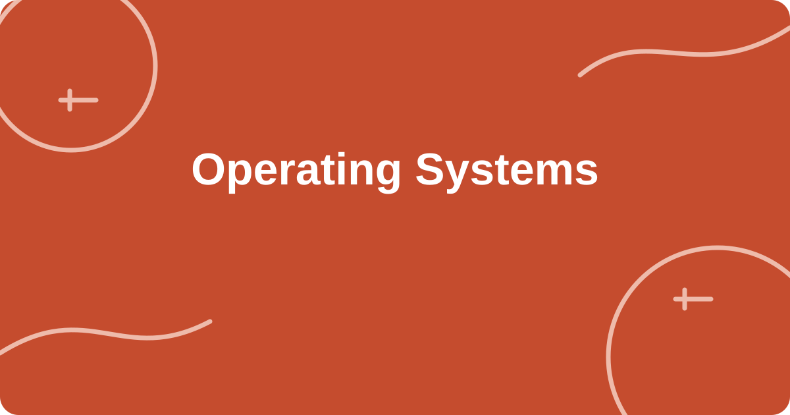</a><br>
  <a href="catalog/computer-science/cs-os.md"><strong>Operating Systems</strong></a><br>
  <sub>8 prompts · Operating System Concepts (Silberschatz et al.)</sub>
</td>
<td width="33%" valign="top">
  <a href="catalog/computer-science/cs-net.md">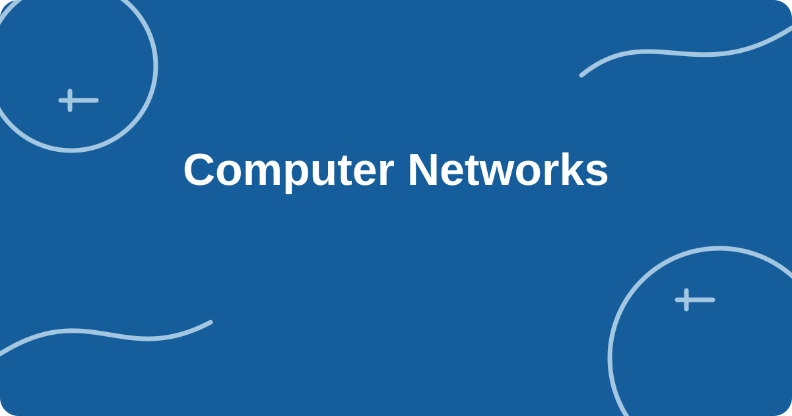</a><br>
  <a href="catalog/computer-science/cs-net.md"><strong>Computer Networks</strong></a><br>
  <sub>8 prompts · Computer Networking: A Top-Down Approach (Kurose and Ross)</sub>
</td>
<td width="33%" valign="top">
  <a href="catalog/computer-science/cs-db.md">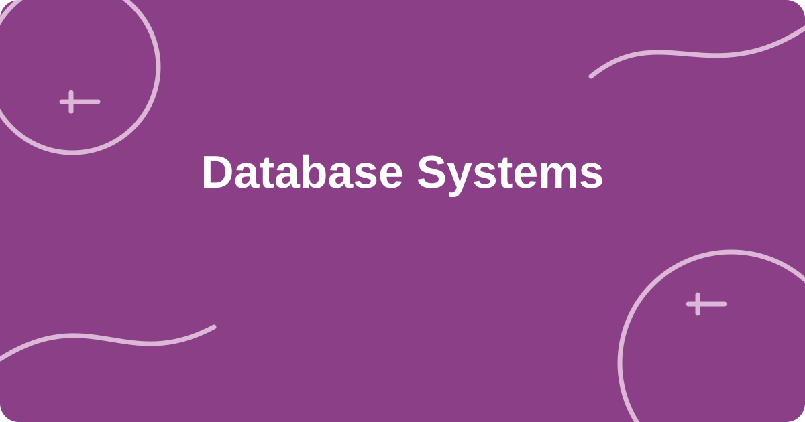</a><br>
  <a href="catalog/computer-science/cs-db.md"><strong>Database Systems</strong></a><br>
  <sub>8 prompts · Database System Concepts (Silberschatz et al.)</sub>
</td>
</tr>
<tr>
<td width="33%" valign="top">
  <a href="catalog/computer-science/cs-comp.md">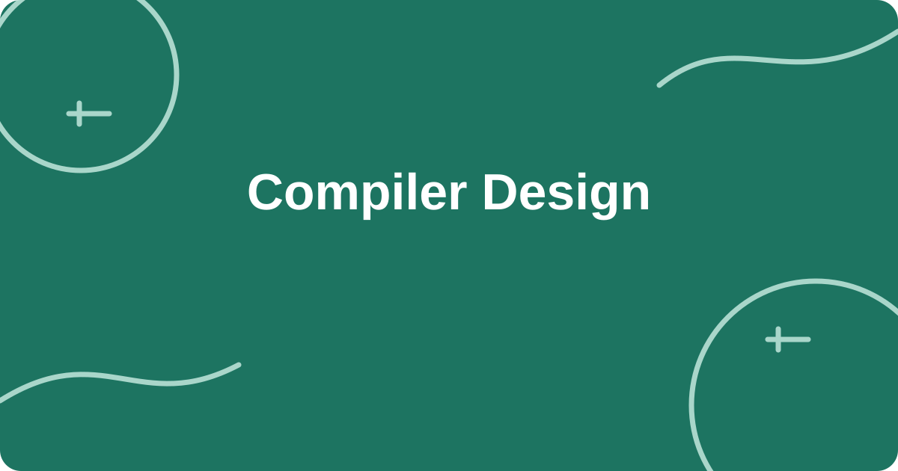</a><br>
  <a href="catalog/computer-science/cs-comp.md"><strong>Compiler Design</strong></a><br>
  <sub>8 prompts · Compilers: Principles, Techniques, and Tools (Aho et al.)</sub>
</td>
<td></td>
<td></td>
</tr>
</table>

### [Introduction to Computer Science](catalog/computer-science/cs50x.md)

**TEXTBOOK · Course notes (no required textbook)** &nbsp; [Open course page](catalog/computer-science/cs50x.md)

#### Knowledge points

1. [**Pointer**](catalog/computer-science/cs50x.md#c01-a001) · `C01-A001` · ▶ PLAY VIDEO
2. [**Memory address**](catalog/computer-science/cs50x.md#c01-a002) · `C01-A002` · ▶ PLAY VIDEO
3. [**Memory layout**](catalog/computer-science/cs50x.md#c01-a003) · `C01-A003` · ▶ PLAY VIDEO
4. [**Time complexity**](catalog/computer-science/cs50x.md#c01-a004) · `C01-A004` · ▶ PLAY VIDEO
5. [**Algorithm growth rate**](catalog/computer-science/cs50x.md#c01-a005) · `C01-A005` · ▶ PLAY VIDEO
6. [**Sorting process**](catalog/computer-science/cs50x.md#c01-a006) · `C01-A006` · ▶ PLAY VIDEO
7. [**Binary search**](catalog/computer-science/cs50x.md#c01-a007) · `C01-A007` · ▶ PLAY VIDEO
8. [**Linked list**](catalog/computer-science/cs50x.md#c01-a008) · `C01-A008` · ▶ PLAY VIDEO
9. [**Tree structure**](catalog/computer-science/cs50x.md#c01-a009) · `C01-A009` · ▶ PLAY VIDEO
10. [**Hash table**](catalog/computer-science/cs50x.md#c01-a010) · `C01-A010` · ▶ PLAY VIDEO
11. [**Relational model**](catalog/computer-science/cs50x.md#c01-a011) · `C01-A011` · ▶ PLAY VIDEO
12. [**SQL JOIN**](catalog/computer-science/cs50x.md#c01-a012) · `C01-A012` · ▶ PLAY VIDEO
13. [**Stack vs. Heap**](catalog/computer-science/cs50x.md#c01-a013) · `C01-A013` · ▶ PLAY VIDEO
14. [**Pointer Dereferencing**](catalog/computer-science/cs50x.md#c01-a014) · `C01-A014` · ▶ PLAY VIDEO
15. [**Pointer Arithmetic**](catalog/computer-science/cs50x.md#c01-a015) · `C01-A015` · ▶ PLAY VIDEO
16. [**Recursive Call Stack**](catalog/computer-science/cs50x.md#c01-a016) · `C01-A016` · ▶ PLAY VIDEO

### [Introduction to Algorithms](catalog/computer-science/6-006.md)

**TEXTBOOK · Introduction to Algorithms, 3e (Cormen et al.)** &nbsp; [Open course page](catalog/computer-science/6-006.md)

#### Knowledge points

1. [**Divide and conquer recursion**](catalog/computer-science/6-006.md#c02-a001) · `C02-A001` · ▶ PLAY VIDEO
2. [**Recursive**](catalog/computer-science/6-006.md#c02-a002) · `C02-A002` · ▶ PLAY VIDEO
3. [**Heap structure**](catalog/computer-science/6-006.md#c02-a003) · `C02-A003` · ▶ PLAY VIDEO
4. [**Heap sort**](catalog/computer-science/6-006.md#c02-a004) · `C02-A004` · ▶ PLAY VIDEO
5. [**Balanced binary search tree**](catalog/computer-science/6-006.md#c02-a005) · `C02-A005` · ▶ PLAY VIDEO
6. [**Graph search**](catalog/computer-science/6-006.md#c02-a006) · `C02-A006` · ▶ PLAY VIDEO
7. [**Shortest path**](catalog/computer-science/6-006.md#c02-a007) · `C02-A007` · ▶ PLAY VIDEO
8. [**Dynamic programming status**](catalog/computer-science/6-006.md#c02-a008) · `C02-A008` · ▶ PLAY VIDEO
9. [**Dynamic programming transfer**](catalog/computer-science/6-006.md#c02-a009) · `C02-A009` · ▶ PLAY VIDEO
10. [**Quicksort Partitioning**](catalog/computer-science/6-006.md#c02-a010) · `C02-A010` · ▶ PLAY VIDEO
11. [**Merge Step in Merge Sort**](catalog/computer-science/6-006.md#c02-a011) · `C02-A011` · ▶ PLAY VIDEO
12. [**Union-Find Path Compression**](catalog/computer-science/6-006.md#c02-a012) · `C02-A012` · ▶ PLAY VIDEO
13. [**Topological Sorting**](catalog/computer-science/6-006.md#c02-a013) · `C02-A013` · ▶ PLAY VIDEO

### [Computer Organization and Architecture](catalog/computer-science/cs-coa.md)

**TEXTBOOK · Computer Organization and Design (Patterson and Hennessy)** &nbsp; [Open course page](catalog/computer-science/cs-coa.md)

#### Knowledge points

1. [**Two&#x27;s Complement**](catalog/computer-science/cs-coa.md#c21-a001) · `C21-A001` · ▶ PLAY VIDEO
2. [**Floating-Point Representation**](catalog/computer-science/cs-coa.md#c21-a002) · `C21-A002` · ▶ PLAY VIDEO
3. [**Boolean Logic Gates**](catalog/computer-science/cs-coa.md#c21-a003) · `C21-A003` · ▶ PLAY VIDEO
4. [**Combinational Logic**](catalog/computer-science/cs-coa.md#c21-a004) · `C21-A004` · ▶ PLAY VIDEO
5. [**Sequential Logic and Clocks**](catalog/computer-science/cs-coa.md#c21-a005) · `C21-A005` · ▶ PLAY VIDEO
6. [**CPU Fetch-Decode-Execute Cycle**](catalog/computer-science/cs-coa.md#c21-a006) · `C21-A006` · ▶ PLAY VIDEO
7. [**Pipeline Hazards**](catalog/computer-science/cs-coa.md#c21-a007) · `C21-A007` · ▶ PLAY VIDEO
8. [**Cache Locality**](catalog/computer-science/cs-coa.md#c21-a008) · `C21-A008` · ▶ PLAY VIDEO

### [Operating Systems](catalog/computer-science/cs-os.md)

**TEXTBOOK · Operating System Concepts (Silberschatz et al.)** &nbsp; [Open course page](catalog/computer-science/cs-os.md)

#### Knowledge points

1. [**Processes and Threads**](catalog/computer-science/cs-os.md#c22-a001) · `C22-A001` · ▶ PLAY VIDEO
2. [**Process State Transitions**](catalog/computer-science/cs-os.md#c22-a002) · `C22-A002` · ▶ PLAY VIDEO
3. [**Context Switching**](catalog/computer-science/cs-os.md#c22-a003) · `C22-A003` · ▶ PLAY VIDEO
4. [**CPU Scheduling**](catalog/computer-science/cs-os.md#c22-a004) · `C22-A004` · ▶ PLAY VIDEO
5. [**Virtual Memory Paging**](catalog/computer-science/cs-os.md#c22-a005) · `C22-A005` · ▶ PLAY VIDEO
6. [**Page-Table Address Translation**](catalog/computer-science/cs-os.md#c22-a006) · `C22-A006` · ▶ PLAY VIDEO
7. [**Page Replacement**](catalog/computer-science/cs-os.md#c22-a007) · `C22-A007` · ▶ PLAY VIDEO
8. [**Four Conditions for Deadlock**](catalog/computer-science/cs-os.md#c22-a008) · `C22-A008` · ▶ PLAY VIDEO

### [Computer Networks](catalog/computer-science/cs-net.md)

**TEXTBOOK · Computer Networking: A Top-Down Approach (Kurose and Ross)** &nbsp; [Open course page](catalog/computer-science/cs-net.md)

#### Knowledge points

1. [**OSI and TCP/IP Layers**](catalog/computer-science/cs-net.md#c23-a001) · `C23-A001` · ▶ PLAY VIDEO
2. [**Packet Encapsulation**](catalog/computer-science/cs-net.md#c23-a002) · `C23-A002` · ▶ PLAY VIDEO
3. [**Subnet Masks and CIDR**](catalog/computer-science/cs-net.md#c23-a003) · `C23-A003` · ▶ PLAY VIDEO
4. [**Longest-Prefix Routing Match**](catalog/computer-science/cs-net.md#c23-a004) · `C23-A004` · ▶ PLAY VIDEO
5. [**TCP Three-Way Handshake**](catalog/computer-science/cs-net.md#c23-a005) · `C23-A005` · ▶ PLAY VIDEO
6. [**TCP Congestion Window**](catalog/computer-science/cs-net.md#c23-a006) · `C23-A006` · ▶ PLAY VIDEO
7. [**DNS Resolution**](catalog/computer-science/cs-net.md#c23-a007) · `C23-A007` · ▶ PLAY VIDEO
8. [**HTTP Request and Response**](catalog/computer-science/cs-net.md#c23-a008) · `C23-A008` · ▶ PLAY VIDEO

### [Database Systems](catalog/computer-science/cs-db.md)

**TEXTBOOK · Database System Concepts (Silberschatz et al.)** &nbsp; [Open course page](catalog/computer-science/cs-db.md)

#### Knowledge points

1. [**Entity-Relationship Model**](catalog/computer-science/cs-db.md#c24-a001) · `C24-A001` · ▶ PLAY VIDEO
2. [**Primary and Foreign Keys**](catalog/computer-science/cs-db.md#c24-a002) · `C24-A002` · ▶ PLAY VIDEO
3. [**Functional Dependencies**](catalog/computer-science/cs-db.md#c24-a003) · `C24-A003` · ▶ PLAY VIDEO
4. [**Database Normalization**](catalog/computer-science/cs-db.md#c24-a004) · `C24-A004` · ▶ PLAY VIDEO
5. [**B+ Tree Index**](catalog/computer-science/cs-db.md#c24-a005) · `C24-A005` · ▶ PLAY VIDEO
6. [**ACID Transactions**](catalog/computer-science/cs-db.md#c24-a006) · `C24-A006` · ▶ PLAY VIDEO
7. [**Concurrency Control and Locks**](catalog/computer-science/cs-db.md#c24-a007) · `C24-A007` · ▶ PLAY VIDEO
8. [**Multiversion Concurrency Control**](catalog/computer-science/cs-db.md#c24-a008) · `C24-A008` · ▶ PLAY VIDEO

### [Compiler Design](catalog/computer-science/cs-comp.md)

**TEXTBOOK · Compilers: Principles, Techniques, and Tools (Aho et al.)** &nbsp; [Open course page](catalog/computer-science/cs-comp.md)

#### Knowledge points

1. [**Lexical Analysis and Tokens**](catalog/computer-science/cs-comp.md#c25-a001) · `C25-A001` · ▶ PLAY VIDEO
2. [**Regular Expression to Finite Automaton**](catalog/computer-science/cs-comp.md#c25-a002) · `C25-A002` · ▶ PLAY VIDEO
3. [**Context-Free Grammar**](catalog/computer-science/cs-comp.md#c25-a003) · `C25-A003` · ▶ PLAY VIDEO
4. [**Abstract Syntax Tree**](catalog/computer-science/cs-comp.md#c25-a004) · `C25-A004` · ▶ PLAY VIDEO
5. [**Recursive-Descent Parsing**](catalog/computer-science/cs-comp.md#c25-a005) · `C25-A005` · ▶ PLAY VIDEO
6. [**Intermediate Representation**](catalog/computer-science/cs-comp.md#c25-a006) · `C25-A006` · ▶ PLAY VIDEO
7. [**Data-Flow Analysis**](catalog/computer-science/cs-comp.md#c25-a007) · `C25-A007` · ▶ PLAY VIDEO
8. [**Register Allocation**](catalog/computer-science/cs-comp.md#c25-a008) · `C25-A008` · ▶ PLAY VIDEO

---

<a id="artificial-intelligence"></a>
## Artificial Intelligence

**6 courses · 60 prompts** &nbsp; [Back to cards](#browse-the-library)

<table>
<tr>
<td width="33%" valign="top">
  <a href="catalog/artificial-intelligence/6-036.md"></a><br>
  <a href="catalog/artificial-intelligence/6-036.md"><strong>Introduction to Machine Learning</strong></a><br>
  <sub>20 prompts · Course notes; The Elements of Statistical Learning (reference)</sub>
</td>
<td width="33%" valign="top">
  <a href="catalog/artificial-intelligence/ai-dl.md">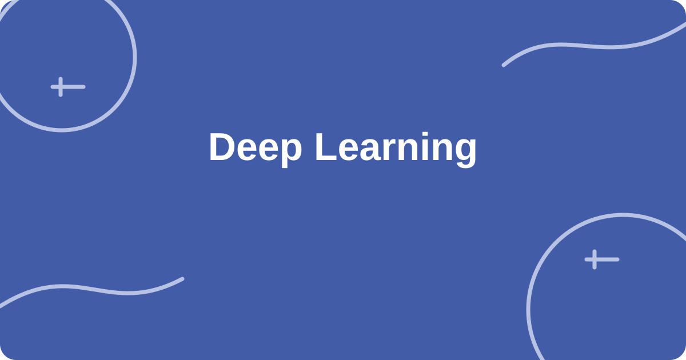</a><br>
  <a href="catalog/artificial-intelligence/ai-dl.md"><strong>Deep Learning</strong></a><br>
  <sub>8 prompts · Deep Learning (Goodfellow et al.)</sub>
</td>
<td width="33%" valign="top">
  <a href="catalog/artificial-intelligence/ai-nlp.md">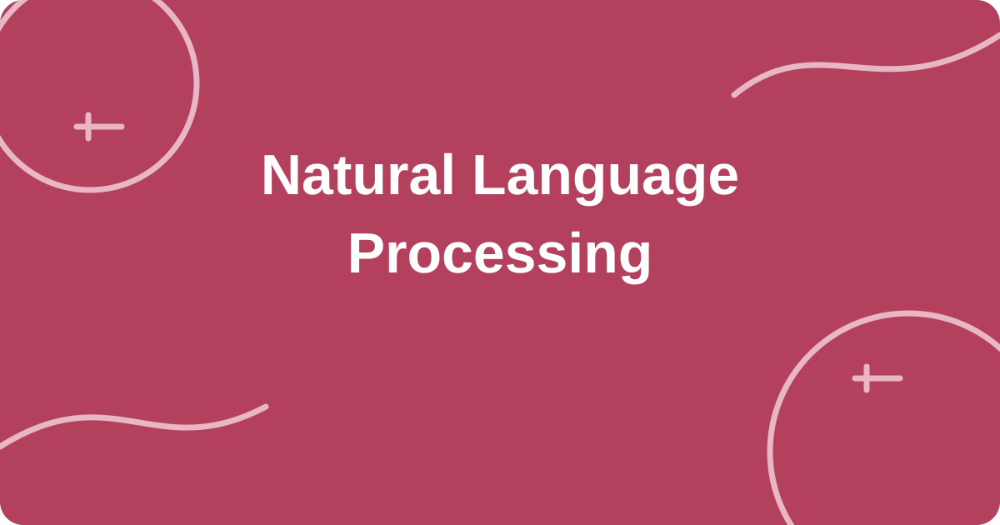</a><br>
  <a href="catalog/artificial-intelligence/ai-nlp.md"><strong>Natural Language Processing</strong></a><br>
  <sub>8 prompts · Speech and Language Processing (Jurafsky and Martin)</sub>
</td>
</tr>
<tr>
<td width="33%" valign="top">
  <a href="catalog/artificial-intelligence/ai-cv.md">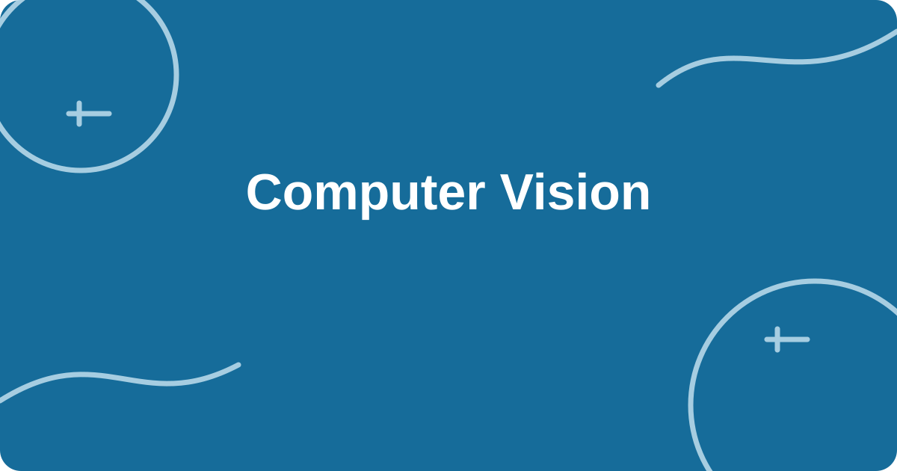</a><br>
  <a href="catalog/artificial-intelligence/ai-cv.md"><strong>Computer Vision</strong></a><br>
  <sub>8 prompts · Computer Vision: Algorithms and Applications (Szeliski)</sub>
</td>
<td width="33%" valign="top">
  <a href="catalog/artificial-intelligence/ai-rl.md">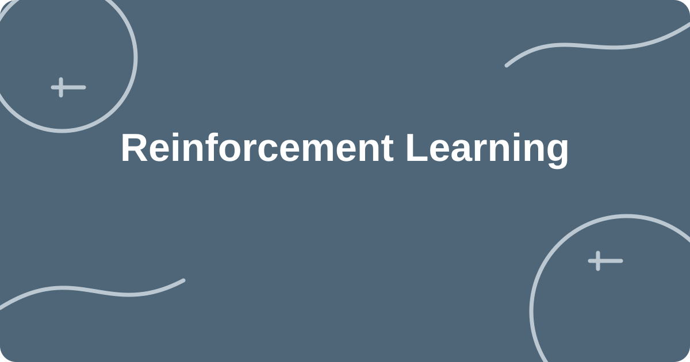</a><br>
  <a href="catalog/artificial-intelligence/ai-rl.md"><strong>Reinforcement Learning</strong></a><br>
  <sub>8 prompts · Reinforcement Learning: An Introduction (Sutton and Barto)</sub>
</td>
<td width="33%" valign="top">
  <a href="catalog/artificial-intelligence/ai-gen.md">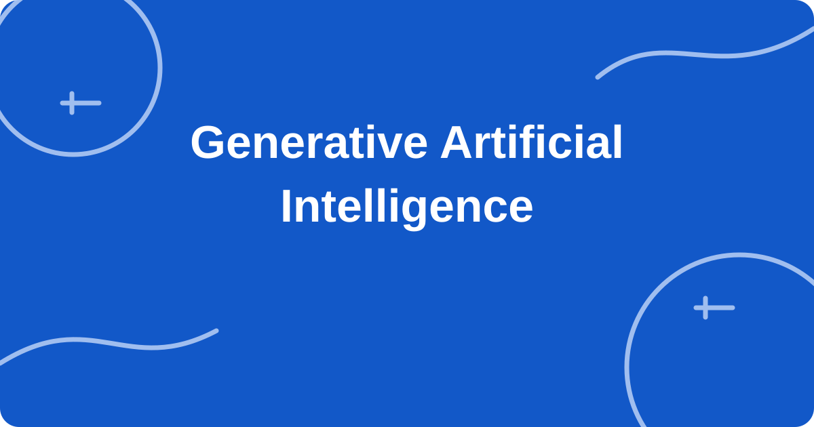</a><br>
  <a href="catalog/artificial-intelligence/ai-gen.md"><strong>Generative Artificial Intelligence</strong></a><br>
  <sub>8 prompts · Course notes (no required textbook)</sub>
</td>
</tr>
</table>

### [Introduction to Machine Learning](catalog/artificial-intelligence/6-036.md)

**TEXTBOOK · Course notes; The Elements of Statistical Learning (reference)** &nbsp; [Open course page](catalog/artificial-intelligence/6-036.md)

#### Knowledge points

1. [**Decision boundary**](catalog/artificial-intelligence/6-036.md#c03-a001) · `C03-A001` · ▶ PLAY VIDEO
2. [**Feature space**](catalog/artificial-intelligence/6-036.md#c03-a002) · `C03-A002` · ▶ PLAY VIDEO
3. [**Gradient descent**](catalog/artificial-intelligence/6-036.md#c03-a003) · `C03-A003` · ▶ PLAY VIDEO
4. [**Loss of terrain**](catalog/artificial-intelligence/6-036.md#c03-a004) · `C03-A004` · ▶ PLAY VIDEO
5. [**Overfitting**](catalog/artificial-intelligence/6-036.md#c03-a005) · `C03-A005` · ▶ PLAY VIDEO
6. [**Underfitting**](catalog/artificial-intelligence/6-036.md#c03-a006) · `C03-A006` · ▶ PLAY VIDEO
7. [**Model bias**](catalog/artificial-intelligence/6-036.md#c03-a007) · `C03-A007` · ▶ PLAY VIDEO
8. [**Model variance**](catalog/artificial-intelligence/6-036.md#c03-a008) · `C03-A008` · ▶ PLAY VIDEO
9. [**Backpropagation**](catalog/artificial-intelligence/6-036.md#c03-a009) · `C03-A009` · ▶ PLAY VIDEO
10. [**Chain rule**](catalog/artificial-intelligence/6-036.md#c03-a010) · `C03-A010` · ▶ PLAY VIDEO
11. [**Markov decision process**](catalog/artificial-intelligence/6-036.md#c03-a011) · `C03-A011` · ▶ PLAY VIDEO
12. [**Value iteration**](catalog/artificial-intelligence/6-036.md#c03-a012) · `C03-A012` · ▶ PLAY VIDEO
13. [**Linear Regression**](catalog/artificial-intelligence/6-036.md#c03-a013) · `C03-A013` · ▶ PLAY VIDEO
14. [**Logistic Regression**](catalog/artificial-intelligence/6-036.md#c03-a014) · `C03-A014` · ▶ PLAY VIDEO
15. [**Softmax Classification**](catalog/artificial-intelligence/6-036.md#c03-a015) · `C03-A015` · ▶ PLAY VIDEO
16. [**K-Nearest Neighbors**](catalog/artificial-intelligence/6-036.md#c03-a016) · `C03-A016` · ▶ PLAY VIDEO
17. [**Maximum-Margin Support Vector Machine**](catalog/artificial-intelligence/6-036.md#c03-a017) · `C03-A017` · ▶ PLAY VIDEO
18. [**Decision-Tree Information Gain**](catalog/artificial-intelligence/6-036.md#c03-a018) · `C03-A018` · ▶ PLAY VIDEO
19. [**K-Means Clustering**](catalog/artificial-intelligence/6-036.md#c03-a019) · `C03-A019` · ▶ PLAY VIDEO
20. [**Principal Component Analysis**](catalog/artificial-intelligence/6-036.md#c03-a020) · `C03-A020` · ▶ PLAY VIDEO

### [Deep Learning](catalog/artificial-intelligence/ai-dl.md)

**TEXTBOOK · Deep Learning (Goodfellow et al.)** &nbsp; [Open course page](catalog/artificial-intelligence/ai-dl.md)

#### Knowledge points

1. [**Artificial Neuron**](catalog/artificial-intelligence/ai-dl.md#c26-a001) · `C26-A001` · ▶ PLAY VIDEO
2. [**Activation Functions**](catalog/artificial-intelligence/ai-dl.md#c26-a002) · `C26-A002` · ▶ PLAY VIDEO
3. [**Parameter Initialization**](catalog/artificial-intelligence/ai-dl.md#c26-a003) · `C26-A003` · ▶ PLAY VIDEO
4. [**Batch Normalization**](catalog/artificial-intelligence/ai-dl.md#c26-a004) · `C26-A004` · ▶ PLAY VIDEO
5. [**Dropout**](catalog/artificial-intelligence/ai-dl.md#c26-a005) · `C26-A005` · ▶ PLAY VIDEO
6. [**Convolutional Neural Network**](catalog/artificial-intelligence/ai-dl.md#c26-a006) · `C26-A006` · ▶ PLAY VIDEO
7. [**Vanishing Gradients in Recurrent Neural Networks**](catalog/artificial-intelligence/ai-dl.md#c26-a007) · `C26-A007` · ▶ PLAY VIDEO
8. [**Attention Mechanism**](catalog/artificial-intelligence/ai-dl.md#c26-a008) · `C26-A008` · ▶ PLAY VIDEO

### [Natural Language Processing](catalog/artificial-intelligence/ai-nlp.md)

**TEXTBOOK · Speech and Language Processing (Jurafsky and Martin)** &nbsp; [Open course page](catalog/artificial-intelligence/ai-nlp.md)

#### Knowledge points

1. [**Text Tokenization**](catalog/artificial-intelligence/ai-nlp.md#c27-a001) · `C27-A001` · ▶ PLAY VIDEO
2. [**N-Gram Language Model**](catalog/artificial-intelligence/ai-nlp.md#c27-a002) · `C27-A002` · ▶ PLAY VIDEO
3. [**Word Embeddings**](catalog/artificial-intelligence/ai-nlp.md#c27-a003) · `C27-A003` · ▶ PLAY VIDEO
4. [**Positional Encoding**](catalog/artificial-intelligence/ai-nlp.md#c27-a004) · `C27-A004` · ▶ PLAY VIDEO
5. [**Self-Attention**](catalog/artificial-intelligence/ai-nlp.md#c27-a005) · `C27-A005` · ▶ PLAY VIDEO
6. [**Encoder-Decoder Architecture**](catalog/artificial-intelligence/ai-nlp.md#c27-a006) · `C27-A006` · ▶ PLAY VIDEO
7. [**Beam Search**](catalog/artificial-intelligence/ai-nlp.md#c27-a007) · `C27-A007` · ▶ PLAY VIDEO
8. [**Retrieval-Augmented Generation**](catalog/artificial-intelligence/ai-nlp.md#c27-a008) · `C27-A008` · ▶ PLAY VIDEO

### [Computer Vision](catalog/artificial-intelligence/ai-cv.md)

**TEXTBOOK · Computer Vision: Algorithms and Applications (Szeliski)** &nbsp; [Open course page](catalog/artificial-intelligence/ai-cv.md)

#### Knowledge points

1. [**Image Convolution**](catalog/artificial-intelligence/ai-cv.md#c28-a001) · `C28-A001` · ▶ PLAY VIDEO
2. [**Edge Detection**](catalog/artificial-intelligence/ai-cv.md#c28-a002) · `C28-A002` · ▶ PLAY VIDEO
3. [**Padding and Stride**](catalog/artificial-intelligence/ai-cv.md#c28-a003) · `C28-A003` · ▶ PLAY VIDEO
4. [**Pooling**](catalog/artificial-intelligence/ai-cv.md#c28-a004) · `C28-A004` · ▶ PLAY VIDEO
5. [**Receptive Field**](catalog/artificial-intelligence/ai-cv.md#c28-a005) · `C28-A005` · ▶ PLAY VIDEO
6. [**Intersection over Union and Non-Maximum Suppression**](catalog/artificial-intelligence/ai-cv.md#c28-a006) · `C28-A006` · ▶ PLAY VIDEO
7. [**Semantic Segmentation**](catalog/artificial-intelligence/ai-cv.md#c28-a007) · `C28-A007` · ▶ PLAY VIDEO
8. [**Image Data Augmentation**](catalog/artificial-intelligence/ai-cv.md#c28-a008) · `C28-A008` · ▶ PLAY VIDEO

### [Reinforcement Learning](catalog/artificial-intelligence/ai-rl.md)

**TEXTBOOK · Reinforcement Learning: An Introduction (Sutton and Barto)** &nbsp; [Open course page](catalog/artificial-intelligence/ai-rl.md)

#### Knowledge points

1. [**States, Actions, and Rewards**](catalog/artificial-intelligence/ai-rl.md#c29-a001) · `C29-A001` · ▶ PLAY VIDEO
2. [**Discounted Return**](catalog/artificial-intelligence/ai-rl.md#c29-a002) · `C29-A002` · ▶ PLAY VIDEO
3. [**Bellman Optimality Equation**](catalog/artificial-intelligence/ai-rl.md#c29-a003) · `C29-A003` · ▶ PLAY VIDEO
4. [**Q-Learning Update**](catalog/artificial-intelligence/ai-rl.md#c29-a004) · `C29-A004` · ▶ PLAY VIDEO
5. [**Epsilon-Greedy Exploration**](catalog/artificial-intelligence/ai-rl.md#c29-a005) · `C29-A005` · ▶ PLAY VIDEO
6. [**Policy Gradient**](catalog/artificial-intelligence/ai-rl.md#c29-a006) · `C29-A006` · ▶ PLAY VIDEO
7. [**Actor-Critic Method**](catalog/artificial-intelligence/ai-rl.md#c29-a007) · `C29-A007` · ▶ PLAY VIDEO
8. [**Experience Replay**](catalog/artificial-intelligence/ai-rl.md#c29-a008) · `C29-A008` · ▶ PLAY VIDEO

### [Generative Artificial Intelligence](catalog/artificial-intelligence/ai-gen.md)

**TEXTBOOK · Course notes (no required textbook)** &nbsp; [Open course page](catalog/artificial-intelligence/ai-gen.md)

#### Knowledge points

1. [**Autoencoder**](catalog/artificial-intelligence/ai-gen.md#c30-a001) · `C30-A001` · ▶ PLAY VIDEO
2. [**Variational Autoencoder Reparameterization**](catalog/artificial-intelligence/ai-gen.md#c30-a002) · `C30-A002` · ▶ PLAY VIDEO
3. [**Latent-Space Interpolation**](catalog/artificial-intelligence/ai-gen.md#c30-a003) · `C30-A003` · ▶ PLAY VIDEO
4. [**Generative Adversarial Training**](catalog/artificial-intelligence/ai-gen.md#c30-a004) · `C30-A004` · ▶ PLAY VIDEO
5. [**Mode Collapse**](catalog/artificial-intelligence/ai-gen.md#c30-a005) · `C30-A005` · ▶ PLAY VIDEO
6. [**Diffusion Forward Noising**](catalog/artificial-intelligence/ai-gen.md#c30-a006) · `C30-A006` · ▶ PLAY VIDEO
7. [**Diffusion Reverse Denoising**](catalog/artificial-intelligence/ai-gen.md#c30-a007) · `C30-A007` · ▶ PLAY VIDEO
8. [**Classifier-Free Guidance**](catalog/artificial-intelligence/ai-gen.md#c30-a008) · `C30-A008` · ▶ PLAY VIDEO

---

<a id="mathematics"></a>
## Mathematics

**7 courses · 68 prompts** &nbsp; [Back to cards](#browse-the-library)

<table>
<tr>
<td width="33%" valign="top">
  <a href="catalog/mathematics/18-01.md"></a><br>
  <a href="catalog/mathematics/18-01.md"><strong>Single-Variable Calculus</strong></a><br>
  <sub>12 prompts · Calculus with Analytic Geometry, 2e (Simmons)</sub>
</td>
<td width="33%" valign="top">
  <a href="catalog/mathematics/18-06.md"></a><br>
  <a href="catalog/mathematics/18-06.md"><strong>Linear Algebra</strong></a><br>
  <sub>16 prompts · Introduction to Linear Algebra, 4e/5e (Strang)</sub>
</td>
<td width="33%" valign="top">
  <a href="catalog/mathematics/math-mvc.md">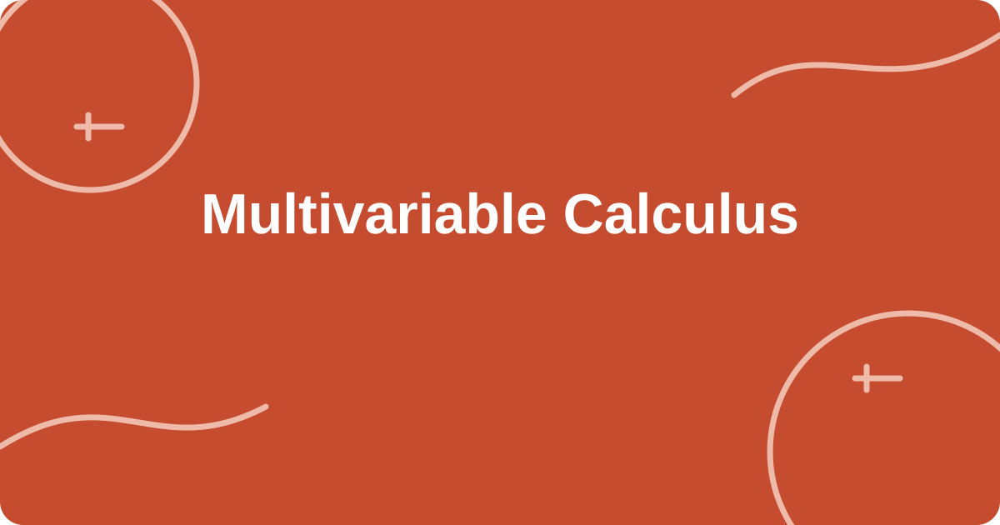</a><br>
  <a href="catalog/mathematics/math-mvc.md"><strong>Multivariable Calculus</strong></a><br>
  <sub>8 prompts · Calculus: Early Transcendentals (Stewart)</sub>
</td>
</tr>
<tr>
<td width="33%" valign="top">
  <a href="catalog/mathematics/math-ode.md">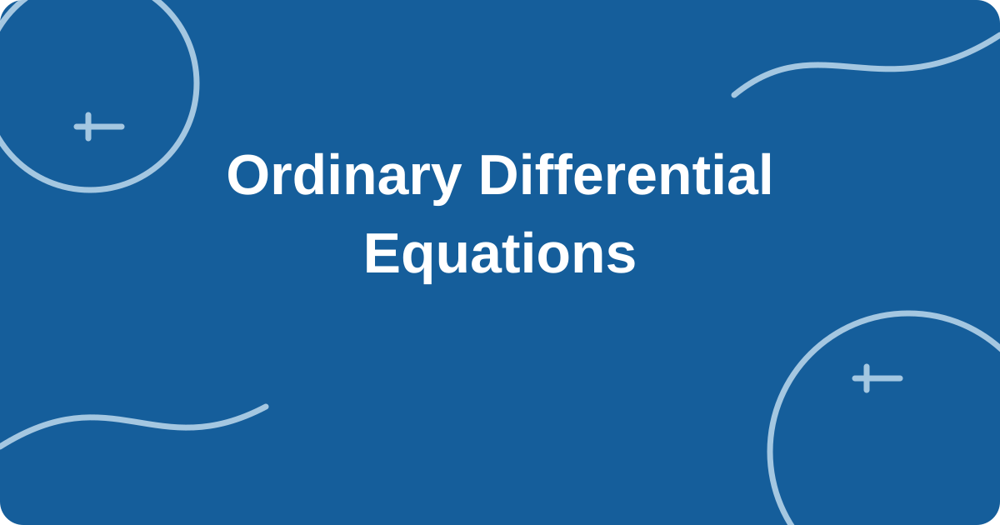</a><br>
  <a href="catalog/mathematics/math-ode.md"><strong>Ordinary Differential Equations</strong></a><br>
  <sub>8 prompts · Elementary Differential Equations (Boyce and DiPrima)</sub>
</td>
<td width="33%" valign="top">
  <a href="catalog/mathematics/math-dm.md">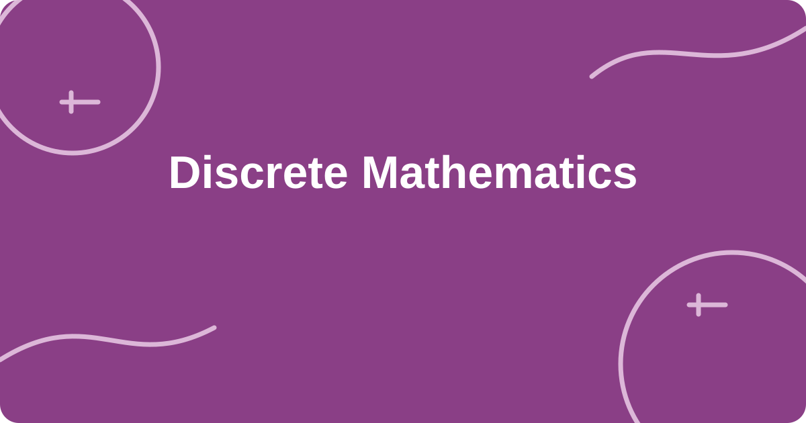</a><br>
  <a href="catalog/mathematics/math-dm.md"><strong>Discrete Mathematics</strong></a><br>
  <sub>8 prompts · Mathematics for Computer Science (Lehman et al.)</sub>
</td>
<td width="33%" valign="top">
  <a href="catalog/mathematics/math-aa.md">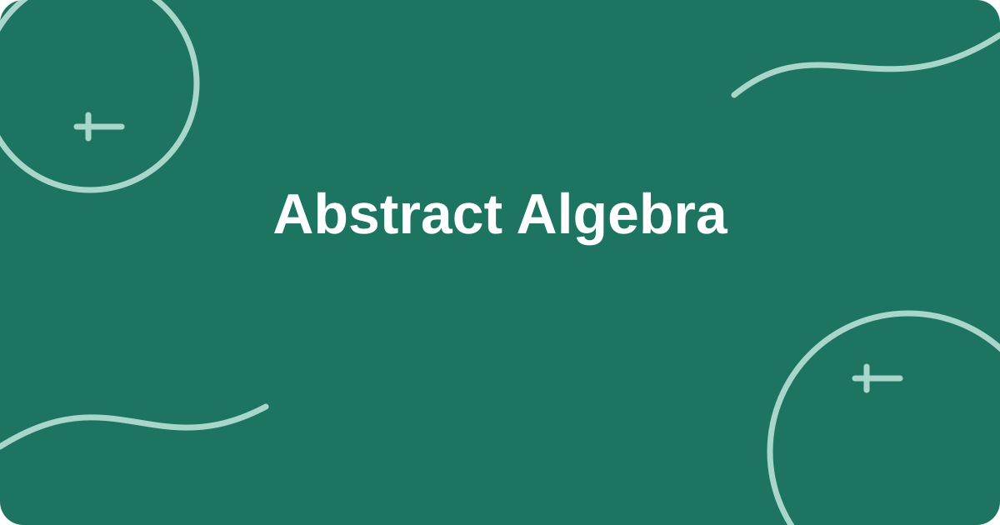</a><br>
  <a href="catalog/mathematics/math-aa.md"><strong>Abstract Algebra</strong></a><br>
  <sub>8 prompts · Abstract Algebra (Dummit and Foote)</sub>
</td>
</tr>
<tr>
<td width="33%" valign="top">
  <a href="catalog/mathematics/math-opt.md">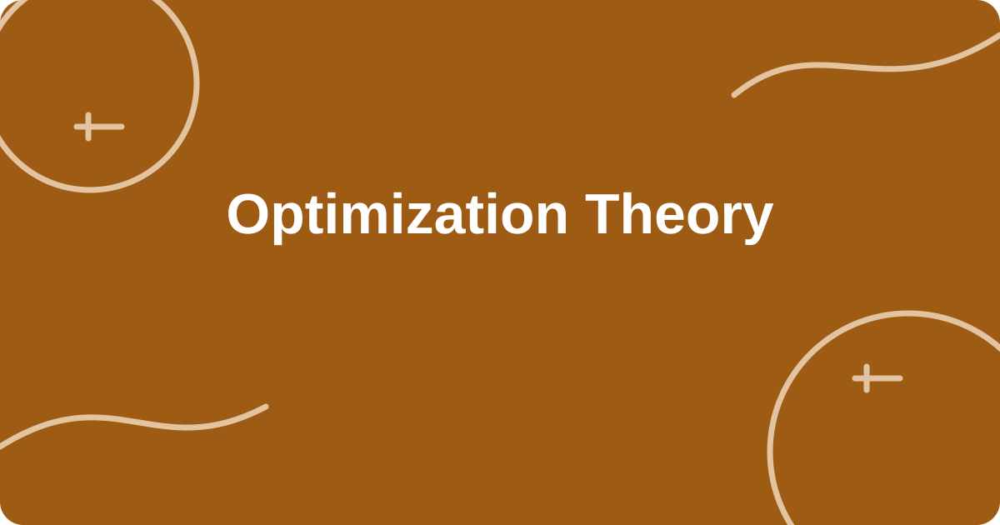</a><br>
  <a href="catalog/mathematics/math-opt.md"><strong>Optimization Theory</strong></a><br>
  <sub>8 prompts · Convex Optimization (Boyd and Vandenberghe)</sub>
</td>
<td></td>
<td></td>
</tr>
</table>

### [Single-Variable Calculus](catalog/mathematics/18-01.md)

**TEXTBOOK · Calculus with Analytic Geometry, 2e (Simmons)** &nbsp; [Open course page](catalog/mathematics/18-01.md)

#### Knowledge points

1. [**Limit**](catalog/mathematics/18-01.md#c04-a001) · `C04-A001` · ▶ PLAY VIDEO
2. [**Continuity**](catalog/mathematics/18-01.md#c04-a002) · `C04-A002` · ▶ PLAY VIDEO
3. [**Derivatives as local rates of change**](catalog/mathematics/18-01.md#c04-a003) · `C04-A003` · ▶ PLAY VIDEO
4. [**Fundamental Theorem of Calculus**](catalog/mathematics/18-01.md#c04-a004) · `C04-A004` · ▶ PLAY VIDEO
5. [**Volume of rotation**](catalog/mathematics/18-01.md#c04-a005) · `C04-A005` · ▶ PLAY VIDEO
6. [**Integral slice**](catalog/mathematics/18-01.md#c04-a006) · `C04-A006` · ▶ PLAY VIDEO
7. [**Infinite series**](catalog/mathematics/18-01.md#c04-a007) · `C04-A007` · ▶ PLAY VIDEO
8. [**Taylor Expand**](catalog/mathematics/18-01.md#c04-a008) · `C04-A008` · ▶ PLAY VIDEO
9. [**Epsilon-Delta Definition of a Limit**](catalog/mathematics/18-01.md#c04-a009) · `C04-A009` · ▶ PLAY VIDEO
10. [**Left- and Right-Hand Limits**](catalog/mathematics/18-01.md#c04-a010) · `C04-A010` · ▶ PLAY VIDEO
11. [**Chain Rule**](catalog/mathematics/18-01.md#c04-a011) · `C04-A011` · ▶ PLAY VIDEO
12. [**Implicit Differentiation**](catalog/mathematics/18-01.md#c04-a012) · `C04-A012` · ▶ PLAY VIDEO

### [Linear Algebra](catalog/mathematics/18-06.md)

**TEXTBOOK · Introduction to Linear Algebra, 4e/5e (Strang)** &nbsp; [Open course page](catalog/mathematics/18-06.md)

#### Knowledge points

1. [**Column space**](catalog/mathematics/18-06.md#c05-a001) · `C05-A001` · ▶ PLAY VIDEO
2. [**Line space**](catalog/mathematics/18-06.md#c05-a002) · `C05-A002` · ▶ PLAY VIDEO
3. [**Zero space**](catalog/mathematics/18-06.md#c05-a003) · `C05-A003` · ▶ PLAY VIDEO
4. [**Left zero space**](catalog/mathematics/18-06.md#c05-a004) · `C05-A004` · ▶ PLAY VIDEO
5. [**Orthographic projection**](catalog/mathematics/18-06.md#c05-a005) · `C05-A005` · ▶ PLAY VIDEO
6. [**Least squares**](catalog/mathematics/18-06.md#c05-a006) · `C05-A006` · ▶ PLAY VIDEO
7. [**Determinant**](catalog/mathematics/18-06.md#c05-a007) · `C05-A007` · ▶ PLAY VIDEO
8. [**Volume scaling for linear transformations**](catalog/mathematics/18-06.md#c05-a008) · `C05-A008` · ▶ PLAY VIDEO
9. [**Eigenvalue**](catalog/mathematics/18-06.md#c05-a009) · `C05-A009` · ▶ PLAY VIDEO
10. [**Eigenvector**](catalog/mathematics/18-06.md#c05-a010) · `C05-A010` · ▶ PLAY VIDEO
11. [**Matrix diagonalization**](catalog/mathematics/18-06.md#c05-a011) · `C05-A011` · ▶ PLAY VIDEO
12. [**Singular value decomposition**](catalog/mathematics/18-06.md#c05-a012) · `C05-A012` · ▶ PLAY VIDEO
13. [**Gaussian Elimination**](catalog/mathematics/18-06.md#c05-a013) · `C05-A013` · ▶ PLAY VIDEO
14. [**Rank-Nullity Theorem**](catalog/mathematics/18-06.md#c05-a014) · `C05-A014` · ▶ PLAY VIDEO
15. [**Gram-Schmidt Orthogonalization**](catalog/mathematics/18-06.md#c05-a015) · `C05-A015` · ▶ PLAY VIDEO
16. [**QR Decomposition**](catalog/mathematics/18-06.md#c05-a016) · `C05-A016` · ▶ PLAY VIDEO

### [Multivariable Calculus](catalog/mathematics/math-mvc.md)

**TEXTBOOK · Calculus: Early Transcendentals (Stewart)** &nbsp; [Open course page](catalog/mathematics/math-mvc.md)

#### Knowledge points

1. [**Partial Derivatives**](catalog/mathematics/math-mvc.md#c31-a001) · `C31-A001` · ▶ PLAY VIDEO
2. [**Gradient**](catalog/mathematics/math-mvc.md#c31-a002) · `C31-A002` · ▶ PLAY VIDEO
3. [**Directional Derivative**](catalog/mathematics/math-mvc.md#c31-a003) · `C31-A003` · ▶ PLAY VIDEO
4. [**Jacobian Matrix**](catalog/mathematics/math-mvc.md#c31-a004) · `C31-A004` · ▶ PLAY VIDEO
5. [**Hessian Matrix**](catalog/mathematics/math-mvc.md#c31-a005) · `C31-A005` · ▶ PLAY VIDEO
6. [**Lagrange Multipliers**](catalog/mathematics/math-mvc.md#c31-a006) · `C31-A006` · ▶ PLAY VIDEO
7. [**Double Integral**](catalog/mathematics/math-mvc.md#c31-a007) · `C31-A007` · ▶ PLAY VIDEO
8. [**Divergence and Curl**](catalog/mathematics/math-mvc.md#c31-a008) · `C31-A008` · ▶ PLAY VIDEO

### [Ordinary Differential Equations](catalog/mathematics/math-ode.md)

**TEXTBOOK · Elementary Differential Equations (Boyce and DiPrima)** &nbsp; [Open course page](catalog/mathematics/math-ode.md)

#### Knowledge points

1. [**Separable Differential Equations**](catalog/mathematics/math-ode.md#c32-a001) · `C32-A001` · ▶ PLAY VIDEO
2. [**First-Order Linear Differential Equations**](catalog/mathematics/math-ode.md#c32-a002) · `C32-A002` · ▶ PLAY VIDEO
3. [**Phase Line**](catalog/mathematics/math-ode.md#c32-a003) · `C32-A003` · ▶ PLAY VIDEO
4. [**Stability of Equilibria**](catalog/mathematics/math-ode.md#c32-a004) · `C32-A004` · ▶ PLAY VIDEO
5. [**Second-Order Homogeneous Equations**](catalog/mathematics/math-ode.md#c32-a005) · `C32-A005` · ▶ PLAY VIDEO
6. [**Forced Oscillation and Resonance**](catalog/mathematics/math-ode.md#c32-a006) · `C32-A006` · ▶ PLAY VIDEO
7. [**Phase Portrait of an ODE System**](catalog/mathematics/math-ode.md#c32-a007) · `C32-A007` · ▶ PLAY VIDEO
8. [**Euler&#x27;s Method**](catalog/mathematics/math-ode.md#c32-a008) · `C32-A008` · ▶ PLAY VIDEO

### [Discrete Mathematics](catalog/mathematics/math-dm.md)

**TEXTBOOK · Mathematics for Computer Science (Lehman et al.)** &nbsp; [Open course page](catalog/mathematics/math-dm.md)

#### Knowledge points

1. [**Propositional Logic Truth Tables**](catalog/mathematics/math-dm.md#c33-a001) · `C33-A001` · ▶ PLAY VIDEO
2. [**Mathematical Induction**](catalog/mathematics/math-dm.md#c33-a002) · `C33-A002` · ▶ PLAY VIDEO
3. [**Set Operations**](catalog/mathematics/math-dm.md#c33-a003) · `C33-A003` · ▶ PLAY VIDEO
4. [**Relations and Equivalence Classes**](catalog/mathematics/math-dm.md#c33-a004) · `C33-A004` · ▶ PLAY VIDEO
5. [**Permutations and Combinations**](catalog/mathematics/math-dm.md#c33-a005) · `C33-A005` · ▶ PLAY VIDEO
6. [**Pigeonhole Principle**](catalog/mathematics/math-dm.md#c33-a006) · `C33-A006` · ▶ PLAY VIDEO
7. [**Recurrence Relations**](catalog/mathematics/math-dm.md#c33-a007) · `C33-A007` · ▶ PLAY VIDEO
8. [**Graph Connectivity**](catalog/mathematics/math-dm.md#c33-a008) · `C33-A008` · ▶ PLAY VIDEO

### [Abstract Algebra](catalog/mathematics/math-aa.md)

**TEXTBOOK · Abstract Algebra (Dummit and Foote)** &nbsp; [Open course page](catalog/mathematics/math-aa.md)

#### Knowledge points

1. [**Group Axioms**](catalog/mathematics/math-aa.md#c34-a001) · `C34-A001` · ▶ PLAY VIDEO
2. [**Subgroups**](catalog/mathematics/math-aa.md#c34-a002) · `C34-A002` · ▶ PLAY VIDEO
3. [**Cyclic Groups**](catalog/mathematics/math-aa.md#c34-a003) · `C34-A003` · ▶ PLAY VIDEO
4. [**Permutation Groups**](catalog/mathematics/math-aa.md#c34-a004) · `C34-A004` · ▶ PLAY VIDEO
5. [**Cosets and Lagrange&#x27;s Theorem**](catalog/mathematics/math-aa.md#c34-a005) · `C34-A005` · ▶ PLAY VIDEO
6. [**Group Homomorphisms**](catalog/mathematics/math-aa.md#c34-a006) · `C34-A006` · ▶ PLAY VIDEO
7. [**Rings and Ideals**](catalog/mathematics/math-aa.md#c34-a007) · `C34-A007` · ▶ PLAY VIDEO
8. [**Finite Fields**](catalog/mathematics/math-aa.md#c34-a008) · `C34-A008` · ▶ PLAY VIDEO

### [Optimization Theory](catalog/mathematics/math-opt.md)

**TEXTBOOK · Convex Optimization (Boyd and Vandenberghe)** &nbsp; [Open course page](catalog/mathematics/math-opt.md)

#### Knowledge points

1. [**Convex Sets and Convex Functions**](catalog/mathematics/math-opt.md#c35-a001) · `C35-A001` · ▶ PLAY VIDEO
2. [**First-Order Optimality Conditions**](catalog/mathematics/math-opt.md#c35-a002) · `C35-A002` · ▶ PLAY VIDEO
3. [**Second-Order Optimality Conditions**](catalog/mathematics/math-opt.md#c35-a003) · `C35-A003` · ▶ PLAY VIDEO
4. [**Gradient Descent Convergence**](catalog/mathematics/math-opt.md#c35-a004) · `C35-A004` · ▶ PLAY VIDEO
5. [**Newton&#x27;s Method**](catalog/mathematics/math-opt.md#c35-a005) · `C35-A005` · ▶ PLAY VIDEO
6. [**Lagrangian Duality**](catalog/mathematics/math-opt.md#c35-a006) · `C35-A006` · ▶ PLAY VIDEO
7. [**KKT Conditions**](catalog/mathematics/math-opt.md#c35-a007) · `C35-A007` · ▶ PLAY VIDEO
8. [**Projected Gradient Method**](catalog/mathematics/math-opt.md#c35-a008) · `C35-A008` · ▶ PLAY VIDEO

---

<a id="mathematics-statistics"></a>
## Mathematics & Statistics

**1 courses · 11 prompts** &nbsp; [Back to cards](#browse-the-library)

<table>
<tr>
<td width="33%" valign="top">
  <a href="catalog/mathematics-statistics/6-041.md"></a><br>
  <a href="catalog/mathematics-statistics/6-041.md"><strong>Applied Probability</strong></a><br>
  <sub>11 prompts · Introduction to Probability, 2e (Bertsekas &amp; Tsitsiklis)</sub>
</td>
<td></td>
<td></td>
</tr>
</table>

### [Applied Probability](catalog/mathematics-statistics/6-041.md)

**TEXTBOOK · Introduction to Probability, 2e (Bertsekas &amp; Tsitsiklis)** &nbsp; [Open course page](catalog/mathematics-statistics/6-041.md)

#### Knowledge points

1. [**Conditional probability**](catalog/mathematics-statistics/6-041.md#c06-a001) · `C06-A001` · VIDEO COMING SOON
2. [**Bayesian formula**](catalog/mathematics-statistics/6-041.md#c06-a002) · `C06-A002` · VIDEO COMING SOON
3. [**Random variable transformation**](catalog/mathematics-statistics/6-041.md#c06-a003) · `C06-A003` · VIDEO COMING SOON
4. [**Joint distribution**](catalog/mathematics-statistics/6-041.md#c06-a004) · `C06-A004` · VIDEO COMING SOON
5. [**Expectation**](catalog/mathematics-statistics/6-041.md#c06-a005) · `C06-A005` · VIDEO COMING SOON
6. [**Variance**](catalog/mathematics-statistics/6-041.md#c06-a006) · `C06-A006` · VIDEO COMING SOON
7. [**Covariance**](catalog/mathematics-statistics/6-041.md#c06-a007) · `C06-A007` · VIDEO COMING SOON
8. [**Law of large numbers**](catalog/mathematics-statistics/6-041.md#c06-a008) · `C06-A008` · VIDEO COMING SOON
9. [**Central limit theorem**](catalog/mathematics-statistics/6-041.md#c06-a009) · `C06-A009` · VIDEO COMING SOON
10. [**Markov chain**](catalog/mathematics-statistics/6-041.md#c06-a010) · `C06-A010` · VIDEO COMING SOON
11. [**Markov chain steady state**](catalog/mathematics-statistics/6-041.md#c06-a011) · `C06-A011` · VIDEO COMING SOON

---

<a id="physics"></a>
## Physics

**2 courses · 25 prompts** &nbsp; [Back to cards](#browse-the-library)

<table>
<tr>
<td width="33%" valign="top">
  <a href="catalog/physics/8-01.md"></a><br>
  <a href="catalog/physics/8-01.md"><strong>Classical Mechanics</strong></a><br>
  <sub>13 prompts · Classical Mechanics: MIT 8.01 Course Notes (Dourmashkin)</sub>
</td>
<td width="33%" valign="top">
  <a href="catalog/physics/8-02.md"></a><br>
  <a href="catalog/physics/8-02.md"><strong>Electromagnetism</strong></a><br>
  <sub>12 prompts · University Physics with Modern Physics, 11e (Young &amp; Freedman)</sub>
</td>
<td></td>
</tr>
</table>

### [Classical Mechanics](catalog/physics/8-01.md)

**TEXTBOOK · Classical Mechanics: MIT 8.01 Course Notes (Dourmashkin)** &nbsp; [Open course page](catalog/physics/8-01.md)

#### Knowledge points

1. [**Location-time graph**](catalog/physics/8-01.md#c07-a001) · `C07-A001` · VIDEO COMING SOON
2. [**Speed-time graph**](catalog/physics/8-01.md#c07-a002) · `C07-A002` · VIDEO COMING SOON
3. [**Acceleration-time graph**](catalog/physics/8-01.md#c07-a003) · `C07-A003` · VIDEO COMING SOON
4. [**Newton&#x27;s laws of motion**](catalog/physics/8-01.md#c07-a004) · `C07-A004` · VIDEO COMING SOON
5. [**Free body diagram**](catalog/physics/8-01.md#c07-a005) · `C07-A005` · VIDEO COMING SOON
6. [**Conservation of momentum**](catalog/physics/8-01.md#c07-a006) · `C07-A006` · VIDEO COMING SOON
7. [**Collision process**](catalog/physics/8-01.md#c07-a007) · `C07-A007` · VIDEO COMING SOON
8. [**Work-Energy Theorem**](catalog/physics/8-01.md#c07-a008) · `C07-A008` · VIDEO COMING SOON
9. [**Potential energy**](catalog/physics/8-01.md#c07-a009) · `C07-A009` · VIDEO COMING SOON
10. [**Potential energy curve**](catalog/physics/8-01.md#c07-a010) · `C07-A010` · VIDEO COMING SOON
11. [**Rigid body rotation**](catalog/physics/8-01.md#c07-a011) · `C07-A011` · VIDEO COMING SOON
12. [**Angular momentum**](catalog/physics/8-01.md#c07-a012) · `C07-A012` · VIDEO COMING SOON
13. [**No slip scrolling**](catalog/physics/8-01.md#c07-a013) · `C07-A013` · VIDEO COMING SOON

### [Electromagnetism](catalog/physics/8-02.md)

**TEXTBOOK · University Physics with Modern Physics, 11e (Young &amp; Freedman)** &nbsp; [Open course page](catalog/physics/8-02.md)

#### Knowledge points

1. [**Electric field**](catalog/physics/8-02.md#c08-a001) · `C08-A001` · VIDEO COMING SOON
2. [**Electric flux**](catalog/physics/8-02.md#c08-a002) · `C08-A002` · VIDEO COMING SOON
3. [**Gauss&#x27;s law**](catalog/physics/8-02.md#c08-a003) · `C08-A003` · VIDEO COMING SOON
4. [**Potential**](catalog/physics/8-02.md#c08-a004) · `C08-A004` · VIDEO COMING SOON
5. [**Potential gradient**](catalog/physics/8-02.md#c08-a005) · `C08-A005` · VIDEO COMING SOON
6. [**RC circuit transients**](catalog/physics/8-02.md#c08-a006) · `C08-A006` · VIDEO COMING SOON
7. [**RL circuit transient**](catalog/physics/8-02.md#c08-a007) · `C08-A007` · VIDEO COMING SOON
8. [**RLC circuit transients**](catalog/physics/8-02.md#c08-a008) · `C08-A008` · VIDEO COMING SOON
9. [**Lorentz force**](catalog/physics/8-02.md#c08-a009) · `C08-A009` · VIDEO COMING SOON
10. [**Magnetic field trajectories of charged particles**](catalog/physics/8-02.md#c08-a010) · `C08-A010` · VIDEO COMING SOON
11. [**Maxwell&#x27;s equations**](catalog/physics/8-02.md#c08-a011) · `C08-A011` · VIDEO COMING SOON
12. [**Electromagnetic wave propagation**](catalog/physics/8-02.md#c08-a012) · `C08-A012` · VIDEO COMING SOON

---

<a id="chemistry"></a>
## Chemistry

**1 courses · 14 prompts** &nbsp; [Back to cards](#browse-the-library)

<table>
<tr>
<td width="33%" valign="top">
  <a href="catalog/chemistry/5-12.md"></a><br>
  <a href="catalog/chemistry/5-12.md"><strong>Organic Chemistry I</strong></a><br>
  <sub>14 prompts · Organic Chemistry, 6e (McMurry)</sub>
</td>
<td></td>
<td></td>
</tr>
</table>

### [Organic Chemistry I](catalog/chemistry/5-12.md)

**TEXTBOOK · Organic Chemistry, 6e (McMurry)** &nbsp; [Open course page](catalog/chemistry/5-12.md)

#### Knowledge points

1. [**Resonance structure**](catalog/chemistry/5-12.md#c09-a001) · `C09-A001` · VIDEO COMING SOON
2. [**Acidity and alkalinity**](catalog/chemistry/5-12.md#c09-a002) · `C09-A002` · VIDEO COMING SOON
3. [**Electron delocalization**](catalog/chemistry/5-12.md#c09-a003) · `C09-A003` · VIDEO COMING SOON
4. [**Conformational analysis**](catalog/chemistry/5-12.md#c09-a004) · `C09-A004` · VIDEO COMING SOON
5. [**Cyclohexane flip**](catalog/chemistry/5-12.md#c09-a005) · `C09-A005` · VIDEO COMING SOON
6. [**Chirality**](catalog/chemistry/5-12.md#c09-a006) · `C09-A006` · VIDEO COMING SOON
7. [**R/S configuration**](catalog/chemistry/5-12.md#c09-a007) · `C09-A007` · VIDEO COMING SOON
8. [**Stereoisomerism**](catalog/chemistry/5-12.md#c09-a008) · `C09-A008` · VIDEO COMING SOON
9. [**SN1 response**](catalog/chemistry/5-12.md#c09-a009) · `C09-A009` · VIDEO COMING SOON
10. [**SN2 reaction**](catalog/chemistry/5-12.md#c09-a010) · `C09-A010` · VIDEO COMING SOON
11. [**E1 response**](catalog/chemistry/5-12.md#c09-a011) · `C09-A011` · VIDEO COMING SOON
12. [**E2 reaction**](catalog/chemistry/5-12.md#c09-a012) · `C09-A012` · VIDEO COMING SOON
13. [**Multi-step organic synthesis**](catalog/chemistry/5-12.md#c09-a013) · `C09-A013` · VIDEO COMING SOON
14. [**Retrosynthetic analysis**](catalog/chemistry/5-12.md#c09-a014) · `C09-A014` · VIDEO COMING SOON

---

<a id="life-sciences"></a>
## Life Sciences

**1 courses · 12 prompts** &nbsp; [Back to cards](#browse-the-library)

<table>
<tr>
<td width="33%" valign="top">
  <a href="catalog/life-sciences/7-013.md"></a><br>
  <a href="catalog/life-sciences/7-013.md"><strong>Introduction to Biology</strong></a><br>
  <sub>12 prompts · Campbell Biology, 9e</sub>
</td>
<td></td>
<td></td>
</tr>
</table>

### [Introduction to Biology](catalog/life-sciences/7-013.md)

**TEXTBOOK · Campbell Biology, 9e** &nbsp; [Open course page](catalog/life-sciences/7-013.md)

#### Knowledge points

1. [**Protein structure**](catalog/life-sciences/7-013.md#c10-a001) · `C10-A001` · VIDEO COMING SOON
2. [**Enzyme kinetics**](catalog/life-sciences/7-013.md#c10-a002) · `C10-A002` · VIDEO COMING SOON
3. [**Cell membrane transport**](catalog/life-sciences/7-013.md#c10-a003) · `C10-A003` · VIDEO COMING SOON
4. [**Electrochemical gradient**](catalog/life-sciences/7-013.md#c10-a004) · `C10-A004` · VIDEO COMING SOON
5. [**Meiosis**](catalog/life-sciences/7-013.md#c10-a005) · `C10-A005` · VIDEO COMING SOON
6. [**Genetic linkage**](catalog/life-sciences/7-013.md#c10-a006) · `C10-A006` · VIDEO COMING SOON
7. [**Genetic probability**](catalog/life-sciences/7-013.md#c10-a007) · `C10-A007` · VIDEO COMING SOON
8. [**DNA replication**](catalog/life-sciences/7-013.md#c10-a008) · `C10-A008` · VIDEO COMING SOON
9. [**Transcribe**](catalog/life-sciences/7-013.md#c10-a009) · `C10-A009` · VIDEO COMING SOON
10. [**Translate**](catalog/life-sciences/7-013.md#c10-a010) · `C10-A010` · VIDEO COMING SOON
11. [**Signal transduction**](catalog/life-sciences/7-013.md#c10-a011) · `C10-A011` · VIDEO COMING SOON
12. [**Negative feedback regulation**](catalog/life-sciences/7-013.md#c10-a012) · `C10-A012` · VIDEO COMING SOON

---

<a id="neuroscience"></a>
## Neuroscience

**1 courses · 10 prompts** &nbsp; [Back to cards](#browse-the-library)

<table>
<tr>
<td width="33%" valign="top">
  <a href="catalog/neuroscience/9-01.md"></a><br>
  <a href="catalog/neuroscience/9-01.md"><strong>Introduction to Neuroscience</strong></a><br>
  <sub>10 prompts · Neuroscience: Exploring the Brain, 3e (Bear et al.)</sub>
</td>
<td></td>
<td></td>
</tr>
</table>

### [Introduction to Neuroscience](catalog/neuroscience/9-01.md)

**TEXTBOOK · Neuroscience: Exploring the Brain, 3e (Bear et al.)** &nbsp; [Open course page](catalog/neuroscience/9-01.md)

#### Knowledge points

1. [**Resting potential**](catalog/neuroscience/9-01.md#c11-a001) · `C11-A001` · VIDEO COMING SOON
2. [**Action potential**](catalog/neuroscience/9-01.md#c11-a002) · `C11-A002` · VIDEO COMING SOON
3. [**Chemical synaptic transmission**](catalog/neuroscience/9-01.md#c11-a003) · `C11-A003` · VIDEO COMING SOON
4. [**Synaptic integration**](catalog/neuroscience/9-01.md#c11-a004) · `C11-A004` · VIDEO COMING SOON
5. [**Brain region localization**](catalog/neuroscience/9-01.md#c11-a005) · `C11-A005` · VIDEO COMING SOON
6. [**Neural pathways**](catalog/neuroscience/9-01.md#c11-a006) · `C11-A006` · VIDEO COMING SOON
7. [**Visual pathway**](catalog/neuroscience/9-01.md#c11-a007) · `C11-A007` · VIDEO COMING SOON
8. [**Receptive field**](catalog/neuroscience/9-01.md#c11-a008) · `C11-A008` · VIDEO COMING SOON
9. [**Synaptic plasticity**](catalog/neuroscience/9-01.md#c11-a009) · `C11-A009` · VIDEO COMING SOON
10. [**Memory formation**](catalog/neuroscience/9-01.md#c11-a010) · `C11-A010` · VIDEO COMING SOON

---

<a id="psychology"></a>
## Psychology

**1 courses · 13 prompts** &nbsp; [Back to cards](#browse-the-library)

<table>
<tr>
<td width="33%" valign="top">
  <a href="catalog/psychology/9-00.md"></a><br>
  <a href="catalog/psychology/9-00.md"><strong>Introduction to Psychology</strong></a><br>
  <sub>13 prompts · Introducing Psychology: Brain, Person, Group, 4e (Kosslyn &amp; Rosenberg)</sub>
</td>
<td></td>
<td></td>
</tr>
</table>

### [Introduction to Psychology](catalog/psychology/9-00.md)

**TEXTBOOK · Introducing Psychology: Brain, Person, Group, 4e (Kosslyn &amp; Rosenberg)** &nbsp; [Open course page](catalog/psychology/9-00.md)

#### Knowledge points

1. [**Experimental design**](catalog/psychology/9-00.md#c12-a001) · `C12-A001` · VIDEO COMING SOON
2. [**Relevance**](catalog/psychology/9-00.md#c12-a002) · `C12-A002` · VIDEO COMING SOON
3. [**Causation**](catalog/psychology/9-00.md#c12-a003) · `C12-A003` · VIDEO COMING SOON
4. [**Optical illusion**](catalog/psychology/9-00.md#c12-a004) · `C12-A004` · VIDEO COMING SOON
5. [**Top-down processing**](catalog/psychology/9-00.md#c12-a005) · `C12-A005` · VIDEO COMING SOON
6. [**Classical conditioning**](catalog/psychology/9-00.md#c12-a006) · `C12-A006` · VIDEO COMING SOON
7. [**Operant conditioning**](catalog/psychology/9-00.md#c12-a007) · `C12-A007` · VIDEO COMING SOON
8. [**Working memory**](catalog/psychology/9-00.md#c12-a008) · `C12-A008` · VIDEO COMING SOON
9. [**Long term memory**](catalog/psychology/9-00.md#c12-a009) · `C12-A009` · VIDEO COMING SOON
10. [**Forget**](catalog/psychology/9-00.md#c12-a010) · `C12-A010` · VIDEO COMING SOON
11. [**Follow the herd**](catalog/psychology/9-00.md#c12-a011) · `C12-A011` · VIDEO COMING SOON
12. [**Obey**](catalog/psychology/9-00.md#c12-a012) · `C12-A012` · VIDEO COMING SOON
13. [**Situational effects**](catalog/psychology/9-00.md#c12-a013) · `C12-A013` · VIDEO COMING SOON

---

<a id="economics"></a>
## Economics

**3 courses · 31 prompts** &nbsp; [Back to cards](#browse-the-library)

<table>
<tr>
<td width="33%" valign="top">
  <a href="catalog/economics/14-01.md"></a><br>
  <a href="catalog/economics/14-01.md"><strong>Principles of Microeconomics</strong></a><br>
  <sub>11 prompts · Microeconomics, 5e (Perloff)</sub>
</td>
<td width="33%" valign="top">
  <a href="catalog/economics/14-02.md"></a><br>
  <a href="catalog/economics/14-02.md"><strong>Principles of Macroeconomics</strong></a><br>
  <sub>8 prompts · Macroeconomics, 8e (Blanchard)</sub>
</td>
<td width="33%" valign="top">
  <a href="catalog/economics/econ-159.md"></a><br>
  <a href="catalog/economics/econ-159.md"><strong>Game Theory</strong></a><br>
  <sub>12 prompts · Strategy and Games (Dutta); Strategy (Watson)</sub>
</td>
</tr>
</table>

### [Principles of Microeconomics](catalog/economics/14-01.md)

**TEXTBOOK · Microeconomics, 5e (Perloff)** &nbsp; [Open course page](catalog/economics/14-01.md)

#### Knowledge points

1. [**Supply and demand balance**](catalog/economics/14-01.md#c13-a001) · `C13-A001` · VIDEO COMING SOON
2. [**Relatively static**](catalog/economics/14-01.md#c13-a002) · `C13-A002` · VIDEO COMING SOON
3. [**Elasticity of demand**](catalog/economics/14-01.md#c13-a003) · `C13-A003` · VIDEO COMING SOON
4. [**Tax burden incidence**](catalog/economics/14-01.md#c13-a004) · `C13-A004` · VIDEO COMING SOON
5. [**Deadweight loss**](catalog/economics/14-01.md#c13-a005) · `C13-A005` · VIDEO COMING SOON
6. [**Maximize consumer utility**](catalog/economics/14-01.md#c13-a006) · `C13-A006` · VIDEO COMING SOON
7. [**Cost curve**](catalog/economics/14-01.md#c13-a007) · `C13-A007` · VIDEO COMING SOON
8. [**Manufacturer&#x27;s output decisions**](catalog/economics/14-01.md#c13-a008) · `C13-A008` · VIDEO COMING SOON
9. [**Perfect competition**](catalog/economics/14-01.md#c13-a009) · `C13-A009` · VIDEO COMING SOON
10. [**Monopoly pricing**](catalog/economics/14-01.md#c13-a010) · `C13-A010` · VIDEO COMING SOON
11. [**Market welfare**](catalog/economics/14-01.md#c13-a011) · `C13-A011` · VIDEO COMING SOON

### [Principles of Macroeconomics](catalog/economics/14-02.md)

**TEXTBOOK · Macroeconomics, 8e (Blanchard)** &nbsp; [Open course page](catalog/economics/14-02.md)

#### Knowledge points

1. [**GDP accounting**](catalog/economics/14-02.md#c14-a001) · `C14-A001` · VIDEO COMING SOON
2. [**Economic circulation flow**](catalog/economics/14-02.md#c14-a002) · `C14-A002` · VIDEO COMING SOON
3. [**IS–LM model**](catalog/economics/14-02.md#c14-a003) · `C14-A003` · VIDEO COMING SOON
4. [**Exchange rate**](catalog/economics/14-02.md#c14-a004) · `C14-A004` · VIDEO COMING SOON
5. [**Balance of payments**](catalog/economics/14-02.md#c14-a005) · `C14-A005` · VIDEO COMING SOON
6. [**Solow growth model**](catalog/economics/14-02.md#c14-a006) · `C14-A006` · VIDEO COMING SOON
7. [**Phillips Curve**](catalog/economics/14-02.md#c14-a007) · `C14-A007` · VIDEO COMING SOON
8. [**Inflation expectations**](catalog/economics/14-02.md#c14-a008) · `C14-A008` · VIDEO COMING SOON

### [Game Theory](catalog/economics/econ-159.md)

**TEXTBOOK · Strategy and Games (Dutta); Strategy (Watson)** &nbsp; [Open course page](catalog/economics/econ-159.md)

#### Knowledge points

1. [**Dominant strategy**](catalog/economics/econ-159.md#c15-a001) · `C15-A001` · VIDEO COMING SOON
2. [**Iterative deletion**](catalog/economics/econ-159.md#c15-a002) · `C15-A002` · VIDEO COMING SOON
3. [**Pure strategy Nash equilibrium**](catalog/economics/econ-159.md#c15-a003) · `C15-A003` · VIDEO COMING SOON
4. [**Mixed strategy**](catalog/economics/econ-159.md#c15-a004) · `C15-A004` · VIDEO COMING SOON
5. [**Mixed Strategy Nash Equilibrium**](catalog/economics/econ-159.md#c15-a005) · `C15-A005` · VIDEO COMING SOON
6. [**Sequential game**](catalog/economics/econ-159.md#c15-a006) · `C15-A006` · VIDEO COMING SOON
7. [**Backward induction**](catalog/economics/econ-159.md#c15-a007) · `C15-A007` · VIDEO COMING SOON
8. [**Subgame refinement**](catalog/economics/econ-159.md#c15-a008) · `C15-A008` · VIDEO COMING SOON
9. [**Credible threat**](catalog/economics/econ-159.md#c15-a009) · `C15-A009` · VIDEO COMING SOON
10. [**Asymmetric information**](catalog/economics/econ-159.md#c15-a010) · `C15-A010` · VIDEO COMING SOON
11. [**Signaling**](catalog/economics/econ-159.md#c15-a011) · `C15-A011` · VIDEO COMING SOON
12. [**Adverse selection**](catalog/economics/econ-159.md#c15-a012) · `C15-A012` · VIDEO COMING SOON

---

<a id="finance"></a>
## Finance

**1 courses · 12 prompts** &nbsp; [Back to cards](#browse-the-library)

<table>
<tr>
<td width="33%" valign="top">
  <a href="catalog/finance/econ-252.md"></a><br>
  <a href="catalog/finance/econ-252.md"><strong>Financial Markets</strong></a><br>
  <sub>12 prompts · Foundations of Financial Markets and Institutions (Fabozzi et al.)</sub>
</td>
<td></td>
<td></td>
</tr>
</table>

### [Financial Markets](catalog/finance/econ-252.md)

**TEXTBOOK · Foundations of Financial Markets and Institutions (Fabozzi et al.)** &nbsp; [Open course page](catalog/finance/econ-252.md)

#### Knowledge points

1. [**Risk-return relationship**](catalog/finance/econ-252.md#c16-a001) · `C16-A001` · VIDEO COMING SOON
2. [**Portfolio diversification**](catalog/finance/econ-252.md#c16-a002) · `C16-A002` · VIDEO COMING SOON
3. [**Present value**](catalog/finance/econ-252.md#c16-a003) · `C16-A003` · VIDEO COMING SOON
4. [**Yield curve**](catalog/finance/econ-252.md#c16-a004) · `C16-A004` · VIDEO COMING SOON
5. [**Bond price**](catalog/finance/econ-252.md#c16-a005) · `C16-A005` · VIDEO COMING SOON
6. [**Efficient market hypothesis**](catalog/finance/econ-252.md#c16-a006) · `C16-A006` · VIDEO COMING SOON
7. [**Behavioral bias**](catalog/finance/econ-252.md#c16-a007) · `C16-A007` · VIDEO COMING SOON
8. [**Option expiration gain**](catalog/finance/econ-252.md#c16-a008) · `C16-A008` · VIDEO COMING SOON
9. [**Options exposure**](catalog/finance/econ-252.md#c16-a009) · `C16-A009` · VIDEO COMING SOON
10. [**Financial leverage**](catalog/finance/econ-252.md#c16-a010) · `C16-A010` · VIDEO COMING SOON
11. [**Market liquidity**](catalog/finance/econ-252.md#c16-a011) · `C16-A011` · VIDEO COMING SOON
12. [**Financial crisis contagion**](catalog/finance/econ-252.md#c16-a012) · `C16-A012` · VIDEO COMING SOON

---

<a id="political-science"></a>
## Political Science

**1 courses · 14 prompts** &nbsp; [Back to cards](#browse-the-library)

<table>
<tr>
<td width="33%" valign="top">
  <a href="catalog/political-science/plsc-114.md"></a><br>
  <a href="catalog/political-science/plsc-114.md"><strong>Introduction to Political Philosophy</strong></a><br>
  <sub>14 prompts · Republic; Politics; Leviathan; Second Treatise; Social Contract</sub>
</td>
<td></td>
<td></td>
</tr>
</table>

### [Introduction to Political Philosophy](catalog/political-science/plsc-114.md)

**TEXTBOOK · Republic; Politics; Leviathan; Second Treatise; Social Contract** &nbsp; [Open course page](catalog/political-science/plsc-114.md)

#### Knowledge points

1. [**Plato&#x27;s justice**](catalog/political-science/plsc-114.md#c17-a001) · `C17-A001` · VIDEO COMING SOON
2. [**Plato&#x27;s Structure of the Soul**](catalog/political-science/plsc-114.md#c17-a002) · `C17-A002` · VIDEO COMING SOON
3. [**Plato&#x27;s city-state structure**](catalog/political-science/plsc-114.md#c17-a003) · `C17-A003` · VIDEO COMING SOON
4. [**Aristotle&#x27;s Classification of Governments**](catalog/political-science/plsc-114.md#c17-a004) · `C17-A004` · VIDEO COMING SOON
5. [**Mixed government**](catalog/political-science/plsc-114.md#c17-a005) · `C17-A005` · VIDEO COMING SOON
6. [**Political power**](catalog/political-science/plsc-114.md#c17-a006) · `C17-A006` · VIDEO COMING SOON
7. [**Hobbes&#x27; fear**](catalog/political-science/plsc-114.md#c17-a007) · `C17-A007` · VIDEO COMING SOON
8. [**Sovereign state**](catalog/political-science/plsc-114.md#c17-a008) · `C17-A008` · VIDEO COMING SOON
9. [**Natural rights**](catalog/political-science/plsc-114.md#c17-a009) · `C17-A009` · VIDEO COMING SOON
10. [**Political consent**](catalog/political-science/plsc-114.md#c17-a010) · `C17-A010` · VIDEO COMING SOON
11. [**Limited government**](catalog/political-science/plsc-114.md#c17-a011) · `C17-A011` · VIDEO COMING SOON
12. [**Democratic participation**](catalog/political-science/plsc-114.md#c17-a012) · `C17-A012` · VIDEO COMING SOON
13. [**Political equality**](catalog/political-science/plsc-114.md#c17-a013) · `C17-A013` · VIDEO COMING SOON
14. [**Tyranny of the majority**](catalog/political-science/plsc-114.md#c17-a014) · `C17-A014` · VIDEO COMING SOON

---

<a id="philosophy"></a>
## Philosophy

**1 courses · 10 prompts** &nbsp; [Back to cards](#browse-the-library)

<table>
<tr>
<td width="33%" valign="top">
  <a href="catalog/philosophy/phil-176.md"></a><br>
  <a href="catalog/philosophy/phil-176.md"><strong>Philosophy of Death</strong></a><br>
  <sub>10 prompts · Phaedo; A Dialogue on Personal Identity and Immortality; Death of Ivan Ilych</sub>
</td>
<td></td>
<td></td>
</tr>
</table>

### [Philosophy of Death](catalog/philosophy/phil-176.md)

**TEXTBOOK · Phaedo; A Dialogue on Personal Identity and Immortality; Death of Ivan Ilych** &nbsp; [Open course page](catalog/philosophy/phil-176.md)

#### Knowledge points

1. [**Mind-body dualism**](catalog/philosophy/phil-176.md#c18-a001) · `C18-A001` · VIDEO COMING SOON
2. [**Physicalism**](catalog/philosophy/phil-176.md#c18-a002) · `C18-A002` · VIDEO COMING SOON
3. [**Soul argument**](catalog/philosophy/phil-176.md#c18-a003) · `C18-A003` · VIDEO COMING SOON
4. [**Personal identity across time**](catalog/philosophy/phil-176.md#c18-a004) · `C18-A004` · VIDEO COMING SOON
5. [**Human death**](catalog/philosophy/phil-176.md#c18-a005) · `C18-A005` · VIDEO COMING SOON
6. [**Physical death**](catalog/philosophy/phil-176.md#c18-a006) · `C18-A006` · VIDEO COMING SOON
7. [**The badness of death**](catalog/philosophy/phil-176.md#c18-a007) · `C18-A007` · VIDEO COMING SOON
8. [**Death deprivation theory**](catalog/philosophy/phil-176.md#c18-a008) · `C18-A008` · VIDEO COMING SOON
9. [**The rational question of suicide**](catalog/philosophy/phil-176.md#c18-a009) · `C18-A009` · VIDEO COMING SOON
10. [**The moral issue of suicide**](catalog/philosophy/phil-176.md#c18-a010) · `C18-A010` · VIDEO COMING SOON

---

<a id="literature"></a>
## Literature

**1 courses · 10 prompts** &nbsp; [Back to cards](#browse-the-library)

<table>
<tr>
<td width="33%" valign="top">
  <a href="catalog/literature/amst-246.md"></a><br>
  <a href="catalog/literature/amst-246.md"><strong>American Modernist Literature</strong></a><br>
  <sub>10 prompts · In Our Time; The Great Gatsby; The Sound and the Fury; As I Lay Dying</sub>
</td>
<td></td>
<td></td>
</tr>
</table>

### [American Modernist Literature](catalog/literature/amst-246.md)

**TEXTBOOK · In Our Time; The Great Gatsby; The Sound and the Fury; As I Lay Dying** &nbsp; [Open course page](catalog/literature/amst-246.md)

#### Knowledge points

1. [**Hemingway style omission**](catalog/literature/amst-246.md#c19-a001) · `C19-A001` · VIDEO COMING SOON
2. [**Iceberg theory**](catalog/literature/amst-246.md#c19-a002) · `C19-A002` · VIDEO COMING SOON
3. [**The time structure of The Great Gatsby**](catalog/literature/amst-246.md#c19-a003) · `C19-A003` · VIDEO COMING SOON
4. [**The spatial symbolism of &quot;The Great Gatsby&quot;**](catalog/literature/amst-246.md#c19-a004) · `C19-A004` · VIDEO COMING SOON
5. [**The Narrative Perspective of &quot;The Sound and the Fury&quot;**](catalog/literature/amst-246.md#c19-a005) · `C19-A005` · VIDEO COMING SOON
6. [**The temporal structure of The Sound and the Fury**](catalog/literature/amst-246.md#c19-a006) · `C19-A006` · VIDEO COMING SOON
7. [**The narrative voice of &quot;As I Lay Dying&quot;**](catalog/literature/amst-246.md#c19-a007) · `C19-A007` · VIDEO COMING SOON
8. [**The Reliability of the Narrator in &quot;As I Lay Dying&quot;**](catalog/literature/amst-246.md#c19-a008) · `C19-A008` · VIDEO COMING SOON
9. [**Modernism**](catalog/literature/amst-246.md#c19-a009) · `C19-A009` · VIDEO COMING SOON
10. [**Literary expression after World War I**](catalog/literature/amst-246.md#c19-a010) · `C19-A010` · VIDEO COMING SOON

---

<a id="astronomy"></a>
## Astronomy

**1 courses · 12 prompts** &nbsp; [Back to cards](#browse-the-library)

<table>
<tr>
<td width="33%" valign="top">
  <a href="catalog/astronomy/astr-160.md"></a><br>
  <a href="catalog/astronomy/astr-160.md"><strong>Frontiers and Controversies in Astrophysics</strong></a><br>
  <sub>12 prompts · Assigned readings by lecture (no single textbook)</sub>
</td>
<td></td>
<td></td>
</tr>
</table>

### [Frontiers and Controversies in Astrophysics](catalog/astronomy/astr-160.md)

**TEXTBOOK · Assigned readings by lecture (no single textbook)** &nbsp; [Open course page](catalog/astronomy/astr-160.md)

#### Knowledge points

1. [**Exoplanet transit method**](catalog/astronomy/astr-160.md#c20-a001) · `C20-A001` · VIDEO COMING SOON
2. [**Exoplanet radial velocity method**](catalog/astronomy/astr-160.md#c20-a002) · `C20-A002` · VIDEO COMING SOON
3. [**Observational selection effect**](catalog/astronomy/astr-160.md#c20-a003) · `C20-A003` · VIDEO COMING SOON
4. [**Observation bias**](catalog/astronomy/astr-160.md#c20-a004) · `C20-A004` · VIDEO COMING SOON
5. [**Schwarzschild radius**](catalog/astronomy/astr-160.md#c20-a005) · `C20-A005` · VIDEO COMING SOON
6. [**Curved space-time**](catalog/astronomy/astr-160.md#c20-a006) · `C20-A006` · VIDEO COMING SOON
7. [**Black hole event horizon**](catalog/astronomy/astr-160.md#c20-a007) · `C20-A007` · VIDEO COMING SOON
8. [**Expansion of the universe**](catalog/astronomy/astr-160.md#c20-a008) · `C20-A008` · VIDEO COMING SOON
9. [**Hubble&#x27;s law**](catalog/astronomy/astr-160.md#c20-a009) · `C20-A009` · VIDEO COMING SOON
10. [**Dark matter**](catalog/astronomy/astr-160.md#c20-a010) · `C20-A010` · VIDEO COMING SOON
11. [**Dark energy**](catalog/astronomy/astr-160.md#c20-a011) · `C20-A011` · VIDEO COMING SOON
12. [**Indirect observational evidence**](catalog/astronomy/astr-160.md#c20-a012) · `C20-A012` · VIDEO COMING SOON

---

## Video import convention

When a video is complete, place it at:

```text
assets/videos/<subject-slug>/<course-slug>/<prompt-slug>.mp4
```

Then set the matching entry in `data/prompts.json` to `status: ready`, populate its repository `video` path, and add its GitHub attachment URL as `player`. A standalone GitHub attachment URL renders as the native inline player.

Course ZIP assets use fixed Release tags and filenames. Rebuild and replace them after adding videos with:

```bash
GITHUB_TOKEN=... python3 scripts/publish_course_video_releases.py
```

To refresh the prompt catalog from the source spreadsheet, run:

```bash
python3 scripts/import_csv.py <prompt-master.csv> data/prompts.json
python3 scripts/build_github_readme.py
```

The importer preserves existing English entries, translates the title and explanatory fields of newly added Chinese rows into English, and aborts before writing if any Chinese remains in a prompt.