# Introduction to Machine Learning

[← Back to Artificial Intelligence](../../README.md#artificial-intelligence)

**Textbook:** Course notes; The Elements of Statistical Learning (reference)  
**Knowledge points:** 20

> **Turn your own idea into an animation:** [Create with Leadde →](https://leadde.ai/animation)

**Course download:** [Download all 20 videos as ZIP](https://github.com/LeaddeOpenLab/leadde-knowledge-in-motion/releases/download/course-videos-artificial-intelligence-6-036/6-036-videos.zip)

---

## Decision boundary

`C03-A001` · Video ready

[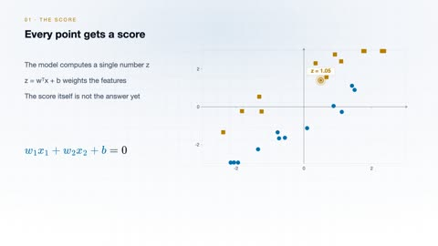](../../assets/videos/artificial-intelligence/introduction-to-machine-learning/decision-boundary.mp4)

[Open or download decision-boundary.mp4](../../assets/videos/artificial-intelligence/introduction-to-machine-learning/decision-boundary.mp4)

> **Make this concept move:** [Create an animation with Leadde →](https://leadde.ai/animation)

[Back to course top](#introduction-to-machine-learning)

---

## Feature space

`C03-A002` · Video ready

[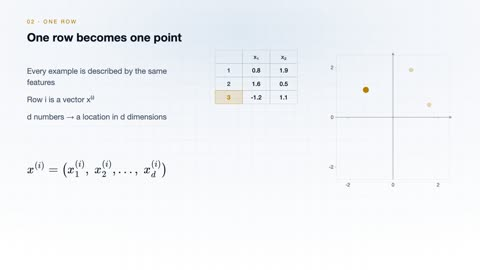](../../assets/videos/artificial-intelligence/introduction-to-machine-learning/feature-space.mp4)

[Open or download feature-space.mp4](../../assets/videos/artificial-intelligence/introduction-to-machine-learning/feature-space.mp4)

> **Make this concept move:** [Create an animation with Leadde →](https://leadde.ai/animation)

[Back to course top](#introduction-to-machine-learning)

---

## Gradient descent

`C03-A003` · Video ready

[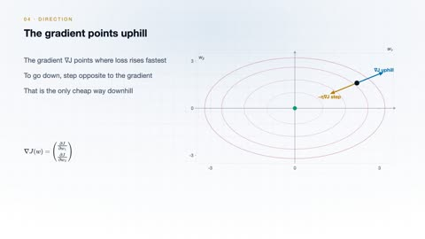](../../assets/videos/artificial-intelligence/introduction-to-machine-learning/gradient-descent.mp4)

[Open or download gradient-descent.mp4](../../assets/videos/artificial-intelligence/introduction-to-machine-learning/gradient-descent.mp4)

> **Make this concept move:** [Create an animation with Leadde →](https://leadde.ai/animation)

[Back to course top](#introduction-to-machine-learning)

---

## Loss of terrain

`C03-A004` · Video ready

[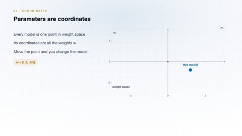](../../assets/videos/artificial-intelligence/introduction-to-machine-learning/loss-of-terrain.mp4)

[Open or download loss-of-terrain.mp4](../../assets/videos/artificial-intelligence/introduction-to-machine-learning/loss-of-terrain.mp4)

> **Make this concept move:** [Create an animation with Leadde →](https://leadde.ai/animation)

[Back to course top](#introduction-to-machine-learning)

---

## Overfitting

`C03-A005` · Video ready

[Open or download overfitting.mp4](../../assets/videos/artificial-intelligence/introduction-to-machine-learning/overfitting.mp4)

> **Make this concept move:** [Create an animation with Leadde →](https://leadde.ai/animation)

[Back to course top](#introduction-to-machine-learning)

---

## Underfitting

`C03-A006` · Video ready

[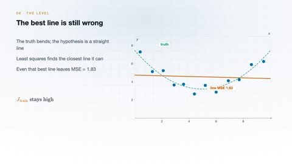](../../assets/videos/artificial-intelligence/introduction-to-machine-learning/underfitting.mp4)

[Open or download underfitting.mp4](../../assets/videos/artificial-intelligence/introduction-to-machine-learning/underfitting.mp4)

> **Make this concept move:** [Create an animation with Leadde →](https://leadde.ai/animation)

[Back to course top](#introduction-to-machine-learning)

---

## Model bias

`C03-A007` · Video ready

[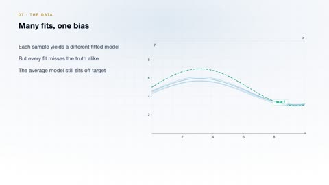](../../assets/videos/artificial-intelligence/introduction-to-machine-learning/model-bias.mp4)

[Open or download model-bias.mp4](../../assets/videos/artificial-intelligence/introduction-to-machine-learning/model-bias.mp4)

> **Make this concept move:** [Create an animation with Leadde →](https://leadde.ai/animation)

[Back to course top](#introduction-to-machine-learning)

---

## Model variance

`C03-A008` · Video ready

[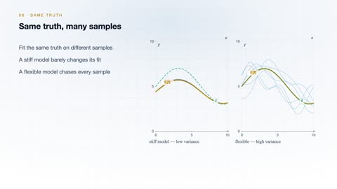](../../assets/videos/artificial-intelligence/introduction-to-machine-learning/model-variance.mp4)

[Open or download model-variance.mp4](../../assets/videos/artificial-intelligence/introduction-to-machine-learning/model-variance.mp4)

> **Make this concept move:** [Create an animation with Leadde →](https://leadde.ai/animation)

[Back to course top](#introduction-to-machine-learning)

---

## Backpropagation

`C03-A009` · Video ready

[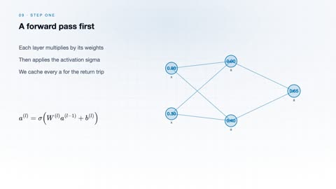](../../assets/videos/artificial-intelligence/introduction-to-machine-learning/backpropagation.mp4)

[Open or download backpropagation.mp4](../../assets/videos/artificial-intelligence/introduction-to-machine-learning/backpropagation.mp4)

> **Make this concept move:** [Create an animation with Leadde →](https://leadde.ai/animation)

[Back to course top](#introduction-to-machine-learning)

---

## Chain rule

`C03-A010` · Video ready

[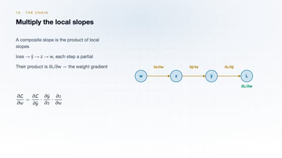](../../assets/videos/artificial-intelligence/introduction-to-machine-learning/chain-rule.mp4)

[Open or download chain-rule.mp4](../../assets/videos/artificial-intelligence/introduction-to-machine-learning/chain-rule.mp4)

> **Make this concept move:** [Create an animation with Leadde →](https://leadde.ai/animation)

[Back to course top](#introduction-to-machine-learning)

---

## Markov decision process

`C03-A011` · Video ready

[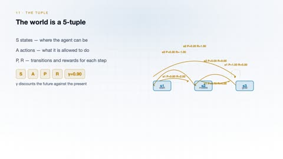](../../assets/videos/artificial-intelligence/introduction-to-machine-learning/markov-decision-process.mp4)

[Open or download markov-decision-process.mp4](../../assets/videos/artificial-intelligence/introduction-to-machine-learning/markov-decision-process.mp4)

> **Make this concept move:** [Create an animation with Leadde →](https://leadde.ai/animation)

[Back to course top](#introduction-to-machine-learning)

---

## Value iteration

`C03-A012` · Video ready

[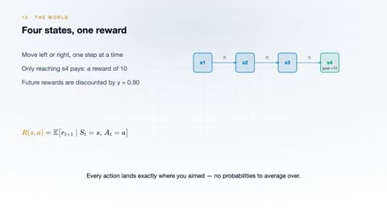](../../assets/videos/artificial-intelligence/introduction-to-machine-learning/value-iteration.mp4)

[Open or download value-iteration.mp4](../../assets/videos/artificial-intelligence/introduction-to-machine-learning/value-iteration.mp4)

> **Make this concept move:** [Create an animation with Leadde →](https://leadde.ai/animation)

[Back to course top](#introduction-to-machine-learning)

---

## Linear Regression

`C03-A013` · Video ready

[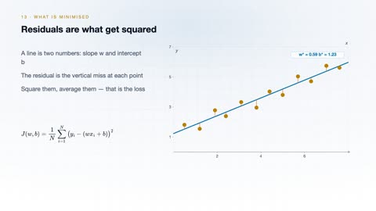](../../assets/videos/artificial-intelligence/introduction-to-machine-learning/linear-regression.mp4)

[Open or download linear-regression.mp4](../../assets/videos/artificial-intelligence/introduction-to-machine-learning/linear-regression.mp4)

> **Make this concept move:** [Create an animation with Leadde →](https://leadde.ai/animation)

[Back to course top](#introduction-to-machine-learning)

---

## Logistic Regression

`C03-A014` · Video ready

[Open or download logistic-regression.mp4](../../assets/videos/artificial-intelligence/introduction-to-machine-learning/logistic-regression.mp4)

> **Make this concept move:** [Create an animation with Leadde →](https://leadde.ai/animation)

[Back to course top](#introduction-to-machine-learning)

---

## Softmax Classification

`C03-A015` · Video ready

[Open or download softmax-classification.mp4](../../assets/videos/artificial-intelligence/introduction-to-machine-learning/softmax-classification.mp4)

> **Make this concept move:** [Create an animation with Leadde →](https://leadde.ai/animation)

[Back to course top](#introduction-to-machine-learning)

---

## K-Nearest Neighbors

`C03-A016` · Video ready

[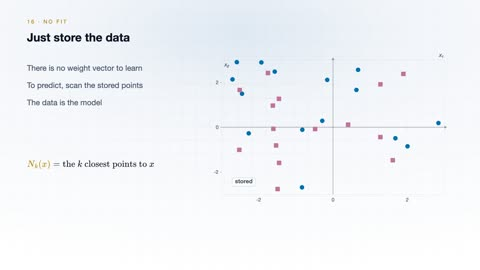](../../assets/videos/artificial-intelligence/introduction-to-machine-learning/k-nearest-neighbors.mp4)

[Open or download k-nearest-neighbors.mp4](../../assets/videos/artificial-intelligence/introduction-to-machine-learning/k-nearest-neighbors.mp4)

> **Make this concept move:** [Create an animation with Leadde →](https://leadde.ai/animation)

[Back to course top](#introduction-to-machine-learning)

---

## Maximum-Margin Support Vector Machine

`C03-A017` · Video ready

[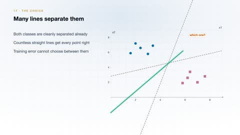](../../assets/videos/artificial-intelligence/introduction-to-machine-learning/maximum-margin-support-vector-machine.mp4)

[Open or download maximum-margin-support-vector-machine.mp4](../../assets/videos/artificial-intelligence/introduction-to-machine-learning/maximum-margin-support-vector-machine.mp4)

> **Make this concept move:** [Create an animation with Leadde →](https://leadde.ai/animation)

[Back to course top](#introduction-to-machine-learning)

---

## Decision-Tree Information Gain

`C03-A018` · Video ready

[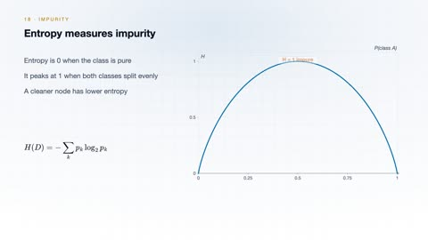](../../assets/videos/artificial-intelligence/introduction-to-machine-learning/decision-tree-information-gain.mp4)

[Open or download decision-tree-information-gain.mp4](../../assets/videos/artificial-intelligence/introduction-to-machine-learning/decision-tree-information-gain.mp4)

> **Make this concept move:** [Create an animation with Leadde →](https://leadde.ai/animation)

[Back to course top](#introduction-to-machine-learning)

---

## K-Means Clustering

`C03-A019` · Video ready

[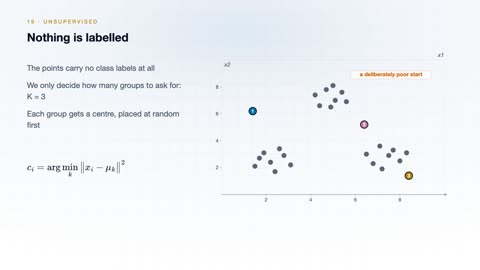](../../assets/videos/artificial-intelligence/introduction-to-machine-learning/k-means-clustering.mp4)

[Open or download k-means-clustering.mp4](../../assets/videos/artificial-intelligence/introduction-to-machine-learning/k-means-clustering.mp4)

> **Make this concept move:** [Create an animation with Leadde →](https://leadde.ai/animation)

[Back to course top](#introduction-to-machine-learning)

---

## Principal Component Analysis

`C03-A020` · Video ready

[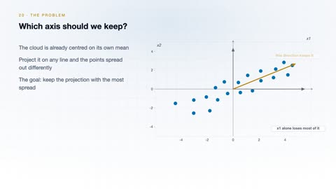](../../assets/videos/artificial-intelligence/introduction-to-machine-learning/principal-component-analysis.mp4)

[Open or download principal-component-analysis.mp4](../../assets/videos/artificial-intelligence/introduction-to-machine-learning/principal-component-analysis.mp4)

> **Make this concept move:** [Create an animation with Leadde →](https://leadde.ai/animation)

[Back to course top](#introduction-to-machine-learning)

---
