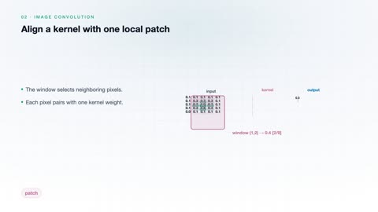
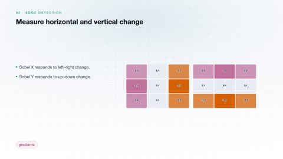
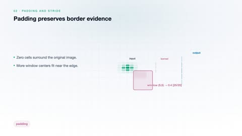
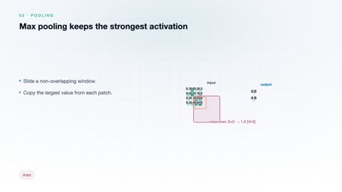
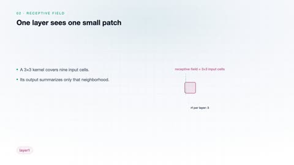
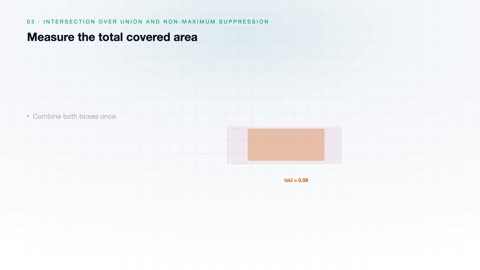
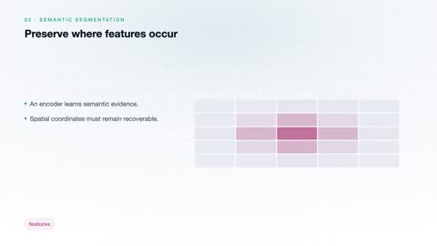
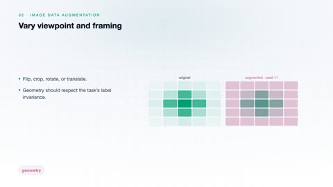

# Computer Vision

[← Back to Artificial Intelligence](../../README.md#artificial-intelligence)

**Textbook:** Computer Vision: Algorithms and Applications (Szeliski)  
**Knowledge points:** 8

> **Turn your own idea into an animation:** [Create with Leadde →](https://leadde.ai/animation)

---

## Image Convolution

`C28-A001` · Video ready

[Open or download image-convolution.mp4](../../assets/videos/artificial-intelligence/computer-vision/image-convolution.mp4)

> **Make this concept move:** [Create an animation with Leadde →](https://leadde.ai/animation)

[Back to course top](#computer-vision)

---

## Edge Detection

`C28-A002` · Video ready

[Open or download edge-detection.mp4](../../assets/videos/artificial-intelligence/computer-vision/edge-detection.mp4)

> **Make this concept move:** [Create an animation with Leadde →](https://leadde.ai/animation)

[Back to course top](#computer-vision)

---

## Padding and Stride

`C28-A003` · Video ready

[Open or download padding-and-stride.mp4](../../assets/videos/artificial-intelligence/computer-vision/padding-and-stride.mp4)

> **Make this concept move:** [Create an animation with Leadde →](https://leadde.ai/animation)

[Back to course top](#computer-vision)

---

## Pooling

`C28-A004` · Video ready

[Open or download pooling.mp4](../../assets/videos/artificial-intelligence/computer-vision/pooling.mp4)

> **Make this concept move:** [Create an animation with Leadde →](https://leadde.ai/animation)

[Back to course top](#computer-vision)

---

## Receptive Field

`C28-A005` · Video ready

[Open or download receptive-field.mp4](../../assets/videos/artificial-intelligence/computer-vision/receptive-field.mp4)

> **Make this concept move:** [Create an animation with Leadde →](https://leadde.ai/animation)

[Back to course top](#computer-vision)

---

## Intersection over Union and Non-Maximum Suppression

`C28-A006` · Video ready

[Open or download intersection-over-union-and-non-maximum-suppression.mp4](../../assets/videos/artificial-intelligence/computer-vision/intersection-over-union-and-non-maximum-suppression.mp4)

> **Make this concept move:** [Create an animation with Leadde →](https://leadde.ai/animation)

[Back to course top](#computer-vision)

---

## Semantic Segmentation

`C28-A007` · Video ready

[Open or download semantic-segmentation.mp4](../../assets/videos/artificial-intelligence/computer-vision/semantic-segmentation.mp4)

> **Make this concept move:** [Create an animation with Leadde →](https://leadde.ai/animation)

[Back to course top](#computer-vision)

---

## Image Data Augmentation

`C28-A008` · Video ready

[Open or download image-data-augmentation.mp4](../../assets/videos/artificial-intelligence/computer-vision/image-data-augmentation.mp4)

> **Make this concept move:** [Create an animation with Leadde →](https://leadde.ai/animation)

[Back to course top](#computer-vision)

---
