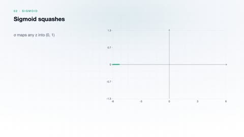
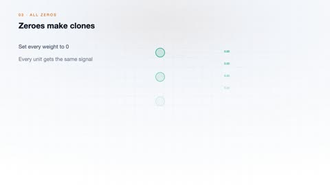
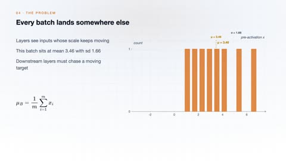
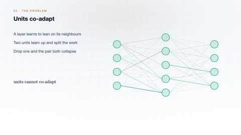
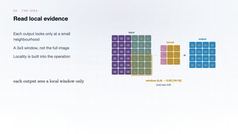
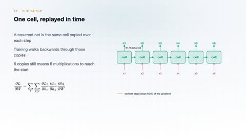
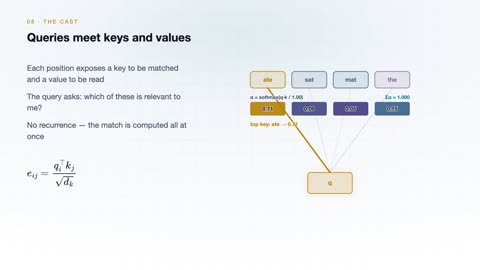

# Deep Learning

[← Back to Artificial Intelligence](../../README.md#artificial-intelligence)

**Textbook:** Deep Learning (Goodfellow et al.)  
**Knowledge points:** 8

> **Turn your own idea into an animation:** [Create with Leadde →](https://leadde.ai/animation)

**Course download:** [Download all 8 videos as ZIP](https://github.com/LeaddeOpenLab/leadde-knowledge-in-motion/releases/download/course-videos-artificial-intelligence-ai-dl/ai-dl-videos.zip)

---

## Artificial Neuron

`C26-A001` · Video ready

[Open or download artificial-neuron.mp4](../../assets/videos/artificial-intelligence/deep-learning/artificial-neuron.mp4)

> **Make this concept move:** [Create an animation with Leadde →](https://leadde.ai/animation)

[Back to course top](#deep-learning)

---

## Activation Functions

`C26-A002` · Video ready

[Open or download activation-functions.mp4](../../assets/videos/artificial-intelligence/deep-learning/activation-functions.mp4)

> **Make this concept move:** [Create an animation with Leadde →](https://leadde.ai/animation)

[Back to course top](#deep-learning)

---

## Parameter Initialization

`C26-A003` · Video ready

[Open or download parameter-initialization.mp4](../../assets/videos/artificial-intelligence/deep-learning/parameter-initialization.mp4)

> **Make this concept move:** [Create an animation with Leadde →](https://leadde.ai/animation)

[Back to course top](#deep-learning)

---

## Batch Normalization

`C26-A004` · Video ready

[Open or download batch-normalization.mp4](../../assets/videos/artificial-intelligence/deep-learning/batch-normalization.mp4)

> **Make this concept move:** [Create an animation with Leadde →](https://leadde.ai/animation)

[Back to course top](#deep-learning)

---

## Dropout

`C26-A005` · Video ready

[Open or download dropout.mp4](../../assets/videos/artificial-intelligence/deep-learning/dropout.mp4)

> **Make this concept move:** [Create an animation with Leadde →](https://leadde.ai/animation)

[Back to course top](#deep-learning)

---

## Convolutional Neural Network

`C26-A006` · Video ready

[Open or download convolutional-neural-network.mp4](../../assets/videos/artificial-intelligence/deep-learning/convolutional-neural-network.mp4)

> **Make this concept move:** [Create an animation with Leadde →](https://leadde.ai/animation)

[Back to course top](#deep-learning)

---

## Vanishing Gradients in Recurrent Neural Networks

`C26-A007` · Video ready

[Open or download vanishing-gradients-in-recurrent-neural-networks.mp4](../../assets/videos/artificial-intelligence/deep-learning/vanishing-gradients-in-recurrent-neural-networks.mp4)

> **Make this concept move:** [Create an animation with Leadde →](https://leadde.ai/animation)

[Back to course top](#deep-learning)

---

## Attention Mechanism

`C26-A008` · Video ready

[Open or download attention-mechanism.mp4](../../assets/videos/artificial-intelligence/deep-learning/attention-mechanism.mp4)

> **Make this concept move:** [Create an animation with Leadde →](https://leadde.ai/animation)

[Back to course top](#deep-learning)

---
