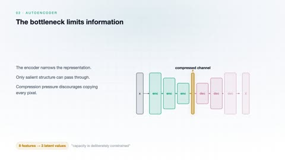
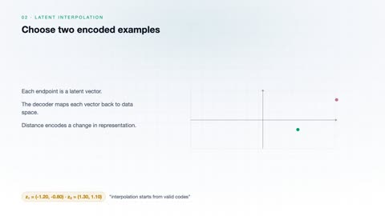
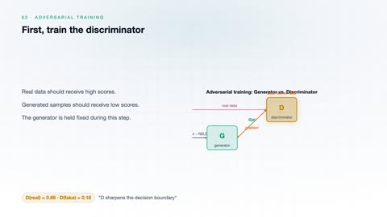
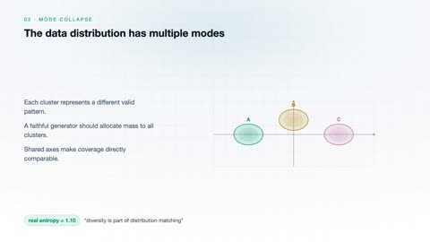
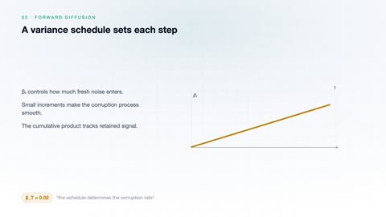
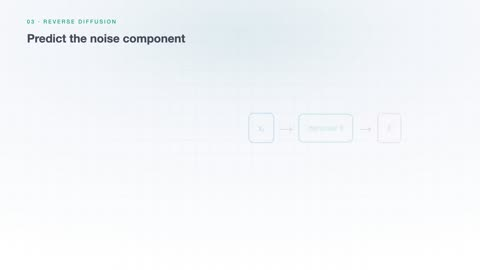
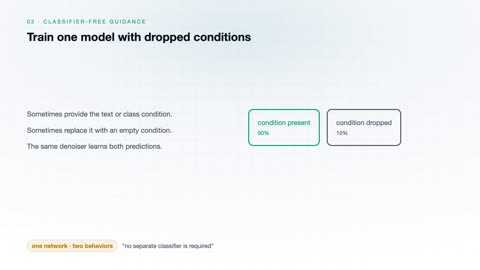

# Generative Artificial Intelligence

[← Back to Artificial Intelligence](../../README.md#artificial-intelligence)

**Textbook:** Course notes (no required textbook)  
**Knowledge points:** 8

> **Turn your own idea into an animation:** [Create with Leadde →](https://leadde.ai/animation)

**Course download:** [Download all 8 videos as ZIP](https://github.com/LeaddeOpenLab/leadde-knowledge-in-motion/releases/download/course-videos-artificial-intelligence-ai-gen/ai-gen-videos.zip)

---

## Autoencoder

`C30-A001` · Video ready

[▶ Watch inline](https://leaddeopenlab.github.io/leadde-knowledge-in-motion/?subject=Artificial+Intelligence&course=Generative+Artificial+Intelligence#c30-a001)

[Open or download autoencoder.mp4](../../assets/videos/artificial-intelligence/generative-artificial-intelligence/autoencoder.mp4)

> **Make this concept move:** [Create an animation with Leadde →](https://leadde.ai/animation)

[Back to course top](#generative-artificial-intelligence)

---

## Variational Autoencoder Reparameterization

`C30-A002` · Video ready

[▶ Watch inline](https://leaddeopenlab.github.io/leadde-knowledge-in-motion/?subject=Artificial+Intelligence&course=Generative+Artificial+Intelligence#c30-a002)

[Open or download variational-autoencoder-reparameterization.mp4](../../assets/videos/artificial-intelligence/generative-artificial-intelligence/variational-autoencoder-reparameterization.mp4)

> **Make this concept move:** [Create an animation with Leadde →](https://leadde.ai/animation)

[Back to course top](#generative-artificial-intelligence)

---

## Latent-Space Interpolation

`C30-A003` · Video ready

[▶ Watch inline](https://leaddeopenlab.github.io/leadde-knowledge-in-motion/?subject=Artificial+Intelligence&course=Generative+Artificial+Intelligence#c30-a003)

[Open or download latent-space-interpolation.mp4](../../assets/videos/artificial-intelligence/generative-artificial-intelligence/latent-space-interpolation.mp4)

> **Make this concept move:** [Create an animation with Leadde →](https://leadde.ai/animation)

[Back to course top](#generative-artificial-intelligence)

---

## Generative Adversarial Training

`C30-A004` · Video ready

[▶ Watch inline](https://leaddeopenlab.github.io/leadde-knowledge-in-motion/?subject=Artificial+Intelligence&course=Generative+Artificial+Intelligence#c30-a004)

[Open or download generative-adversarial-training.mp4](../../assets/videos/artificial-intelligence/generative-artificial-intelligence/generative-adversarial-training.mp4)

> **Make this concept move:** [Create an animation with Leadde →](https://leadde.ai/animation)

[Back to course top](#generative-artificial-intelligence)

---

## Mode Collapse

`C30-A005` · Video ready

[▶ Watch inline](https://leaddeopenlab.github.io/leadde-knowledge-in-motion/?subject=Artificial+Intelligence&course=Generative+Artificial+Intelligence#c30-a005)

[Open or download mode-collapse.mp4](../../assets/videos/artificial-intelligence/generative-artificial-intelligence/mode-collapse.mp4)

> **Make this concept move:** [Create an animation with Leadde →](https://leadde.ai/animation)

[Back to course top](#generative-artificial-intelligence)

---

## Diffusion Forward Noising

`C30-A006` · Video ready

[▶ Watch inline](https://leaddeopenlab.github.io/leadde-knowledge-in-motion/?subject=Artificial+Intelligence&course=Generative+Artificial+Intelligence#c30-a006)

[Open or download diffusion-forward-noising.mp4](../../assets/videos/artificial-intelligence/generative-artificial-intelligence/diffusion-forward-noising.mp4)

> **Make this concept move:** [Create an animation with Leadde →](https://leadde.ai/animation)

[Back to course top](#generative-artificial-intelligence)

---

## Diffusion Reverse Denoising

`C30-A007` · Video ready

[▶ Watch inline](https://leaddeopenlab.github.io/leadde-knowledge-in-motion/?subject=Artificial+Intelligence&course=Generative+Artificial+Intelligence#c30-a007)

[Open or download diffusion-reverse-denoising.mp4](../../assets/videos/artificial-intelligence/generative-artificial-intelligence/diffusion-reverse-denoising.mp4)

> **Make this concept move:** [Create an animation with Leadde →](https://leadde.ai/animation)

[Back to course top](#generative-artificial-intelligence)

---

## Classifier-Free Guidance

`C30-A008` · Video ready

[▶ Watch inline](https://leaddeopenlab.github.io/leadde-knowledge-in-motion/?subject=Artificial+Intelligence&course=Generative+Artificial+Intelligence#c30-a008)

[Open or download classifier-free-guidance.mp4](../../assets/videos/artificial-intelligence/generative-artificial-intelligence/classifier-free-guidance.mp4)

> **Make this concept move:** [Create an animation with Leadde →](https://leadde.ai/animation)

[Back to course top](#generative-artificial-intelligence)

---
