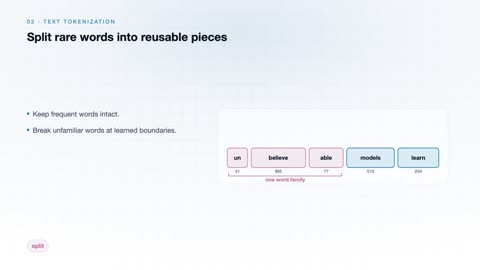
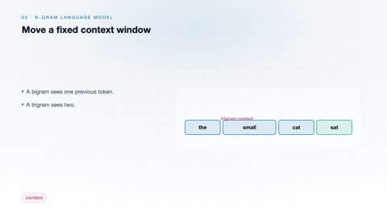
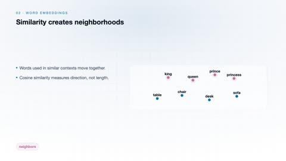
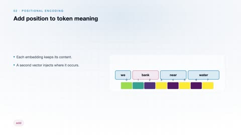
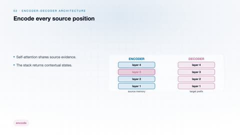
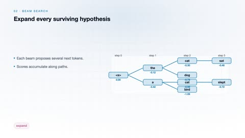
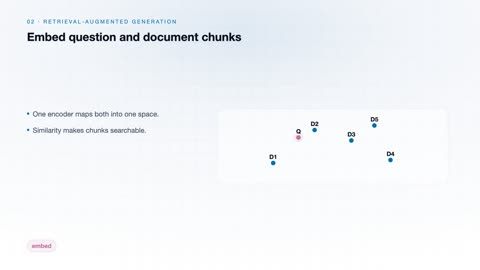

# Natural Language Processing

[← Back to Artificial Intelligence](../../README.md#artificial-intelligence)

**Textbook:** Speech and Language Processing (Jurafsky and Martin)  
**Knowledge points:** 8

> **Turn your own idea into an animation:** [Create with Leadde →](https://leadde.ai/animation)

**Course download:** [Download all 8 videos as ZIP](https://github.com/LeaddeOpenLab/leadde-knowledge-in-motion/releases/download/course-videos-artificial-intelligence-ai-nlp/ai-nlp-videos.zip)

---

## Text Tokenization

`C27-A001` · Video ready

[Open or download text-tokenization.mp4](../../assets/videos/artificial-intelligence/natural-language-processing/text-tokenization.mp4)

> **Make this concept move:** [Create an animation with Leadde →](https://leadde.ai/animation)

[Back to course top](#natural-language-processing)

---

## N-Gram Language Model

`C27-A002` · Video ready

[Open or download n-gram-language-model.mp4](../../assets/videos/artificial-intelligence/natural-language-processing/n-gram-language-model.mp4)

> **Make this concept move:** [Create an animation with Leadde →](https://leadde.ai/animation)

[Back to course top](#natural-language-processing)

---

## Word Embeddings

`C27-A003` · Video ready

[Open or download word-embeddings.mp4](../../assets/videos/artificial-intelligence/natural-language-processing/word-embeddings.mp4)

> **Make this concept move:** [Create an animation with Leadde →](https://leadde.ai/animation)

[Back to course top](#natural-language-processing)

---

## Positional Encoding

`C27-A004` · Video ready

[Open or download positional-encoding.mp4](../../assets/videos/artificial-intelligence/natural-language-processing/positional-encoding.mp4)

> **Make this concept move:** [Create an animation with Leadde →](https://leadde.ai/animation)

[Back to course top](#natural-language-processing)

---

## Self-Attention

`C27-A005` · Video ready

[Open or download self-attention.mp4](../../assets/videos/artificial-intelligence/natural-language-processing/self-attention.mp4)

> **Make this concept move:** [Create an animation with Leadde →](https://leadde.ai/animation)

[Back to course top](#natural-language-processing)

---

## Encoder-Decoder Architecture

`C27-A006` · Video ready

[Open or download encoder-decoder-architecture.mp4](../../assets/videos/artificial-intelligence/natural-language-processing/encoder-decoder-architecture.mp4)

> **Make this concept move:** [Create an animation with Leadde →](https://leadde.ai/animation)

[Back to course top](#natural-language-processing)

---

## Beam Search

`C27-A007` · Video ready

[Open or download beam-search.mp4](../../assets/videos/artificial-intelligence/natural-language-processing/beam-search.mp4)

> **Make this concept move:** [Create an animation with Leadde →](https://leadde.ai/animation)

[Back to course top](#natural-language-processing)

---

## Retrieval-Augmented Generation

`C27-A008` · Video ready

[Open or download retrieval-augmented-generation.mp4](../../assets/videos/artificial-intelligence/natural-language-processing/retrieval-augmented-generation.mp4)

> **Make this concept move:** [Create an animation with Leadde →](https://leadde.ai/animation)

[Back to course top](#natural-language-processing)

---
