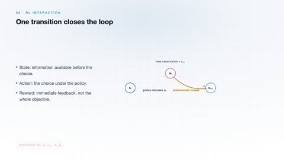
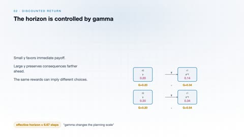
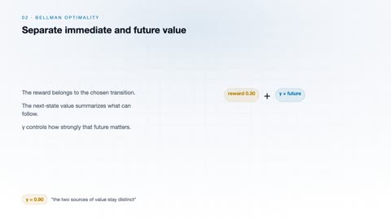
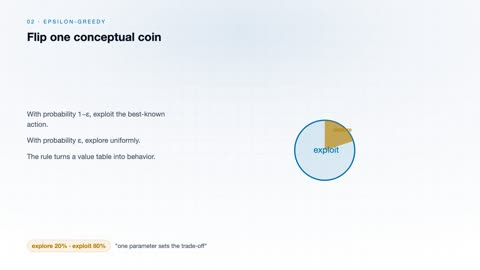
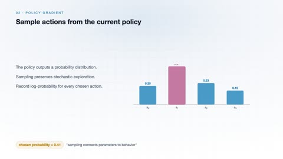
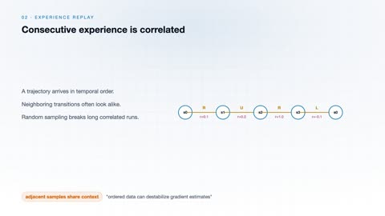

# Reinforcement Learning

[← Back to Artificial Intelligence](../../README.md#artificial-intelligence)

**Textbook:** Reinforcement Learning: An Introduction (Sutton and Barto)  
**Knowledge points:** 8

> **Turn your own idea into an animation:** [Create with Leadde →](https://leadde.ai/animation)

**Course download:** [Download all 8 videos as ZIP](https://github.com/LeaddeOpenLab/leadde-knowledge-in-motion/releases/download/course-videos-artificial-intelligence-ai-rl/ai-rl-videos.zip)

---

## States, Actions, and Rewards

`C29-A001` · Video ready

[Open or download states-actions-and-rewards.mp4](../../assets/videos/artificial-intelligence/reinforcement-learning/states-actions-and-rewards.mp4)

> **Make this concept move:** [Create an animation with Leadde →](https://leadde.ai/animation)

[Back to course top](#reinforcement-learning)

---

## Discounted Return

`C29-A002` · Video ready

[Open or download discounted-return.mp4](../../assets/videos/artificial-intelligence/reinforcement-learning/discounted-return.mp4)

> **Make this concept move:** [Create an animation with Leadde →](https://leadde.ai/animation)

[Back to course top](#reinforcement-learning)

---

## Bellman Optimality Equation

`C29-A003` · Video ready

[Open or download bellman-optimality-equation.mp4](../../assets/videos/artificial-intelligence/reinforcement-learning/bellman-optimality-equation.mp4)

> **Make this concept move:** [Create an animation with Leadde →](https://leadde.ai/animation)

[Back to course top](#reinforcement-learning)

---

## Q-Learning Update

`C29-A004` · Video ready

[Open or download q-learning-update.mp4](../../assets/videos/artificial-intelligence/reinforcement-learning/q-learning-update.mp4)

> **Make this concept move:** [Create an animation with Leadde →](https://leadde.ai/animation)

[Back to course top](#reinforcement-learning)

---

## Epsilon-Greedy Exploration

`C29-A005` · Video ready

[Open or download epsilon-greedy-exploration.mp4](../../assets/videos/artificial-intelligence/reinforcement-learning/epsilon-greedy-exploration.mp4)

> **Make this concept move:** [Create an animation with Leadde →](https://leadde.ai/animation)

[Back to course top](#reinforcement-learning)

---

## Policy Gradient

`C29-A006` · Video ready

[Open or download policy-gradient.mp4](../../assets/videos/artificial-intelligence/reinforcement-learning/policy-gradient.mp4)

> **Make this concept move:** [Create an animation with Leadde →](https://leadde.ai/animation)

[Back to course top](#reinforcement-learning)

---

## Actor-Critic Method

`C29-A007` · Video ready

[Open or download actor-critic-method.mp4](../../assets/videos/artificial-intelligence/reinforcement-learning/actor-critic-method.mp4)

> **Make this concept move:** [Create an animation with Leadde →](https://leadde.ai/animation)

[Back to course top](#reinforcement-learning)

---

## Experience Replay

`C29-A008` · Video ready

[Open or download experience-replay.mp4](../../assets/videos/artificial-intelligence/reinforcement-learning/experience-replay.mp4)

> **Make this concept move:** [Create an animation with Leadde →](https://leadde.ai/animation)

[Back to course top](#reinforcement-learning)

---
