# Introduction to Algorithms

[← Back to Computer Science](../../README.md#computer-science)

**Textbook:** Introduction to Algorithms, 3e (Cormen et al.)  
**Knowledge points:** 13

> **Turn your own idea into an animation:** [Create with Leadde →](https://leadde.ai/animation)

---

## Divide and conquer recursion

`C02-A001` · Video ready

[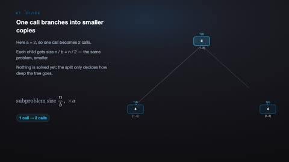](../../assets/videos/computer-science/introduction-to-algorithms/divide-and-conquer-recursion.mp4)

[Open or download divide-and-conquer-recursion.mp4](../../assets/videos/computer-science/introduction-to-algorithms/divide-and-conquer-recursion.mp4)

> **Make this concept move:** [Create an animation with Leadde →](https://leadde.ai/animation)

[Back to course top](#introduction-to-algorithms)

---

## Recursive

`C02-A002` · Video ready

[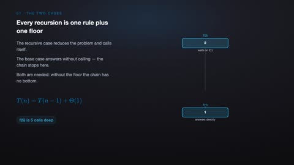](../../assets/videos/computer-science/introduction-to-algorithms/recursive.mp4)

[Open or download recursive.mp4](../../assets/videos/computer-science/introduction-to-algorithms/recursive.mp4)

> **Make this concept move:** [Create an animation with Leadde →](https://leadde.ai/animation)

[Back to course top](#introduction-to-algorithms)

---

## Heap structure

`C02-A003` · Video ready

[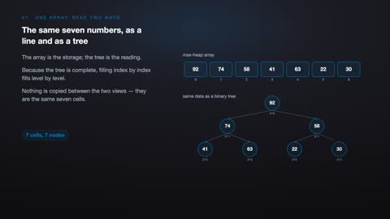](../../assets/videos/computer-science/introduction-to-algorithms/heap-structure.mp4)

[Open or download heap-structure.mp4](../../assets/videos/computer-science/introduction-to-algorithms/heap-structure.mp4)

> **Make this concept move:** [Create an animation with Leadde →](https://leadde.ai/animation)

[Back to course top](#introduction-to-algorithms)

---

## Heap sort

`C02-A004` · Video ready

[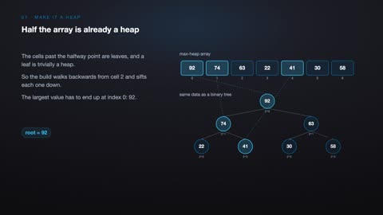](../../assets/videos/computer-science/introduction-to-algorithms/heap-sort.mp4)

[Open or download heap-sort.mp4](../../assets/videos/computer-science/introduction-to-algorithms/heap-sort.mp4)

> **Make this concept move:** [Create an animation with Leadde →](https://leadde.ai/animation)

[Back to course top](#introduction-to-algorithms)

---

## Balanced binary search tree

`C02-A005` · Video ready

[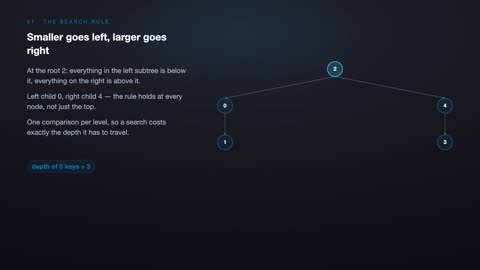](../../assets/videos/computer-science/introduction-to-algorithms/balanced-binary-search-tree.mp4)

[Open or download balanced-binary-search-tree.mp4](../../assets/videos/computer-science/introduction-to-algorithms/balanced-binary-search-tree.mp4)

> **Make this concept move:** [Create an animation with Leadde →](https://leadde.ai/animation)

[Back to course top](#introduction-to-algorithms)

---

## Graph search

`C02-A006` · Video ready

[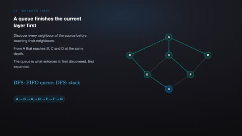](../../assets/videos/computer-science/introduction-to-algorithms/graph-search.mp4)

[Open or download graph-search.mp4](../../assets/videos/computer-science/introduction-to-algorithms/graph-search.mp4)

> **Make this concept move:** [Create an animation with Leadde →](https://leadde.ai/animation)

[Back to course top](#introduction-to-algorithms)

---

## Shortest path

`C02-A007` · Video ready

[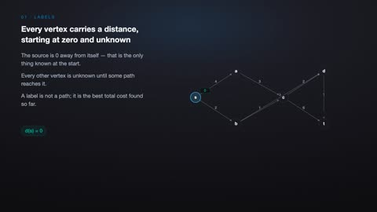](../../assets/videos/computer-science/introduction-to-algorithms/shortest-path.mp4)

[Open or download shortest-path.mp4](../../assets/videos/computer-science/introduction-to-algorithms/shortest-path.mp4)

> **Make this concept move:** [Create an animation with Leadde →](https://leadde.ai/animation)

[Back to course top](#introduction-to-algorithms)

---

## Dynamic programming status

`C02-A008` · Video ready

[Open or download dynamic-programming-status.mp4](../../assets/videos/computer-science/introduction-to-algorithms/dynamic-programming-status.mp4)

> **Make this concept move:** [Create an animation with Leadde →](https://leadde.ai/animation)

[Back to course top](#introduction-to-algorithms)

---

## Dynamic programming transfer

`C02-A009` · Video ready

[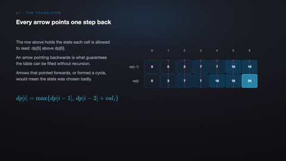](../../assets/videos/computer-science/introduction-to-algorithms/dynamic-programming-transfer.mp4)

[Open or download dynamic-programming-transfer.mp4](../../assets/videos/computer-science/introduction-to-algorithms/dynamic-programming-transfer.mp4)

> **Make this concept move:** [Create an animation with Leadde →](https://leadde.ai/animation)

[Back to course top](#introduction-to-algorithms)

---

## Quicksort Partitioning

`C02-A010` · Video ready

[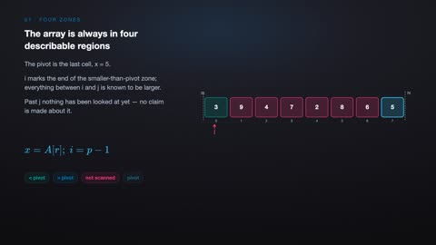](../../assets/videos/computer-science/introduction-to-algorithms/quicksort-partitioning.mp4)

[Open or download quicksort-partitioning.mp4](../../assets/videos/computer-science/introduction-to-algorithms/quicksort-partitioning.mp4)

> **Make this concept move:** [Create an animation with Leadde →](https://leadde.ai/animation)

[Back to course top](#introduction-to-algorithms)

---

## Merge Step in Merge Sort

`C02-A011` · Video ready

[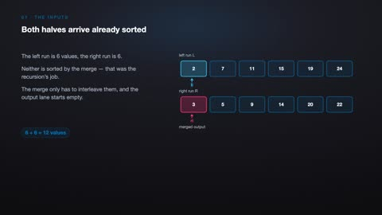](../../assets/videos/computer-science/introduction-to-algorithms/merge-step-in-merge-sort.mp4)

[Open or download merge-step-in-merge-sort.mp4](../../assets/videos/computer-science/introduction-to-algorithms/merge-step-in-merge-sort.mp4)

> **Make this concept move:** [Create an animation with Leadde →](https://leadde.ai/animation)

[Back to course top](#introduction-to-algorithms)

---

## Union-Find Path Compression

`C02-A012` · Video ready

[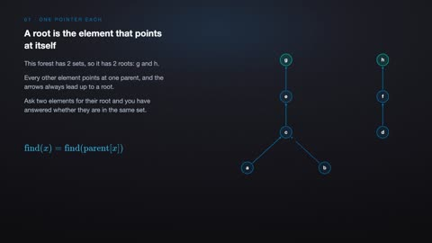](../../assets/videos/computer-science/introduction-to-algorithms/union-find-path-compression.mp4)

[Open or download union-find-path-compression.mp4](../../assets/videos/computer-science/introduction-to-algorithms/union-find-path-compression.mp4)

> **Make this concept move:** [Create an animation with Leadde →](https://leadde.ai/animation)

[Back to course top](#introduction-to-algorithms)

---

## Topological Sorting

`C02-A013` · Video ready

[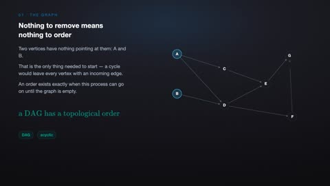](../../assets/videos/computer-science/introduction-to-algorithms/topological-sorting.mp4)

[Open or download topological-sorting.mp4](../../assets/videos/computer-science/introduction-to-algorithms/topological-sorting.mp4)

> **Make this concept move:** [Create an animation with Leadde →](https://leadde.ai/animation)

[Back to course top](#introduction-to-algorithms)

---
