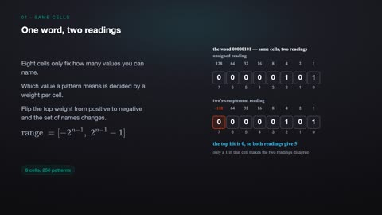
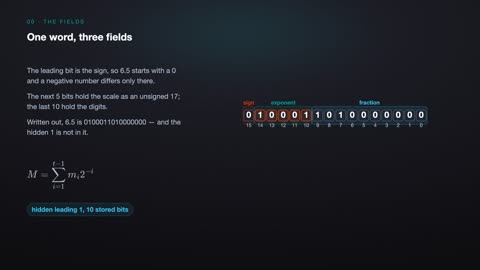
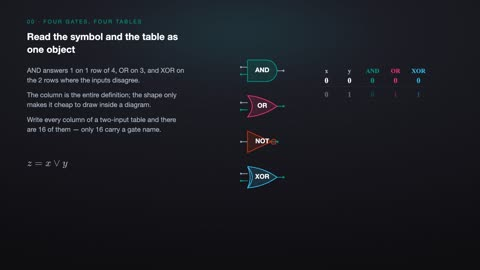
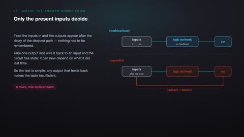
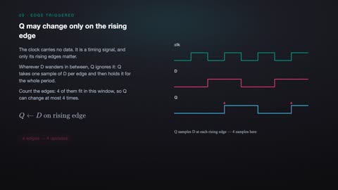
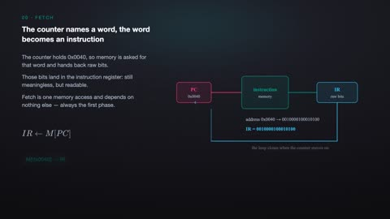
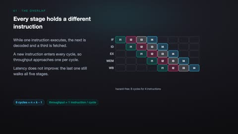
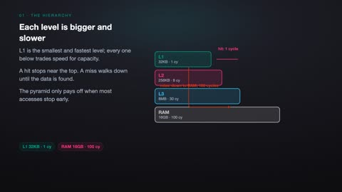

# Computer Organization and Architecture

[← Back to Computer Science](../../README.md#computer-science)

**Textbook:** Computer Organization and Design (Patterson and Hennessy)  
**Knowledge points:** 8

> **Turn your own idea into an animation:** [Create with Leadde →](https://leadde.ai/animation)

---

## Two's Complement

`C21-A001` · Video ready

[Open or download two-s-complement.mp4](../../assets/videos/computer-science/computer-organization-and-architecture/two-s-complement.mp4)

> **Make this concept move:** [Create an animation with Leadde →](https://leadde.ai/animation)

[Back to course top](#computer-organization-and-architecture)

---

## Floating-Point Representation

`C21-A002` · Video ready

[Open or download floating-point-representation.mp4](../../assets/videos/computer-science/computer-organization-and-architecture/floating-point-representation.mp4)

> **Make this concept move:** [Create an animation with Leadde →](https://leadde.ai/animation)

[Back to course top](#computer-organization-and-architecture)

---

## Boolean Logic Gates

`C21-A003` · Video ready

[Open or download boolean-logic-gates.mp4](../../assets/videos/computer-science/computer-organization-and-architecture/boolean-logic-gates.mp4)

> **Make this concept move:** [Create an animation with Leadde →](https://leadde.ai/animation)

[Back to course top](#computer-organization-and-architecture)

---

## Combinational Logic

`C21-A004` · Video ready

[Open or download combinational-logic.mp4](../../assets/videos/computer-science/computer-organization-and-architecture/combinational-logic.mp4)

> **Make this concept move:** [Create an animation with Leadde →](https://leadde.ai/animation)

[Back to course top](#computer-organization-and-architecture)

---

## Sequential Logic and Clocks

`C21-A005` · Video ready

[Open or download sequential-logic-and-clocks.mp4](../../assets/videos/computer-science/computer-organization-and-architecture/sequential-logic-and-clocks.mp4)

> **Make this concept move:** [Create an animation with Leadde →](https://leadde.ai/animation)

[Back to course top](#computer-organization-and-architecture)

---

## CPU Fetch-Decode-Execute Cycle

`C21-A006` · Video ready

[Open or download cpu-fetch-decode-execute-cycle.mp4](../../assets/videos/computer-science/computer-organization-and-architecture/cpu-fetch-decode-execute-cycle.mp4)

> **Make this concept move:** [Create an animation with Leadde →](https://leadde.ai/animation)

[Back to course top](#computer-organization-and-architecture)

---

## Pipeline Hazards

`C21-A007` · Video ready

[Open or download pipeline-hazards.mp4](../../assets/videos/computer-science/computer-organization-and-architecture/pipeline-hazards.mp4)

> **Make this concept move:** [Create an animation with Leadde →](https://leadde.ai/animation)

[Back to course top](#computer-organization-and-architecture)

---

## Cache Locality

`C21-A008` · Video ready

[Open or download cache-locality.mp4](../../assets/videos/computer-science/computer-organization-and-architecture/cache-locality.mp4)

> **Make this concept move:** [Create an animation with Leadde →](https://leadde.ai/animation)

[Back to course top](#computer-organization-and-architecture)

---
