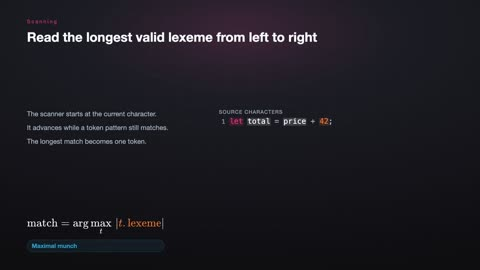
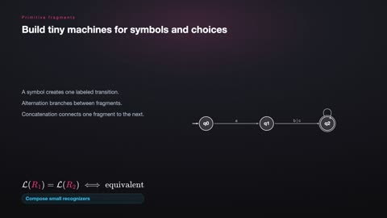
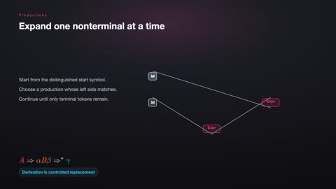
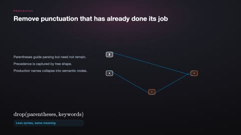
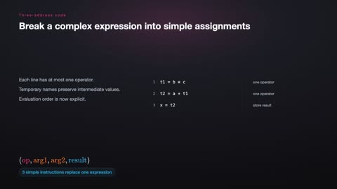
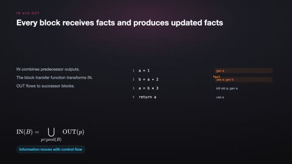
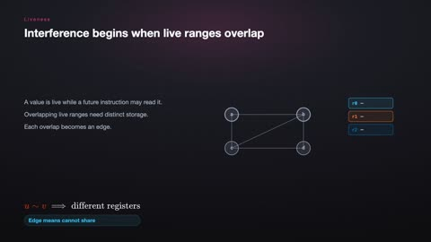

# Compiler Design

[← Back to Computer Science](../../README.md#computer-science)

**Textbook:** Compilers: Principles, Techniques, and Tools (Aho et al.)  
**Knowledge points:** 8

> **Turn your own idea into an animation:** [Create with Leadde →](https://leadde.ai/animation)

**Course download:** [Download all 8 videos as ZIP](https://github.com/LeaddeOpenLab/leadde-knowledge-in-motion/releases/download/course-videos-computer-science-cs-comp/cs-comp-videos.zip)

---

## Lexical Analysis and Tokens

`C25-A001` · Video ready

[Open or download lexical-analysis-and-tokens.mp4](../../assets/videos/computer-science/compiler-design/lexical-analysis-and-tokens.mp4)

> **Make this concept move:** [Create an animation with Leadde →](https://leadde.ai/animation)

[Back to course top](#compiler-design)

---

## Regular Expression to Finite Automaton

`C25-A002` · Video ready

[Open or download regular-expression-to-finite-automaton.mp4](../../assets/videos/computer-science/compiler-design/regular-expression-to-finite-automaton.mp4)

> **Make this concept move:** [Create an animation with Leadde →](https://leadde.ai/animation)

[Back to course top](#compiler-design)

---

## Context-Free Grammar

`C25-A003` · Video ready

[Open or download context-free-grammar.mp4](../../assets/videos/computer-science/compiler-design/context-free-grammar.mp4)

> **Make this concept move:** [Create an animation with Leadde →](https://leadde.ai/animation)

[Back to course top](#compiler-design)

---

## Abstract Syntax Tree

`C25-A004` · Video ready

[Open or download abstract-syntax-tree.mp4](../../assets/videos/computer-science/compiler-design/abstract-syntax-tree.mp4)

> **Make this concept move:** [Create an animation with Leadde →](https://leadde.ai/animation)

[Back to course top](#compiler-design)

---

## Recursive-Descent Parsing

`C25-A005` · Video ready

[Open or download recursive-descent-parsing.mp4](../../assets/videos/computer-science/compiler-design/recursive-descent-parsing.mp4)

> **Make this concept move:** [Create an animation with Leadde →](https://leadde.ai/animation)

[Back to course top](#compiler-design)

---

## Intermediate Representation

`C25-A006` · Video ready

[Open or download intermediate-representation.mp4](../../assets/videos/computer-science/compiler-design/intermediate-representation.mp4)

> **Make this concept move:** [Create an animation with Leadde →](https://leadde.ai/animation)

[Back to course top](#compiler-design)

---

## Data-Flow Analysis

`C25-A007` · Video ready

[Open or download data-flow-analysis.mp4](../../assets/videos/computer-science/compiler-design/data-flow-analysis.mp4)

> **Make this concept move:** [Create an animation with Leadde →](https://leadde.ai/animation)

[Back to course top](#compiler-design)

---

## Register Allocation

`C25-A008` · Video ready

[Open or download register-allocation.mp4](../../assets/videos/computer-science/compiler-design/register-allocation.mp4)

> **Make this concept move:** [Create an animation with Leadde →](https://leadde.ai/animation)

[Back to course top](#compiler-design)

---
