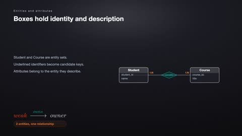
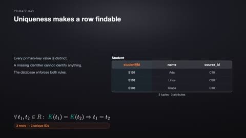
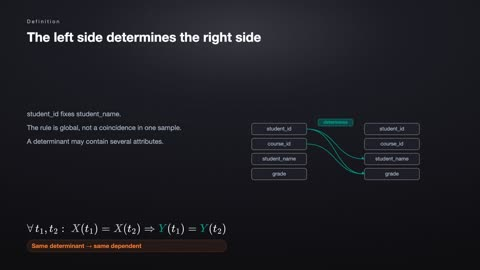
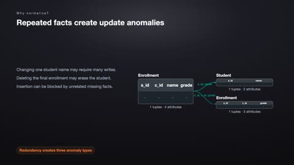
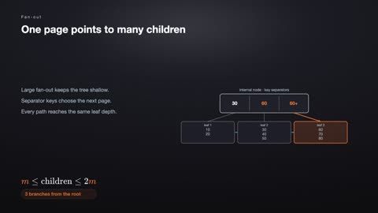
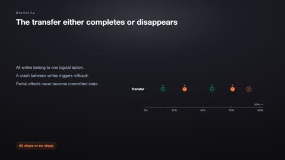
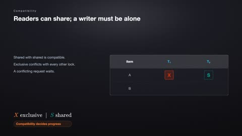
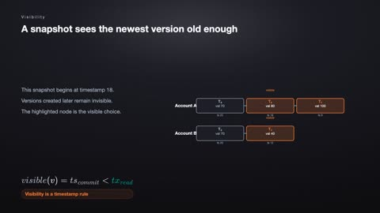

# Database Systems

[← Back to Computer Science](../../README.md#computer-science)

**Textbook:** Database System Concepts (Silberschatz et al.)  
**Knowledge points:** 8

> **Turn your own idea into an animation:** [Create with Leadde →](https://leadde.ai/animation)

**Course download:** [Download all 8 videos as ZIP](https://github.com/LeaddeOpenLab/leadde-knowledge-in-motion/releases/download/course-videos-computer-science-cs-db/cs-db-videos.zip)

---

## Entity-Relationship Model

`C24-A001` · Video ready

[▶ Watch inline](https://leaddeopenlab.github.io/leadde-knowledge-in-motion/?subject=Computer+Science&course=Database+Systems#c24-a001)

[Open or download entity-relationship-model.mp4](../../assets/videos/computer-science/database-systems/entity-relationship-model.mp4)

> **Make this concept move:** [Create an animation with Leadde →](https://leadde.ai/animation)

[Back to course top](#database-systems)

---

## Primary and Foreign Keys

`C24-A002` · Video ready

[▶ Watch inline](https://leaddeopenlab.github.io/leadde-knowledge-in-motion/?subject=Computer+Science&course=Database+Systems#c24-a002)

[Open or download primary-and-foreign-keys.mp4](../../assets/videos/computer-science/database-systems/primary-and-foreign-keys.mp4)

> **Make this concept move:** [Create an animation with Leadde →](https://leadde.ai/animation)

[Back to course top](#database-systems)

---

## Functional Dependencies

`C24-A003` · Video ready

[▶ Watch inline](https://leaddeopenlab.github.io/leadde-knowledge-in-motion/?subject=Computer+Science&course=Database+Systems#c24-a003)

[Open or download functional-dependencies.mp4](../../assets/videos/computer-science/database-systems/functional-dependencies.mp4)

> **Make this concept move:** [Create an animation with Leadde →](https://leadde.ai/animation)

[Back to course top](#database-systems)

---

## Database Normalization

`C24-A004` · Video ready

[▶ Watch inline](https://leaddeopenlab.github.io/leadde-knowledge-in-motion/?subject=Computer+Science&course=Database+Systems#c24-a004)

[Open or download database-normalization.mp4](../../assets/videos/computer-science/database-systems/database-normalization.mp4)

> **Make this concept move:** [Create an animation with Leadde →](https://leadde.ai/animation)

[Back to course top](#database-systems)

---

## B+ Tree Index

`C24-A005` · Video ready

[▶ Watch inline](https://leaddeopenlab.github.io/leadde-knowledge-in-motion/?subject=Computer+Science&course=Database+Systems#c24-a005)

[Open or download b-tree-index.mp4](../../assets/videos/computer-science/database-systems/b-tree-index.mp4)

> **Make this concept move:** [Create an animation with Leadde →](https://leadde.ai/animation)

[Back to course top](#database-systems)

---

## ACID Transactions

`C24-A006` · Video ready

[▶ Watch inline](https://leaddeopenlab.github.io/leadde-knowledge-in-motion/?subject=Computer+Science&course=Database+Systems#c24-a006)

[Open or download acid-transactions.mp4](../../assets/videos/computer-science/database-systems/acid-transactions.mp4)

> **Make this concept move:** [Create an animation with Leadde →](https://leadde.ai/animation)

[Back to course top](#database-systems)

---

## Concurrency Control and Locks

`C24-A007` · Video ready

[▶ Watch inline](https://leaddeopenlab.github.io/leadde-knowledge-in-motion/?subject=Computer+Science&course=Database+Systems#c24-a007)

[Open or download concurrency-control-and-locks.mp4](../../assets/videos/computer-science/database-systems/concurrency-control-and-locks.mp4)

> **Make this concept move:** [Create an animation with Leadde →](https://leadde.ai/animation)

[Back to course top](#database-systems)

---

## Multiversion Concurrency Control

`C24-A008` · Video ready

[▶ Watch inline](https://leaddeopenlab.github.io/leadde-knowledge-in-motion/?subject=Computer+Science&course=Database+Systems#c24-a008)

[Open or download multiversion-concurrency-control.mp4](../../assets/videos/computer-science/database-systems/multiversion-concurrency-control.mp4)

> **Make this concept move:** [Create an animation with Leadde →](https://leadde.ai/animation)

[Back to course top](#database-systems)

---
