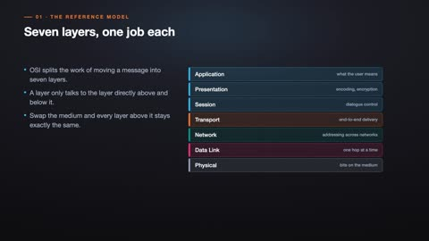
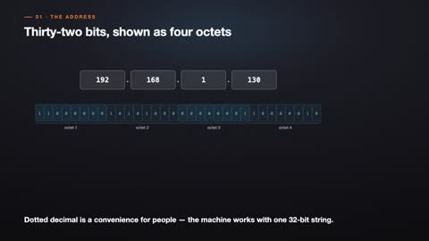
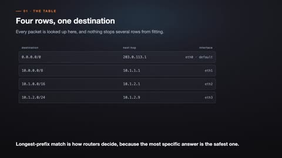
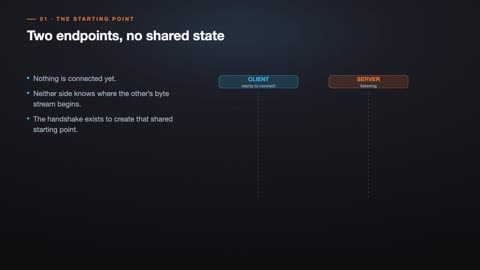
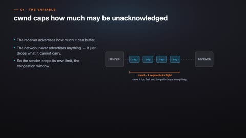
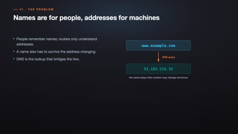
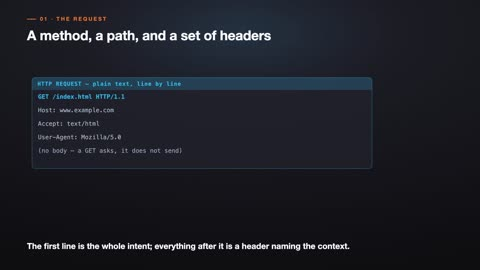

# Computer Networks

[← Back to Computer Science](../../README.md#computer-science)

**Textbook:** Computer Networking: A Top-Down Approach (Kurose and Ross)  
**Knowledge points:** 8

> **Turn your own idea into an animation:** [Create with Leadde →](https://leadde.ai/animation)

**Course download:** [Download all 8 videos as ZIP](https://github.com/LeaddeOpenLab/leadde-knowledge-in-motion/releases/download/course-videos-computer-science-cs-net/cs-net-videos.zip)

---

## OSI and TCP/IP Layers

`C23-A001` · Video ready

[▶ Watch inline](https://leaddeopenlab.github.io/leadde-knowledge-in-motion/?subject=Computer+Science&course=Computer+Networks#c23-a001)

[Open or download osi-and-tcp-ip-layers.mp4](../../assets/videos/computer-science/computer-networks/osi-and-tcp-ip-layers.mp4)

> **Make this concept move:** [Create an animation with Leadde →](https://leadde.ai/animation)

[Back to course top](#computer-networks)

---

## Packet Encapsulation

`C23-A002` · Video ready

[▶ Watch inline](https://leaddeopenlab.github.io/leadde-knowledge-in-motion/?subject=Computer+Science&course=Computer+Networks#c23-a002)

[Open or download packet-encapsulation.mp4](../../assets/videos/computer-science/computer-networks/packet-encapsulation.mp4)

> **Make this concept move:** [Create an animation with Leadde →](https://leadde.ai/animation)

[Back to course top](#computer-networks)

---

## Subnet Masks and CIDR

`C23-A003` · Video ready

[▶ Watch inline](https://leaddeopenlab.github.io/leadde-knowledge-in-motion/?subject=Computer+Science&course=Computer+Networks#c23-a003)

[Open or download subnet-masks-and-cidr.mp4](../../assets/videos/computer-science/computer-networks/subnet-masks-and-cidr.mp4)

> **Make this concept move:** [Create an animation with Leadde →](https://leadde.ai/animation)

[Back to course top](#computer-networks)

---

## Longest-Prefix Routing Match

`C23-A004` · Video ready

[▶ Watch inline](https://leaddeopenlab.github.io/leadde-knowledge-in-motion/?subject=Computer+Science&course=Computer+Networks#c23-a004)

[Open or download longest-prefix-routing-match.mp4](../../assets/videos/computer-science/computer-networks/longest-prefix-routing-match.mp4)

> **Make this concept move:** [Create an animation with Leadde →](https://leadde.ai/animation)

[Back to course top](#computer-networks)

---

## TCP Three-Way Handshake

`C23-A005` · Video ready

[▶ Watch inline](https://leaddeopenlab.github.io/leadde-knowledge-in-motion/?subject=Computer+Science&course=Computer+Networks#c23-a005)

[Open or download tcp-three-way-handshake.mp4](../../assets/videos/computer-science/computer-networks/tcp-three-way-handshake.mp4)

> **Make this concept move:** [Create an animation with Leadde →](https://leadde.ai/animation)

[Back to course top](#computer-networks)

---

## TCP Congestion Window

`C23-A006` · Video ready

[▶ Watch inline](https://leaddeopenlab.github.io/leadde-knowledge-in-motion/?subject=Computer+Science&course=Computer+Networks#c23-a006)

[Open or download tcp-congestion-window.mp4](../../assets/videos/computer-science/computer-networks/tcp-congestion-window.mp4)

> **Make this concept move:** [Create an animation with Leadde →](https://leadde.ai/animation)

[Back to course top](#computer-networks)

---

## DNS Resolution

`C23-A007` · Video ready

[▶ Watch inline](https://leaddeopenlab.github.io/leadde-knowledge-in-motion/?subject=Computer+Science&course=Computer+Networks#c23-a007)

[Open or download dns-resolution.mp4](../../assets/videos/computer-science/computer-networks/dns-resolution.mp4)

> **Make this concept move:** [Create an animation with Leadde →](https://leadde.ai/animation)

[Back to course top](#computer-networks)

---

## HTTP Request and Response

`C23-A008` · Video ready

[▶ Watch inline](https://leaddeopenlab.github.io/leadde-knowledge-in-motion/?subject=Computer+Science&course=Computer+Networks#c23-a008)

[Open or download http-request-and-response.mp4](../../assets/videos/computer-science/computer-networks/http-request-and-response.mp4)

> **Make this concept move:** [Create an animation with Leadde →](https://leadde.ai/animation)

[Back to course top](#computer-networks)

---
