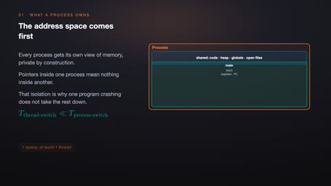
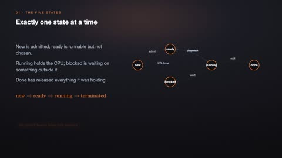
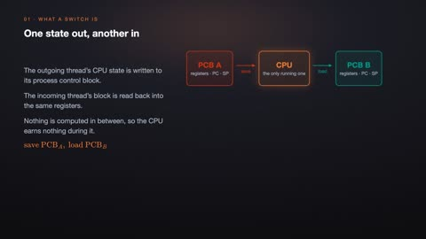
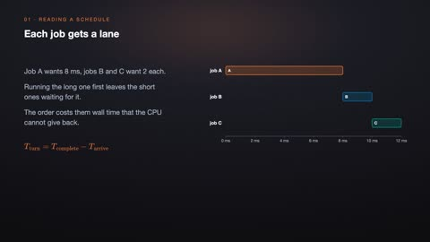
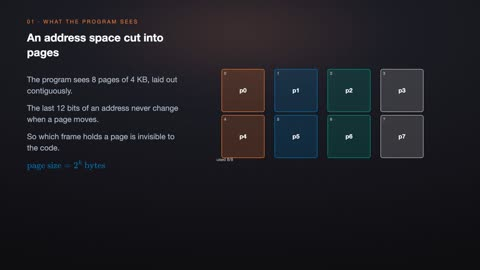
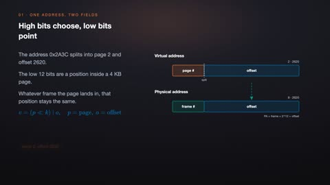
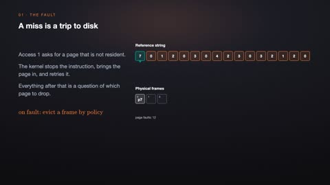
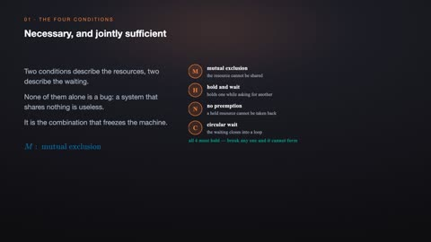

# Operating Systems

[← Back to Computer Science](../../README.md#computer-science)

**Textbook:** Operating System Concepts (Silberschatz et al.)  
**Knowledge points:** 8

> **Turn your own idea into an animation:** [Create with Leadde →](https://leadde.ai/animation)

**Course download:** [Download all 8 videos as ZIP](https://github.com/LeaddeOpenLab/leadde-knowledge-in-motion/releases/download/course-videos-computer-science-cs-os/cs-os-videos.zip)

---

## Processes and Threads

`C22-A001` · Video ready

[Open or download processes-and-threads.mp4](../../assets/videos/computer-science/operating-systems/processes-and-threads.mp4)

> **Make this concept move:** [Create an animation with Leadde →](https://leadde.ai/animation)

[Back to course top](#operating-systems)

---

## Process State Transitions

`C22-A002` · Video ready

[Open or download process-state-transitions.mp4](../../assets/videos/computer-science/operating-systems/process-state-transitions.mp4)

> **Make this concept move:** [Create an animation with Leadde →](https://leadde.ai/animation)

[Back to course top](#operating-systems)

---

## Context Switching

`C22-A003` · Video ready

[Open or download context-switching.mp4](../../assets/videos/computer-science/operating-systems/context-switching.mp4)

> **Make this concept move:** [Create an animation with Leadde →](https://leadde.ai/animation)

[Back to course top](#operating-systems)

---

## CPU Scheduling

`C22-A004` · Video ready

[Open or download cpu-scheduling.mp4](../../assets/videos/computer-science/operating-systems/cpu-scheduling.mp4)

> **Make this concept move:** [Create an animation with Leadde →](https://leadde.ai/animation)

[Back to course top](#operating-systems)

---

## Virtual Memory Paging

`C22-A005` · Video ready

[Open or download virtual-memory-paging.mp4](../../assets/videos/computer-science/operating-systems/virtual-memory-paging.mp4)

> **Make this concept move:** [Create an animation with Leadde →](https://leadde.ai/animation)

[Back to course top](#operating-systems)

---

## Page-Table Address Translation

`C22-A006` · Video ready

[Open or download page-table-address-translation.mp4](../../assets/videos/computer-science/operating-systems/page-table-address-translation.mp4)

> **Make this concept move:** [Create an animation with Leadde →](https://leadde.ai/animation)

[Back to course top](#operating-systems)

---

## Page Replacement

`C22-A007` · Video ready

[Open or download page-replacement.mp4](../../assets/videos/computer-science/operating-systems/page-replacement.mp4)

> **Make this concept move:** [Create an animation with Leadde →](https://leadde.ai/animation)

[Back to course top](#operating-systems)

---

## Four Conditions for Deadlock

`C22-A008` · Video ready

[Open or download four-conditions-for-deadlock.mp4](../../assets/videos/computer-science/operating-systems/four-conditions-for-deadlock.mp4)

> **Make this concept move:** [Create an animation with Leadde →](https://leadde.ai/animation)

[Back to course top](#operating-systems)

---
