# Introduction to Computer Science

[← Back to Computer Science](../../README.md#computer-science)

**Textbook:** Course notes (no required textbook)  
**Knowledge points:** 16

> **Turn your own idea into an animation:** [Create with Leadde →](https://leadde.ai/animation)

**Course download:** [Download all 16 videos as ZIP](https://github.com/LeaddeOpenLab/leadde-knowledge-in-motion/releases/download/course-videos-computer-science-cs50x/cs50x-videos.zip)

---

## Pointer

`C01-A001` · Video ready

[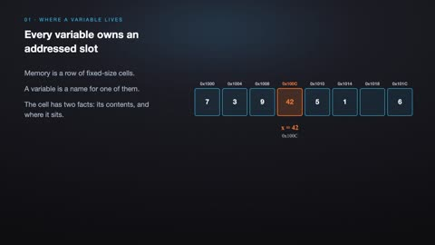](../../assets/videos/computer-science/introduction-to-computer-science/pointer.mp4)

[Open or download pointer.mp4](../../assets/videos/computer-science/introduction-to-computer-science/pointer.mp4)

> **Make this concept move:** [Create an animation with Leadde →](https://leadde.ai/animation)

[Back to course top](#introduction-to-computer-science)

---

## Memory address

`C01-A002` · Video ready

[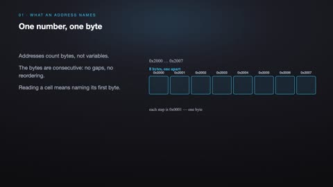](../../assets/videos/computer-science/introduction-to-computer-science/memory-address.mp4)

[Open or download memory-address.mp4](../../assets/videos/computer-science/introduction-to-computer-science/memory-address.mp4)

> **Make this concept move:** [Create an animation with Leadde →](https://leadde.ai/animation)

[Back to course top](#introduction-to-computer-science)

---

## Memory layout

`C01-A003` · Video ready

[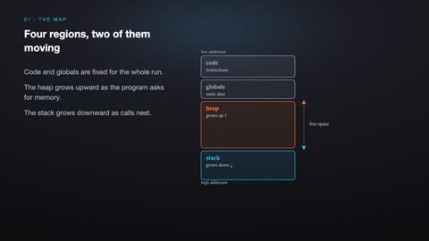](../../assets/videos/computer-science/introduction-to-computer-science/memory-layout.mp4)

[Open or download memory-layout.mp4](../../assets/videos/computer-science/introduction-to-computer-science/memory-layout.mp4)

> **Make this concept move:** [Create an animation with Leadde →](https://leadde.ai/animation)

[Back to course top](#introduction-to-computer-science)

---

## Time complexity

`C01-A004` · Video ready

[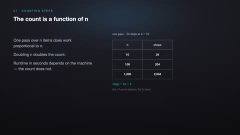](../../assets/videos/computer-science/introduction-to-computer-science/time-complexity.mp4)

[Open or download time-complexity.mp4](../../assets/videos/computer-science/introduction-to-computer-science/time-complexity.mp4)

> **Make this concept move:** [Create an animation with Leadde →](https://leadde.ai/animation)

[Back to course top](#introduction-to-computer-science)

---

## Algorithm growth rate

`C01-A005` · Video ready

[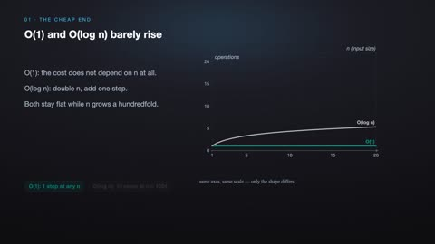](../../assets/videos/computer-science/introduction-to-computer-science/algorithm-growth-rate.mp4)

[Open or download algorithm-growth-rate.mp4](../../assets/videos/computer-science/introduction-to-computer-science/algorithm-growth-rate.mp4)

> **Make this concept move:** [Create an animation with Leadde →](https://leadde.ai/animation)

[Back to course top](#introduction-to-computer-science)

---

## Sorting process

`C01-A006` · Video ready

[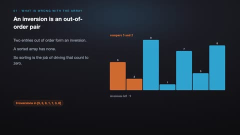](../../assets/videos/computer-science/introduction-to-computer-science/sorting-process.mp4)

[Open or download sorting-process.mp4](../../assets/videos/computer-science/introduction-to-computer-science/sorting-process.mp4)

> **Make this concept move:** [Create an animation with Leadde →](https://leadde.ai/animation)

[Back to course top](#introduction-to-computer-science)

---

## Binary search

`C01-A007` · Video ready

[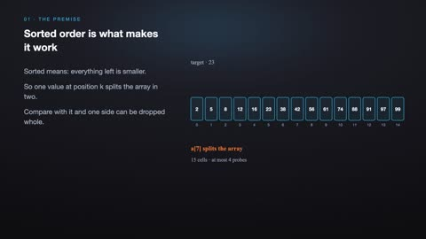](../../assets/videos/computer-science/introduction-to-computer-science/binary-search.mp4)

[Open or download binary-search.mp4](../../assets/videos/computer-science/introduction-to-computer-science/binary-search.mp4)

> **Make this concept move:** [Create an animation with Leadde →](https://leadde.ai/animation)

[Back to course top](#introduction-to-computer-science)

---

## Linked list

`C01-A008` · Video ready

[Open or download linked-list.mp4](../../assets/videos/computer-science/introduction-to-computer-science/linked-list.mp4)

> **Make this concept move:** [Create an animation with Leadde →](https://leadde.ai/animation)

[Back to course top](#introduction-to-computer-science)

---

## Tree structure

`C01-A009` · Video ready

[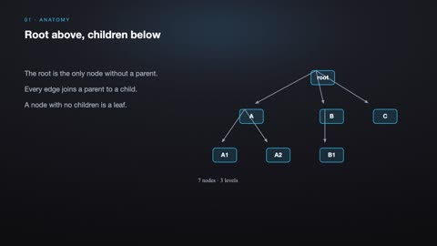](../../assets/videos/computer-science/introduction-to-computer-science/tree-structure.mp4)

[Open or download tree-structure.mp4](../../assets/videos/computer-science/introduction-to-computer-science/tree-structure.mp4)

> **Make this concept move:** [Create an animation with Leadde →](https://leadde.ai/animation)

[Back to course top](#introduction-to-computer-science)

---

## Hash table

`C01-A010` · Video ready

[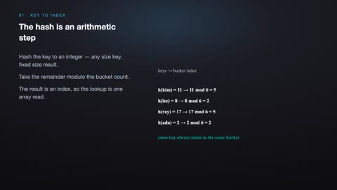](../../assets/videos/computer-science/introduction-to-computer-science/hash-table.mp4)

[Open or download hash-table.mp4](../../assets/videos/computer-science/introduction-to-computer-science/hash-table.mp4)

> **Make this concept move:** [Create an animation with Leadde →](https://leadde.ai/animation)

[Back to course top](#introduction-to-computer-science)

---

## Relational model

`C01-A011` · Video ready

[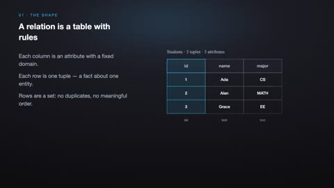](../../assets/videos/computer-science/introduction-to-computer-science/relational-model.mp4)

[Open or download relational-model.mp4](../../assets/videos/computer-science/introduction-to-computer-science/relational-model.mp4)

> **Make this concept move:** [Create an animation with Leadde →](https://leadde.ai/animation)

[Back to course top](#introduction-to-computer-science)

---

## SQL JOIN

`C01-A012` · Video ready

[Open or download sql-join.mp4](../../assets/videos/computer-science/introduction-to-computer-science/sql-join.mp4)

> **Make this concept move:** [Create an animation with Leadde →](https://leadde.ai/animation)

[Back to course top](#introduction-to-computer-science)

---

## Stack vs. Heap

`C01-A013` · Video ready

[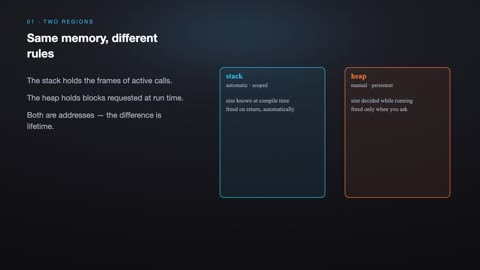](../../assets/videos/computer-science/introduction-to-computer-science/stack-vs-heap.mp4)

[Open or download stack-vs-heap.mp4](../../assets/videos/computer-science/introduction-to-computer-science/stack-vs-heap.mp4)

> **Make this concept move:** [Create an animation with Leadde →](https://leadde.ai/animation)

[Back to course top](#introduction-to-computer-science)

---

## Pointer Dereferencing

`C01-A014` · Video ready

[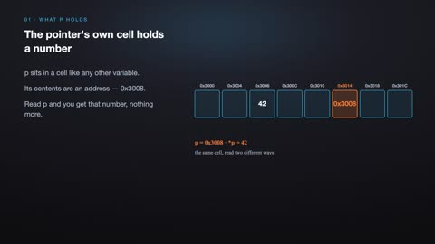](../../assets/videos/computer-science/introduction-to-computer-science/pointer-dereferencing.mp4)

[Open or download pointer-dereferencing.mp4](../../assets/videos/computer-science/introduction-to-computer-science/pointer-dereferencing.mp4)

> **Make this concept move:** [Create an animation with Leadde →](https://leadde.ai/animation)

[Back to course top](#introduction-to-computer-science)

---

## Pointer Arithmetic

`C01-A015` · Video ready

[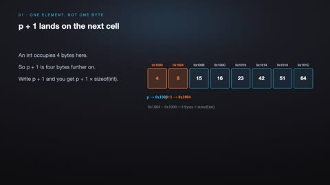](../../assets/videos/computer-science/introduction-to-computer-science/pointer-arithmetic.mp4)

[Open or download pointer-arithmetic.mp4](../../assets/videos/computer-science/introduction-to-computer-science/pointer-arithmetic.mp4)

> **Make this concept move:** [Create an animation with Leadde →](https://leadde.ai/animation)

[Back to course top](#introduction-to-computer-science)

---

## Recursive Call Stack

`C01-A016` · Video ready

[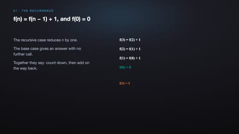](../../assets/videos/computer-science/introduction-to-computer-science/recursive-call-stack.mp4)

[Open or download recursive-call-stack.mp4](../../assets/videos/computer-science/introduction-to-computer-science/recursive-call-stack.mp4)

> **Make this concept move:** [Create an animation with Leadde →](https://leadde.ai/animation)

[Back to course top](#introduction-to-computer-science)

---
