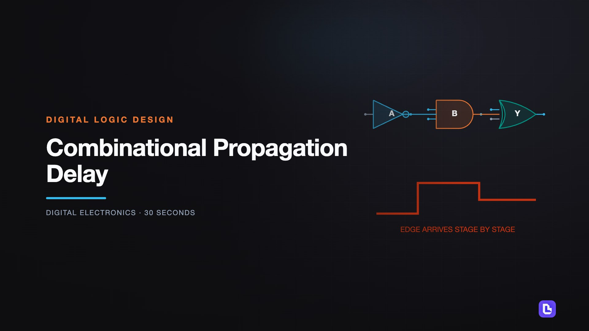
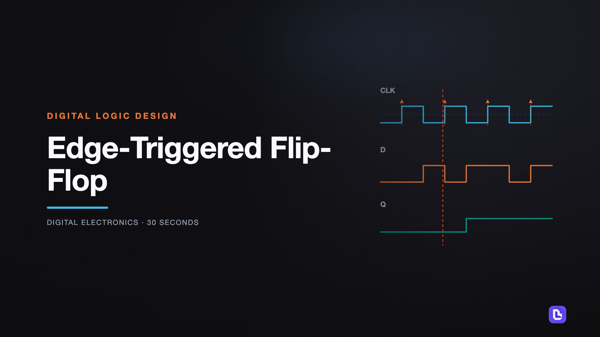
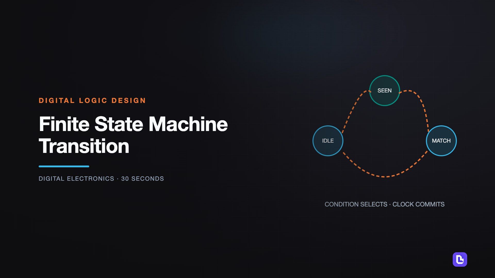
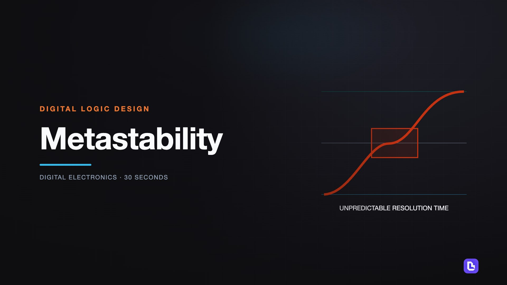
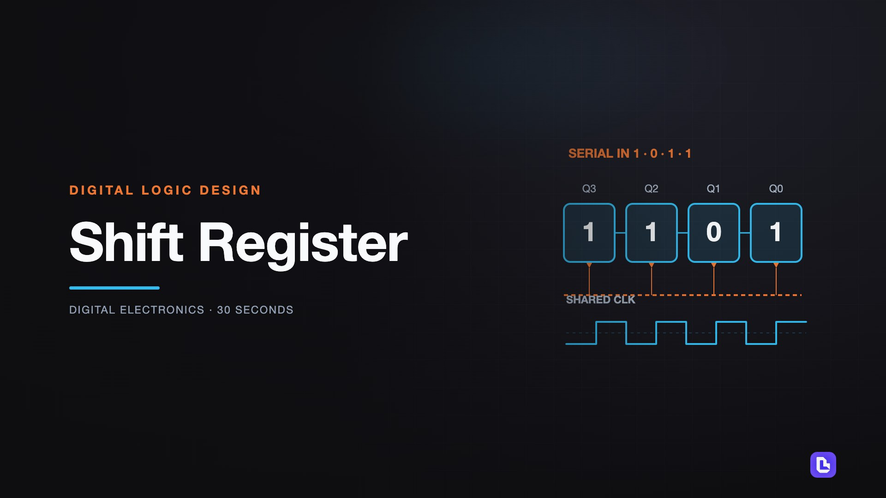

# Digital Logic Design

[← Back to Digital Electronics](../../README.md#digital-electronics)

**Textbook:** Digital Design and Computer Architecture (Harris and Harris)  
**Knowledge points:** 5

> **Turn your own idea into an animation:** [Create with Leadde →](https://leadde.ai/animation)

---

## Combinational Propagation Delay

`C38-A001` · Video ready

[Open or download combinational-propagation-delay.mp4](../../assets/videos/digital-electronics/digital-logic-design/combinational-propagation-delay.mp4)

> **Make this concept move:** [Create an animation with Leadde →](https://leadde.ai/animation)

[Back to course top](#digital-logic-design)

---

## Edge-Triggered Flip-Flop

`C38-A002` · Video ready

[Open or download edge-triggered-flip-flop.mp4](../../assets/videos/digital-electronics/digital-logic-design/edge-triggered-flip-flop.mp4)

> **Make this concept move:** [Create an animation with Leadde →](https://leadde.ai/animation)

[Back to course top](#digital-logic-design)

---

## Finite State Machine Transition

`C38-A003` · Video ready

[Open or download finite-state-machine-transition.mp4](../../assets/videos/digital-electronics/digital-logic-design/finite-state-machine-transition.mp4)

> **Make this concept move:** [Create an animation with Leadde →](https://leadde.ai/animation)

[Back to course top](#digital-logic-design)

---

## Metastability

`C38-A004` · Video ready

[Open or download metastability.mp4](../../assets/videos/digital-electronics/digital-logic-design/metastability.mp4)

> **Make this concept move:** [Create an animation with Leadde →](https://leadde.ai/animation)

[Back to course top](#digital-logic-design)

---

## Shift Register

`C38-A005` · Video ready

[Open or download shift-register.mp4](../../assets/videos/digital-electronics/digital-logic-design/shift-register.mp4)

> **Make this concept move:** [Create an animation with Leadde →](https://leadde.ai/animation)

[Back to course top](#digital-logic-design)

---
