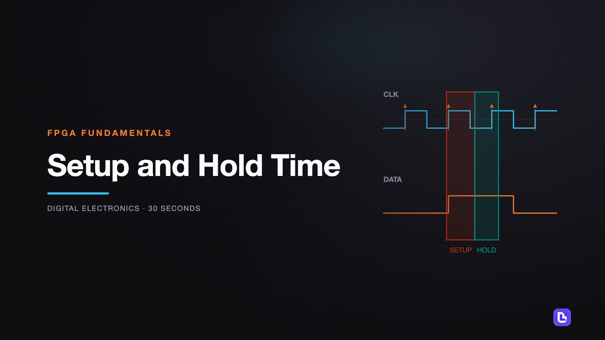
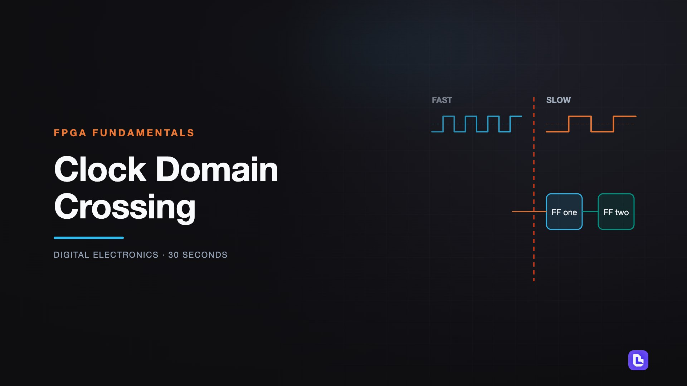
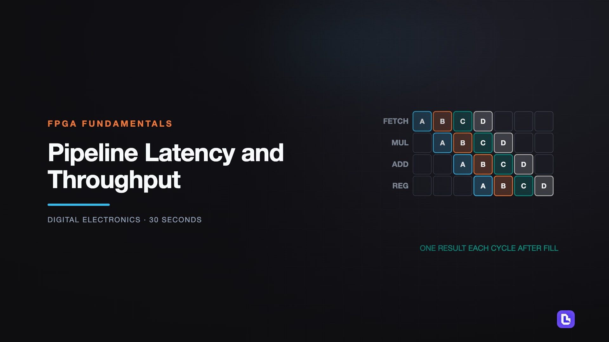
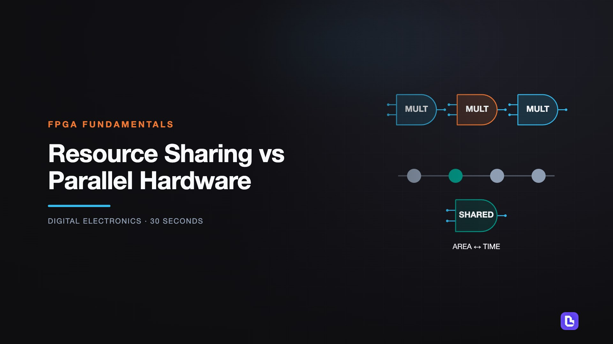

# FPGA Fundamentals

[← Back to Digital Electronics](../../README.md#digital-electronics)

**Textbook:** Course notes (no required textbook)  
**Knowledge points:** 4

> **Turn your own idea into an animation:** [Create with Leadde →](https://leadde.ai/animation)

---

## Setup and Hold Time

`C39-A001` · Video ready

[Open or download setup-and-hold-time.mp4](../../assets/videos/digital-electronics/fpga-fundamentals/setup-and-hold-time.mp4)

> **Make this concept move:** [Create an animation with Leadde →](https://leadde.ai/animation)

[Back to course top](#fpga-fundamentals)

---

## Clock Domain Crossing

`C39-A002` · Video ready

[Open or download clock-domain-crossing.mp4](../../assets/videos/digital-electronics/fpga-fundamentals/clock-domain-crossing.mp4)

> **Make this concept move:** [Create an animation with Leadde →](https://leadde.ai/animation)

[Back to course top](#fpga-fundamentals)

---

## Pipeline Latency and Throughput

`C39-A003` · Video ready

[Open or download pipeline-latency-and-throughput.mp4](../../assets/videos/digital-electronics/fpga-fundamentals/pipeline-latency-and-throughput.mp4)

> **Make this concept move:** [Create an animation with Leadde →](https://leadde.ai/animation)

[Back to course top](#fpga-fundamentals)

---

## Resource Sharing vs Parallel Hardware

`C39-A004` · Video ready

[Open or download resource-sharing-vs-parallel-hardware.mp4](../../assets/videos/digital-electronics/fpga-fundamentals/resource-sharing-vs-parallel-hardware.mp4)

> **Make this concept move:** [Create an animation with Leadde →](https://leadde.ai/animation)

[Back to course top](#fpga-fundamentals)

---
