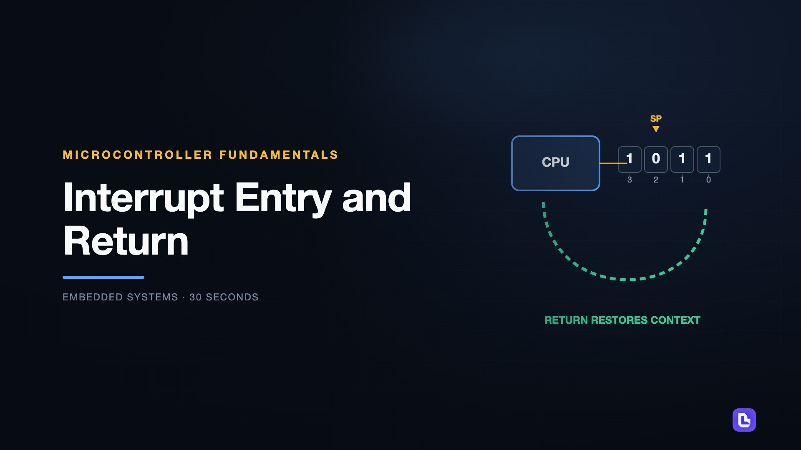
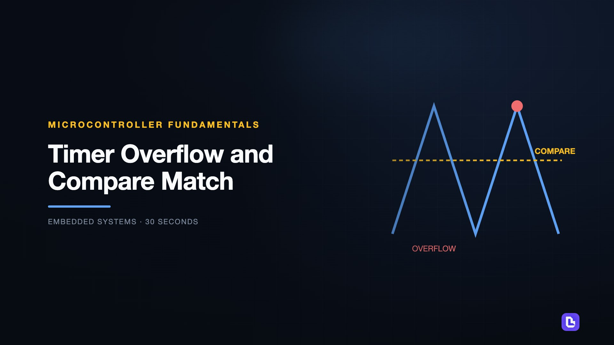
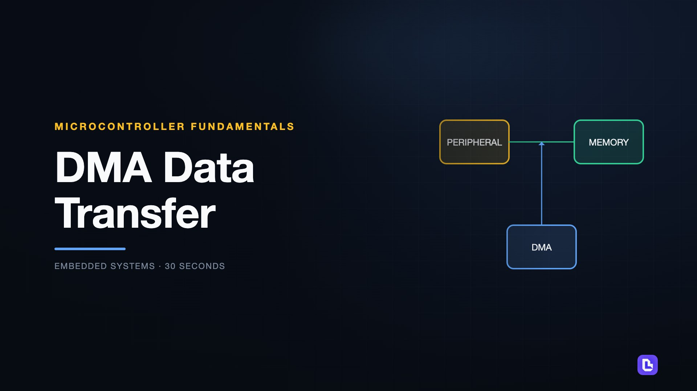
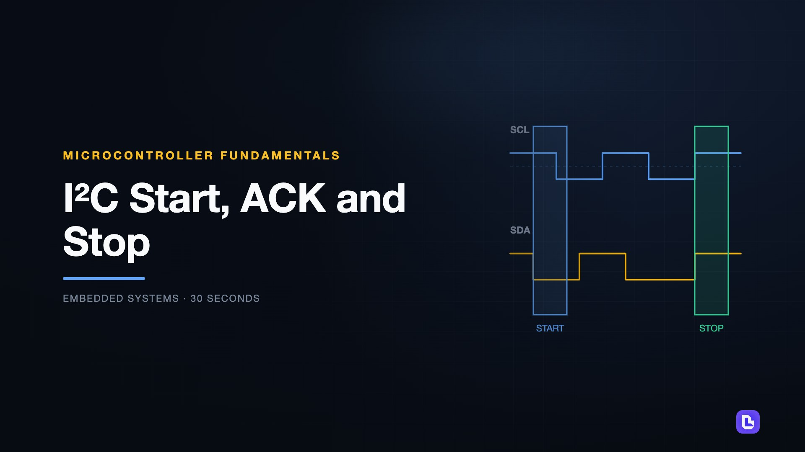

# Microcontroller Fundamentals

[← Back to Embedded Systems](../../README.md#embedded-systems)

**Textbook:** Course notes (no required textbook)  
**Knowledge points:** 4

> **Turn your own idea into an animation:** [Create with Leadde →](https://leadde.ai/animation)

---

## Interrupt Entry and Return

`C36-A001` · Video ready

[▶ Watch inline](https://leaddeopenlab.github.io/leadde-knowledge-in-motion/?subject=Embedded+Systems&course=Microcontroller+Fundamentals#c36-a001)

[Open or download interrupt-entry-and-return.mp4](../../assets/videos/embedded-systems/microcontroller-fundamentals/interrupt-entry-and-return.mp4)

> **Make this concept move:** [Create an animation with Leadde →](https://leadde.ai/animation)

[Back to course top](#microcontroller-fundamentals)

---

## Timer Overflow and Compare Match

`C36-A002` · Video ready

[▶ Watch inline](https://leaddeopenlab.github.io/leadde-knowledge-in-motion/?subject=Embedded+Systems&course=Microcontroller+Fundamentals#c36-a002)

[Open or download timer-overflow-and-compare-match.mp4](../../assets/videos/embedded-systems/microcontroller-fundamentals/timer-overflow-and-compare-match.mp4)

> **Make this concept move:** [Create an animation with Leadde →](https://leadde.ai/animation)

[Back to course top](#microcontroller-fundamentals)

---

## DMA Data Transfer

`C36-A003` · Video ready

[▶ Watch inline](https://leaddeopenlab.github.io/leadde-knowledge-in-motion/?subject=Embedded+Systems&course=Microcontroller+Fundamentals#c36-a003)

[Open or download dma-data-transfer.mp4](../../assets/videos/embedded-systems/microcontroller-fundamentals/dma-data-transfer.mp4)

> **Make this concept move:** [Create an animation with Leadde →](https://leadde.ai/animation)

[Back to course top](#microcontroller-fundamentals)

---

## I²C Start, ACK and Stop

`C36-A004` · Video ready

[▶ Watch inline](https://leaddeopenlab.github.io/leadde-knowledge-in-motion/?subject=Embedded+Systems&course=Microcontroller+Fundamentals#c36-a004)

[Open or download i2c-start-ack-and-stop.mp4](../../assets/videos/embedded-systems/microcontroller-fundamentals/i2c-start-ack-and-stop.mp4)

> **Make this concept move:** [Create an animation with Leadde →](https://leadde.ai/animation)

[Back to course top](#microcontroller-fundamentals)

---
