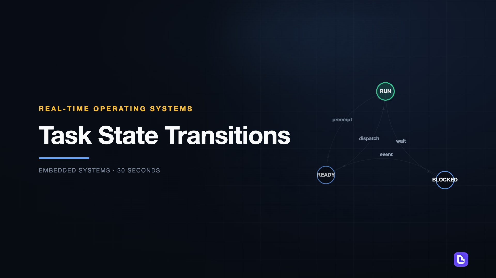
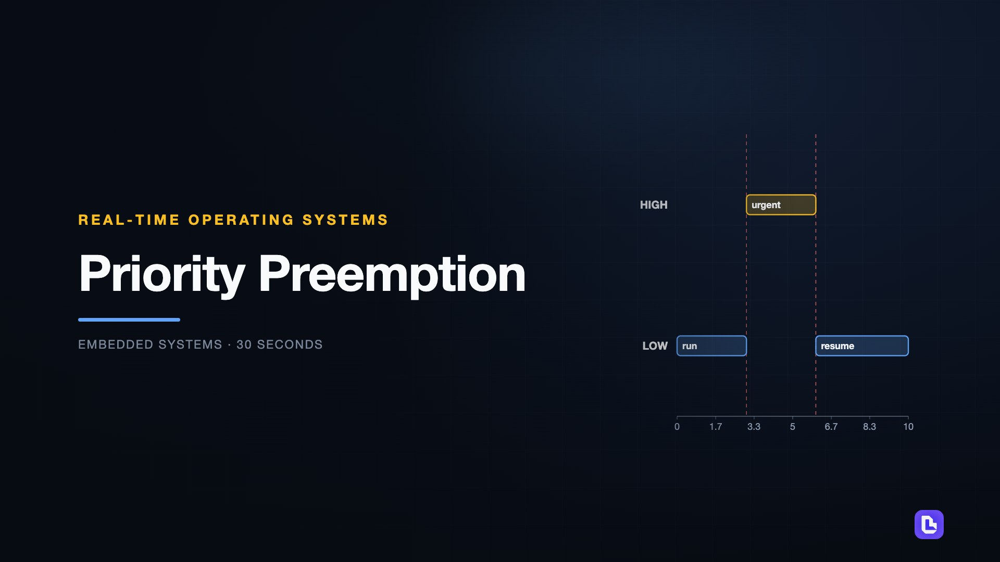
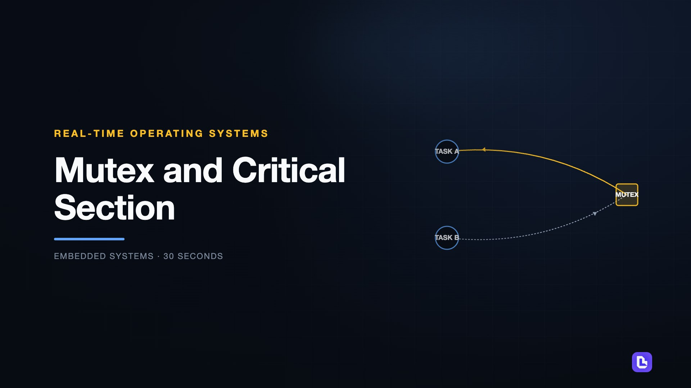
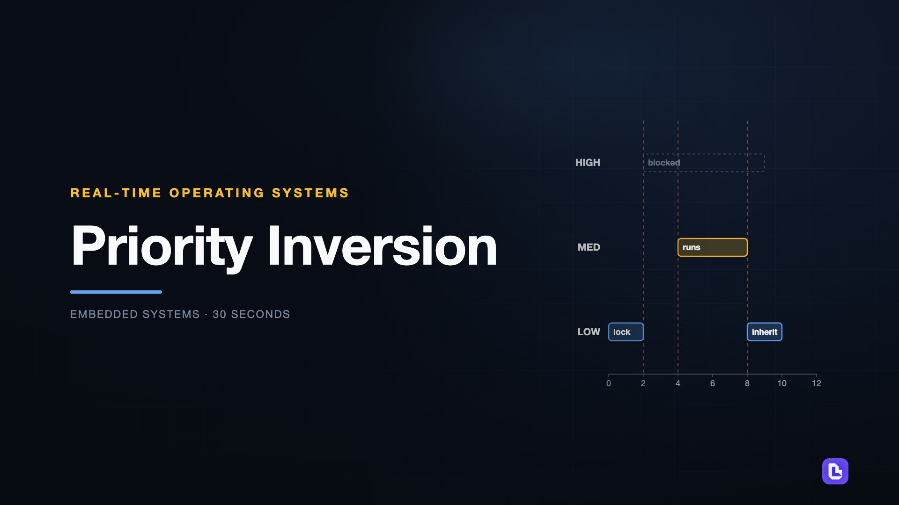

# Real-Time Operating Systems

[← Back to Embedded Systems](../../README.md#embedded-systems)

**Textbook:** Course notes (no required textbook)  
**Knowledge points:** 4

> **Turn your own idea into an animation:** [Create with Leadde →](https://leadde.ai/animation)

---

## Task State Transitions

`C37-A001` · Video ready

[Open or download task-state-transitions.mp4](../../assets/videos/embedded-systems/real-time-operating-systems/task-state-transitions.mp4)

> **Make this concept move:** [Create an animation with Leadde →](https://leadde.ai/animation)

[Back to course top](#real-time-operating-systems)

---

## Priority Preemption

`C37-A002` · Video ready

[Open or download priority-preemption.mp4](../../assets/videos/embedded-systems/real-time-operating-systems/priority-preemption.mp4)

> **Make this concept move:** [Create an animation with Leadde →](https://leadde.ai/animation)

[Back to course top](#real-time-operating-systems)

---

## Mutex and Critical Section

`C37-A003` · Video ready

[Open or download mutex-and-critical-section.mp4](../../assets/videos/embedded-systems/real-time-operating-systems/mutex-and-critical-section.mp4)

> **Make this concept move:** [Create an animation with Leadde →](https://leadde.ai/animation)

[Back to course top](#real-time-operating-systems)

---

## Priority Inversion

`C37-A004` · Video ready

[Open or download priority-inversion.mp4](../../assets/videos/embedded-systems/real-time-operating-systems/priority-inversion.mp4)

> **Make this concept move:** [Create an animation with Leadde →](https://leadde.ai/animation)

[Back to course top](#real-time-operating-systems)

---
