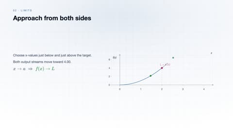
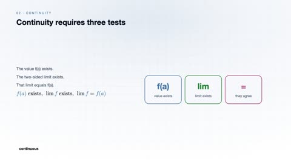
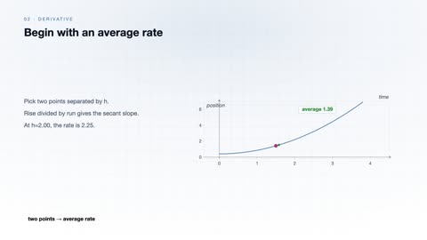
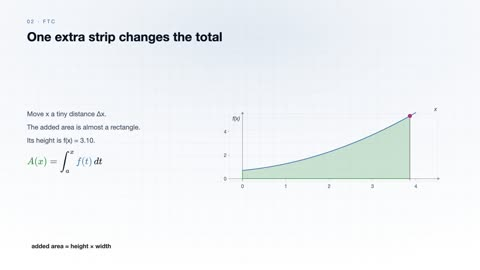
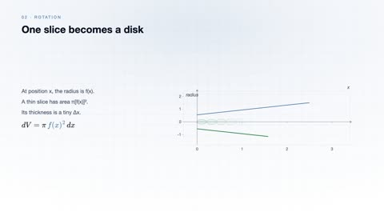
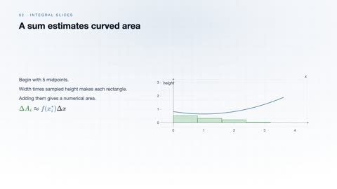
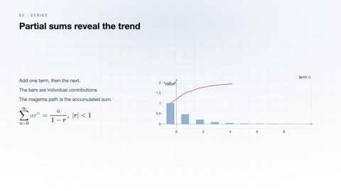
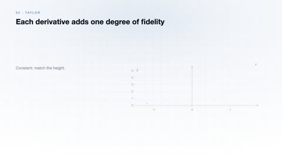
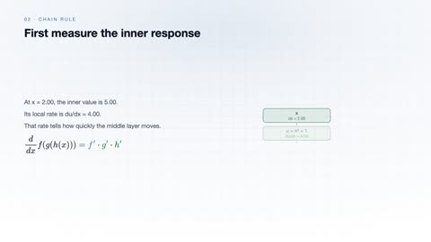
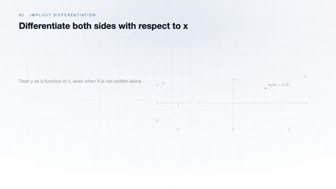

# Single-Variable Calculus

[← Back to Mathematics](../../README.md#mathematics)

**Textbook:** Calculus with Analytic Geometry, 2e (Simmons)  
**Knowledge points:** 12

> **Turn your own idea into an animation:** [Create with Leadde →](https://leadde.ai/animation)

---

## Limit

`C04-A001` · Video ready

[Open or download limit.mp4](../../assets/videos/mathematics/single-variable-calculus/limit.mp4)

> **Make this concept move:** [Create an animation with Leadde →](https://leadde.ai/animation)

[Back to course top](#single-variable-calculus)

---

## Continuity

`C04-A002` · Video ready

[Open or download continuity.mp4](../../assets/videos/mathematics/single-variable-calculus/continuity.mp4)

> **Make this concept move:** [Create an animation with Leadde →](https://leadde.ai/animation)

[Back to course top](#single-variable-calculus)

---

## Derivatives as local rates of change

`C04-A003` · Video ready

[Open or download derivatives-as-local-rates-of-change.mp4](../../assets/videos/mathematics/single-variable-calculus/derivatives-as-local-rates-of-change.mp4)

> **Make this concept move:** [Create an animation with Leadde →](https://leadde.ai/animation)

[Back to course top](#single-variable-calculus)

---

## Fundamental Theorem of Calculus

`C04-A004` · Video ready

[Open or download fundamental-theorem-of-calculus.mp4](../../assets/videos/mathematics/single-variable-calculus/fundamental-theorem-of-calculus.mp4)

> **Make this concept move:** [Create an animation with Leadde →](https://leadde.ai/animation)

[Back to course top](#single-variable-calculus)

---

## Volume of rotation

`C04-A005` · Video ready

[Open or download volume-of-rotation.mp4](../../assets/videos/mathematics/single-variable-calculus/volume-of-rotation.mp4)

> **Make this concept move:** [Create an animation with Leadde →](https://leadde.ai/animation)

[Back to course top](#single-variable-calculus)

---

## Integral slice

`C04-A006` · Video ready

[Open or download integral-slice.mp4](../../assets/videos/mathematics/single-variable-calculus/integral-slice.mp4)

> **Make this concept move:** [Create an animation with Leadde →](https://leadde.ai/animation)

[Back to course top](#single-variable-calculus)

---

## Infinite series

`C04-A007` · Video ready

[Open or download infinite-series.mp4](../../assets/videos/mathematics/single-variable-calculus/infinite-series.mp4)

> **Make this concept move:** [Create an animation with Leadde →](https://leadde.ai/animation)

[Back to course top](#single-variable-calculus)

---

## Taylor Expand

`C04-A008` · Video ready

[Open or download taylor-expand.mp4](../../assets/videos/mathematics/single-variable-calculus/taylor-expand.mp4)

> **Make this concept move:** [Create an animation with Leadde →](https://leadde.ai/animation)

[Back to course top](#single-variable-calculus)

---

## Epsilon-Delta Definition of a Limit

`C04-A009` · Video ready

[Open or download epsilon-delta-definition-of-a-limit.mp4](../../assets/videos/mathematics/single-variable-calculus/epsilon-delta-definition-of-a-limit.mp4)

> **Make this concept move:** [Create an animation with Leadde →](https://leadde.ai/animation)

[Back to course top](#single-variable-calculus)

---

## Left- and Right-Hand Limits

`C04-A010` · Video ready

[Open or download left-and-right-hand-limits.mp4](../../assets/videos/mathematics/single-variable-calculus/left-and-right-hand-limits.mp4)

> **Make this concept move:** [Create an animation with Leadde →](https://leadde.ai/animation)

[Back to course top](#single-variable-calculus)

---

## Chain Rule

`C04-A011` · Video ready

[Open or download chain-rule.mp4](../../assets/videos/mathematics/single-variable-calculus/chain-rule.mp4)

> **Make this concept move:** [Create an animation with Leadde →](https://leadde.ai/animation)

[Back to course top](#single-variable-calculus)

---

## Implicit Differentiation

`C04-A012` · Video ready

[Open or download implicit-differentiation.mp4](../../assets/videos/mathematics/single-variable-calculus/implicit-differentiation.mp4)

> **Make this concept move:** [Create an animation with Leadde →](https://leadde.ai/animation)

[Back to course top](#single-variable-calculus)

---
