# Linear Algebra

[← Back to Mathematics](../../README.md#mathematics)

**Textbook:** Introduction to Linear Algebra, 4e/5e (Strang)  
**Knowledge points:** 16

> **Turn your own idea into an animation:** [Create with Leadde →](https://leadde.ai/animation)

---

## Column space

`C05-A001` · Video ready

[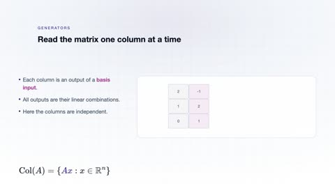](../../assets/videos/mathematics/linear-algebra/column-space.mp4)

[Open or download column-space.mp4](../../assets/videos/mathematics/linear-algebra/column-space.mp4)

> **Make this concept move:** [Create an animation with Leadde →](https://leadde.ai/animation)

[Back to course top](#linear-algebra)

---

## Line space

`C05-A002` · Video ready

[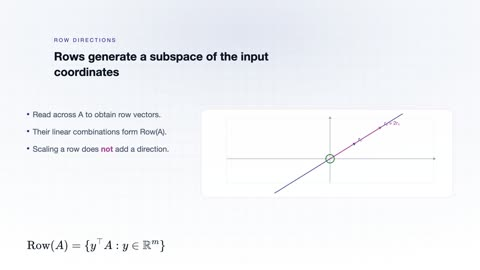](../../assets/videos/mathematics/linear-algebra/line-space.mp4)

[Open or download line-space.mp4](../../assets/videos/mathematics/linear-algebra/line-space.mp4)

> **Make this concept move:** [Create an animation with Leadde →](https://leadde.ai/animation)

[Back to course top](#linear-algebra)

---

## Zero space

`C05-A003` · Video ready

[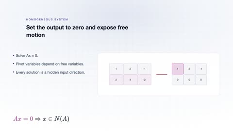](../../assets/videos/mathematics/linear-algebra/zero-space.mp4)

[Open or download zero-space.mp4](../../assets/videos/mathematics/linear-algebra/zero-space.mp4)

> **Make this concept move:** [Create an animation with Leadde →](https://leadde.ai/animation)

[Back to course top](#linear-algebra)

---

## Left zero space

`C05-A004` · Video ready

[Open or download left-zero-space.mp4](../../assets/videos/mathematics/linear-algebra/left-zero-space.mp4)

> **Make this concept move:** [Create an animation with Leadde →](https://leadde.ai/animation)

[Back to course top](#linear-algebra)

---

## Orthographic projection

`C05-A005` · Video ready

[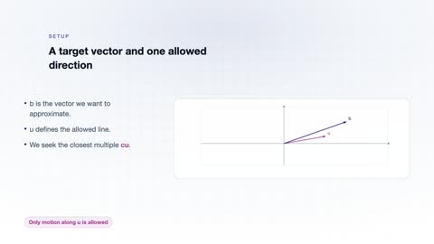](../../assets/videos/mathematics/linear-algebra/orthographic-projection.mp4)

[Open or download orthographic-projection.mp4](../../assets/videos/mathematics/linear-algebra/orthographic-projection.mp4)

> **Make this concept move:** [Create an animation with Leadde →](https://leadde.ai/animation)

[Back to course top](#linear-algebra)

---

## Least squares

`C05-A006` · Video ready

[Open or download least-squares.mp4](../../assets/videos/mathematics/linear-algebra/least-squares.mp4)

> **Make this concept move:** [Create an animation with Leadde →](https://leadde.ai/animation)

[Back to course top](#linear-algebra)

---

## Determinant

`C05-A007` · Video ready

[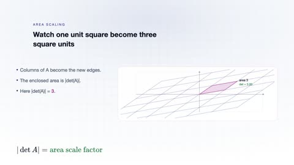](../../assets/videos/mathematics/linear-algebra/determinant.mp4)

[Open or download determinant.mp4](../../assets/videos/mathematics/linear-algebra/determinant.mp4)

> **Make this concept move:** [Create an animation with Leadde →](https://leadde.ai/animation)

[Back to course top](#linear-algebra)

---

## Volume scaling for linear transformations

`C05-A008` · Video ready

[Open or download volume-scaling-for-linear-transformations.mp4](../../assets/videos/mathematics/linear-algebra/volume-scaling-for-linear-transformations.mp4)

> **Make this concept move:** [Create an animation with Leadde →](https://leadde.ai/animation)

[Back to course top](#linear-algebra)

---

## Eigenvalue

`C05-A009` · Video ready

[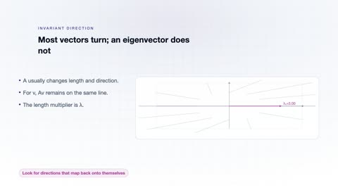](../../assets/videos/mathematics/linear-algebra/eigenvalue.mp4)

[Open or download eigenvalue.mp4](../../assets/videos/mathematics/linear-algebra/eigenvalue.mp4)

> **Make this concept move:** [Create an animation with Leadde →](https://leadde.ai/animation)

[Back to course top](#linear-algebra)

---

## Eigenvector

`C05-A010` · Video ready

[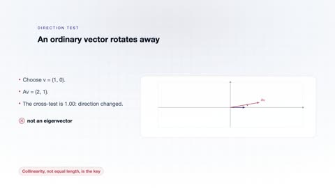](../../assets/videos/mathematics/linear-algebra/eigenvector.mp4)

[Open or download eigenvector.mp4](../../assets/videos/mathematics/linear-algebra/eigenvector.mp4)

> **Make this concept move:** [Create an animation with Leadde →](https://leadde.ai/animation)

[Back to course top](#linear-algebra)

---

## Matrix diagonalization

`C05-A011` · Video ready

[Open or download matrix-diagonalization.mp4](../../assets/videos/mathematics/linear-algebra/matrix-diagonalization.mp4)

> **Make this concept move:** [Create an animation with Leadde →](https://leadde.ai/animation)

[Back to course top](#linear-algebra)

---

## Singular value decomposition

`C05-A012` · Video ready

[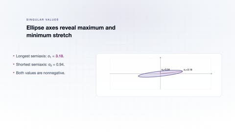](../../assets/videos/mathematics/linear-algebra/singular-value-decomposition.mp4)

[Open or download singular-value-decomposition.mp4](../../assets/videos/mathematics/linear-algebra/singular-value-decomposition.mp4)

> **Make this concept move:** [Create an animation with Leadde →](https://leadde.ai/animation)

[Back to course top](#linear-algebra)

---

## Gaussian Elimination

`C05-A013` · Video ready

[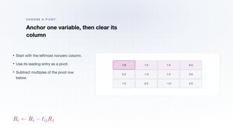](../../assets/videos/mathematics/linear-algebra/gaussian-elimination.mp4)

[Open or download gaussian-elimination.mp4](../../assets/videos/mathematics/linear-algebra/gaussian-elimination.mp4)

> **Make this concept move:** [Create an animation with Leadde →](https://leadde.ai/animation)

[Back to course top](#linear-algebra)

---

## Rank-Nullity Theorem

`C05-A014` · Video ready

[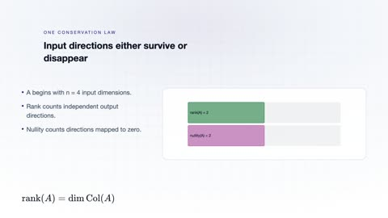](../../assets/videos/mathematics/linear-algebra/rank-nullity-theorem.mp4)

[Open or download rank-nullity-theorem.mp4](../../assets/videos/mathematics/linear-algebra/rank-nullity-theorem.mp4)

> **Make this concept move:** [Create an animation with Leadde →](https://leadde.ai/animation)

[Back to course top](#linear-algebra)

---

## Gram-Schmidt Orthogonalization

`C05-A015` · Video ready

[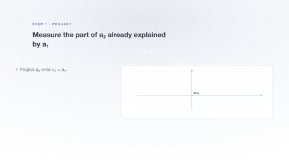](../../assets/videos/mathematics/linear-algebra/gram-schmidt-orthogonalization.mp4)

[Open or download gram-schmidt-orthogonalization.mp4](../../assets/videos/mathematics/linear-algebra/gram-schmidt-orthogonalization.mp4)

> **Make this concept move:** [Create an animation with Leadde →](https://leadde.ai/animation)

[Back to course top](#linear-algebra)

---

## QR Decomposition

`C05-A016` · Video ready

[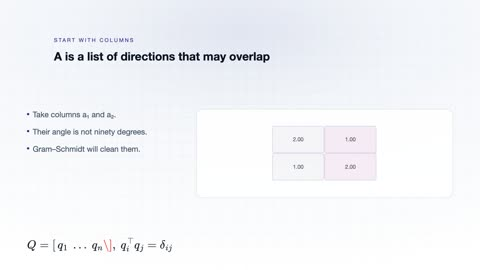](../../assets/videos/mathematics/linear-algebra/qr-decomposition.mp4)

[Open or download qr-decomposition.mp4](../../assets/videos/mathematics/linear-algebra/qr-decomposition.mp4)

> **Make this concept move:** [Create an animation with Leadde →](https://leadde.ai/animation)

[Back to course top](#linear-algebra)

---
