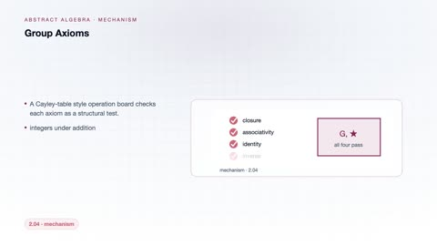
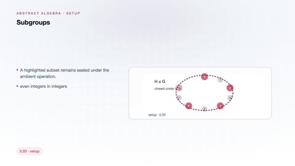
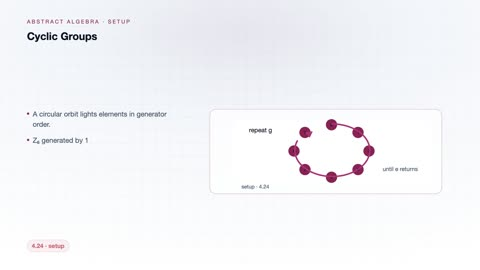
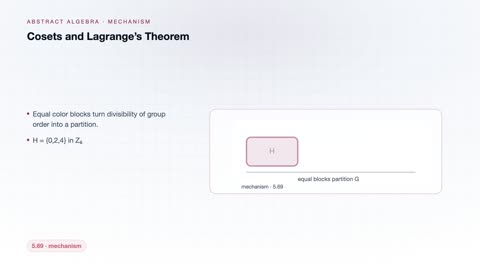
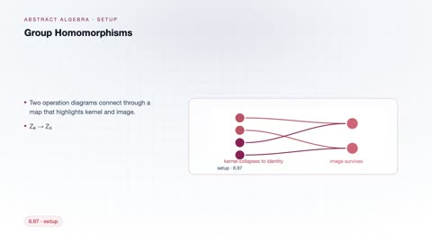
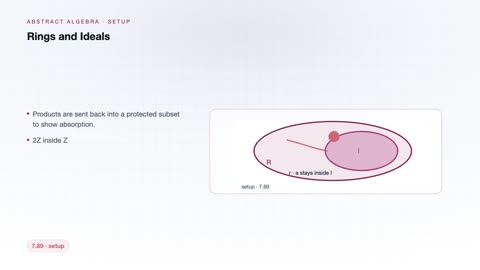

# Abstract Algebra

[← Back to Mathematics](../../README.md#mathematics)

**Textbook:** Abstract Algebra (Dummit and Foote)  
**Knowledge points:** 8

> **Turn your own idea into an animation:** [Create with Leadde →](https://leadde.ai/animation)

---

## Group Axioms

`C34-A001` · Video ready

[▶ Watch inline](https://leaddeopenlab.github.io/leadde-knowledge-in-motion/?subject=Mathematics&course=Abstract+Algebra#c34-a001)

[Open or download group-axioms.mp4](../../assets/videos/mathematics/abstract-algebra/group-axioms.mp4)

> **Make this concept move:** [Create an animation with Leadde →](https://leadde.ai/animation)

[Back to course top](#abstract-algebra)

---

## Subgroups

`C34-A002` · Video ready

[▶ Watch inline](https://leaddeopenlab.github.io/leadde-knowledge-in-motion/?subject=Mathematics&course=Abstract+Algebra#c34-a002)

[Open or download subgroups.mp4](../../assets/videos/mathematics/abstract-algebra/subgroups.mp4)

> **Make this concept move:** [Create an animation with Leadde →](https://leadde.ai/animation)

[Back to course top](#abstract-algebra)

---

## Cyclic Groups

`C34-A003` · Video ready

[▶ Watch inline](https://leaddeopenlab.github.io/leadde-knowledge-in-motion/?subject=Mathematics&course=Abstract+Algebra#c34-a003)

[Open or download cyclic-groups.mp4](../../assets/videos/mathematics/abstract-algebra/cyclic-groups.mp4)

> **Make this concept move:** [Create an animation with Leadde →](https://leadde.ai/animation)

[Back to course top](#abstract-algebra)

---

## Permutation Groups

`C34-A004` · Video ready

[▶ Watch inline](https://leaddeopenlab.github.io/leadde-knowledge-in-motion/?subject=Mathematics&course=Abstract+Algebra#c34-a004)

[Open or download permutation-groups.mp4](../../assets/videos/mathematics/abstract-algebra/permutation-groups.mp4)

> **Make this concept move:** [Create an animation with Leadde →](https://leadde.ai/animation)

[Back to course top](#abstract-algebra)

---

## Cosets and Lagrange's Theorem

`C34-A005` · Video ready

[▶ Watch inline](https://leaddeopenlab.github.io/leadde-knowledge-in-motion/?subject=Mathematics&course=Abstract+Algebra#c34-a005)

[Open or download cosets-and-lagrange-s-theorem.mp4](../../assets/videos/mathematics/abstract-algebra/cosets-and-lagrange-s-theorem.mp4)

> **Make this concept move:** [Create an animation with Leadde →](https://leadde.ai/animation)

[Back to course top](#abstract-algebra)

---

## Group Homomorphisms

`C34-A006` · Video ready

[▶ Watch inline](https://leaddeopenlab.github.io/leadde-knowledge-in-motion/?subject=Mathematics&course=Abstract+Algebra#c34-a006)

[Open or download group-homomorphisms.mp4](../../assets/videos/mathematics/abstract-algebra/group-homomorphisms.mp4)

> **Make this concept move:** [Create an animation with Leadde →](https://leadde.ai/animation)

[Back to course top](#abstract-algebra)

---

## Rings and Ideals

`C34-A007` · Video ready

[▶ Watch inline](https://leaddeopenlab.github.io/leadde-knowledge-in-motion/?subject=Mathematics&course=Abstract+Algebra#c34-a007)

[Open or download rings-and-ideals.mp4](../../assets/videos/mathematics/abstract-algebra/rings-and-ideals.mp4)

> **Make this concept move:** [Create an animation with Leadde →](https://leadde.ai/animation)

[Back to course top](#abstract-algebra)

---

## Finite Fields

`C34-A008` · Video ready

[▶ Watch inline](https://leaddeopenlab.github.io/leadde-knowledge-in-motion/?subject=Mathematics&course=Abstract+Algebra#c34-a008)

[Open or download finite-fields.mp4](../../assets/videos/mathematics/abstract-algebra/finite-fields.mp4)

> **Make this concept move:** [Create an animation with Leadde →](https://leadde.ai/animation)

[Back to course top](#abstract-algebra)

---
