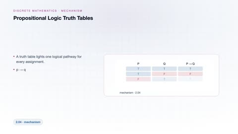
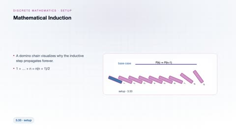
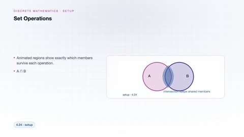
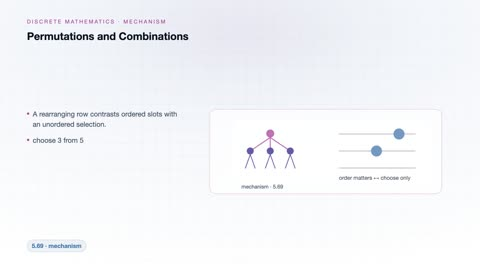
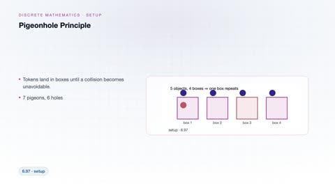
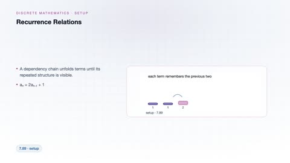

# Discrete Mathematics

[← Back to Mathematics](../../README.md#mathematics)

**Textbook:** Mathematics for Computer Science (Lehman et al.)  
**Knowledge points:** 8

> **Turn your own idea into an animation:** [Create with Leadde →](https://leadde.ai/animation)

---

## Propositional Logic Truth Tables

`C33-A001` · Video ready

[▶ Watch inline](https://leaddeopenlab.github.io/leadde-knowledge-in-motion/?subject=Mathematics&course=Discrete+Mathematics#c33-a001)

[Open or download propositional-logic-truth-tables.mp4](../../assets/videos/mathematics/discrete-mathematics/propositional-logic-truth-tables.mp4)

> **Make this concept move:** [Create an animation with Leadde →](https://leadde.ai/animation)

[Back to course top](#discrete-mathematics)

---

## Mathematical Induction

`C33-A002` · Video ready

[▶ Watch inline](https://leaddeopenlab.github.io/leadde-knowledge-in-motion/?subject=Mathematics&course=Discrete+Mathematics#c33-a002)

[Open or download mathematical-induction.mp4](../../assets/videos/mathematics/discrete-mathematics/mathematical-induction.mp4)

> **Make this concept move:** [Create an animation with Leadde →](https://leadde.ai/animation)

[Back to course top](#discrete-mathematics)

---

## Set Operations

`C33-A003` · Video ready

[▶ Watch inline](https://leaddeopenlab.github.io/leadde-knowledge-in-motion/?subject=Mathematics&course=Discrete+Mathematics#c33-a003)

[Open or download set-operations.mp4](../../assets/videos/mathematics/discrete-mathematics/set-operations.mp4)

> **Make this concept move:** [Create an animation with Leadde →](https://leadde.ai/animation)

[Back to course top](#discrete-mathematics)

---

## Relations and Equivalence Classes

`C33-A004` · Video ready

[▶ Watch inline](https://leaddeopenlab.github.io/leadde-knowledge-in-motion/?subject=Mathematics&course=Discrete+Mathematics#c33-a004)

[Open or download relations-and-equivalence-classes.mp4](../../assets/videos/mathematics/discrete-mathematics/relations-and-equivalence-classes.mp4)

> **Make this concept move:** [Create an animation with Leadde →](https://leadde.ai/animation)

[Back to course top](#discrete-mathematics)

---

## Permutations and Combinations

`C33-A005` · Video ready

[▶ Watch inline](https://leaddeopenlab.github.io/leadde-knowledge-in-motion/?subject=Mathematics&course=Discrete+Mathematics#c33-a005)

[Open or download permutations-and-combinations.mp4](../../assets/videos/mathematics/discrete-mathematics/permutations-and-combinations.mp4)

> **Make this concept move:** [Create an animation with Leadde →](https://leadde.ai/animation)

[Back to course top](#discrete-mathematics)

---

## Pigeonhole Principle

`C33-A006` · Video ready

[▶ Watch inline](https://leaddeopenlab.github.io/leadde-knowledge-in-motion/?subject=Mathematics&course=Discrete+Mathematics#c33-a006)

[Open or download pigeonhole-principle.mp4](../../assets/videos/mathematics/discrete-mathematics/pigeonhole-principle.mp4)

> **Make this concept move:** [Create an animation with Leadde →](https://leadde.ai/animation)

[Back to course top](#discrete-mathematics)

---

## Recurrence Relations

`C33-A007` · Video ready

[▶ Watch inline](https://leaddeopenlab.github.io/leadde-knowledge-in-motion/?subject=Mathematics&course=Discrete+Mathematics#c33-a007)

[Open or download recurrence-relations.mp4](../../assets/videos/mathematics/discrete-mathematics/recurrence-relations.mp4)

> **Make this concept move:** [Create an animation with Leadde →](https://leadde.ai/animation)

[Back to course top](#discrete-mathematics)

---

## Graph Connectivity

`C33-A008` · Video ready

[▶ Watch inline](https://leaddeopenlab.github.io/leadde-knowledge-in-motion/?subject=Mathematics&course=Discrete+Mathematics#c33-a008)

[Open or download graph-connectivity.mp4](../../assets/videos/mathematics/discrete-mathematics/graph-connectivity.mp4)

> **Make this concept move:** [Create an animation with Leadde →](https://leadde.ai/animation)

[Back to course top](#discrete-mathematics)

---
