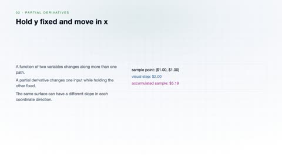
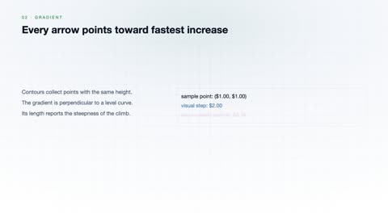
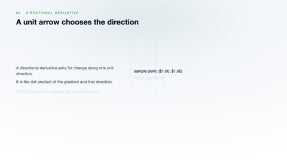
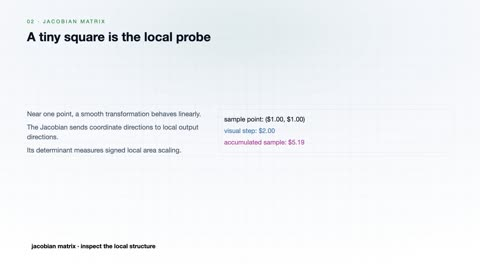
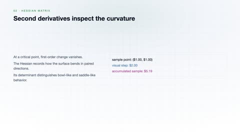
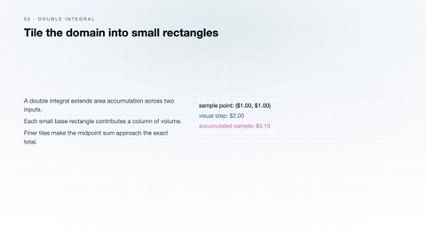
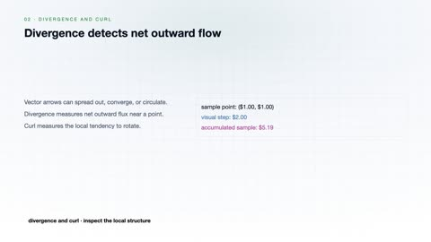

# Multivariable Calculus

[← Back to Mathematics](../../README.md#mathematics)

**Textbook:** Calculus: Early Transcendentals (Stewart)  
**Knowledge points:** 8

> **Turn your own idea into an animation:** [Create with Leadde →](https://leadde.ai/animation)

---

## Partial Derivatives

`C31-A001` · Video ready

[▶ Watch inline](https://leaddeopenlab.github.io/leadde-knowledge-in-motion/?subject=Mathematics&course=Multivariable+Calculus#c31-a001)

[Open or download partial-derivatives.mp4](../../assets/videos/mathematics/multivariable-calculus/partial-derivatives.mp4)

> **Make this concept move:** [Create an animation with Leadde →](https://leadde.ai/animation)

[Back to course top](#multivariable-calculus)

---

## Gradient

`C31-A002` · Video ready

[▶ Watch inline](https://leaddeopenlab.github.io/leadde-knowledge-in-motion/?subject=Mathematics&course=Multivariable+Calculus#c31-a002)

[Open or download gradient.mp4](../../assets/videos/mathematics/multivariable-calculus/gradient.mp4)

> **Make this concept move:** [Create an animation with Leadde →](https://leadde.ai/animation)

[Back to course top](#multivariable-calculus)

---

## Directional Derivative

`C31-A003` · Video ready

[▶ Watch inline](https://leaddeopenlab.github.io/leadde-knowledge-in-motion/?subject=Mathematics&course=Multivariable+Calculus#c31-a003)

[Open or download directional-derivative.mp4](../../assets/videos/mathematics/multivariable-calculus/directional-derivative.mp4)

> **Make this concept move:** [Create an animation with Leadde →](https://leadde.ai/animation)

[Back to course top](#multivariable-calculus)

---

## Jacobian Matrix

`C31-A004` · Video ready

[▶ Watch inline](https://leaddeopenlab.github.io/leadde-knowledge-in-motion/?subject=Mathematics&course=Multivariable+Calculus#c31-a004)

[Open or download jacobian-matrix.mp4](../../assets/videos/mathematics/multivariable-calculus/jacobian-matrix.mp4)

> **Make this concept move:** [Create an animation with Leadde →](https://leadde.ai/animation)

[Back to course top](#multivariable-calculus)

---

## Hessian Matrix

`C31-A005` · Video ready

[▶ Watch inline](https://leaddeopenlab.github.io/leadde-knowledge-in-motion/?subject=Mathematics&course=Multivariable+Calculus#c31-a005)

[Open or download hessian-matrix.mp4](../../assets/videos/mathematics/multivariable-calculus/hessian-matrix.mp4)

> **Make this concept move:** [Create an animation with Leadde →](https://leadde.ai/animation)

[Back to course top](#multivariable-calculus)

---

## Lagrange Multipliers

`C31-A006` · Video ready

[▶ Watch inline](https://leaddeopenlab.github.io/leadde-knowledge-in-motion/?subject=Mathematics&course=Multivariable+Calculus#c31-a006)

[Open or download lagrange-multipliers.mp4](../../assets/videos/mathematics/multivariable-calculus/lagrange-multipliers.mp4)

> **Make this concept move:** [Create an animation with Leadde →](https://leadde.ai/animation)

[Back to course top](#multivariable-calculus)

---

## Double Integral

`C31-A007` · Video ready

[▶ Watch inline](https://leaddeopenlab.github.io/leadde-knowledge-in-motion/?subject=Mathematics&course=Multivariable+Calculus#c31-a007)

[Open or download double-integral.mp4](../../assets/videos/mathematics/multivariable-calculus/double-integral.mp4)

> **Make this concept move:** [Create an animation with Leadde →](https://leadde.ai/animation)

[Back to course top](#multivariable-calculus)

---

## Divergence and Curl

`C31-A008` · Video ready

[▶ Watch inline](https://leaddeopenlab.github.io/leadde-knowledge-in-motion/?subject=Mathematics&course=Multivariable+Calculus#c31-a008)

[Open or download divergence-and-curl.mp4](../../assets/videos/mathematics/multivariable-calculus/divergence-and-curl.mp4)

> **Make this concept move:** [Create an animation with Leadde →](https://leadde.ai/animation)

[Back to course top](#multivariable-calculus)

---
