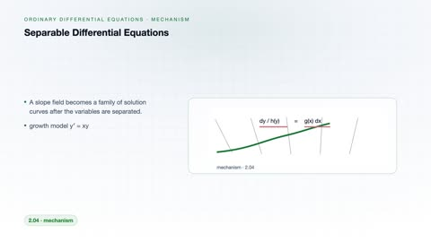
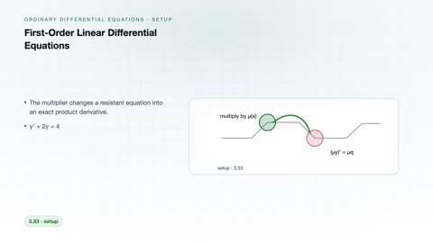
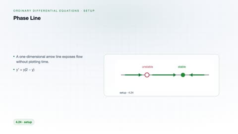
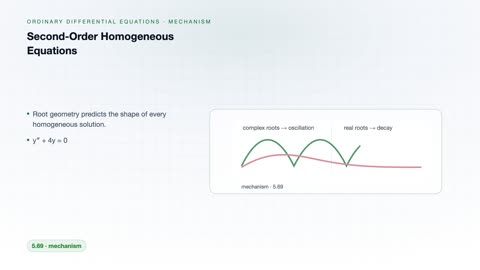
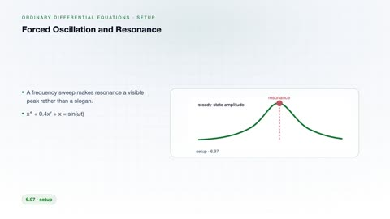
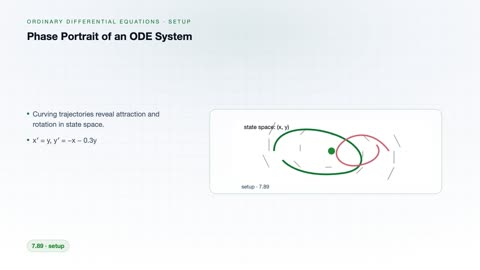

# Ordinary Differential Equations

[← Back to Mathematics](../../README.md#mathematics)

**Textbook:** Elementary Differential Equations (Boyce and DiPrima)  
**Knowledge points:** 8

> **Turn your own idea into an animation:** [Create with Leadde →](https://leadde.ai/animation)

---

## Separable Differential Equations

`C32-A001` · Video ready

[Open or download separable-differential-equations.mp4](../../assets/videos/mathematics/ordinary-differential-equations/separable-differential-equations.mp4)

> **Make this concept move:** [Create an animation with Leadde →](https://leadde.ai/animation)

[Back to course top](#ordinary-differential-equations)

---

## First-Order Linear Differential Equations

`C32-A002` · Video ready

[Open or download first-order-linear-differential-equations.mp4](../../assets/videos/mathematics/ordinary-differential-equations/first-order-linear-differential-equations.mp4)

> **Make this concept move:** [Create an animation with Leadde →](https://leadde.ai/animation)

[Back to course top](#ordinary-differential-equations)

---

## Phase Line

`C32-A003` · Video ready

[Open or download phase-line.mp4](../../assets/videos/mathematics/ordinary-differential-equations/phase-line.mp4)

> **Make this concept move:** [Create an animation with Leadde →](https://leadde.ai/animation)

[Back to course top](#ordinary-differential-equations)

---

## Stability of Equilibria

`C32-A004` · Video ready

[Open or download stability-of-equilibria.mp4](../../assets/videos/mathematics/ordinary-differential-equations/stability-of-equilibria.mp4)

> **Make this concept move:** [Create an animation with Leadde →](https://leadde.ai/animation)

[Back to course top](#ordinary-differential-equations)

---

## Second-Order Homogeneous Equations

`C32-A005` · Video ready

[Open or download second-order-homogeneous-equations.mp4](../../assets/videos/mathematics/ordinary-differential-equations/second-order-homogeneous-equations.mp4)

> **Make this concept move:** [Create an animation with Leadde →](https://leadde.ai/animation)

[Back to course top](#ordinary-differential-equations)

---

## Forced Oscillation and Resonance

`C32-A006` · Video ready

[Open or download forced-oscillation-and-resonance.mp4](../../assets/videos/mathematics/ordinary-differential-equations/forced-oscillation-and-resonance.mp4)

> **Make this concept move:** [Create an animation with Leadde →](https://leadde.ai/animation)

[Back to course top](#ordinary-differential-equations)

---

## Phase Portrait of an ODE System

`C32-A007` · Video ready

[Open or download phase-portrait-of-an-ode-system.mp4](../../assets/videos/mathematics/ordinary-differential-equations/phase-portrait-of-an-ode-system.mp4)

> **Make this concept move:** [Create an animation with Leadde →](https://leadde.ai/animation)

[Back to course top](#ordinary-differential-equations)

---

## Euler's Method

`C32-A008` · Video ready

[Open or download euler-s-method.mp4](../../assets/videos/mathematics/ordinary-differential-equations/euler-s-method.mp4)

> **Make this concept move:** [Create an animation with Leadde →](https://leadde.ai/animation)

[Back to course top](#ordinary-differential-equations)

---
