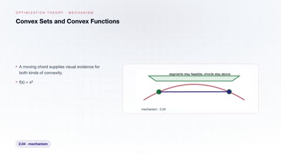
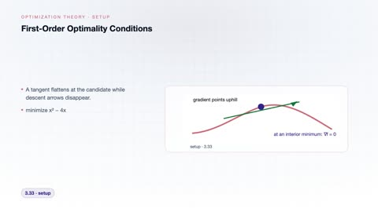
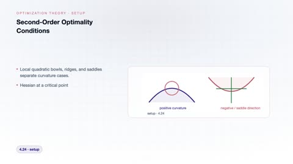
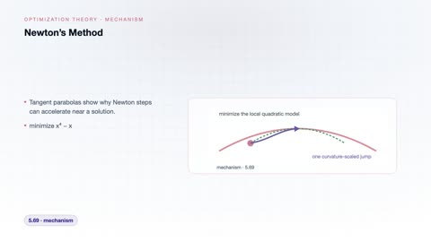
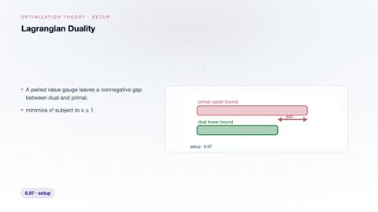
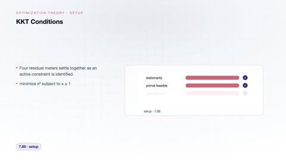

# Optimization Theory

[← Back to Mathematics](../../README.md#mathematics)

**Textbook:** Convex Optimization (Boyd and Vandenberghe)  
**Knowledge points:** 8

> **Turn your own idea into an animation:** [Create with Leadde →](https://leadde.ai/animation)

---

## Convex Sets and Convex Functions

`C35-A001` · Video ready

[▶ Watch inline](https://leaddeopenlab.github.io/leadde-knowledge-in-motion/?subject=Mathematics&course=Optimization+Theory#c35-a001)

[Open or download convex-sets-and-convex-functions.mp4](../../assets/videos/mathematics/optimization-theory/convex-sets-and-convex-functions.mp4)

> **Make this concept move:** [Create an animation with Leadde →](https://leadde.ai/animation)

[Back to course top](#optimization-theory)

---

## First-Order Optimality Conditions

`C35-A002` · Video ready

[▶ Watch inline](https://leaddeopenlab.github.io/leadde-knowledge-in-motion/?subject=Mathematics&course=Optimization+Theory#c35-a002)

[Open or download first-order-optimality-conditions.mp4](../../assets/videos/mathematics/optimization-theory/first-order-optimality-conditions.mp4)

> **Make this concept move:** [Create an animation with Leadde →](https://leadde.ai/animation)

[Back to course top](#optimization-theory)

---

## Second-Order Optimality Conditions

`C35-A003` · Video ready

[▶ Watch inline](https://leaddeopenlab.github.io/leadde-knowledge-in-motion/?subject=Mathematics&course=Optimization+Theory#c35-a003)

[Open or download second-order-optimality-conditions.mp4](../../assets/videos/mathematics/optimization-theory/second-order-optimality-conditions.mp4)

> **Make this concept move:** [Create an animation with Leadde →](https://leadde.ai/animation)

[Back to course top](#optimization-theory)

---

## Gradient Descent Convergence

`C35-A004` · Video ready

[▶ Watch inline](https://leaddeopenlab.github.io/leadde-knowledge-in-motion/?subject=Mathematics&course=Optimization+Theory#c35-a004)

[Open or download gradient-descent-convergence.mp4](../../assets/videos/mathematics/optimization-theory/gradient-descent-convergence.mp4)

> **Make this concept move:** [Create an animation with Leadde →](https://leadde.ai/animation)

[Back to course top](#optimization-theory)

---

## Newton's Method

`C35-A005` · Video ready

[▶ Watch inline](https://leaddeopenlab.github.io/leadde-knowledge-in-motion/?subject=Mathematics&course=Optimization+Theory#c35-a005)

[Open or download newton-s-method.mp4](../../assets/videos/mathematics/optimization-theory/newton-s-method.mp4)

> **Make this concept move:** [Create an animation with Leadde →](https://leadde.ai/animation)

[Back to course top](#optimization-theory)

---

## Lagrangian Duality

`C35-A006` · Video ready

[▶ Watch inline](https://leaddeopenlab.github.io/leadde-knowledge-in-motion/?subject=Mathematics&course=Optimization+Theory#c35-a006)

[Open or download lagrangian-duality.mp4](../../assets/videos/mathematics/optimization-theory/lagrangian-duality.mp4)

> **Make this concept move:** [Create an animation with Leadde →](https://leadde.ai/animation)

[Back to course top](#optimization-theory)

---

## KKT Conditions

`C35-A007` · Video ready

[▶ Watch inline](https://leaddeopenlab.github.io/leadde-knowledge-in-motion/?subject=Mathematics&course=Optimization+Theory#c35-a007)

[Open or download kkt-conditions.mp4](../../assets/videos/mathematics/optimization-theory/kkt-conditions.mp4)

> **Make this concept move:** [Create an animation with Leadde →](https://leadde.ai/animation)

[Back to course top](#optimization-theory)

---

## Projected Gradient Method

`C35-A008` · Video ready

[▶ Watch inline](https://leaddeopenlab.github.io/leadde-knowledge-in-motion/?subject=Mathematics&course=Optimization+Theory#c35-a008)

[Open or download projected-gradient-method.mp4](../../assets/videos/mathematics/optimization-theory/projected-gradient-method.mp4)

> **Make this concept move:** [Create an animation with Leadde →](https://leadde.ai/animation)

[Back to course top](#optimization-theory)

---
